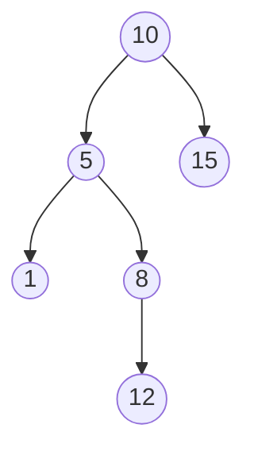
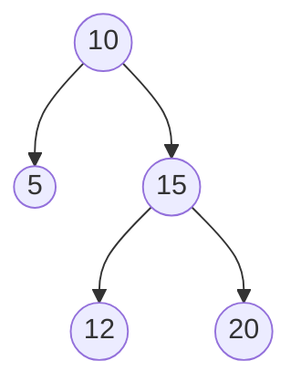
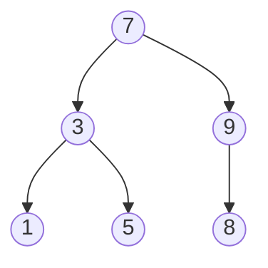
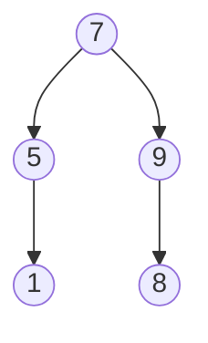

## Objetivos de Aprendizagem

- Declarar o invariante de árvore binária de busca precisamente, incluindo que ele se aplica a todo descendente, não só aos filhos imediatos.
- Implementar busca numa ABB, e explicar por que cada comparação elimina uma subárvore inteira da consideração.
- Implementar inserção numa ABB, e explicar por que o ponto de inserção de um novo valor é unicamente determinado pelo invariante.
- Implementar remoção numa ABB para os três casos estruturais (folha, um filho, dois filhos), incluindo encontrar um sucessor ou predecessor em ordem.
- Verificar, dada uma árvore, se ela satisfaz o invariante de ABB, e identificar precisamente onde uma violação ocorre se não satisfaz.

## Contexto e Motivação

Os dois conceitos anteriores construíram o vocabulário e a mecânica de percurso para árvores binárias em geral, árvores sem restrição sobre *quais valores* vão onde, só sobre *quantos filhos* um nó pode ter. Uma **árvore binária de busca (ABB)** toma essa mesma estrutura de nó-e-ponteiro e adiciona exatamente mais uma regra: para todo nó, tudo em sua subárvore esquerda é menor, e tudo em sua subárvore direita é maior. Essa única regra de ordenação é o que transforma uma árvore binária de "uma forma para organizar dados" em "uma forma que torna busca rápida", a razão inteira pela qual ABBs existem como uma estrutura de dados nomeada e amplamente usada em vez de árvores binárias serem simplesmente usadas diretamente para tudo.

O retorno é direto e espelha uma técnica já familiar de vetores ordenados: busca binária. Dado um vetor ordenado, você pode encontrar um valor alvo comparando-o ao elemento do meio e descartando metade do vetor restante a cada comparação. Uma ABB alcança a mesma ideia de dividir pela metade o espaço de busca, mas sem precisar dos dados pré-ordenados em memória contígua e sem o custo O(n) de inserir no meio de um vetor para mantê-lo ordenado; a posição de cada nó *é* o registro de uma série de comparações, e seguir essas comparações de volta a partir da raiz é como busca, inserção e remoção todas funcionam. Lembre-se de `tree-traversals` que um percurso em ordem de uma ABB sempre produz ordem ordenada sem passo extra de ordenação; esse fato era uma referência adiantada a este conceito, e agora tem uma explicação: o invariante de ABB é precisamente a condição que torna "subárvore esquerda, depois raiz, depois subárvore direita" equivalente a "valores menores, depois este valor, depois valores maiores", em todo nó individual, recursivamente.

As três operações cobertas aqui (busca, inserção, remoção) não são igualmente difíceis. Busca e inserção são primas próximas: as duas percorrem um único caminho a partir da raiz, comparando o alvo contra cada nó e movendo-se para a esquerda ou direita conforme apropriado, até que o alvo seja encontrado (busca) ou um espaço vazio seja alcançado para anexar um novo nó (inserção). Remoção é onde cuidado real é exigido, porque remover um nó pode deixar um buraco na estrutura da árvore que precisa ser remendado sem quebrar o invariante para todos os outros, e o tratamento honesto das três formas pelas quais um nó pode precisar ser removido (sem filhos, um filho, dois filhos) é a parte deste conceito mais valendo a pena desacelerar, já que o caso de dois filhos é onde a maioria dos bugs em implementações reais de ABB acontece.

## Teoria Central

### O invariante de ABB, declarado precisamente

Para todo nó `n` numa árvore binária de busca: todo valor na subárvore esquerda de `n` é estritamente menor que o valor de `n`, e todo valor na subárvore direita de `n` é estritamente maior que o valor de `n`. A palavra fazendo o trabalho de verdade nessa frase é **todo**; a regra se aplica a *todos os descendentes*, arbitrariamente profundos, não meramente aos filhos esquerdo e direito imediatos de `n`. Uma árvore onde os filhos imediatos de um nó satisfazem "filho esquerdo < nó < filho direito" mas algum descendente mais profundo viola a ordenação em relação a um ancestral mais acima **não** é uma ABB válida, mesmo que todo par pai-filho individual pareça localmente correto.



Esta árvore parece localmente boa em todo par pai-filho (5 < 10, 15 > 10; 1 < 5, 8 > 5; 12 > 8), mas o nó 12 mora na subárvore *esquerda* do nó 10 (como descendente de 5, que é o filho esquerdo de 10), e 12 é maior que 10. O invariante exige que *tudo* na subárvore esquerda de 10 seja menor que 10, e 12 viola isso, mesmo que a própria relação imediata de pai de 12 (12 > 8) seja localmente correta. Esta é exatamente a armadilha sinalizada nos Equívocos Comuns: checar só pares pai-filho imediatos não é suficiente para verificar uma ABB.

### Busca: seguindo um caminho para baixo

```python
class No:
    def __init__(self, valor, esquerda=None, direita=None):
        self.valor = valor
        self.esquerda = esquerda
        self.direita = direita

def busca(no, alvo):
    if no is None:                       # caiu fora da árvore, não está presente
        return None
    if alvo == no.valor:
        return no
    if alvo < no.valor:
        return busca(no.esquerda, alvo)     # tudo relevante está na subárvore esquerda
    return busca(no.direita, alvo)          # tudo relevante está na subárvore direita
```

Cada comparação contra o valor do nó atual diz a você, pelo invariante, qual subárvore *inteira* poderia possivelmente conter o alvo; a outra subárvore é eliminada da consideração completamente, não só despriorizada. Isso é exatamente o que torna a busca rápida numa árvore bem formada: cada passo descarta aproximadamente metade dos nós restantes, a mesma ideia de eliminação logarítmica da busca binária num vetor ordenado, mas realizada através de ponteiros em vez de aritmética de índice. (Precisamente *quão* rápido isso é no pior caso, e o que "bem formada" exige, é o assunto do próximo conceito; busca aqui é apresentada como um mecanismo, seu desempenho analisado propriamente depois.)

### Inserção: o invariante determina unicamente onde um novo valor vai

```python
def insere(no, valor):
    if no is None:
        return No(valor)                    # encontrou o espaço vazio, anexa aqui
    if valor < no.valor:
        no.esquerda = insere(no.esquerda, valor)
    elif valor > no.valor:
        no.direita = insere(no.direita, valor)
    # se valor == no.valor, uma convenção comum é não fazer nada (sem duplicatas)
    return no
```

Inserção percorre exatamente o mesmo caminho de comparação que busca usaria para procurar `valor`, e quando cai fora da árvore (alcança `None`), aquele espaço vazio é o *único* lugar onde um novo nó com aquele valor pode ir sem quebrar o invariante para todo ancestral já visitado; todo ancestral ao longo do caminho já se comprometeu com "menor vai à minha esquerda, maior vai à minha direita", então a posição do novo nó é forçada, não uma questão de escolha.

### Remoção: três casos estruturalmente diferentes

Remover um nó é mais delicado porque, diferente de busca ou inserção, pode precisar remover um nó com descendentes que precisam permanecer corretamente posicionados depois.

**Caso 1: o nó é uma folha (sem filhos).** Simplesmente remova-o; nada mais na árvore o referencia, e a pertinência de subárvore de nenhum outro nó muda.

**Caso 2: o nó tem exatamente um filho.** Emende o nó para fora conectando seu pai diretamente ao seu único filho, tomando o lugar do nó removido. Isso preserva o invariante porque a subárvore inteira daquele filho já estava corretamente posicionada em relação a tudo acima do nó removido (estava no lado correto do nó removido, que estava no lado correto de seu próprio pai).

**Caso 3: o nó tem dois filhos.** Nenhum filho pode simplesmente tomar o lugar do nó removido (um nó só pode ter um slot de pai para preencher, mas há duas subárvores precisando de um novo pai comum). A técnica padrão: encontre o **sucessor em ordem** do nó, o menor valor em sua subárvore direita (equivalentemente, o *próximo* valor em ordem ordenada/em ordem), copie o valor desse sucessor para o nó sendo "removido", depois recursivamente remova o nó sucessor da subárvore direita, onde é garantido ser uma remoção de Caso 1 ou Caso 2 (o sucessor em ordem, sendo o menor em sua subárvore, nunca pode ter um filho esquerdo, já que um filho esquerdo seria ainda menor). Um *predecessor* em ordem, o maior valor na subárvore esquerda, funciona simetricamente e é uma escolha igualmente válida.

```python
def encontra_minimo(no):
    while no.esquerda is not None:       # o menor valor é o nó mais à esquerda
        no = no.esquerda
    return no

def remove(no, alvo):
    if no is None:
        return None                       # alvo não encontrado; nada a fazer
    if alvo < no.valor:
        no.esquerda = remove(no.esquerda, alvo)
    elif alvo > no.valor:
        no.direita = remove(no.direita, alvo)
    else:
        # encontrou o nó a remover
        if no.esquerda is None and no.direita is None:      # Caso 1: folha
            return None
        if no.esquerda is None:                               # Caso 2: só filho direito
            return no.direita
        if no.direita is None:                                # Caso 2: só filho esquerdo
            return no.esquerda
        # Caso 3: dois filhos, substitui pelo valor do sucessor em ordem
        sucessor = encontra_minimo(no.direita)
        no.valor = sucessor.valor
        no.direita = remove(no.direita, sucessor.valor)   # remove o sucessor de seu lugar antigo
    return no
```



Remover 15 (dois filhos: 12 e 20) aqui encontra seu sucessor em ordem indo à direita uma vez até 20, depois à esquerda o quanto possível, mas 20 não tem filho esquerdo, então o próprio 20 é o sucessor. O valor de 15 é sobrescrito com 20, e o nó antigo segurando 20 (agora uma folha) é removido via Caso 1.

## Exemplos Resolvidos

### Exemplo 1: construindo uma ABB por inserção repetida e lendo de volta ordenado

**Problema:** insira os valores `7, 3, 9, 1, 5, 8` numa ABB vazia, um de cada vez, depois confirme que o percurso em ordem produz ordem ordenada.

**Insere 7.** A árvore está vazia; 7 se torna a raiz.
**Insere 3.** 3 < 7, vai à esquerda; a esquerda está vazia, anexa 3 como filho esquerdo de 7.
**Insere 9.** 9 > 7, vai à direita; a direita está vazia, anexa 9 como filho direito de 7.
**Insere 1.** 1 < 7, vai à esquerda até 3; 1 < 3, vai à esquerda; vazio, anexa 1 como filho esquerdo de 3.
**Insere 5.** 5 < 7, vai à esquerda até 3; 5 > 3, vai à direita; vazio, anexa 5 como filho direito de 3.
**Insere 8.** 8 > 7, vai à direita até 9; 8 < 9, vai à esquerda; vazio, anexa 8 como filho esquerdo de 9.



**Checagem em ordem.** Subárvore esquerda de 7 (com raiz em 3): em ordem dá 1, 3, 5. Depois 7. Depois subárvore direita (com raiz em 9): em ordem dá 8, 9. Sequência completa: `1, 3, 5, 7, 8, 9`, ordenada, exatamente como garantido pelo invariante de ABB mais a ordem esquerda-raiz-direita do percurso em ordem.

### Exemplo 2: buscando, e contando quantos nós uma busca de fato toca

**Problema:** na árvore do Exemplo 1, busque por 5 e por 6, e liste todo nó comparado em cada caso.

**Busca por 5.** Começa em 7: `5 < 7`, vai à esquerda. Em 3: `5 > 3`, vai à direita. Em 5: `5 == 5`, encontrado. Nós tocados: 7, 3, 5, três comparações, e cada uma eliminou uma subárvore inteira (comparar em 7 eliminou toda a subárvore de 9; comparar em 3 eliminou a subárvore do nó 1).

**Busca por 6.** Começa em 7: `6 < 7`, vai à esquerda. Em 3: `6 > 3`, vai à direita. Em 5: `6 > 5`, vai à direita; 5 não tem filho direito, cai fora da árvore, alvo não encontrado. Nós tocados: 7, 3, 5, depois `None`, três comparações de nó reais antes de concluir ausência, o mesmo comprimento de caminho que uma busca bem-sucedida teria para um valor que *pertenceria* àquele mesmo espaço vazio.

### Exemplo 3: removendo um nó de dois filhos passo a passo

**Problema:** na árvore do Exemplo 1 (raiz `7`, filhos `3`/`9`, `1`/`5` sob 3, `8` sob 9), remova 3.

**Identifique o caso.** O nó 3 tem dois filhos (1 e 5), Caso 3.

**Encontre o sucessor em ordem.** Vá à direita de 3 até 5; 5 não tem filho esquerdo, então o próprio 5 é o menor valor na subárvore direita de 3, o sucessor em ordem.

**Aplique a substituição.** Copie o valor de 5 para a posição do nó 3 (o nó mantém sua posição estrutural e ponteiros de filhos, mas seu valor se torna 5). Depois remova recursivamente 5 da subárvore direita de 3: 5 é uma folha ali (sem filhos), então o Caso 1 se aplica, simplesmente remova-o.



**Verifique que o invariante ainda vale.** O nó 5 (antiga posição de 3) tem filho esquerdo 1 (1 < 5, correto) e nenhum filho direito (o antigo filho direito de 5, o nó original segurando o valor 5, foi removido como parte da remoção do sucessor). O percurso em ordem agora dá `1, 5, 7, 8, 9`, ainda ordenado, confirmando que o invariante sobreviveu à remoção intacto.

## Equívocos Comuns e Armadilhas

- **"Checar que os filhos imediatos de cada nó são menores/maiores é suficiente para confirmar uma ABB válida."** O contraexemplo da Teoria Central (nó 12 morando sob 5, ele mesmo sob 10, com 12 > 10) mostra uma árvore onde todo par pai-filho imediato é individualmente correto mas a árvore ainda não é uma ABB válida, porque 12 é um descendente de 10 através da subárvore esquerda de 10 enquanto é maior que 10. O invariante é sobre *todos os descendentes*, não só filhos diretos; o único método de verificação totalmente correto é checar que o percurso em ordem produz uma sequência ordenada (ou, equivalentemente, rastrear uma faixa `[mín, máx)` válida conforme você desce recursivamente e a reduz a cada passo).
- **"Remover um nó com dois filhos só significa escolher um dos filhos para subir ao seu lugar."** Nenhum filho sozinho pode assumir; a *outra* subárvore do nó removido então não teria onde se anexar, já que um nó só tem um slot esquerdo e um slot direito. A técnica do sucessor (ou predecessor) em ordem especificamente encontra um valor que pode validamente substituir o nó removido preservando ordem para as duas subárvores restantes, e não é uma escolha arbitrária de "algum nó próximo".
- **"O sucessor em ordem de um nó de dois filhos pode ele mesmo precisar de lógica de remoção complicada."** Por construção, o sucessor em ordem (o nó mais à esquerda da subárvore direita) nunca pode ter um filho esquerdo; se tivesse, esse filho esquerdo seria menor, contradizendo que o sucessor era o mais à esquerda, portanto o menor, nó daquela subárvore. Então a própria remoção do sucessor é sempre uma remoção de Caso 1 (folha) ou Caso 2 (um filho, especificamente só um filho direito), nunca outro Caso 3; a recursão na função `remove` termina depois de no máximo um nível extra por essa razão.
- **"Buscar por um valor que não está na árvore é de algum jeito uma operação diferente e mais cara que uma busca bem-sucedida."** Como o Exemplo 2 mostra, uma busca malsucedida segue exatamente o mesmo tipo de caminho único da raiz até algum lugar que uma busca bem-sucedida segue, simplesmente terminando num ponteiro vazio (`None`) em vez de um acerto exato; seu custo é governado pelo mesmo comprimento de caminho que uma busca bem-sucedida teria para um valor que pertence àquele mesmo espaço vazio, não algum algoritmo separado e pior.

## Resumo

Uma árvore binária de busca adiciona um invariante de ordenação a uma árvore binária simples (todo valor de subárvore esquerda menor, todo valor de subárvore direita maior, aplicando-se a *todos* os descendentes, não só filhos imediatos), e esse invariante é exatamente o que faz o percurso em ordem produzir saída ordenada e o que torna busca, inserção e remoção todas navegáveis seguindo um único caminho da raiz ao alvo. Busca e inserção são primas próximas, as duas percorrendo um único caminho conduzido por comparação a partir da raiz. Remoção exige cuidado através de três casos estruturais distintos: uma folha é simplesmente removida, um nó de um filho é emendado para fora promovendo seu filho, e um nó de dois filhos é tratado copiando o valor de seu sucessor (ou predecessor) em ordem e depois removendo esse sucessor de seu lugar original, uma remoção garantida ser um Caso 1 ou Caso 2 simples. Verificar o invariante corretamente exige checar todos os descendentes, não só pares pai-filho adjacentes, uma sutileza à qual os Exemplos 1 a 3 e a seção de Equívocos ambos retornam diretamente.

## Documentation Links

- [Sedgewick & Wayne — Algorithms, Part I (Princeton, Coursera)](https://www.coursera.org/learn/algorithms-part1) — doc
- [MIT 6.006 — Lecture Notes (OCW)](https://ocw.mit.edu/courses/6-006-introduction-to-algorithms-spring-2020/pages/lecture-notes/) — doc
