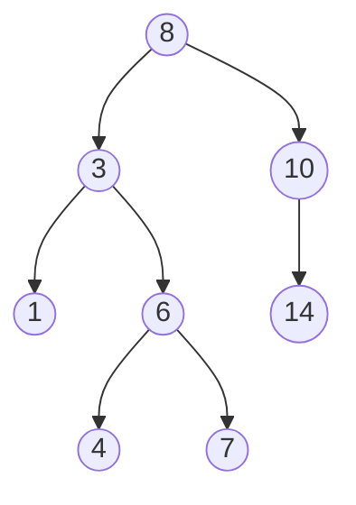
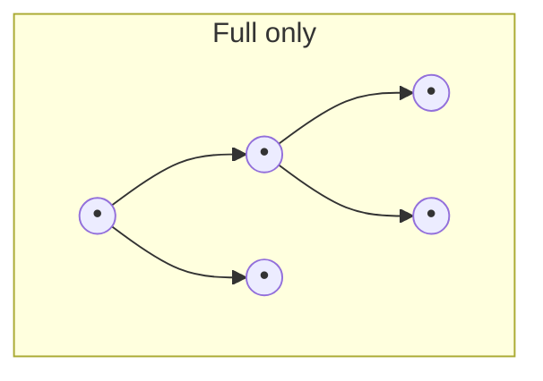
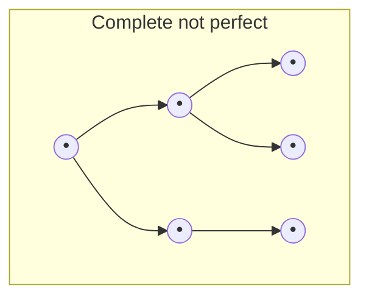
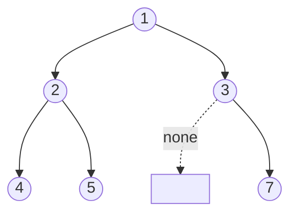

## Learning Objectives

- Define a binary tree as a rooted tree in which every node has at most two children, distinguished as left and right.
- Identify, for any given node in a binary tree, its parent, children, and the subtree it roots.
- Compute the depth of a specific node and the height of an entire binary tree.
- Distinguish full, complete, and perfect binary trees, and explain what shape guarantee (or lack of one) each term makes.
- Implement a binary tree using both a linked (Node-object) representation and an implicit array representation, and translate between the two mentally.

## Context & Motivation

The discrete-math-logic discipline's `trees` concept already did the hard mathematical work: it defined a tree as a connected, acyclic graph, proved that any tree on n vertices has exactly n − 1 edges, proved that any tree with at least two vertices has at least two leaves, and introduced rooting — the act of designating one vertex as special, which induces the parent/child/depth/height vocabulary on top of the underlying graph. That concept even mentioned, in passing, that "a binary tree further restricts every vertex to at most two children, conventionally distinguished as left and right." This concept picks up exactly there and makes that restriction the whole story: a **binary tree** is a rooted tree where the at-most-two-children rule is not just allowed but enforced, and — critically for a data structures course rather than a graph theory course — it is a structure you actually build in memory, not just reason about on paper.

That shift from "mathematical object satisfying a property" to "thing sitting in RAM that a program manipulates" is the real content of this concept. A graph-theoretic tree is a set of vertices and edges; nothing about that definition says how a computer stores it. A binary tree, as a data structure, needs a concrete answer: given a node, how does the program find its children? Two answers dominate practice, and both are covered here. The first, a **linked representation**, mirrors the graph picture directly — each node is an object holding a value and two pointers, `left` and `right`, each either pointing to a child node or to nothing at all. This is the representation used for essentially every binary search tree, expression tree, and general-purpose binary tree you will build in this course and beyond. The second, an **implicit array representation**, throws away pointers entirely and instead uses arithmetic on array indices to locate children — a technique you will meet again, in a much more central role, when this curriculum reaches heaps, but which is worth seeing here first, in the simpler context of a plain binary tree, precisely so that when it reappears it is a familiar trick rather than a new one.

Why does the shape vocabulary — full, complete, perfect — matter at all, rather than being trivia? Because the height of a binary tree, and therefore the cost of walking from the root to any node, depends entirely on how "bushy" versus how "stringy" the tree is, and the shape vocabulary is the standard way of naming specific bushiness guarantees precisely. This matters concretely a few concepts from now: `bst-performance-and-balance` will show that a binary search tree's search, insert, and delete costs are all O(height), and that height can be as good as O(log n) or as bad as O(n) depending on shape — the same shape spectrum being named here in the abstract, before there is an ordering invariant layered on top to complicate matters.

## Core Theory

### The at-most-two-children restriction, and left/right as labels, not just positions

A **binary tree** is a rooted tree in which every node has at most two children, and — unlike the unlabeled children of a general rooted tree — a binary tree's two child slots are distinguished: one is the **left child**, the other the **right child**, and a node with only one child specifies which slot that child occupies. This distinction matters structurally, not just cosmetically: a node with only a left child is a genuinely different binary tree from a node with only a right child, even though both have exactly one child, because later algorithms (search in a binary search tree, in particular) will make decisions based on which side a child sits on.

All the vocabulary already established for general rooted trees carries over unchanged: the **root** is the unique node with no parent; a **leaf** is a node with no children; for any node, its **parent** is the node one edge closer to the root, and its **children** are the nodes one edge farther; any node together with all its descendants forms a **subtree** rooted at that node. The **depth** of a node is the number of edges on the path from the root to it (so the root itself has depth 0); the **height** of the tree is the maximum depth of any node in it (equivalently, the height of a single-node tree is 0, and the height of any larger tree is one more than the greater of its two subtrees' heights — a recursive definition that will resurface constantly once traversals are introduced).



Here node 8 is the root (depth 0); nodes 3 and 10 are its children, at depth 1; node 3's subtree contains 3, 1, 6, 4, 7; node 1 is a leaf (no children); node 10 has only a right child (14), no left child; the tree's height is 3 (the path 8 → 3 → 6 → 7, or 8 → 3 → 6 → 4).

### Full, complete, and perfect: naming specific shapes precisely

Three terms describe increasingly strong shape guarantees, and it is worth being precise about each because they are easy to confuse:

- A binary tree is **full** if every node has either zero children or exactly two children — no node is allowed to have exactly one child. A full tree can still be wildly unbalanced in height; "full" says nothing about how deep the tree gets, only that no node is left with a single, lonely child.
- A binary tree is **complete** if every level is filled entirely, except possibly the last, and all nodes in that last level are pushed as far left as possible. This is precisely the shape guarantee that makes the array representation below efficient (no wasted array slots), and it is the shape a binary heap always maintains.
- A binary tree is **perfect** if every internal node has exactly two children *and* every leaf sits at the same depth. A perfect tree is automatically both full and complete, but the reverse implications do not hold — a tree can be full without being complete, and complete without being perfect.





In the first diagram, every node has 0 or 2 children (full), but the leaves sit at two different depths (F4/F5 at depth 2, F3 at depth 1) — not perfect, and since the last level (F4, F5) does not fill the whole level while F3 has no children, it is also not complete in the strict sense of "last level filled left-to-right with no gaps elsewhere." In the second diagram, every level is filled left-to-right with only the last level partial (complete), but C3 has only one child (C6) while C2 has two — so this tree is neither full nor perfect, only complete.

### Linked representation: nodes and pointers

The direct, general-purpose way to build a binary tree in memory is a small `Node` class holding a value and two references to other nodes (or `None`, signaling "no child here"):

```python
class Node:
    def __init__(self, value, left=None, right=None):
        self.value = value
        self.left = left
        self.right = right

# Building the tree from the Core Theory diagram, bottom-up:
n1 = Node(1)
n4 = Node(4)
n7 = Node(7)
n14 = Node(14)
n6 = Node(6, left=n4, right=n7)
n3 = Node(3, left=n1, right=n6)
n10 = Node(10, right=n14)
root = Node(8, left=n3, right=n10)
```

Finding a node's children is a direct attribute lookup (`root.left`, `root.right`); a missing child is simply `None`. This is the representation used throughout the rest of this discipline's binary tree concepts (traversals, binary search trees), because it handles trees of any shape — including badly lopsided ones — without wasting any memory on nodes that don't exist.

### Implicit array representation: index arithmetic instead of pointers

An alternative representation stores a binary tree's values in a single flat array, using arithmetic on array indices to simulate the pointers instead of storing them explicitly. If a node lives at index `i` (using 0-based indexing), then:

- its **left child** lives at index `2i + 1`,
- its **right child** lives at index `2i + 2`,
- its **parent** lives at index `(i - 1) // 2` (integer division), for any `i > 0`.

```python
# The same tree as above, stored implicitly.
# Index:  0  1  2   3  4  5  6   (only slots that exist are filled in)
tree = [8, 3, 10, 1, 6, None, 14]

def left_child(arr, i):
    idx = 2 * i + 1
    return arr[idx] if idx < len(arr) and arr[idx] is not None else None

def right_child(arr, i):
    idx = 2 * i + 2
    return arr[idx] if idx < len(arr) and arr[idx] is not None else None

left_child(tree, 0)   # 3  (index 1)
right_child(tree, 0)  # 10 (index 2)
left_child(tree, 2)   # None — node 10 (index 2) has no left child; slot 5 is None
right_child(tree, 2)  # 14 (index 6)
```

No pointers are stored anywhere — the tree's *shape* is entirely implicit in which array indices are occupied versus empty. This is compact and cache-friendly precisely when the tree is complete (every level packed, no gaps), because then no array slots are wasted; it is exactly this efficiency that makes the array representation the standard choice for heaps later in this curriculum, where completeness is maintained as an invariant. For a general, possibly lopsided binary tree, though, the array representation can be badly wasteful — a tree that is a single long chain of left children would need an array of size roughly `2^height`, almost all of it unused `None` slots, which is why the linked representation, not the array one, is the default choice for the binary trees and binary search trees this course builds going forward.

## Worked Examples

### Example 1 — Building a tree and computing depth and height by hand

**Problem:** Given the linked tree built above (root 8, with 8→3→{1, 6→{4,7}} on the left and 8→10→{right: 14} on the right), find the depth of node 7 and the height of the whole tree.

**Depth of node 7.** Depth counts edges from the root. Path: 8 (depth 0) → 3 (depth 1) → 6 (depth 2) → 7 (depth 3). Node 7's depth is 3.

**Height of the tree.** Height is the maximum depth over all nodes. Depths present: root 8 at 0; 3 and 10 at 1; 1, 6, 14 at 2; 4 and 7 at 3. The maximum is 3, so the tree's height is 3 — driven entirely by the 8→3→6→7 (or 8→3→6→4) path; the other branch (8→10→14) only reaches depth 2 and does not determine the height.

### Example 2 — Classifying a tree's shape

**Problem:** Is the tree from Example 1 full, complete, perfect, or none of these?

**Full check.** Every node needs 0 or 2 children. Node 8 has 2 (full so far). Node 3 has 2. Node 10 has only a right child (1 child) — this already fails the full requirement. Conclusion: not full (and therefore, since perfect requires full, also not perfect).

**Complete check.** Complete requires every level fully filled except possibly the last, and once a level is missing a node, no deeper level may contain any nodes at all. Level 0: {8}. Level 1: {3, 10} — full (2 of 2 possible slots). Level 2: node 3 contributes both children (1, 6), but node 10 contributes only a right child, 14, leaving its left-child slot empty — level 2 is missing a node. Since level 2 is already incomplete, completeness requires level 3 to be entirely empty — but level 3 is not empty; it has nodes 4 and 7 (children of 6). A level below an incomplete level has nodes, so the tree fails completeness. Conclusion: not complete.

**Overall.** This tree is none of full, complete, or perfect — it is simply a valid, unrestricted binary tree, which is the common case; the three shape terms describe special, stronger guarantees that most binary trees arising from real insertions (as in the next concept, binary search trees) do not automatically satisfy.

### Example 3 — Converting between representations

**Problem:** Given the array `[1, 2, 3, 4, 5, None, 7]` (0-based, implicit representation), draw the tree and rebuild it as linked `Node` objects.

**Reading the array.** Index 0 is the root: value 1. Its children live at indices `2(0)+1=1` and `2(0)+2=2`: values 2 and 3. Index 1 (value 2)'s children live at indices `2(1)+1=3` and `2(1)+2=4`: values 4 and 5. Index 2 (value 3)'s children live at indices `2(2)+1=5` and `2(2)+2=6`: index 5 is `None` (no left child), index 6 is value 7 (right child).



**Rebuilding as linked nodes**, bottom-up so every child exists before its parent references it:

```python
n4 = Node(4)
n5 = Node(5)
n7 = Node(7)
n2 = Node(2, left=n4, right=n5)
n3 = Node(3, left=None, right=n7)
root = Node(1, left=n2, right=n3)
```

Both representations describe the identical tree shape and identical values — the choice between them is purely about how the shape is stored, not what the shape is.

## Common Misconceptions & Pitfalls

- **"A binary tree with two children per node, at most, is the same thing as a general tree with a two-child limit — the left/right distinction is just bookkeeping."** It is not just bookkeeping: a node with a single left child and a node with a single right child are different binary trees, even though a general rooted tree would treat "one child" as one child regardless of which "slot" it occupies. This distinction is exactly what later lets a binary search tree's invariant ("smaller values go left, larger go right") be meaningful at all — without labeled slots, "go left" would be undefined.
- **"Complete implies perfect, since both sound like 'no gaps.'"** Example 2's shape-check care aside, the general rule is that perfect is strictly stronger: a complete tree only requires the last level to be filled left-to-right (it can stop partway through), while a perfect tree requires every leaf at the exact same depth. A complete tree with an odd number of nodes on its last level is complete but not perfect.
- **"The array representation is always more efficient than the linked one."** It is more space-efficient only when the tree is complete or close to it. For a lopsided tree — say, one that is really just a chain of left children, height h with only h+1 real nodes — the implicit array representation would need an array of size roughly `2^h`, almost entirely empty slots, while the linked representation uses exactly h+1 node objects and no wasted space at all. Efficiency of the array form is a property of the tree's *shape*, not a universal property of the representation.
- **"Height and depth are interchangeable terms, same as in general trees."** As already flagged in the trees prerequisite concept, depth is per-node (distance from the root to that one node) and height is whole-tree (the maximum depth over every node) — a binary tree student who says "this node has height 2" when they mean "this node is at depth 2" is making exactly the same conflation flagged there, now inside a concrete, in-memory structure rather than an abstract graph.

## Summary

A binary tree specializes the rooted tree from discrete math by capping every node at two children, distinguished as left and right — a restriction that is precisely what makes later concepts like binary search trees possible. All the general rooted-tree vocabulary (parent, child, leaf, subtree, depth, height) carries over unchanged. Full, complete, and perfect name three progressively stronger shape guarantees: full restricts child counts to 0 or 2 without constraining depth; complete requires levels packed left-to-right with only the last level partial; perfect requires both full and every leaf at the same depth. Two representations build a binary tree in memory: the linked representation (Node objects with `left`/`right` pointers), which handles any shape without wasted space and is the default going forward, and the implicit array representation (child of index `i` at `2i+1` and `2i+2`), which is compact only when the tree stays close to complete — a property maintained as an invariant later, for heaps, but not assumed for general binary trees or binary search trees in this discipline.

## Documentation Links

- [MIT 6.006 — Lecture Notes (OCW)](https://ocw.mit.edu/courses/6-006-introduction-to-algorithms-spring-2020/pages/lecture-notes/) — doc
- [Stanford CS106B — Lecture Schedule](https://web.stanford.edu/class/cs106b/schedule) — doc
