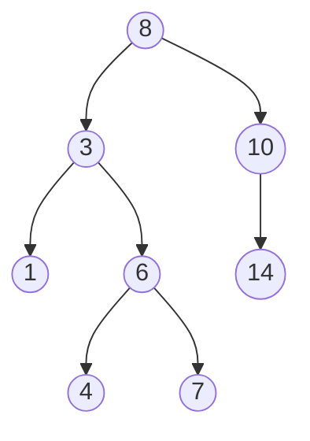
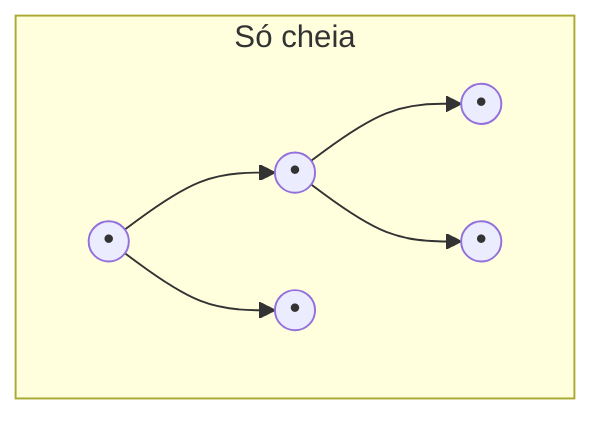
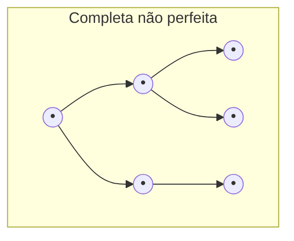
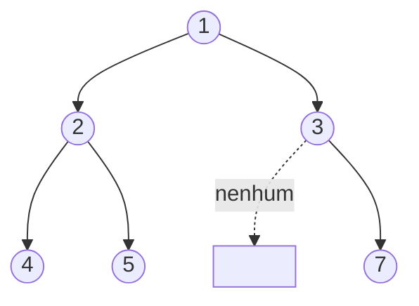

## Objetivos de Aprendizagem

- Definir uma árvore binária como uma árvore enraizada em que todo nó tem no máximo dois filhos, distinguidos como esquerdo e direito.
- Identificar, para qualquer nó dado numa árvore binária, seu pai, seus filhos, e a subárvore que ele enraíza.
- Computar a profundidade de um nó específico e a altura de uma árvore binária inteira.
- Distinguir árvores binárias cheias, completas e perfeitas, e explicar que garantia de forma (ou falta de uma) cada termo faz.
- Implementar uma árvore binária usando tanto uma representação encadeada (objetos Nó) quanto uma representação implícita em vetor, e traduzir entre as duas mentalmente.

## Contexto e Motivação

O conceito `árvores` da disciplina de matemática discreta e lógica já fez o trabalho matemático pesado: definiu uma árvore como um grafo conexo e acíclico, provou que qualquer árvore com n vértices tem exatamente n − 1 arestas, provou que qualquer árvore com pelo menos dois vértices tem pelo menos duas folhas, e introduziu enraizamento, o ato de designar um vértice como especial, que induz o vocabulário pai/filho/profundidade/altura sobre o grafo subjacente. Aquele conceito até mencionou, de passagem, que "uma árvore binária restringe ainda mais todo vértice a no máximo dois filhos, convencionalmente distinguidos como esquerdo e direito". Este conceito retoma exatamente daí e faz dessa restrição toda a história: uma **árvore binária** é uma árvore enraizada onde a regra de no-máximo-dois-filhos não é apenas permitida mas imposta, e, crucialmente para um curso de estruturas de dados em vez de um curso de teoria dos grafos, é uma estrutura que você de fato constrói na memória, não só raciocina sobre no papel.

Essa mudança de "objeto matemático satisfazendo uma propriedade" para "coisa sentada na RAM que um programa manipula" é o conteúdo real deste conceito. Uma árvore da teoria dos grafos é um conjunto de vértices e arestas; nada nessa definição diz como um computador a armazena. Uma árvore binária, como estrutura de dados, precisa de uma resposta concreta: dado um nó, como o programa acha seus filhos? Duas respostas dominam a prática, e as duas são cobertas aqui. A primeira, uma **representação encadeada**, espelha a figura do grafo diretamente: cada nó é um objeto guardando um valor e dois ponteiros, `left` e `right`, cada um ou apontando para um nó filho ou para coisa nenhuma. Essa é a representação usada para essencialmente toda árvore binária de busca, árvore de expressão, e árvore binária de propósito geral que você vai construir neste curso e além. A segunda, uma **representação implícita em vetor**, joga fora ponteiros completamente e em vez disso usa aritmética sobre índices de vetor para localizar filhos, uma técnica que você vai encontrar de novo, num papel muito mais central, quando este currículo chegar a heaps, mas que vale a pena ver aqui primeiro, no contexto mais simples de uma árvore binária pura, precisamente para que quando reaparecer seja um truque familiar em vez de um novo.

Por que o vocabulário de forma (cheia, completa, perfeita) importa de forma alguma, em vez de ser trivialidade? Porque a altura de uma árvore binária, e portanto o custo de andar da raiz até qualquer nó, depende inteiramente de quão "densa" versus quão "esticada" a árvore é, e o vocabulário de forma é a maneira padrão de nomear garantias específicas de densidade com precisão. Isso importa concretamente daqui a alguns conceitos: `desempenho-e-balanceamento-de-abbs` vai mostrar que os custos de busca, inserção e remoção de uma árvore binária de busca são todos O(altura), e que essa altura pode ser tão boa quanto O(log n) ou tão ruim quanto O(n) dependendo da forma, o mesmo espectro de forma sendo nomeado aqui no abstrato, antes de haver um invariante de ordenação sobreposto para complicar as coisas.

## Teoria Central

### A restrição de no-máximo-dois-filhos, e esquerda/direita como rótulos, não só posições

Uma **árvore binária** é uma árvore enraizada em que todo nó tem no máximo dois filhos, e, diferente dos filhos sem rótulo de uma árvore enraizada geral, os dois slots de filho de uma árvore binária são distinguidos: um é o **filho esquerdo**, o outro o **filho direito**, e um nó com só um filho especifica em qual slot esse filho ocupa. Essa distinção importa estruturalmente, não só cosmeticamente: um nó com só um filho esquerdo é uma árvore binária genuinamente diferente de um nó com só um filho direito, mesmo que os dois tenham exatamente um filho, porque algoritmos posteriores (busca numa árvore binária de busca, em particular) vão tomar decisões baseadas em de que lado um filho está.

Todo o vocabulário já estabelecido para árvores enraizadas gerais se transfere sem mudança: a **raiz** é o único nó sem pai; uma **folha** é um nó sem filhos; para qualquer nó, seu **pai** é o nó uma aresta mais perto da raiz, e seus **filhos** são os nós uma aresta mais longe; qualquer nó junto com todos os seus descendentes forma uma **subárvore** enraizada naquele nó. A **profundidade** de um nó é o número de arestas no caminho da raiz até ele (então a própria raiz tem profundidade 0); a **altura** da árvore é a profundidade máxima de qualquer nó nela (equivalentemente, a altura de uma árvore de um único nó é 0, e a altura de qualquer árvore maior é uma a mais que a maior das alturas de suas duas subárvores, uma definição recursiva que vai ressurgir constantemente quando percursos forem introduzidos).



Aqui o nó 8 é a raiz (profundidade 0); os nós 3 e 10 são seus filhos, na profundidade 1; a subárvore do nó 3 contém 3, 1, 6, 4, 7; o nó 1 é uma folha (sem filhos); o nó 10 tem só um filho direito (14), nenhum filho esquerdo; a altura da árvore é 3 (o caminho 8 → 3 → 6 → 7, ou 8 → 3 → 6 → 4).

### Cheia, completa e perfeita: nomeando formas específicas com precisão

Três termos descrevem garantias de forma progressivamente mais fortes, e vale a pena ser preciso sobre cada um porque são fáceis de confundir:

- Uma árvore binária é **cheia** se todo nó tem ou zero filhos ou exatamente dois filhos; nenhum nó tem permissão de ter exatamente um filho. Uma árvore cheia ainda pode ser extremamente desbalanceada em altura; "cheia" não diz nada sobre quão profunda a árvore fica, só que nenhum nó fica com um único filho solitário.
- Uma árvore binária é **completa** se todo nível é preenchido inteiramente, exceto possivelmente o último, e todos os nós daquele último nível estão empurrados o mais para a esquerda possível. Essa é precisamente a garantia de forma que torna a representação em vetor abaixo eficiente (sem slots de vetor desperdiçados), e é a forma que um heap binário sempre mantém.
- Uma árvore binária é **perfeita** se todo nó interno tem exatamente dois filhos *e* toda folha está na mesma profundidade. Uma árvore perfeita é automaticamente tanto cheia quanto completa, mas as implicações reversas não valem; uma árvore pode ser cheia sem ser completa, e completa sem ser perfeita.





No primeiro diagrama, todo nó tem 0 ou 2 filhos (cheia), mas as folhas estão em duas profundidades diferentes (F4/F5 na profundidade 2, F3 na profundidade 1); não é perfeita, e como o último nível (F4, F5) não preenche o nível inteiro enquanto F3 não tem filhos, também não é completa no sentido estrito de "último nível preenchido da esquerda para a direita sem lacunas em outro lugar". No segundo diagrama, todo nível é preenchido da esquerda para a direita com só o último nível parcial (completa), mas C3 tem só um filho (C6) enquanto C2 tem dois; então essa árvore não é nem cheia nem perfeita, só completa.

### Representação encadeada: nós e ponteiros

A forma direta e de propósito geral de construir uma árvore binária em memória é uma pequena classe `Node` guardando um valor e duas referências a outros nós (ou `None`, sinalizando "nenhum filho aqui"):

```python
class Node:
    def __init__(self, value, left=None, right=None):
        self.value = value
        self.left = left
        self.right = right

# Construindo a árvore do diagrama da Teoria Central, de baixo para cima:
n1 = Node(1)
n4 = Node(4)
n7 = Node(7)
n14 = Node(14)
n6 = Node(6, left=n4, right=n7)
n3 = Node(3, left=n1, right=n6)
n10 = Node(10, right=n14)
root = Node(8, left=n3, right=n10)
```

Achar os filhos de um nó é uma consulta direta de atributo (`root.left`, `root.right`); um filho faltando é simplesmente `None`. Essa é a representação usada ao longo do resto dos conceitos de árvore binária desta disciplina (percursos, árvores binárias de busca), porque lida com árvores de qualquer forma, incluindo mal desbalanceadas, sem desperdiçar memória alguma com nós que não existem.

### Representação implícita em vetor: aritmética de índice em vez de ponteiros

Uma representação alternativa armazena os valores de uma árvore binária num único vetor plano, usando aritmética sobre índices de vetor para simular os ponteiros em vez de armazená-los explicitamente. Se um nó mora no índice `i` (usando indexação a partir de 0), então:

- seu **filho esquerdo** mora no índice `2i + 1`,
- seu **filho direito** mora no índice `2i + 2`,
- seu **pai** mora no índice `(i - 1) // 2` (divisão inteira), para qualquer `i > 0`.

```python
# A mesma árvore de acima, armazenada implicitamente.
# Índice:  0  1  2   3  4  5  6   (só os slots que existem estão preenchidos)
tree = [8, 3, 10, 1, 6, None, 14]

def left_child(arr, i):
    idx = 2 * i + 1
    return arr[idx] if idx < len(arr) and arr[idx] is not None else None

def right_child(arr, i):
    idx = 2 * i + 2
    return arr[idx] if idx < len(arr) and arr[idx] is not None else None

left_child(tree, 0)   # 3  (índice 1)
right_child(tree, 0)  # 10 (índice 2)
left_child(tree, 2)   # None — nó 10 (índice 2) não tem filho esquerdo; slot 5 é None
right_child(tree, 2)  # 14 (índice 6)
```

Nenhum ponteiro é armazenado em lugar algum; a *forma* da árvore está inteiramente implícita em quais índices de vetor estão ocupados versus vazios. Isso é compacto e amigável ao cache precisamente quando a árvore é completa (todo nível cheio, sem lacunas), porque então nenhum slot de vetor é desperdiçado; é exatamente essa eficiência que faz da representação em vetor a escolha padrão para heaps mais adiante neste currículo, onde completude é mantida como invariante. Para uma árvore binária geral, possivelmente desbalanceada, porém, a representação em vetor pode ser terrivelmente desperdiçadora; uma árvore que é uma única cadeia longa de filhos esquerdos precisaria de um vetor de tamanho aproximadamente `2^altura`, quase tudo slots `None` não usados, que é por que a representação encadeada, não a em vetor, é a escolha padrão para as árvores binárias e árvores binárias de busca que este curso constrói daqui pra frente.

## Exemplos Resolvidos

### Exemplo 1: construindo uma árvore e computando profundidade e altura à mão

**Problema:** dada a árvore encadeada construída acima (raiz 8, com 8→3→{1, 6→{4,7}} à esquerda e 8→10→{direita: 14} à direita), ache a profundidade do nó 7 e a altura da árvore inteira.

**Profundidade do nó 7.** Profundidade conta arestas a partir da raiz. Caminho: 8 (profundidade 0) → 3 (profundidade 1) → 6 (profundidade 2) → 7 (profundidade 3). A profundidade do nó 7 é 3.

**Altura da árvore.** Altura é a profundidade máxima entre todos os nós. Profundidades presentes: raiz 8 em 0; 3 e 10 em 1; 1, 6, 14 em 2; 4 e 7 em 3. O máximo é 3, então a altura da árvore é 3, conduzida inteiramente pelo caminho 8→3→6→7 (ou 8→3→6→4); o outro ramo (8→10→14) só alcança profundidade 2 e não determina a altura.

### Exemplo 2: classificando a forma de uma árvore

**Problema:** a árvore do Exemplo 1 é cheia, completa, perfeita, ou nenhuma dessas?

**Checagem de cheia.** Todo nó precisa de 0 ou 2 filhos. O nó 8 tem 2 (cheia até agora). O nó 3 tem 2. O nó 10 tem só um filho direito (1 filho); isso já falha a exigência de cheia. Conclusão: não é cheia (e portanto, já que perfeita exige cheia, também não é perfeita).

**Checagem de completa.** Completa exige todo nível totalmente preenchido exceto possivelmente o último, e uma vez que um nível está faltando um nó, nenhum nível mais profundo pode conter nó algum. Nível 0: {8}. Nível 1: {3, 10}, cheio (2 de 2 slots possíveis). Nível 2: o nó 3 contribui os dois filhos (1, 6), mas o nó 10 contribui só um filho direito, 14, deixando seu slot de filho esquerdo vazio, o nível 2 está faltando um nó. Como o nível 2 já está incompleto, completude exige que o nível 3 esteja inteiramente vazio, mas o nível 3 não está vazio; tem os nós 4 e 7 (filhos de 6). Um nível abaixo de um nível incompleto tem nós, então a árvore falha em completude. Conclusão: não é completa.

**No geral.** Esta árvore não é nem cheia, nem completa, nem perfeita; é simplesmente uma árvore binária válida e irrestrita, que é o caso comum; os três termos de forma descrevem garantias especiais e mais fortes que a maioria das árvores binárias resultantes de inserções reais (como no próximo conceito, árvores binárias de busca) não satisfaz automaticamente.

### Exemplo 3: convertendo entre representações

**Problema:** dado o vetor `[1, 2, 3, 4, 5, None, 7]` (a partir de 0, representação implícita), desenhe a árvore e a reconstrua como objetos `Node` encadeados.

**Lendo o vetor.** O índice 0 é a raiz: valor 1. Seus filhos moram nos índices `2(0)+1=1` e `2(0)+2=2`: valores 2 e 3. Os filhos do índice 1 (valor 2) moram nos índices `2(1)+1=3` e `2(1)+2=4`: valores 4 e 5. Os filhos do índice 2 (valor 3) moram nos índices `2(2)+1=5` e `2(2)+2=6`: o índice 5 é `None` (sem filho esquerdo), o índice 6 é valor 7 (filho direito).



**Reconstruindo como nós encadeados**, de baixo para cima para que todo filho exista antes de seu pai referenciá-lo:

```python
n4 = Node(4)
n5 = Node(5)
n7 = Node(7)
n2 = Node(2, left=n4, right=n5)
n3 = Node(3, left=None, right=n7)
root = Node(1, left=n2, right=n3)
```

As duas representações descrevem a forma de árvore e os valores idênticos; a escolha entre elas é puramente sobre como a forma é armazenada, não qual é a forma.

## Equívocos Comuns e Armadilhas

- **"Uma árvore binária com no máximo dois filhos por nó é a mesma coisa que uma árvore geral com um limite de dois filhos; a distinção esquerda/direita é só contabilidade."** Não é só contabilidade: um nó com um único filho esquerdo e um nó com um único filho direito são árvores binárias diferentes, mesmo que uma árvore enraizada geral trataria "um filho" como um filho independentemente de qual "slot" ele ocupa. Essa distinção é exatamente o que depois permite que o invariante de uma árvore binária de busca ("valores menores vão à esquerda, maiores à direita") seja significativo de forma alguma; sem slots rotulados, "ir à esquerda" seria indefinido.
- **"Completa implica perfeita, já que as duas soam como 'sem lacunas'."** Deixando de lado o cuidado da checagem de forma do Exemplo 2, a regra geral é que perfeita é estritamente mais forte: uma árvore completa só exige que o último nível seja preenchido da esquerda para a direita (pode parar no meio), enquanto uma árvore perfeita exige toda folha na mesma profundidade exata. Uma árvore completa com um número ímpar de nós em seu último nível é completa mas não perfeita.
- **"A representação em vetor é sempre mais eficiente que a encadeada."** Ela é mais eficiente em espaço só quando a árvore é completa ou perto disso. Para uma árvore desbalanceada, digamos, uma que é na verdade só uma cadeia de filhos esquerdos, altura h com só h+1 nós reais, a representação implícita em vetor precisaria de um vetor de tamanho aproximadamente `2^h`, quase inteiramente slots vazios, enquanto a representação encadeada usa exatamente h+1 objetos nó e nenhum espaço desperdiçado. Eficiência da forma em vetor é uma propriedade da *forma* da árvore, não uma propriedade universal da representação.
- **"Altura e profundidade são termos intercambiáveis, igual em árvores gerais."** Como já sinalizado no conceito pré-requisito de árvores, profundidade é por nó (distância da raiz até aquele único nó) e altura é da árvore inteira (a profundidade máxima entre todo nó); um aluno de árvore binária que diz "este nó tem altura 2" quando quer dizer "este nó está na profundidade 2" está fazendo exatamente a mesma confusão sinalizada lá, agora dentro de uma estrutura concreta em memória em vez de um grafo abstrato.

## Resumo

Uma árvore binária especializa a árvore enraizada da matemática discreta limitando todo nó a dois filhos, distinguidos como esquerdo e direito, uma restrição que é precisamente o que torna possíveis conceitos posteriores como árvores binárias de busca. Todo o vocabulário de árvore enraizada geral (pai, filho, folha, subárvore, profundidade, altura) se transfere sem mudança. Cheia, completa e perfeita nomeiam três garantias de forma progressivamente mais fortes: cheia restringe contagens de filho a 0 ou 2 sem restringir profundidade; completa exige níveis preenchidos da esquerda para a direita com só o último nível parcial; perfeita exige tanto cheia quanto toda folha na mesma profundidade. Duas representações constroem uma árvore binária em memória: a representação encadeada (objetos Node com ponteiros `left`/`right`), que lida com qualquer forma sem espaço desperdiçado e é a escolha padrão daqui pra frente, e a representação implícita em vetor (filho do índice `i` em `2i+1` e `2i+2`), que é compacta só quando a árvore permanece perto de completa, uma propriedade mantida como invariante mais tarde, para heaps, mas não assumida para árvores binárias gerais ou árvores binárias de busca nesta disciplina.

## Documentation Links

- [MIT 6.006 — Lecture Notes (OCW)](https://ocw.mit.edu/courses/6-006-introduction-to-algorithms-spring-2020/pages/lecture-notes/) — doc
- [Stanford CS106B — Lecture Schedule](https://web.stanford.edu/class/cs106b/schedule) — doc
