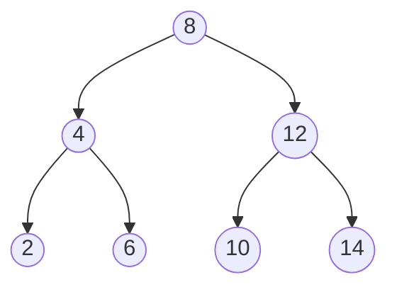
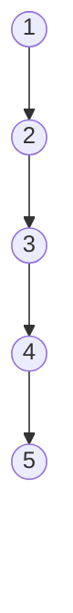
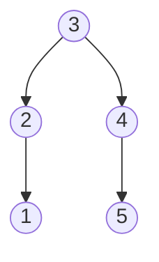
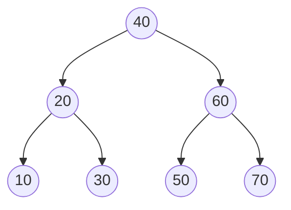

## Learning Objectives

- State the time complexity of search, insert, and delete in a binary search tree in terms of the tree's height, h.
- Explain why h = O(log n) for a "bushy" tree but h = O(n) in the worst case, and construct an input sequence that forces the worst case.
- Predict, given a sequence of insertions, whether the resulting BST will be well-shaped or degenerate, without building it.
- Explain, at a conceptual level, what a self-balancing tree does differently to guarantee O(log n) height, without needing to implement one.

## Context & Motivation

The previous concept described BST search, insert, and delete as algorithms that each follow a single path from the root — but it deliberately deferred a hard question: how long is that path? This concept answers it honestly, and the honest answer has a sting in it: a binary search tree's operations cost O(h), where h is the tree's height, and h is not a fixed or guaranteed quantity — it depends entirely on the shape the tree happens to have, which in turn depends entirely on the order values were inserted in. The same set of n values, inserted in different orders, can produce a BST with height as small as roughly log₂(n) or as large as n − 1, and the algorithms from the previous concept run identically either way — they simply take very different amounts of time to finish, because "follow one path from the root" costs exactly as many steps as that path is long.

This matters because it is exactly the kind of gap between "the algorithm is correct" and "the algorithm is fast" that this whole curriculum has been building the tools to notice. A BST is often introduced — including in the previous concept — with an implicit promise of "logarithmic time," and that promise is true only under an unstated assumption: that the tree stays reasonably balanced, or "bushy," rather than becoming lopsided, or "degenerate." Making that assumption explicit, and showing exactly how it can fail, is the entire point of this concept. This is not a defect unique to some sloppy BST implementation — it is a structural fact about the plain BST as introduced so far, and it is precisely the gap that motivates an entire further family of structures (self-balancing trees) that this curriculum defers to a later discipline, `data-structures-ii`, specifically its algorithms-software module — this concept's job is to make the *need* for that later material completely convincing, not to build the fix itself.

## Core Theory

### Search, insert, delete are all O(h)

Every one of the three BST operations from the previous concept follows exactly one path, starting at the root and moving to at most one child at each step, until either finding the target, finding an empty spot to insert into, or (for delete's Case 3) finding an in-order successor one subtree over. The number of nodes on any root-to-somewhere path is bounded by the tree's height plus one (a path from the root to a node at depth d visits d + 1 nodes, and no node in the tree has depth greater than h, the height). So each operation does O(h) work — h comparisons at most, each comparison taking O(1) time. This is the entire content of "BST operations are O(h)": it isn't a separate fact to prove per operation, it's a direct consequence of "each operation walks one root-to-somewhere path, and no such path is longer than the tree's height."

### The best case: a bushy tree gives h = O(log n)

If a BST is kept **balanced** — very roughly, every subtree's two children-subtrees have comparable size — then each step down from the root eliminates roughly half the remaining nodes from consideration, the same halving behavior search exploits explicitly. Halving n repeatedly until reaching 1 takes about log₂(n) steps, so a balanced BST on n nodes has height roughly log₂(n), and every operation costs O(log n) — the performance a BST is usually associated with, and the performance that actually justifies choosing a BST over, say, a plain sorted array (which supports O(log n) search but O(n) insert, since shifting elements is required to keep it sorted).



This 7-node tree has height 2 — every leaf is exactly 2 edges from the root, and log₂(7) ≈ 2.8, so height 2 is right in line with the O(log n) expectation. Any search here touches at most 3 nodes.

### The worst case: sorted-order insertion collapses a BST into a linked list

The insert algorithm from the previous concept always attaches a new node at the first empty spot its comparison path reaches — it has no mechanism at all for noticing or correcting an unbalanced shape as it goes. Feed it already-sorted input, one value at a time, and every single insertion goes the same direction:

```python
values = [1, 2, 3, 4, 5]
root = None
for v in values:
    root = insert(root, v)   # insert() from the binary-search-trees concept
```

Inserting `1` makes it the root. Inserting `2`: `2 > 1`, go right; empty, attach as 1's right child. Inserting `3`: `3 > 1`, go right to 2; `3 > 2`, go right; empty, attach as 2's right child. Every subsequent value is larger than everything already in the tree, so it always goes right, and always ends up attached as the right child of the previous most-recently-inserted node.



This is a **degenerate tree** — structurally a binary tree, and a perfectly valid one by every definition in the earlier concepts (every node has at most two children; the BST invariant genuinely holds throughout), but its shape is exactly a linked list: height n − 1 for n nodes, one long chain with no branching at all. Search, insert, and delete on this tree are all O(h) = O(n − 1) = O(n) — no better than a plain unsorted linked list's linear scan, despite this being, by every structural definition given so far, a completely valid BST. The same degenerate shape results from inserting values in *reverse*-sorted order (every value smaller than everything already present, so every insertion goes left instead) — the direction doesn't matter, only that each new value is always more extreme than everything already inserted.

### Why balance is a property of insertion order, not of the values themselves

It is worth being precise about what actually causes degeneration: it is not the *set* of values `{1, 2, 3, 4, 5}` that is somehow bad — that same set, inserted in a different order, produces a well-balanced tree. Inserting `3, 2, 4, 1, 5` (a deliberately "middle-out" order) on the same value set gives:



Height 2, for the identical 5 values that produced height 4 under sorted-order insertion. The BST's height is a function of the *sequence of insertions*, not of the final set of values it happens to contain — which is exactly why this problem cannot be fixed by "choosing better values" and must instead be fixed by either controlling the insertion order (rarely practical, since real applications don't usually get to choose it) or by having the tree itself actively restructure as it grows, which is the self-balancing approach.

### What self-balancing trees do differently (forward reference, not implemented here)

A **self-balancing binary search tree** — AVL trees and red-black trees are the two classic examples, both covered later in this curriculum's `data-structures-ii` discipline, in its algorithms-software module — augments the plain BST with extra bookkeeping (a per-node balance factor for AVL trees; a per-node color bit for red-black trees) and, after every insert or delete, performs local restructuring operations called **rotations** that re-shape the tree just enough to restore a bounded-height guarantee, without violating the BST invariant. The guarantee these structures provide is precisely the one a plain BST lacks: height is kept at O(log n) *no matter what order* values are inserted or deleted in — the sorted-input degeneration demonstrated above simply cannot happen to a correctly maintained AVL or red-black tree, because a rotation would trigger and re-balance the tree the moment an imbalance appeared. Nothing about rotations or balance factors is needed to understand *why* they exist, though — that motivation is precisely the O(n)-height degeneration this concept just walked through directly, and is the reason self-balancing trees are worth learning at all rather than always using a plain BST.

## Worked Examples

### Example 1 — Computing height and predicting cost for two insertion orders

**Problem:** For the values `{10, 20, 30, 40, 50, 60, 70}`, compare the height and worst-case search cost of inserting them in sorted order versus inserting them as `40, 20, 60, 10, 30, 50, 70`.

**Sorted-order insertion.** Each value is larger than everything before it, so — exactly as in Core Theory — every insertion goes right, producing a straight chain: 10 → 20 → 30 → 40 → 50 → 60 → 70, each the right child of the last. Height = 7 − 1 = 6. A search for 70 (the last-inserted, deepest value) touches all 7 nodes.

**Middle-out insertion.** `40` becomes the root. `20 < 40`, left child of 40. `60 > 40`, right child of 40. `10 < 40`, left, `10 < 20`, left child of 20. `30 < 40`, left, `30 > 20`, right child of 20. `50 > 40`, right, `50 < 60`, left child of 60. `70 > 40`, right, `70 > 60`, right child of 60.



Height = 2. A search for any value touches at most 3 nodes.

**Comparison.** Same 7 values, same final set — height 6 (worst case, O(n)) versus height 2 (O(log n), since log₂(7) ≈ 2.8). The insertion order alone accounts for the entire difference.

### Example 2 — Identifying which of two sequences produces a degenerate tree

**Problem:** Without building either tree, predict which of these two insertion sequences produces a badly unbalanced BST: (A) `5, 3, 8, 1, 4, 7, 9`, or (B) `1, 2, 3, 4, 5, 6, 7`.

**Reasoning for (A).** The first value, 5, becomes the root and roughly splits the remaining values into "smaller" (3, 1, 4) and "larger" (8, 7, 9) groups of comparable size — a strong sign the tree will branch in both directions rather than collapse to one side. This pattern (each new value roughly bisecting what remains) is the general signature of a sequence that tends to build a bushy tree.

**Reasoning for (B).** Every value in this sequence is strictly larger than every value before it — the exact "sorted order" pattern identified in Core Theory as the worst case. No value ever goes left of the root; the tree will collapse into a rightward chain, exactly like the `1, 2, 3, 4, 5` example worked through earlier.

**Conclusion.** Sequence (B) produces the degenerate, O(n)-height tree; sequence (A) produces a bushy, O(log n)-height tree — confirmed by the fact that (A) is exactly the same style of "middle-out" ordering used in Example 1's second case, while (B) is exactly the sorted-order pattern shown to degenerate in Core Theory.

### Example 3 — Quantifying the real-world gap for large n

**Problem:** For n = 1,000,000 nodes, compare the worst-case number of comparisons a search would need in a balanced BST versus a degenerate one.

**Balanced case.** Height ≈ log₂(1,000,000) ≈ 20 (since 2²⁰ = 1,048,576). A search touches at most about 20 nodes.

**Degenerate case.** Height = n − 1 = 999,999. A search for the deepest value touches up to 999,999 nodes — roughly 50,000 times more comparisons than the balanced case, for the exact same set of stored values and the exact same search algorithm.

**Takeaway.** This is not a minor constant-factor difference of the kind that "faster hardware" absorbs — it is the qualitative difference between an algorithm that scales to large n and one that effectively doesn't, and it arises purely from insertion order, with the search algorithm itself completely unchanged between the two cases. This gap is precisely what makes the self-balancing guarantee (height always O(log n), regardless of insertion order) worth the extra bookkeeping AVL and red-black trees introduce, covered later in `data-structures-ii`.

## Common Misconceptions & Pitfalls

- **"A binary search tree is O(log n) for search, insert, and delete."** This is the single most common oversimplification about BSTs, and Example 3 shows exactly how wrong it can be in the worst case: the true statement is O(h), and h is only O(log n) when the tree happens to be balanced — h = O(n) is a completely valid, structurally correct outcome for a plain BST built from unlucky (e.g., sorted) input.
- **"A degenerate tree, like the sorted-insertion chain, must be a bug — a 'real' BST wouldn't look like that."** The degenerate chain in Core Theory violates no rule from the previous concept: every node has at most two children, and the BST invariant holds at every single node. It is a perfectly valid binary search tree; it is simply a badly *shaped* one. Recognizing that "valid" and "well-shaped" are different properties is the core lesson of this concept.
- **"If a tree degenerates, the fix is to rebuild it with 'better' values."** As the middle-out re-insertion example shows, the exact same value set produces a bushy tree under one insertion order and a degenerate one under another — the problem is never the values themselves, only the sequence they arrived in, which is why the real fix (self-balancing) has to operate on structure *during* insertion/deletion, not on the value set beforehand.
- **"Since self-balancing trees fix this, there's no reason to understand plain BSTs' worst case."** The plain BST's failure mode is exactly the motivation self-balancing trees are built to address — understanding precisely how and why a plain BST degrades (Core Theory's mechanism: every insertion goes the same direction because each value is more extreme than everything before it) is what makes the extra machinery of AVL or red-black trees (covered later, in `data-structures-ii`) legible as a solution to a specific, well-understood problem, rather than arbitrary complexity.

## Summary

Binary search tree operations cost O(h), where h is the tree's height — not automatically O(log n), a distinction this concept exists specifically to make explicit. A bushy tree, where insertions have roughly alternated above and below the running middle of the values seen so far, gives h = O(log n) and the performance a BST is normally associated with. A degenerate tree — most simply produced by inserting already-sorted (or already-reverse-sorted) data one value at a time — collapses to h = O(n), making every operation as slow as a linked list scan, despite remaining a completely valid binary search tree by every rule covered previously. This height gap is purely a function of insertion order, not of the value set itself, which is why the fix cannot be "choose better data" and must instead be structural: self-balancing trees (AVL, red-black), covered later in the `data-structures-ii` discipline's algorithms-software module, restructure themselves via rotations after every insert or delete to guarantee O(log n) height regardless of insertion order — a guarantee motivated directly, and made necessary, by the degeneration mechanism demonstrated here.

## Documentation Links

- [Sedgewick & Wayne — Algorithms, Part I (Princeton, Coursera)](https://www.coursera.org/learn/algorithms-part1) — doc
- [MIT 6.006 — Syllabus (OCW)](https://ocw.mit.edu/courses/6-006-introduction-to-algorithms-spring-2020/pages/syllabus/) — doc
