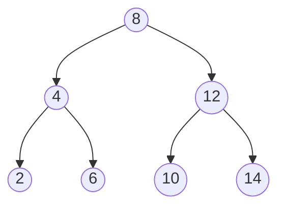
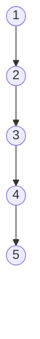
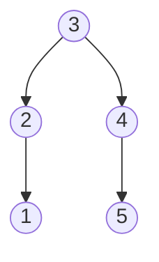
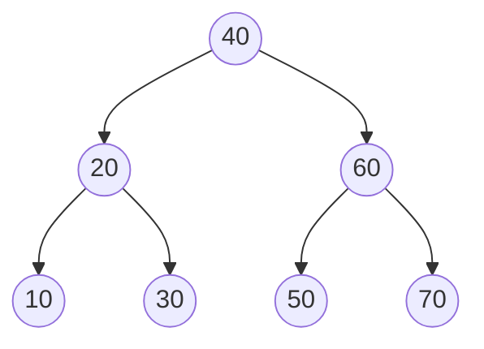

## Objetivos de Aprendizagem

- Declarar a complexidade de tempo de busca, inserção e remoção numa árvore binária de busca em termos da altura da árvore, h.
- Explicar por que h = O(log n) para uma árvore "cheia" mas h = O(n) no pior caso, e construir uma sequência de entrada que força o pior caso.
- Prever, dada uma sequência de inserções, se a ABB resultante será bem formada ou degenerada, sem construí-la.
- Explicar, num nível conceitual, o que uma árvore autobalanceada faz de diferente para garantir altura O(log n), sem precisar implementar uma.

## Contexto e Motivação

O conceito anterior descreveu busca, inserção e remoção em ABB como algoritmos que cada um segue um único caminho a partir da raiz, mas deliberadamente adiou uma pergunta difícil: quão longo é esse caminho? Este conceito responde honestamente, e a resposta honesta tem uma pegadinha: as operações de uma árvore binária de busca custam O(h), onde h é a altura da árvore, e h não é uma quantidade fixa ou garantida; depende inteiramente da forma que a árvore acontece de ter, que por sua vez depende inteiramente da ordem em que os valores foram inseridos. O mesmo conjunto de n valores, inserido em ordens diferentes, pode produzir uma ABB com altura tão pequena quanto aproximadamente log₂(n) ou tão grande quanto n − 1, e os algoritmos do conceito anterior rodam identicamente de qualquer forma; eles simplesmente levam quantidades de tempo muito diferentes para terminar, porque "seguir um caminho a partir da raiz" custa exatamente tantos passos quanto o comprimento desse caminho.

Isso importa porque é exatamente o tipo de lacuna entre "o algoritmo é correto" e "o algoritmo é rápido" que todo este currículo tem construído as ferramentas para notar. Uma ABB é frequentemente introduzida (incluindo no conceito anterior) com uma promessa implícita de "tempo logarítmico", e essa promessa só é verdadeira sob uma suposição não declarada: que a árvore permanece razoavelmente balanceada, ou "cheia", em vez de se tornar torta, ou "degenerada". Tornar essa suposição explícita, e mostrar exatamente como ela pode falhar, é todo o ponto deste conceito. Isso não é um defeito exclusivo de alguma implementação de ABB descuidada; é um fato estrutural sobre a ABB simples como introduzida até agora, e é precisamente a lacuna que motiva uma família inteira de estruturas posteriores (árvores autobalanceadas) que este currículo adia para uma disciplina posterior, `data-structures-ii`, especificamente seu módulo algorithms-software; o trabalho deste conceito é tornar a *necessidade* daquele material posterior completamente convincente, não construir a solução em si.

## Teoria Central

### Busca, inserção, remoção são todas O(h)

Cada uma das três operações de ABB do conceito anterior segue exatamente um caminho, começando na raiz e movendo-se para no máximo um filho a cada passo, até encontrar o alvo, encontrar um espaço vazio para inserir, ou (para o Caso 3 da remoção) encontrar um sucessor em ordem uma subárvore adiante. O número de nós em qualquer caminho da raiz até algum lugar é limitado pela altura da árvore mais um (um caminho da raiz até um nó na profundidade d visita d + 1 nós, e nenhum nó na árvore tem profundidade maior que h, a altura). Então cada operação faz O(h) de trabalho, no máximo h comparações, cada comparação levando O(1) de tempo. Esse é todo o conteúdo de "operações de ABB são O(h)": não é um fato separado a provar por operação, é uma consequência direta de "cada operação percorre um caminho da raiz até algum lugar, e nenhum desses caminhos é mais longo que a altura da árvore".

### O melhor caso: uma árvore cheia dá h = O(log n)

Se uma ABB é mantida **balanceada**, muito grosseiramente, as duas subárvores-filhas de toda subárvore têm tamanho comparável, então cada passo descendo a partir da raiz elimina aproximadamente metade dos nós restantes da consideração, o mesmo comportamento de divisão pela metade que a busca explora explicitamente. Dividir n pela metade repetidamente até chegar a 1 leva cerca de log₂(n) passos, então uma ABB balanceada com n nós tem altura aproximadamente log₂(n), e toda operação custa O(log n), o desempenho ao qual uma ABB é normalmente associada, e o desempenho que de fato justifica escolher uma ABB em vez de, digamos, um vetor ordenado simples (que suporta busca O(log n) mas inserção O(n), já que deslocar elementos é necessário para mantê-lo ordenado).



Esta árvore de 7 nós tem altura 2, toda folha está exatamente 2 arestas da raiz, e log₂(7) ≈ 2,8, então altura 2 está bem alinhada com a expectativa O(log n). Qualquer busca aqui toca no máximo 3 nós.

### O pior caso: inserção em ordem ordenada colapsa uma ABB numa lista encadeada

O algoritmo de inserção do conceito anterior sempre anexa um novo nó no primeiro espaço vazio que seu caminho de comparação alcança; ele não tem mecanismo algum para notar ou corrigir uma forma desbalanceada conforme avança. Alimente-o com entrada já ordenada, um valor de cada vez, e toda inserção vai na mesma direção:

```python
valores = [1, 2, 3, 4, 5]
raiz = None
for v in valores:
    raiz = insere(raiz, v)   # insere() do conceito de árvores binárias de busca
```

Inserir `1` o torna a raiz. Inserir `2`: `2 > 1`, vai à direita; vazio, anexa como filho direito de 1. Inserir `3`: `3 > 1`, vai à direita para 2; `3 > 2`, vai à direita; vazio, anexa como filho direito de 2. Todo valor subsequente é maior que tudo que já está na árvore, então sempre vai à direita, e sempre acaba anexado como o filho direito do nó mais recentemente inserido.



Esta é uma **árvore degenerada**, estruturalmente uma árvore binária, e uma perfeitamente válida por toda definição nos conceitos anteriores (todo nó tem no máximo dois filhos; o invariante de ABB genuinamente vale em todo lugar), mas sua forma é exatamente uma lista encadeada: altura n − 1 para n nós, uma longa cadeia sem ramificação alguma. Busca, inserção e remoção nessa árvore são todas O(h) = O(n − 1) = O(n), não melhor que uma varredura linear de lista encadeada não ordenada simples, apesar de isso ser, por toda definição estrutural dada até agora, uma ABB completamente válida. A mesma forma degenerada resulta de inserir valores em ordem *reversa* (todo valor menor que tudo já presente, então toda inserção vai à esquerda em vez disso); a direção não importa, só que cada novo valor é sempre mais extremo que tudo já inserido.

### Por que balanceamento é uma propriedade da ordem de inserção, não dos valores em si

Vale a pena ser preciso sobre o que de fato causa a degeneração: não é o *conjunto* de valores `{1, 2, 3, 4, 5}` que é de algum jeito ruim; esse mesmo conjunto, inserido em outra ordem, produz uma árvore bem balanceada. Inserir `3, 2, 4, 1, 5` (uma ordem deliberadamente "do meio para fora") no mesmo conjunto de valores dá:



Altura 2, para os mesmos 5 valores idênticos que produziram altura 4 sob inserção em ordem ordenada. A altura da ABB é uma função da *sequência de inserções*, não do conjunto final de valores que acontece de conter, que é exatamente por que esse problema não pode ser corrigido "escolhendo valores melhores" e precisa em vez disso ser corrigido ou controlando a ordem de inserção (raramente prático, já que aplicações reais geralmente não têm como escolher isso) ou fazendo com que a própria árvore se reestruture ativamente conforme cresce, que é a abordagem autobalanceada.

### O que árvores autobalanceadas fazem de diferente (referência adiante, não implementada aqui)

Uma **árvore binária de busca autobalanceada**, árvores AVL e árvores rubro-negras são os dois exemplos clássicos, ambos cobertos mais adiante na disciplina `data-structures-ii` deste currículo, em seu módulo algorithms-software, aumenta a ABB simples com contabilidade extra (um fator de balanceamento por nó para árvores AVL; um bit de cor por nó para árvores rubro-negras) e, depois de toda inserção ou remoção, executa operações locais de reestruturação chamadas **rotações** que remodelam a árvore o suficiente para restaurar uma garantia de altura limitada, sem violar o invariante de ABB. A garantia que essas estruturas fornecem é precisamente aquela que uma ABB simples não tem: a altura é mantida em O(log n) *não importa em que ordem* os valores sejam inseridos ou removidos; a degeneração de entrada ordenada demonstrada acima simplesmente não pode acontecer a uma árvore AVL ou rubro-negra corretamente mantida, porque uma rotação dispararia e rebalancearia a árvore no momento em que um desbalanceamento aparecesse. Nada sobre rotações ou fatores de balanceamento é necessário para entender *por que* elas existem, porém; essa motivação é precisamente o mecanismo de degeneração para O(n) de altura que este conceito acabou de percorrer diretamente, e é a razão pela qual árvores autobalanceadas valem a pena aprender de forma alguma em vez de sempre usar uma ABB simples.

## Exemplos Resolvidos

### Exemplo 1: computando altura e prevendo custo para duas ordens de inserção

**Problema:** para os valores `{10, 20, 30, 40, 50, 60, 70}`, compare a altura e o custo de busca de pior caso de inserí-los em ordem ordenada versus inserí-los como `40, 20, 60, 10, 30, 50, 70`.

**Inserção em ordem ordenada.** Cada valor é maior que tudo antes dele, então, exatamente como na Teoria Central, toda inserção vai à direita, produzindo uma cadeia reta: 10 → 20 → 30 → 40 → 50 → 60 → 70, cada um filho direito do anterior. Altura = 7 − 1 = 6. Uma busca por 70 (o valor mais recentemente inserido, mais profundo) toca todos os 7 nós.

**Inserção do meio para fora.** `40` se torna a raiz. `20 < 40`, filho esquerdo de 40. `60 > 40`, filho direito de 40. `10 < 40`, esquerda, `10 < 20`, filho esquerdo de 20. `30 < 40`, esquerda, `30 > 20`, filho direito de 20. `50 > 40`, direita, `50 < 60`, filho esquerdo de 60. `70 > 40`, direita, `70 > 60`, filho direito de 60.



Altura = 2. Uma busca por qualquer valor toca no máximo 3 nós.

**Comparação.** Os mesmos 7 valores, o mesmo conjunto final; altura 6 (pior caso, O(n)) versus altura 2 (O(log n), já que log₂(7) ≈ 2,8). A ordem de inserção sozinha explica toda a diferença.

### Exemplo 2: identificando qual de duas sequências produz uma árvore degenerada

**Problema:** sem construir nenhuma das duas árvores, preveja qual dessas duas sequências de inserção produz uma ABB gravemente desbalanceada: (A) `5, 3, 8, 1, 4, 7, 9`, ou (B) `1, 2, 3, 4, 5, 6, 7`.

**Raciocínio para (A).** O primeiro valor, 5, se torna a raiz e divide aproximadamente os valores restantes em grupos "menores" (3, 1, 4) e "maiores" (8, 7, 9) de tamanho comparável, um forte sinal de que a árvore vai ramificar nas duas direções em vez de colapsar para um lado. Esse padrão (cada novo valor bissectando aproximadamente o que resta) é a assinatura geral de uma sequência que tende a construir uma árvore cheia.

**Raciocínio para (B).** Todo valor nessa sequência é estritamente maior que todo valor antes dele, o exato padrão de "ordem ordenada" identificado na Teoria Central como o pior caso. Nenhum valor jamais vai à esquerda da raiz; a árvore vai colapsar numa cadeia para a direita, exatamente como o exemplo `1, 2, 3, 4, 5` trabalhado anteriormente.

**Conclusão.** A sequência (B) produz a árvore degenerada, de altura O(n); a sequência (A) produz uma árvore cheia, de altura O(log n), confirmado pelo fato de que (A) é exatamente o mesmo estilo de ordenação "do meio para fora" usado no segundo caso do Exemplo 1, enquanto (B) é exatamente o padrão de ordem ordenada mostrado degenerando na Teoria Central.

### Exemplo 3: quantificando a lacuna do mundo real para n grande

**Problema:** para n = 1.000.000 de nós, compare o número de pior caso de comparações que uma busca precisaria numa ABB balanceada versus uma degenerada.

**Caso balanceado.** Altura ≈ log₂(1.000.000) ≈ 20 (já que 2²⁰ = 1.048.576). Uma busca toca no máximo cerca de 20 nós.

**Caso degenerado.** Altura = n − 1 = 999.999. Uma busca pelo valor mais profundo toca até 999.999 nós, aproximadamente 50.000 vezes mais comparações que o caso balanceado, para o exato mesmo conjunto de valores armazenados e o exato mesmo algoritmo de busca.

**Conclusão.** Isso não é uma diferença menor de fator constante do tipo que "hardware mais rápido" absorve; é a diferença qualitativa entre um algoritmo que escala para n grande e um que efetivamente não escala, e surge puramente da ordem de inserção, com o próprio algoritmo de busca completamente inalterado entre os dois casos. Essa lacuna é precisamente o que torna a garantia de autobalanceamento (altura sempre O(log n), independentemente da ordem de inserção) valendo a contabilidade extra que árvores AVL e rubro-negras introduzem, cobertas mais adiante em `data-structures-ii`.

## Equívocos Comuns e Armadilhas

- **"Uma árvore binária de busca é O(log n) para busca, inserção e remoção."** Esta é a simplificação excessiva mais comum sobre ABBs, e o Exemplo 3 mostra exatamente quão errada ela pode ser no pior caso: a afirmação verdadeira é O(h), e h só é O(log n) quando a árvore acontece de estar balanceada; h = O(n) é um resultado completamente válido e estruturalmente correto para uma ABB simples construída a partir de entrada azarada (por exemplo, ordenada).
- **"Uma árvore degenerada, como a cadeia de inserção ordenada, precisa ser um bug; uma ABB 'de verdade' não pareceria assim."** A cadeia degenerada na Teoria Central não viola nenhuma regra do conceito anterior: todo nó tem no máximo dois filhos, e o invariante de ABB vale em cada nó individual. É uma árvore binária de busca perfeitamente válida; simplesmente tem uma forma ruim. Reconhecer que "válida" e "bem formada" são propriedades diferentes é a lição central deste conceito.
- **"Se uma árvore degenera, a correção é reconstruí-la com valores 'melhores'."** Como o exemplo de reinserção do meio para fora mostra, o exato mesmo conjunto de valores produz uma árvore cheia sob uma ordem de inserção e uma degenerada sob outra; o problema nunca são os próprios valores, só a sequência em que chegaram, que é exatamente por que a correção de verdade (autobalanceamento) precisa operar sobre a estrutura *durante* a inserção/remoção, não sobre o conjunto de valores de antemão.
- **"Já que árvores autobalanceadas corrigem isso, não há razão para entender o pior caso das ABBs simples."** O modo de falha da ABB simples é exatamente a motivação para a qual árvores autobalanceadas são construídas para tratar; entender precisamente como e por que uma ABB simples se degrada (o mecanismo da Teoria Central: toda inserção vai na mesma direção porque cada valor é mais extremo que tudo antes dele) é o que torna a maquinaria extra de árvores AVL ou rubro-negras (cobertas mais adiante, em `data-structures-ii`) legível como solução para um problema específico e bem entendido, em vez de complexidade arbitrária.

## Resumo

Operações de árvore binária de busca custam O(h), onde h é a altura da árvore, não automaticamente O(log n), uma distinção que este conceito existe especificamente para tornar explícita. Uma árvore cheia, onde inserções alternaram aproximadamente acima e abaixo do meio corrente dos valores vistos até agora, dá h = O(log n) e o desempenho ao qual uma ABB é normalmente associada. Uma árvore degenerada, mais simplesmente produzida inserindo dados já ordenados (ou já ordenados de forma reversa) um valor de cada vez, colapsa para h = O(n), tornando toda operação tão lenta quanto uma varredura de lista encadeada, apesar de permanecer uma árvore binária de busca completamente válida por toda regra coberta anteriormente. Essa lacuna de altura é puramente uma função da ordem de inserção, não do conjunto de valores em si, que é por que a correção não pode ser "escolher dados melhores" e precisa em vez disso ser estrutural: árvores autobalanceadas (AVL, rubro-negras), cobertas mais adiante no módulo algorithms-software da disciplina `data-structures-ii`, se reestruturam via rotações depois de toda inserção ou remoção para garantir altura O(log n) independentemente da ordem de inserção, uma garantia motivada diretamente, e tornada necessária, pelo mecanismo de degeneração demonstrado aqui.

## Documentation Links

- [Sedgewick & Wayne — Algorithms, Part I (Princeton, Coursera)](https://www.coursera.org/learn/algorithms-part1) — doc
- [MIT 6.006 — Syllabus (OCW)](https://ocw.mit.edu/courses/6-006-introduction-to-algorithms-spring-2020/pages/syllabus/) — doc
