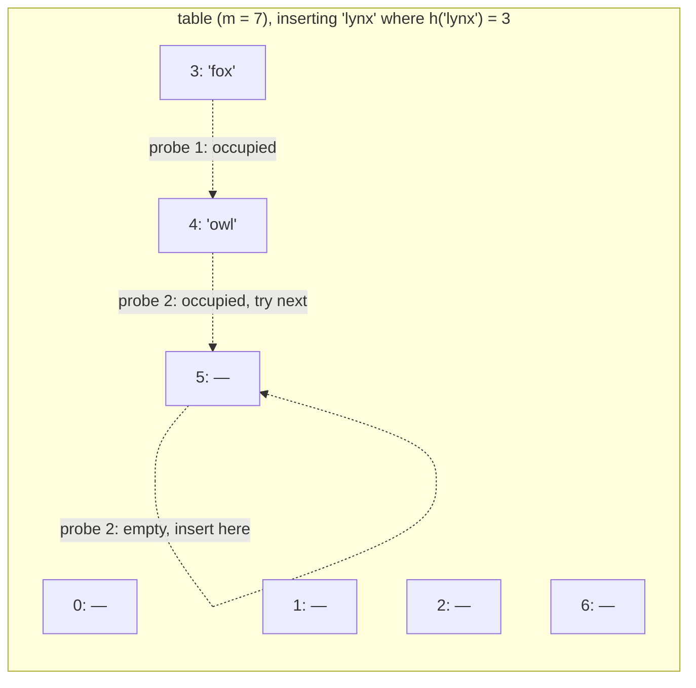
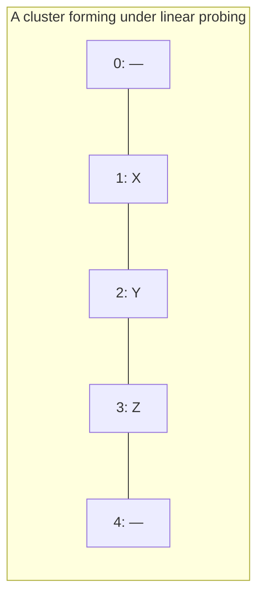

## Learning Objectives

- Explain how open addressing resolves a collision by probing for another open slot within the array itself, rather than chaining elsewhere.
- Implement linear probing insert, lookup, and delete from scratch in Python, including the tombstone technique for handling deletions correctly.
- Analyze the primary clustering problem that arises from linear probing, and explain why it makes performance worse than the load factor alone would suggest.
- Compare linear probing, quadratic probing, and double hashing as increasingly sophisticated attempts to reduce clustering.
- Predict why open addressing imposes a hard capacity ceiling that separate chaining does not.

## Context & Motivation

Separate chaining resolves a collision by growing a small list at the colliding slot — a clean solution, but one that pays for its cleanliness with an extra pointer (or an extra layer of indirection) for every single stored entry, and with a table that spends time walking outside the main array once chains get long, following pointers to memory locations that may be scattered anywhere on the heap. Open addressing takes the opposite philosophy: keep every entry directly inside the one contiguous array, with no auxiliary structure at any slot at all. When two keys collide, the second one doesn't get a list appended to it — it gets redirected to a *different* slot in the same array, found by a deterministic search procedure called **probing**.

This design has real appeal. Because everything lives in one flat array, open addressing tends to have excellent cache behavior — probing nearby slots often means probing nearby memory, which modern hardware rewards heavily — and it avoids the per-entry pointer overhead that chaining requires. But that appeal comes with a matching cost: an open-addressed table has a hard ceiling on how many entries it can ever hold (at most `m`, the array's size, since there is nowhere else to put an entry once every slot is occupied), and the very act of resolving a collision by moving to a nearby slot can create a systematic pattern — clustering — that makes subsequent collisions at that same neighborhood more likely, not less. Understanding open addressing well means understanding both why it can outperform chaining in the friendly case and precisely how it can degrade in the unfriendly one.

## Core Theory

### The probing idea

In open addressing, a collision at index `i = h(key)` is resolved by trying a sequence of alternative indices — a **probe sequence** — until an empty slot is found (for insertion) or the target key is found (for lookup). The simplest and most concrete version is **linear probing**: if slot `i` is occupied, try `i + 1`, then `i + 2`, then `i + 3`, and so on, wrapping around to the start of the array with modulo arithmetic if the end is reached, until an empty slot turns up.



`'lynx'` hashes to slot 3, which is occupied by `'fox'`; the probe sequence tries slot 4 (occupied by `'owl'`), then slot 5, which is empty, so `'lynx'` is inserted there. A later lookup for `'lynx'` must repeat exactly this same probe sequence — compute index 3, find `'fox'` (not a match), probe to 4, find `'owl'` (not a match), probe to 5, find `'lynx'` (match) — which is why the probe sequence must be a fully deterministic function of the key and the attempt number, identical on insert and on lookup.

### From-scratch implementation with linear probing

```python
_EMPTY, _DELETED = object(), object()   # sentinel markers

class LinearProbingHashTable:
    def __init__(self, table_size: int = 8):
        self.table_size = table_size
        self.slots = [_EMPTY] * table_size    # each slot: _EMPTY, _DELETED, or (key, value)
        self.count = 0

    def _probe_indices(self, key):
        start = hash(key) % self.table_size
        for offset in range(self.table_size):
            yield (start + offset) % self.table_size

    def put(self, key, value) -> None:
        first_deleted = None
        for i in self._probe_indices(key):
            slot = self.slots[i]
            if slot is _EMPTY:
                target = first_deleted if first_deleted is not None else i
                self.slots[target] = (key, value)
                self.count += 1
                return
            if slot is _DELETED:
                if first_deleted is None:
                    first_deleted = i     # remember the earliest tombstone to reuse
                continue
            if slot[0] == key:
                self.slots[i] = (key, value)   # update in place
                return
        raise RuntimeError("hash table is full")

    def get(self, key):
        for i in self._probe_indices(key):
            slot = self.slots[i]
            if slot is _EMPTY:
                raise KeyError(key)     # a genuinely empty slot proves the key was never inserted
            if slot is not _DELETED and slot[0] == key:
                return slot[1]
        raise KeyError(key)

    def remove(self, key) -> None:
        for i in self._probe_indices(key):
            slot = self.slots[i]
            if slot is _EMPTY:
                raise KeyError(key)
            if slot is not _DELETED and slot[0] == key:
                self.slots[i] = _DELETED   # tombstone: mark, don't clear to _EMPTY
                self.count -= 1
                return
        raise KeyError(key)
```

### Why deletion needs a tombstone, not a plain clear

Deletion is the one operation where open addressing is genuinely trickier than chaining, and the reason is worth making explicit. Suppose `'fox'` (at slot 3) is deleted by simply resetting slot 3 to `_EMPTY`. Now look up `'lynx'`, which actually lives at slot 5 after having probed past slots 3 and 4 during insertion: the lookup computes index 3, finds it `_EMPTY`, and — following the same logic used in `get` above, that an empty slot proves the key was never inserted — incorrectly concludes `'lynx'` isn't in the table, even though it's sitting right there at slot 5. The fix is the **tombstone**: mark a deleted slot with a special `_DELETED` sentinel that lookup treats as "keep probing past this, it used to be occupied" while insertion treats it as "this slot is available for reuse." This is precisely what `_probe_indices` combined with the `is _DELETED` checks accomplishes above — `get` distinguishes a tombstone (keep going) from a truly empty slot (stop, key isn't here), while `put` is free to overwrite the first tombstone it encounters.

### Primary clustering

Linear probing's simplicity is also its main weakness. When a run of consecutive occupied slots forms — simply because keys happened to collide near each other — that run acts as a magnet for *future* collisions too: any new key that hashes to *any* slot within or just before that run will probe forward and land at the end of it, extending the run further. This self-reinforcing tendency for occupied slots to clump into ever-longer contiguous runs is called **primary clustering**, and it means linear probing's actual performance degrades faster, as the load factor rises, than a naive "average number of probes" calculation would suggest if it assumed collisions were independent events. A long run isn't just several isolated collisions; it is a structure that actively attracts more collisions than an equivalent number of scattered ones would.



Slots 1, 2, 3 form one contiguous run. Any new key hashing to slot 1, 2, or 3 must now probe all the way past this entire run before finding slot 4 — the cluster has effectively made itself a bigger target for future collisions than three isolated occupied slots would have been.

### Beyond linear probing: quadratic probing and double hashing

Two refinements exist specifically to reduce clustering, at the cost of some added complexity:

- **Quadratic probing** tries slots at increasing squared offsets from the original index — `i`, `i + 1^2`, `i + 2^2`, `i + 3^2`, ... — so that keys colliding at the same initial slot spread out more quickly than they would moving one step at a time, which weakens (though does not eliminate) primary clustering. It introduces its own, milder version called *secondary clustering*: keys that hash to the *same* initial slot still follow the *identical* probe sequence as each other, so they remain bunched together relative to each other, even though the table as a whole clusters less than under linear probing.
- **Double hashing** uses a *second*, independent hash function to determine the step size between probes — `i`, `i + step`, `i + 2*step`, ... where `step = h2(key)` — so that two keys colliding at the same initial slot are very likely to follow entirely different probe sequences thereafter (since their step sizes differ), which essentially eliminates both primary and secondary clustering when `h2` is chosen well. This is generally regarded as the strongest of the three, at the cost of computing a second hash function on every probe.

This course builds and reasons about linear probing concretely because it makes the clustering trade-off easiest to see directly; quadratic probing and double hashing are worth knowing as the standard next steps a real implementation would reach for once clustering becomes a measured problem.

## Worked Examples

### Example 1 — tracing linear probing through several insertions and a collision chain

**Problem:** With `table_size = 7`, insert keys with hash values (before compression) landing at raw indices: `"a"` → 2, `"b"` → 3, `"c"` → 2, `"d"` → 2, `"e"` → 4. Trace the final table.

**Trace.**
- `"a"`: index 2, empty → place at 2.
- `"b"`: index 3, empty → place at 3.
- `"c"`: index 2, occupied by `"a"` → probe to 3, occupied by `"b"` → probe to 4, empty → place at 4.
- `"d"`: index 2, occupied by `"a"` → probe to 3, occupied by `"b"` → probe to 4, occupied by `"c"` → probe to 5, empty → place at 5.
- `"e"`: index 4, occupied by `"c"` → probe to 5, occupied by `"d"` → probe to 6, empty → place at 6.

Final table: slot 2 = a, 3 = b, 4 = c, 5 = d, 6 = e, slots 0 and 1 empty. Notice the cluster: slots 2 through 6 form one unbroken run of five occupied slots, even though only two keys (`"a"` and `"b"`) actually had *different* original hash indices among the five — the cluster grew because each subsequent collision extended the run by exactly one slot, which is primary clustering playing out directly.

### Example 2 — deletion with tombstones, then a lookup that must survive it

**Problem:** From the table in Example 1, delete `"b"` (at slot 3), then look up `"d"` (at slot 5).

**Delete `"b"`:** slot 3 is marked `_DELETED` (tombstoned), not reset to empty.

**Look up `"d"`:** compute the raw index, 2 (as given). Slot 2 holds `"a"` — not a match, keep probing. Slot 3 is `_DELETED` — under the `get` logic, this is *not* treated as proof the key is absent; probing continues to slot 4, `"c"` — not a match, continue. Slot 5, `"d"` — match, found. If slot 3 had instead been reset to a plain `_EMPTY` on deletion, the lookup would have stopped at slot 3, incorrectly concluding `"d"` isn't in the table. This is the tombstone mechanism doing exactly the job described in Core Theory: preserving the integrity of every probe sequence that happens to pass through a deleted slot.

### Example 3 — comparing chaining and open addressing at the same load factor

**Problem:** Two hash tables, one using chaining and one using linear probing, both have `m = 10` and hold `n = 9` entries (`alpha = 0.9`). Discuss the qualitative difference in behavior, and what happens if an attempt is made to insert a 10th and then an 11th entry.

**Chaining at alpha = 0.9:** average chain length is 0.9, so lookups remain fast on average; inserting a 10th entry (`alpha = 1.0`) or an 11th (`alpha = 1.1`) is completely unproblematic — chaining has no capacity ceiling, chains just get slightly longer on average.

**Linear probing at alpha = 0.9:** with only one slot free out of ten, a new key's probe sequence has, in the worst case, up to nine occupied slots to walk past before finding the single empty one — and because of clustering, that one empty slot is not necessarily nearby the new key's original hash index. Empirically, linear probing's expected number of probes grows roughly like `1/(1 - alpha)`, which at `alpha = 0.9` is already around 10 probes on average for an unsuccessful search — far worse than chaining's ~0.9 at the identical load factor. Attempting an 11th entry is not merely slow, it is *impossible*: once all 10 slots are occupied (`alpha = 1.0`), `put` above raises `RuntimeError("hash table is full")`, because there is, by construction, nowhere left in the array to place another entry. This is the hard ceiling mentioned in Context & Motivation, made concrete: open addressing cannot exceed `n = m`, and its performance is already degrading sharply well before it gets there — which is exactly why keeping `alpha` well below 1 via rehashing (the next concept) matters even more urgently for open addressing than for chaining.

## Common Misconceptions & Pitfalls

- **"Deleting from an open-addressed table just means clearing the slot, same as chaining."** As Example 2 demonstrates directly, clearing a slot to a plain empty state can break lookups for other keys whose probe sequence passes through that slot — the tombstone technique exists specifically to prevent this, and it is a genuinely distinguishing complexity of open addressing that chaining doesn't share (deleting a chain node just re-links a pointer, with no analogous hazard).
- **"Since linear probing and chaining can both be described by a load factor, they degrade the same way as alpha increases."** Example 3 shows this is false: at identical `alpha`, linear probing's expected probe count grows much faster (roughly `1/(1-alpha)`) than chaining's (`1 + alpha`), because of primary clustering — the two schemes are not interchangeable at "the same" load factor, and open addressing generally needs to be kept at a noticeably lower load factor than chaining to achieve comparable performance.
- **"A hash table using open addressing can hold as many entries as memory allows, just like one using chaining."** Open addressing has a hard ceiling at `n = m` since every entry must live in the array itself; once the array is full, insertion fails outright rather than merely slowing down. Chaining has no such ceiling — buckets grow indefinitely, so its capacity is bounded only by memory, not by `m`.
- **"Primary clustering is just 'more collisions happen when the table is fuller' — nothing special about linear probing in particular."** Clustering is a distinct, additional effect beyond the raw load factor: as Example 1 shows, a contiguous run of occupied slots attracts more of the *next* collisions than the same number of scattered occupied slots would, because every key hashing anywhere into or just before the run gets funneled to its far end. Quadratic probing and double hashing exist precisely because this self-reinforcing effect is specific to the "always try the very next slot" rule of linear probing, not an unavoidable consequence of load factor alone.

## Summary

Open addressing resolves a collision by probing for another open slot within the array itself rather than chaining elsewhere, keeping every entry inside one contiguous block of memory. Linear probing — trying the next slot, then the next, wrapping around as needed — is the simplest version, but its very simplicity produces primary clustering: contiguous runs of occupied slots that attract disproportionately more future collisions, making its real-world probe counts grow faster than the load factor alone would suggest. Quadratic probing and double hashing exist as refinements that spread colliding keys out more aggressively, with double hashing essentially eliminating clustering at the cost of a second hash computation per probe. Open addressing also requires careful handling of deletion via tombstones (to avoid breaking probe sequences for other keys) and, unlike chaining, has a hard ceiling of `n <= m` entries, with performance degrading sharply as that ceiling is approached — making the load factor and rehashing strategy covered next an even more pressing concern here than under chaining.

## Documentation Links

- [Sedgewick & Wayne — Algorithms, Part I (Princeton, Coursera)](https://www.coursera.org/learn/algorithms-part1) — doc
- [Stanford CS106B — Lecture Schedule](https://web.stanford.edu/class/cs106b/schedule) — doc
