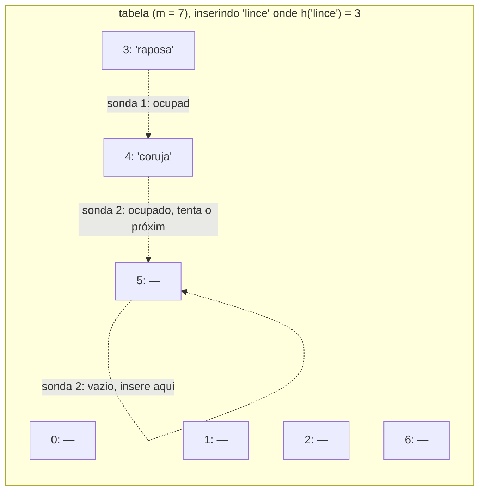
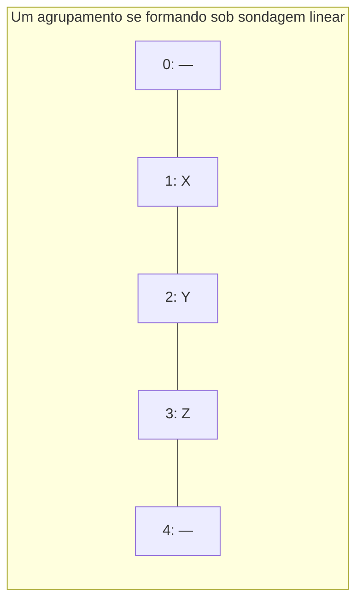

## Objetivos de Aprendizagem

- Explicar como endereçamento aberto resolve uma colisão sondando outro slot aberto dentro do próprio vetor, em vez de encadear em outro lugar.
- Implementar inserção, busca e remoção com sondagem linear do zero em Python, incluindo a técnica de lápide para tratar remoções corretamente.
- Analisar o problema de agrupamento primário que surge da sondagem linear, e explicar por que ele torna o desempenho pior do que o fator de carga sozinho sugeriria.
- Comparar sondagem linear, sondagem quadrática, e hashing duplo como tentativas cada vez mais sofisticadas de reduzir agrupamento.
- Prever por que endereçamento aberto impõe um teto de capacidade rígido que encadeamento separado não impõe.

## Contexto e Motivação

Encadeamento separado resolve uma colisão crescendo uma pequena lista no slot colidindo, uma solução limpa, mas que paga por sua limpeza com um ponteiro extra (ou uma camada extra de indireção) para cada entrada armazenada, e com uma tabela que gasta tempo caminhando fora do vetor principal uma vez que cadeias ficam longas, seguindo ponteiros para localizações de memória que podem estar espalhadas em qualquer lugar do heap. Endereçamento aberto toma a filosofia oposta: mantenha toda entrada diretamente dentro do único vetor contíguo, sem estrutura auxiliar em nenhum slot de forma alguma. Quando duas chaves colidem, a segunda não recebe uma lista anexada a ela; ela é redirecionada para um slot *diferente* no mesmo vetor, encontrado por um procedimento de busca determinístico chamado **sondagem**.

Esse projeto tem apelo real. Como tudo mora num único vetor plano, endereçamento aberto tende a ter excelente comportamento de cache (sondar slots próximos frequentemente significa sondar memória próxima, que o hardware moderno recompensa fortemente), e evita o overhead de ponteiro por entrada que encadeamento exige. Mas esse apelo vem com um custo correspondente: uma tabela de endereçamento aberto tem um teto rígido de quantas entradas pode segurar (no máximo `m`, o tamanho do vetor, já que não há outro lugar para colocar uma entrada uma vez que todo slot está ocupado), e o próprio ato de resolver uma colisão movendo-se para um slot próximo pode criar um padrão sistemático, agrupamento, que torna colisões subsequentes naquela mesma vizinhança mais prováveis, não menos. Entender endereçamento aberto bem significa entender tanto por que pode superar encadeamento no caso amigável quanto precisamente como pode degradar no caso hostil.

## Teoria Central

### A ideia de sondagem

Em endereçamento aberto, uma colisão no índice `i = h(chave)` é resolvida tentando uma sequência de índices alternativos, uma **sequência de sondagem**, até que um slot vazio seja encontrado (para inserção) ou a chave alvo seja encontrada (para busca). A versão mais simples e concreta é **sondagem linear**: se o slot `i` está ocupado, tente `i + 1`, depois `i + 2`, depois `i + 3`, e assim por diante, dando a volta ao início do vetor com aritmética modular se o final for alcançado, até um slot vazio aparecer.



`'lince'` dá hash para o slot 3, que está ocupado por `'raposa'`; a sequência de sondagem tenta o slot 4 (ocupado por `'coruja'`), depois o slot 5, que está vazio, então `'lince'` é inserido ali. Uma busca posterior por `'lince'` precisa repetir exatamente essa mesma sequência de sondagem: computa o índice 3, encontra `'raposa'` (não é um acerto), sonda para 4, encontra `'coruja'` (não é um acerto), sonda para 5, encontra `'lince'` (acerto), que é por que a sequência de sondagem precisa ser uma função totalmente determinística da chave e do número da tentativa, idêntica na inserção e na busca.

### Implementação do zero com sondagem linear

```python
_VAZIO, _REMOVIDO = object(), object()   # marcadores sentinela

class TabelaHashSondagemLinear:
    def __init__(self, tamanho_tabela: int = 8):
        self.tamanho_tabela = tamanho_tabela
        self.slots = [_VAZIO] * tamanho_tabela    # cada slot: _VAZIO, _REMOVIDO, ou (chave, valor)
        self.contagem = 0

    def _indices_sondagem(self, chave):
        inicio = hash(chave) % self.tamanho_tabela
        for deslocamento in range(self.tamanho_tabela):
            yield (inicio + deslocamento) % self.tamanho_tabela

    def put(self, chave, valor) -> None:
        primeiro_removido = None
        for i in self._indices_sondagem(chave):
            slot = self.slots[i]
            if slot is _VAZIO:
                alvo = primeiro_removido if primeiro_removido is not None else i
                self.slots[alvo] = (chave, valor)
                self.contagem += 1
                return
            if slot is _REMOVIDO:
                if primeiro_removido is None:
                    primeiro_removido = i     # lembra a primeira lápide para reusar
                continue
            if slot[0] == chave:
                self.slots[i] = (chave, valor)   # atualiza no lugar
                return
        raise RuntimeError("tabela hash está cheia")

    def get(self, chave):
        for i in self._indices_sondagem(chave):
            slot = self.slots[i]
            if slot is _VAZIO:
                raise KeyError(chave)     # um slot genuinamente vazio prova que a chave nunca foi inserida
            if slot is not _REMOVIDO and slot[0] == chave:
                return slot[1]
        raise KeyError(chave)

    def remove(self, chave) -> None:
        for i in self._indices_sondagem(chave):
            slot = self.slots[i]
            if slot is _VAZIO:
                raise KeyError(chave)
            if slot is not _REMOVIDO and slot[0] == chave:
                self.slots[i] = _REMOVIDO   # lápide: marca, não limpa para _VAZIO
                self.contagem -= 1
                return
        raise KeyError(chave)
```

### Por que remoção precisa de uma lápide, não de uma limpeza simples

Remoção é a única operação onde endereçamento aberto é genuinamente mais complicado que encadeamento, e a razão vale a pena tornar explícita. Suponha que `'raposa'` (no slot 3) seja removida simplesmente redefinindo o slot 3 para `_VAZIO`. Agora busque `'lince'`, que na verdade mora no slot 5 depois de ter sondado além dos slots 3 e 4 durante a inserção: a busca computa o índice 3, o encontra `_VAZIO`, e, seguindo a mesma lógica usada em `get` acima, de que um slot vazio prova que a chave nunca foi inserida, incorretamente conclui que `'lince'` não está na tabela, mesmo estando bem ali no slot 5. A correção é a **lápide**: marque um slot removido com um sentinela especial `_REMOVIDO` que a busca trata como "continue sondando além disso, isso costumava estar ocupado" enquanto a inserção trata como "este slot está disponível para reuso". Isso é precisamente o que `_indices_sondagem` combinado com as checagens `is _REMOVIDO` realiza acima; `get` distingue uma lápide (continue) de um slot verdadeiramente vazio (pare, a chave não está aqui), enquanto `put` fica livre para sobrescrever a primeira lápide que encontra.

### Agrupamento primário

A simplicidade da sondagem linear é também sua principal fraqueza. Quando uma sequência de slots ocupados consecutivos se forma, simplesmente porque chaves aconteceram de colidir perto umas das outras, essa sequência age como um ímã para colisões *futuras* também: qualquer nova chave que dá hash para *qualquer* slot dentro ou logo antes daquela sequência vai sondar para frente e cair no final dela, estendendo a sequência ainda mais. Essa tendência autorreforçadora de slots ocupados se aglomerarem em sequências contíguas cada vez mais longas se chama **agrupamento primário**, e significa que o desempenho real da sondagem linear se degrada mais rápido, conforme o fator de carga sobe, do que um cálculo ingênuo de "número médio de sondagens" sugeriria se assumisse que colisões eram eventos independentes. Uma sequência longa não é só várias colisões isoladas; é uma estrutura que ativamente atrai mais colisões do que um número equivalente de slots ocupados espalhados atrairia.



Os slots 1, 2, 3 formam uma sequência contígua. Qualquer nova chave dando hash para o slot 1, 2, ou 3 agora precisa sondar até além dessa sequência inteira antes de encontrar o slot 4; o agrupamento efetivamente se tornou um alvo maior para colisões futuras do que três slots ocupados isolados teriam sido.

### Além da sondagem linear: sondagem quadrática e hashing duplo

Dois refinamentos existem especificamente para reduzir agrupamento, ao custo de alguma complexidade adicional:

- **Sondagem quadrática** tenta slots em deslocamentos quadrados crescentes a partir do índice original: `i`, `i + 1^2`, `i + 2^2`, `i + 3^2`, ..., de forma que chaves colidindo no mesmo slot inicial se espalhem mais rapidamente do que se movendo um passo de cada vez, o que enfraquece (embora não elimine) o agrupamento primário. Introduz sua própria versão, mais branda, chamada *agrupamento secundário*: chaves que dão hash para o *mesmo* slot inicial ainda seguem a *idêntica* sequência de sondagem entre si, então permanecem agrupadas relativamente umas às outras, mesmo que a tabela como um todo se agrupe menos que sob sondagem linear.
- **Hashing duplo** usa uma *segunda* função de hash independente para determinar o tamanho do passo entre sondagens: `i`, `i + passo`, `i + 2*passo`, ... onde `passo = h2(chave)`, de forma que duas chaves colidindo no mesmo slot inicial provavelmente vão seguir sequências de sondagem inteiramente diferentes daí em diante (já que seus tamanhos de passo diferem), o que essencialmente elimina tanto agrupamento primário quanto secundário quando `h2` é bem escolhido. Isso é geralmente considerado o mais forte dos três, ao custo de computar uma segunda função de hash a cada sondagem.

Este curso constrói e raciocina sobre sondagem linear concretamente porque torna a troca de agrupamento mais fácil de ver diretamente; sondagem quadrática e hashing duplo valem a pena saber como os próximos passos padrão que uma implementação real buscaria uma vez que agrupamento se torna um problema medido.

## Exemplos Resolvidos

### Exemplo 1: traçando sondagem linear através de várias inserções e uma cadeia de colisões

**Problema:** com `tamanho_tabela = 7`, insira chaves com valores de hash (antes da compressão) caindo em índices crus: `"a"` → 2, `"b"` → 3, `"c"` → 2, `"d"` → 2, `"e"` → 4. Trace a tabela final.

**Traço.**
- `"a"`: índice 2, vazio → coloca em 2.
- `"b"`: índice 3, vazio → coloca em 3.
- `"c"`: índice 2, ocupado por `"a"` → sonda para 3, ocupado por `"b"` → sonda para 4, vazio → coloca em 4.
- `"d"`: índice 2, ocupado por `"a"` → sonda para 3, ocupado por `"b"` → sonda para 4, ocupado por `"c"` → sonda para 5, vazio → coloca em 5.
- `"e"`: índice 4, ocupado por `"c"` → sonda para 5, ocupado por `"d"` → sonda para 6, vazio → coloca em 6.

Tabela final: slot 2 = a, 3 = b, 4 = c, 5 = d, 6 = e, slots 0 e 1 vazios. Note o agrupamento: os slots 2 a 6 formam uma sequência ininterrupta de cinco slots ocupados, mesmo que só duas chaves (`"a"` e `"b"`) de fato tivessem índices de hash originais *diferentes* entre as cinco; o agrupamento cresceu porque cada colisão subsequente estendeu a sequência em exatamente um slot, que é agrupamento primário se manifestando diretamente.

### Exemplo 2: remoção com lápides, depois uma busca que precisa sobreviver a isso

**Problema:** a partir da tabela no Exemplo 1, remova `"b"` (no slot 3), depois busque `"d"` (no slot 5).

**Remove `"b"`:** o slot 3 é marcado `_REMOVIDO` (lápide), não redefinido para vazio.

**Busca `"d"`:** compute o índice cru, 2 (como dado). O slot 2 segura `"a"`, não é um acerto, continua sondando. O slot 3 é `_REMOVIDO`, sob a lógica de `get`, isso *não* é tratado como prova de que a chave está ausente; a sondagem continua para o slot 4, `"c"`, não é um acerto, continua. Slot 5, `"d"`, acerto, encontrado. Se o slot 3 tivesse em vez disso sido redefinido para um `_VAZIO` simples na remoção, a busca teria parado no slot 3, incorretamente concluindo que `"d"` não está na tabela. Isso é o mecanismo de lápide fazendo exatamente o trabalho descrito na Teoria Central: preservando a integridade de toda sequência de sondagem que acontece de passar por um slot removido.

### Exemplo 3: comparando encadeamento e endereçamento aberto no mesmo fator de carga

**Problema:** duas tabelas hash, uma usando encadeamento e uma usando sondagem linear, as duas têm `m = 10` e seguram `n = 9` entradas (`alfa = 0,9`). Discuta a diferença qualitativa de comportamento, e o que acontece se uma tentativa é feita de inserir uma 10ª e depois uma 11ª entrada.

**Encadeamento em alfa = 0,9:** o comprimento médio da cadeia é 0,9, então buscas permanecem rápidas em média; inserir uma 10ª entrada (`alfa = 1,0`) ou uma 11ª (`alfa = 1,1`) é completamente sem problemas; encadeamento não tem teto de capacidade, cadeias só ficam um pouco mais longas em média.

**Sondagem linear em alfa = 0,9:** com apenas um slot livre em dez, a sequência de sondagem de uma nova chave tem, no pior caso, até nove slots ocupados para passar antes de encontrar o único vazio, e por causa do agrupamento, esse único slot vazio não está necessariamente perto do índice de hash original da nova chave. Empiricamente, o número esperado de sondagens da sondagem linear cresce aproximadamente como `1/(1 - alfa)`, que em `alfa = 0,9` já está por volta de 10 sondagens em média para uma busca malsucedida, muito pior que o ~0,9 do encadeamento no mesmo fator de carga idêntico. Tentar uma 11ª entrada não é meramente lento, é *impossível*: uma vez que todos os 10 slots estão ocupados (`alfa = 1,0`), o `put` acima levanta `RuntimeError("tabela hash está cheia")`, porque não há, por construção, mais lugar no vetor para colocar outra entrada. Este é o teto rígido mencionado no Contexto e Motivação, tornado concreto: endereçamento aberto não pode exceder `n = m`, e seu desempenho já está se degradando fortemente bem antes de chegar lá, que é exatamente por que manter `alfa` bem abaixo de 1 via rehashing (o próximo conceito) importa ainda mais urgentemente para endereçamento aberto do que para encadeamento.

## Equívocos Comuns e Armadilhas

- **"Remover de uma tabela de endereçamento aberto só significa limpar o slot, igual encadeamento."** Como o Exemplo 2 demonstra diretamente, limpar um slot para um estado vazio simples pode quebrar buscas para outras chaves cuja sequência de sondagem passa por aquele slot; a técnica de lápide existe especificamente para prevenir isso, e é uma complexidade genuinamente distintiva de endereçamento aberto que encadeamento não compartilha (remover um nó de cadeia só religa um ponteiro, sem risco análogo).
- **"Já que sondagem linear e encadeamento podem ambos ser descritos por um fator de carga, eles degradam do mesmo jeito conforme alfa aumenta."** O Exemplo 3 mostra que isso é falso: no mesmo `alfa` idêntico, a contagem esperada de sondagens da sondagem linear cresce muito mais rápido (aproximadamente `1/(1-alfa)`) que a do encadeamento (`1 + alfa`), por causa do agrupamento primário; os dois esquemas não são intercambiáveis no "mesmo" fator de carga, e endereçamento aberto geralmente precisa ser mantido num fator de carga notavelmente mais baixo que encadeamento para alcançar desempenho comparável.
- **"Uma tabela hash usando endereçamento aberto pode segurar tantas entradas quanto a memória permitir, igual uma usando encadeamento."** Endereçamento aberto tem um teto rígido em `n = m` já que toda entrada precisa morar no próprio vetor; uma vez que o vetor está cheio, inserção falha completamente em vez de meramente ficar mais lenta. Encadeamento não tem esse teto; baldes crescem indefinidamente, então sua capacidade é limitada só pela memória, não por `m`.
- **"Agrupamento primário é só 'mais colisões acontecem quando a tabela está mais cheia', nada de especial sobre sondagem linear em particular."** Agrupamento é um efeito distinto e adicional além do fator de carga cru: como o Exemplo 1 mostra, uma sequência contígua de slots ocupados atrai mais das *próximas* colisões do que o mesmo número de slots ocupados espalhados atrairia, porque toda chave dando hash para qualquer lugar dentro ou logo antes da sequência é canalizada para o final dela. Sondagem quadrática e hashing duplo existem precisamente porque esse efeito autorreforçador é específico da regra "sempre tente o próximo slot" da sondagem linear, não uma consequência inevitável do fator de carga sozinho.

## Resumo

Endereçamento aberto resolve uma colisão sondando outro slot aberto dentro do próprio vetor em vez de encadear em outro lugar, mantendo toda entrada dentro de um único bloco contíguo de memória. Sondagem linear (tentar o próximo slot, depois o próximo, dando a volta conforme necessário) é a versão mais simples, mas sua própria simplicidade produz agrupamento primário: sequências contíguas de slots ocupados que atraem desproporcionalmente mais colisões futuras, fazendo suas contagens reais de sondagem crescer mais rápido do que o fator de carga sozinho sugeriria. Sondagem quadrática e hashing duplo existem como refinamentos que espalham chaves colidindo mais agressivamente, com hashing duplo essencialmente eliminando agrupamento ao custo de uma segunda computação de hash por sondagem. Endereçamento aberto também exige tratamento cuidadoso de remoção via lápides (para evitar quebrar sequências de sondagem para outras chaves) e, diferente de encadeamento, tem um teto rígido de `n <= m` entradas, com desempenho se degradando fortemente conforme esse teto é aproximado, tornando o fator de carga e a estratégia de rehashing cobertos a seguir uma preocupação ainda mais premente aqui do que sob encadeamento.

## Documentation Links

- [Sedgewick & Wayne — Algorithms, Part I (Princeton, Coursera)](https://www.coursera.org/learn/algorithms-part1) — doc
- [Stanford CS106B — Lecture Schedule](https://web.stanford.edu/class/cs106b/schedule) — doc
