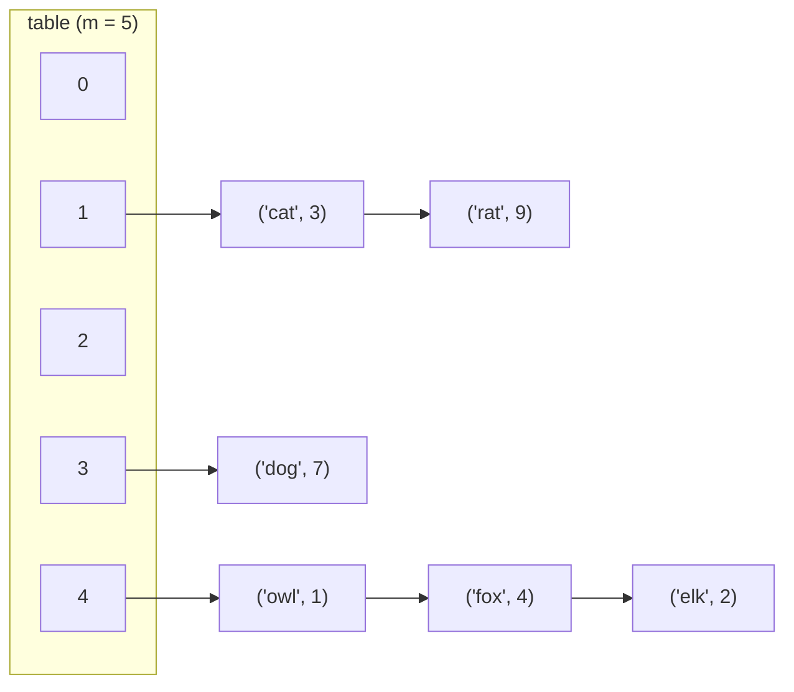

## Learning Objectives

- Explain how separate chaining resolves a collision by storing multiple key-value pairs at a single array slot instead of choosing between them.
- Implement a hash table with separate chaining from scratch in Python, including insert, lookup, and delete.
- Analyze how a chained hash table's average-case performance depends on the average chain length, and connect that length to the table's load factor.
- Compare separate chaining against the alternative (open addressing) on memory overhead and worst-case behavior.
- Predict what happens to lookup cost as more and more keys collide into the same bucket, including the degenerate worst case.

## Context & Motivation

The previous concept established that collisions in a hash table are not an occasional inconvenience but a mathematical certainty — the pigeonhole principle guarantees that once more keys are inserted than there are table slots, at least two must land on the same index, and in practice collisions show up far earlier than that, by ordinary probability. A hash table's design is therefore incomplete without an answer to a very concrete question: when `h(k1) == h(k2)` for two different keys, and slot `h(k1)` is where both "belong," what actually happens to the second one?

Separate chaining answers this question in the simplest way imaginable: don't force a single slot to hold only one key. Instead, let each slot hold a small collection — conventionally a linked list, though any list-like structure works — of every key-value pair that has ever hashed to that index. A collision, under this scheme, doesn't require any special-casing or searching elsewhere in the array; it just means the bucket at that index now holds two entries instead of one. This is the same idea that appears throughout this course whenever a single structure needs to hold "zero or more of something at one place": a linked list nested inside an array slot is really just deploying a data structure the course already covers (singly linked lists) to solve a new problem. Understanding chaining well means seeing that a chained hash table is not a wholly new invention — it's a fairly direct combination of two structures already in hand, plus the crucial insight that the analysis of the whole depends on the *typical length* of these little lists, not on the size of the table alone.

## Core Theory

### The bucket-of-a-list structure

In separate chaining, the table is an array of `m` slots, but each slot doesn't hold a single key-value pair directly — it holds a reference to a list (a **bucket**) containing all pairs whose key currently hashes to that index. Inserting a key means computing `i = h(key)`, then appending (or updating, if the key is already present) within the list at `table[i]`. Looking up a key means computing the same `i`, then walking the list at `table[i]` — usually a short list — checking each entry's key for equality until a match is found or the list is exhausted.



Here `'cat'` and `'rat'` collided at index 1, and `'owl'`, `'fox'`, `'elk'` all collided at index 4 — each bucket simply grew a longer chain rather than needing anywhere else to put the data.

### From-scratch implementation

```python
class Node:
    __slots__ = ("key", "value", "next")
    def __init__(self, key, value, next=None):
        self.key = key
        self.value = value
        self.next = next

class ChainingHashTable:
    def __init__(self, table_size: int = 8):
        self.table_size = table_size
        self.buckets = [None] * table_size   # each slot is a linked-list head, or None
        self.count = 0

    def _index(self, key) -> int:
        return hash(key) % self.table_size

    def put(self, key, value) -> None:
        i = self._index(key)
        node = self.buckets[i]
        while node is not None:
            if node.key == key:
                node.value = value      # key already present: update in place
                return
            node = node.next
        # key not found in the chain: insert at the front (O(1))
        self.buckets[i] = Node(key, value, self.buckets[i])
        self.count += 1

    def get(self, key):
        i = self._index(key)
        node = self.buckets[i]
        while node is not None:
            if node.key == key:
                return node.value
            node = node.next
        raise KeyError(key)

    def remove(self, key) -> None:
        i = self._index(key)
        node = self.buckets[i]
        prev = None
        while node is not None:
            if node.key == key:
                if prev is None:
                    self.buckets[i] = node.next
                else:
                    prev.next = node.next
                self.count -= 1
                return
            prev, node = node, node.next
        raise KeyError(key)
```

Every operation follows the same two-step pattern: compute the index in O(1), then walk one bucket's list. This is exactly why chaining's performance analysis reduces almost entirely to a single question — how long is a typical chain?

### Average-case analysis: chain length and load factor

Define the **load factor** `alpha = n / m`, where `n` is the number of stored key-value pairs and `m` is the number of buckets. If the hash function distributes keys uniformly, then each of the `m` buckets receives, on average, `n / m = alpha` entries — so `alpha` is literally the *average chain length*. A lookup that doesn't find its key must walk an entire chain, costing O(1 + alpha) on average (the "+1" accounts for computing the hash and touching the bucket at all, which is a fixed cost even for an empty chain); a successful lookup costs somewhat less on average but is also O(1 + alpha). As long as `alpha` is kept bounded by a small constant — which is exactly the job of the rehashing strategy covered in the next concept — chains stay short and every operation is effectively O(1) regardless of how large `n` grows, because `m` is grown to keep pace with `n`.

### Worst case: everything in one bucket

Nothing about chaining *prevents* a pathological hash function (or a pathological key sequence, chosen adversarially against a known hash function) from sending every key to the same bucket. In that scenario, the table's `m` buckets are irrelevant — one bucket holds all `n` entries as one long linked list, and every operation degrades to O(n), identical to searching an unsorted linked list directly. This is the concrete worst case that motivates the "uniform distribution" requirement from the hashing concept: chaining's average-case elegance is entirely contingent on the hash function actually spreading keys out; a bad hash function doesn't break chaining's correctness (lookups still work, they just get slow) but it does erase its performance advantage completely.

### Variations: what a "bucket" can be

The description above uses a singly linked list per bucket, which is the classic textbook presentation and keeps insertion O(1) at the head. Some practical implementations instead use a small dynamic array (a resizing array, as covered earlier in this course) per bucket, trading O(1) head-insertion for better memory locality since array elements sit contiguously rather than scattered across separately allocated nodes. A few advanced implementations (e.g., certain JVM `HashMap` internals) even convert an individual bucket from a list into a small balanced tree once its chain grows unusually long, to cap the worst-case cost of a single pathological bucket at O(log k) instead of O(k) — a refinement worth knowing exists, though the linked-list bucket is what this course builds and reasons about directly.

## Worked Examples

### Example 1 — inserting and tracing chain growth

**Problem:** Using the `ChainingHashTable` above with `table_size = 5`, insert the keys `"cat"`, `"dog"`, `"bird"`, `"cow"`, `"ant"` (in that order) and trace which bucket each lands in, assuming (for illustration) that `hash(key) % 5` produces: cat → 2, dog → 4, bird → 2, cow → 4, ant → 0.

**Trace.**
- `put("cat", ...)`: index 2, bucket empty → bucket[2] = [cat].
- `put("dog", ...)`: index 4, bucket empty → bucket[4] = [dog].
- `put("bird", ...)`: index 2, bucket[2] already holds cat (not a match) → prepend → bucket[2] = [bird, cat].
- `put("cow", ...)`: index 4, bucket[4] holds dog (not a match) → prepend → bucket[4] = [cow, dog].
- `put("ant", ...)`: index 0, bucket empty → bucket[0] = [ant].

Final state: bucket 0 = [ant], bucket 2 = [bird, cat], bucket 4 = [cow, dog], buckets 1 and 3 empty. `n = 5`, `m = 5`, so `alpha = 1.0` — on average one entry per bucket, though the *actual* distribution here is uneven (two buckets hold 2 entries, one holds 1, two hold 0), a reminder that "average chain length" is a statement about the average, not a guarantee that every bucket is the same length.

**Looking up `"bird"`:** compute index 2, walk bucket[2] starting from the head: check `bird` first (the most recently inserted entry, since new entries are prepended) — match found immediately, O(1) for this particular key. **Looking up `"cat"`** in the same bucket: check `bird` (no match), then `cat` (match) — two comparisons, still O(chain length) as expected, just not the head this time.

### Example 2 — deleting from a chain and re-linking

**Problem:** From the state at the end of Example 1, delete `"cow"` from bucket 4 = [cow, dog].

**Trace of `remove("cow")`:** index 4, `node = bucket[4]` starts at the `cow` node, `prev = None`. Check: `node.key == "cow"` → match on the very first node. Since `prev is None`, set `bucket[4] = node.next`, which is the `dog` node. Bucket 4 is now [dog], and `cow`'s node is unreferenced and reclaimed. This shows why the `prev` pointer is necessary even though it wasn't needed for insertion: removing a node requires re-linking whatever pointed to it (either the bucket's head reference or the previous node's `next` pointer) to skip over the removed node, and that requires knowing what came immediately before it.

### Example 3 — quantifying the cost of a bad hash function under chaining

**Problem:** Suppose 1,000 keys are inserted into a chaining hash table with `m = 100` buckets. Compare the average lookup cost under (a) a uniform hash function, versus (b) a degenerate hash function that always returns index 0.

**Case (a): uniform.** `alpha = n / m = 1000 / 100 = 10`. Average chain length is 10, so an average lookup costs O(1 + 10) = O(11) comparisons — a small constant, and critically, one that doesn't grow if `n` and `m` are scaled up together (e.g., 10,000 keys over 1,000 buckets gives the same `alpha = 10`).

**Case (b): degenerate.** All 1,000 keys land in bucket 0; the other 99 buckets stay empty. A lookup for a key at the end of the chain costs up to 1,000 comparisons — O(n), not O(1 + alpha) — because the "average chain length" formula `n/m` assumed uniform distribution across all `m` buckets, an assumption this hash function violates completely. The table's *nominal* load factor is still `10` by the `n/m` formula, but that number is meaningless as a performance predictor here, because the entries aren't actually spread according to it. This is the concrete demonstration that chaining's O(1 + alpha) guarantee is conditional on the hash function's quality, not a property of chaining as a mechanism by itself.

## Common Misconceptions & Pitfalls

- **"Chaining wastes so much memory that it's always worse than open addressing."** Chaining does carry per-entry overhead (a node object with a `next` pointer, or a small array-of-arrays structure), but it degrades *gracefully*: a table with `alpha = 3` (three times as many entries as buckets) still functions correctly under chaining, just with somewhat longer chains, whereas open addressing (the next concept) cannot store more entries than it has slots at all. The two schemes make different trade-offs — memory overhead per entry versus a hard capacity ceiling — neither dominates the other unconditionally.
- **"A hash table with separate chaining can never exceed `m` entries because the table only has `m` slots."** This confuses the number of *buckets* with the table's *capacity*. Each bucket can hold arbitrarily many chained entries, so `n` can exceed `m` without difficulty — the load factor `alpha = n/m` is routinely greater than 1 under chaining (though a large `alpha` still degrades performance, which is why rehashing exists, covered next).
- **"Since chaining handles collisions automatically, the hash function's quality doesn't matter as much."** Example 3 shows the opposite: a bad hash function doesn't break chaining's *correctness* (every operation still eventually finds the right answer), but it can completely destroy its *performance*, collapsing the O(1 + alpha) average case into an O(n) worst case concentrated in one bucket while other buckets sit unused.
- **"Deleting from a chain is the same operation as deleting from an array — just remove the item."** As Example 2 shows, deleting from a singly linked list requires tracking the previous node so its `next` pointer can be re-linked around the removed node; forgetting to track `prev` (or mishandling the case where the match is the very first node in the bucket) is a common source of bugs where deletion silently fails to actually unlink the node.

## Summary

Separate chaining resolves a hash collision by letting each array slot hold a small list of every key that has hashed there, rather than forcing one key to displace another or search elsewhere. Insert, lookup, and delete all reduce to computing one hash-based index in O(1) and then walking that bucket's list, so the entire scheme's average-case performance comes down to one number: the average chain length, which equals the load factor `alpha = n/m` when the hash function distributes keys uniformly. This makes chaining simple to implement and gracefully tolerant of load factors above 1, at the cost of per-entry memory overhead (list nodes) and a worst case — everything hashing into one bucket — that degrades all the way to O(n), a risk that falls entirely on the hash function's quality rather than on chaining itself. The next concept, open addressing, takes a fundamentally different approach: instead of letting a bucket grow, it finds room for a colliding key somewhere else within the array itself.

## Documentation Links

- [Sedgewick & Wayne — Algorithms, Part I (Princeton, Coursera)](https://www.coursera.org/learn/algorithms-part1) — doc
- [ACM/IEEE CS2013 — Software Development Fundamentals (SDF)](https://csed.acm.org/wp-content/uploads/2023/09/SDF-Version-Gamma.pdf) — doc
