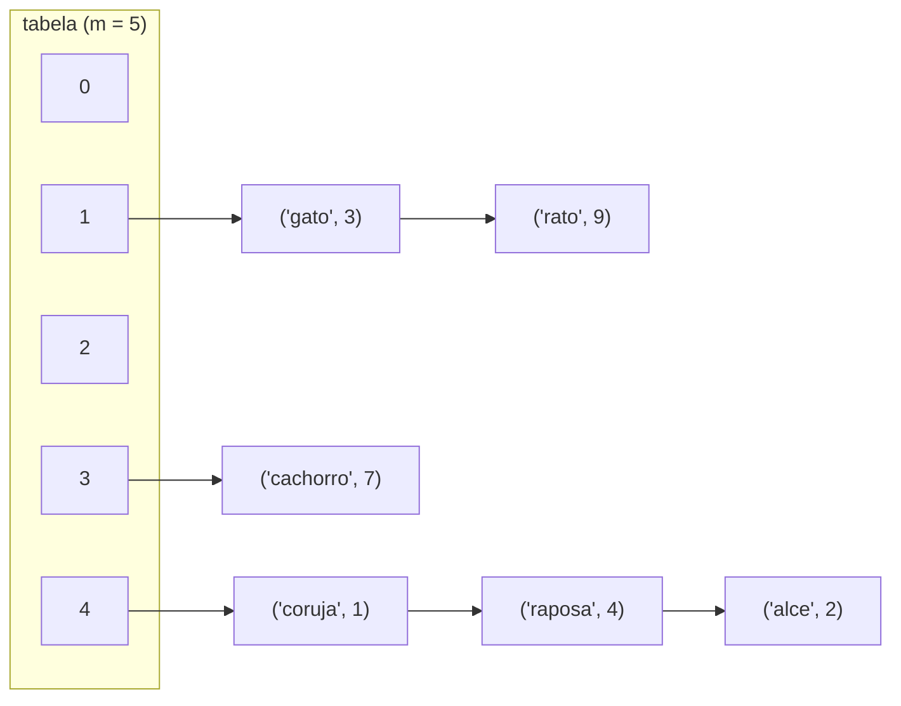

## Objetivos de Aprendizagem

- Explicar como encadeamento separado resolve uma colisão armazenando múltiplos pares chave-valor num único slot de vetor em vez de escolher entre eles.
- Implementar uma tabela hash com encadeamento separado do zero em Python, incluindo inserção, busca e remoção.
- Analisar como o desempenho de caso médio de uma tabela hash encadeada depende do comprimento médio da cadeia, e conectar esse comprimento ao fator de carga da tabela.
- Comparar encadeamento separado contra a alternativa (endereçamento aberto) em overhead de memória e comportamento de pior caso.
- Prever o que acontece com o custo de busca conforme mais e mais chaves colidem no mesmo balde, incluindo o pior caso degenerado.

## Contexto e Motivação

O conceito anterior estabeleceu que colisões numa tabela hash não são um incômodo ocasional mas uma certeza matemática: o princípio da casa dos pombos garante que assim que mais chaves são inseridas que slots existem na tabela, pelo menos duas precisam cair no mesmo índice, e na prática colisões aparecem bem antes disso, por probabilidade comum. O projeto de uma tabela hash é portanto incompleto sem uma resposta para uma pergunta bem concreta: quando `h(k1) == h(k2)` para duas chaves diferentes, e o slot `h(k1)` é onde as duas "pertencem", o que de fato acontece com a segunda?

Encadeamento separado responde essa pergunta da forma mais simples imaginável: não force um único slot a segurar só uma chave. Em vez disso, deixe cada slot segurar uma pequena coleção (convencionalmente uma lista encadeada, embora qualquer estrutura tipo lista funcione) de todo par chave-valor que já deu hash para aquele índice. Uma colisão, sob esse esquema, não exige nenhum tratamento especial ou busca em outro lugar do vetor; só significa que o balde naquele índice agora segura duas entradas em vez de uma. Essa é a mesma ideia que aparece ao longo deste curso sempre que uma única estrutura precisa segurar "zero ou mais de algo num lugar": uma lista encadeada aninhada dentro de um slot de vetor está de fato só reaproveitando uma estrutura de dados que o curso já cobre (listas encadeadas simples) para resolver um novo problema. Entender encadeamento bem significa ver que uma tabela hash encadeada não é uma invenção inteiramente nova; é uma combinação bastante direta de duas estruturas já em mãos, mais a percepção crucial de que a análise do todo depende do *comprimento típico* dessas pequenas listas, não do tamanho da tabela sozinho.

## Teoria Central

### A estrutura balde-de-uma-lista

Em encadeamento separado, a tabela é um vetor de `m` slots, mas cada slot não segura um único par chave-valor diretamente; segura uma referência a uma lista (um **balde**) contendo todos os pares cuja chave atualmente dá hash para aquele índice. Inserir uma chave significa computar `i = h(chave)`, depois anexar (ou atualizar, se a chave já está presente) dentro da lista em `table[i]`. Buscar uma chave significa computar o mesmo `i`, depois percorrer a lista em `table[i]`, geralmente uma lista curta, checando a igualdade da chave de cada entrada até um acerto ser encontrado ou a lista se esgotar.



Aqui `'gato'` e `'rato'` colidiram no índice 1, e `'coruja'`, `'raposa'`, `'alce'` colidiram todos no índice 4; cada balde simplesmente cresceu uma cadeia mais longa em vez de precisar de outro lugar para colocar os dados.

### Implementação do zero

```python
class No:
    __slots__ = ("chave", "valor", "proximo")
    def __init__(self, chave, valor, proximo=None):
        self.chave = chave
        self.valor = valor
        self.proximo = proximo

class TabelaHashEncadeada:
    def __init__(self, tamanho_tabela: int = 8):
        self.tamanho_tabela = tamanho_tabela
        self.baldes = [None] * tamanho_tabela   # cada slot é a cabeça de uma lista, ou None
        self.contagem = 0

    def _indice(self, chave) -> int:
        return hash(chave) % self.tamanho_tabela

    def put(self, chave, valor) -> None:
        i = self._indice(chave)
        no = self.baldes[i]
        while no is not None:
            if no.chave == chave:
                no.valor = valor        # chave já presente: atualiza no lugar
                return
            no = no.proximo
        # chave não encontrada na cadeia: insere na frente (O(1))
        self.baldes[i] = No(chave, valor, self.baldes[i])
        self.contagem += 1

    def get(self, chave):
        i = self._indice(chave)
        no = self.baldes[i]
        while no is not None:
            if no.chave == chave:
                return no.valor
            no = no.proximo
        raise KeyError(chave)

    def remove(self, chave) -> None:
        i = self._indice(chave)
        no = self.baldes[i]
        anterior = None
        while no is not None:
            if no.chave == chave:
                if anterior is None:
                    self.baldes[i] = no.proximo
                else:
                    anterior.proximo = no.proximo
                self.contagem -= 1
                return
            anterior, no = no, no.proximo
        raise KeyError(chave)
```

Toda operação segue o mesmo padrão de dois passos: computa o índice em O(1), depois percorre a lista de um balde. É exatamente por isso que a análise de desempenho do encadeamento se reduz quase inteiramente a uma única pergunta: quão longa é uma cadeia típica?

### Análise de caso médio: comprimento da cadeia e fator de carga

Defina o **fator de carga** `alfa = n / m`, onde `n` é o número de pares chave-valor armazenados e `m` é o número de baldes. Se a função de hash distribui chaves uniformemente, então cada um dos `m` baldes recebe, em média, `n / m = alfa` entradas, então `alfa` é literalmente o *comprimento médio da cadeia*. Uma busca que não encontra sua chave precisa percorrer uma cadeia inteira, custando O(1 + alfa) em média (o "+1" contabiliza computar o hash e tocar o balde de forma alguma, que é um custo fixo mesmo para uma cadeia vazia); uma busca bem-sucedida custa um pouco menos em média mas também é O(1 + alfa). Enquanto `alfa` for mantido limitado por uma pequena constante, que é exatamente o trabalho da estratégia de rehashing coberta no próximo conceito, cadeias permanecem curtas e toda operação é efetivamente O(1) independentemente de quão grande `n` cresça, porque `m` é aumentado para acompanhar `n`.

### Pior caso: tudo num único balde

Nada no encadeamento *impede* que uma função de hash patológica (ou uma sequência de chaves patológica, escolhida adversarialmente contra uma função de hash conhecida) mande toda chave para o mesmo balde. Nesse cenário, os `m` baldes da tabela são irrelevantes; um balde segura todas as `n` entradas como uma longa lista encadeada, e toda operação se degrada para O(n), idêntico a buscar diretamente numa lista encadeada não ordenada. Este é o pior caso concreto que motiva a exigência de "distribuição uniforme" do conceito de hashing: a elegância de caso médio do encadeamento é inteiramente contingente na função de hash de fato espalhar chaves; uma função de hash ruim não quebra a corretude do encadeamento (buscas ainda funcionam, só ficam lentas) mas apaga completamente sua vantagem de desempenho.

### Variações: o que um "balde" pode ser

A descrição acima usa uma lista encadeada simples por balde, que é a apresentação clássica de livro-texto e mantém inserção O(1) na cabeça. Algumas implementações práticas em vez disso usam um pequeno vetor dinâmico (um vetor redimensionável, como coberto anteriormente neste curso) por balde, trocando inserção O(1) na cabeça por melhor localidade de memória já que elementos de vetor ficam contíguos em vez de espalhados por nós alocados separadamente. Algumas implementações avançadas (por exemplo, certos internos de `HashMap` da JVM) até convertem um balde individual de uma lista para uma pequena árvore balanceada uma vez que sua cadeia cresce incomumente longa, para limitar o custo de pior caso de um único balde patológico a O(log k) em vez de O(k); um refinamento que vale a pena saber que existe, embora o balde de lista encadeada seja o que este curso constrói e raciocina diretamente.

## Exemplos Resolvidos

### Exemplo 1: inserindo e traçando o crescimento da cadeia

**Problema:** usando a `TabelaHashEncadeada` acima com `tamanho_tabela = 5`, insira as chaves `"gato"`, `"cachorro"`, `"passaro"`, `"vaca"`, `"formiga"` (nessa ordem) e trace em qual balde cada uma cai, assumindo (para ilustração) que `hash(chave) % 5` produz: gato → 2, cachorro → 4, passaro → 2, vaca → 4, formiga → 0.

**Traço.**
- `put("gato", ...)`: índice 2, balde vazio → balde[2] = [gato].
- `put("cachorro", ...)`: índice 4, balde vazio → balde[4] = [cachorro].
- `put("passaro", ...)`: índice 2, balde[2] já segura gato (não é um acerto) → anexa na frente → balde[2] = [passaro, gato].
- `put("vaca", ...)`: índice 4, balde[4] segura cachorro (não é um acerto) → anexa na frente → balde[4] = [vaca, cachorro].
- `put("formiga", ...)`: índice 0, balde vazio → balde[0] = [formiga].

Estado final: balde 0 = [formiga], balde 2 = [passaro, gato], balde 4 = [vaca, cachorro], baldes 1 e 3 vazios. `n = 5`, `m = 5`, então `alfa = 1,0`; em média uma entrada por balde, embora a distribuição *real* aqui seja desigual (dois baldes seguram 2 entradas, um segura 1, dois seguram 0), um lembrete de que "comprimento médio da cadeia" é uma afirmação sobre a média, não uma garantia de que todo balde tem o mesmo comprimento.

**Buscando `"passaro"`:** compute o índice 2, percorra balde[2] começando da cabeça: checa `passaro` primeiro (a entrada inserida mais recentemente, já que novas entradas são anexadas na frente), acerto encontrado imediatamente, O(1) para essa chave particular. **Buscando `"gato"`** no mesmo balde: checa `passaro` (sem acerto), depois `gato` (acerto), duas comparações, ainda O(comprimento da cadeia) como esperado, só que não a cabeça desta vez.

### Exemplo 2: removendo de uma cadeia e religando

**Problema:** a partir do estado no final do Exemplo 1, remova `"vaca"` do balde 4 = [vaca, cachorro].

**Traço de `remove("vaca")`:** índice 4, `no = balde[4]` começa no nó `vaca`, `anterior = None`. Checa: `no.chave == "vaca"` → acerto no primeiríssimo nó. Como `anterior is None`, define `balde[4] = no.proximo`, que é o nó `cachorro`. O balde 4 agora é [cachorro], e o nó de `vaca` fica sem referência e é reciclado. Isso mostra por que o ponteiro `anterior` é necessário mesmo não tendo sido necessário para inserção: remover um nó exige religar o que quer que apontasse para ele (ou a referência de cabeça do balde, ou o ponteiro `proximo` do nó anterior) para pular o nó removido, e isso exige saber o que vinha imediatamente antes dele.

### Exemplo 3: quantificando o custo de uma função de hash ruim sob encadeamento

**Problema:** suponha que 1.000 chaves são inseridas numa tabela hash encadeada com `m = 100` baldes. Compare o custo médio de busca sob (a) uma função de hash uniforme, versus (b) uma função de hash degenerada que sempre retorna índice 0.

**Caso (a): uniforme.** `alfa = n / m = 1000 / 100 = 10`. O comprimento médio da cadeia é 10, então uma busca média custa O(1 + 10) = O(11) comparações, uma pequena constante, e crucialmente, uma que não cresce se `n` e `m` forem escalados juntos (por exemplo, 10.000 chaves sobre 1.000 baldes dá o mesmo `alfa = 10`).

**Caso (b): degenerado.** Todas as 1.000 chaves caem no balde 0; os outros 99 baldes ficam vazios. Uma busca por uma chave no final da cadeia custa até 1.000 comparações, O(n), não O(1 + alfa), porque a fórmula "comprimento médio da cadeia" `n/m` assumiu distribuição uniforme através de todos os `m` baldes, uma suposição que essa função de hash viola completamente. O fator de carga *nominal* da tabela ainda é `10` pela fórmula `n/m`, mas esse número é sem sentido como preditor de desempenho aqui, porque as entradas não estão de fato espalhadas de acordo com ele. Esta é a demonstração concreta de que a garantia O(1 + alfa) do encadeamento é condicional à qualidade da função de hash, não uma propriedade do encadeamento como mecanismo em si.

## Equívocos Comuns e Armadilhas

- **"Encadeamento desperdiça tanta memória que é sempre pior que endereçamento aberto."** Encadeamento de fato carrega overhead por entrada (um objeto nó com um ponteiro `proximo`, ou uma pequena estrutura de vetor-de-vetores), mas degrada *graciosamente*: uma tabela com `alfa = 3` (três vezes mais entradas que baldes) ainda funciona corretamente sob encadeamento, só com cadeias um pouco mais longas, enquanto endereçamento aberto (o próximo conceito) não consegue armazenar mais entradas do que tem slots de forma alguma. Os dois esquemas fazem trocas diferentes (overhead de memória por entrada versus um teto de capacidade rígido); nenhum domina o outro incondicionalmente.
- **"Uma tabela hash com encadeamento separado nunca pode exceder `m` entradas porque a tabela só tem `m` slots."** Isso confunde o número de *baldes* com a *capacidade* da tabela. Cada balde pode segurar um número arbitrariamente grande de entradas encadeadas, então `n` pode exceder `m` sem dificuldade; o fator de carga `alfa = n/m` é rotineiramente maior que 1 sob encadeamento (embora um `alfa` grande ainda degrade desempenho, que é por que rehashing existe, coberto a seguir).
- **"Já que encadeamento trata colisões automaticamente, a qualidade da função de hash não importa tanto."** O Exemplo 3 mostra o oposto: uma função de hash ruim não quebra a *corretude* do encadeamento (toda operação ainda eventualmente encontra a resposta certa), mas pode destruir completamente seu *desempenho*, colapsando o caso médio O(1 + alfa) num pior caso O(n) concentrado num balde enquanto outros baldes ficam sem uso.
- **"Remover de uma cadeia é a mesma operação que remover de um vetor, só remova o item."** Como o Exemplo 2 mostra, remover de uma lista encadeada simples exige rastrear o nó anterior para que seu ponteiro `proximo` possa ser religado ao redor do nó removido; esquecer de rastrear `anterior` (ou tratar mal o caso onde o acerto é o primeiríssimo nó do balde) é uma fonte comum de bugs onde remoção silenciosamente falha em de fato desligar o nó.

## Resumo

Encadeamento separado resolve uma colisão de hash deixando cada slot de vetor segurar uma pequena lista de toda chave que deu hash ali, em vez de forçar uma chave a deslocar outra ou buscar em outro lugar. Inserção, busca e remoção todas se reduzem a computar um índice baseado em hash em O(1) e depois percorrer a lista daquele balde, então o desempenho de caso médio do esquema inteiro se resume a um número: o comprimento médio da cadeia, que é igual ao fator de carga `alfa = n/m` quando a função de hash distribui chaves uniformemente. Isso torna encadeamento simples de implementar e graciosamente tolerante a fatores de carga acima de 1, ao custo de overhead de memória por entrada (nós de lista) e um pior caso (tudo dando hash num único balde) que degrada até O(n), um risco que recai inteiramente sobre a qualidade da função de hash em vez de sobre o próprio encadeamento. O próximo conceito, endereçamento aberto, toma uma abordagem fundamentalmente diferente: em vez de deixar um balde crescer, ele encontra espaço para uma chave colidindo em outro lugar dentro do próprio vetor.

## Documentation Links

- [Sedgewick & Wayne — Algorithms, Part I (Princeton, Coursera)](https://www.coursera.org/learn/algorithms-part1) — doc
- [ACM/IEEE CS2013 — Software Development Fundamentals (SDF)](https://csed.acm.org/wp-content/uploads/2023/09/SDF-Version-Gamma.pdf) — doc
