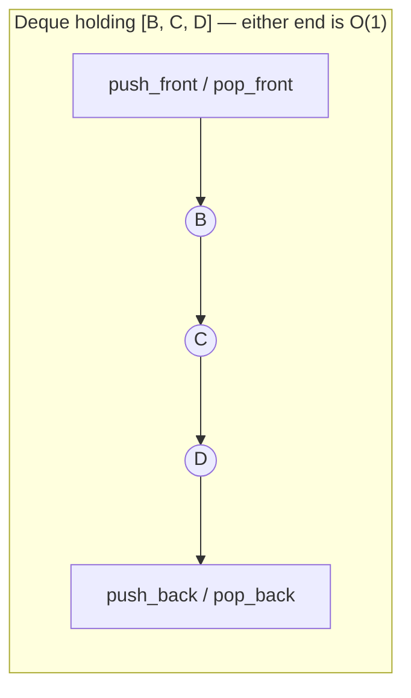
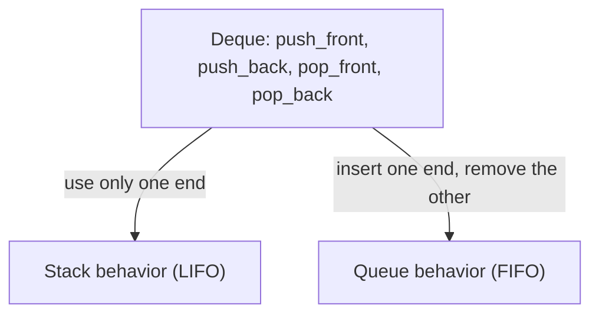

## Learning Objectives

- Define the Deque (double-ended queue) ADT and state why it strictly generalizes both the Stack and Queue ADTs.
- Explain how a circular buffer generalizes to support O(1) insertion and removal at both ends simultaneously, not just one.
- Implement a deque from scratch on top of a circular array and on top of a doubly linked list.
- Demonstrate, by usage pattern alone, how a deque restricted to one end behaves exactly like a stack, and restricted to opposite ends behaves exactly like a queue.
- Predict which end(s) of a deque a given algorithmic need (sliding window, undo/redo, work-stealing) should use, and justify the choice.

## Context & Motivation

The Stack ADT commits to one end for both insertion and removal. The Queue ADT commits to opposite ends — insertion at the back, removal at the front. A natural question follows immediately: what if a problem needs *both* — fast insertion and removal at either end, sometimes the front, sometimes the back, depending on what's happening at runtime? A sliding-window algorithm that needs to add new elements at one edge of the window while discarding stale ones from the other edge (and occasionally discarding from the *new* edge too, if it turns out not to help) cannot commit in advance to "front is always removal, back is always insertion." A browser's back/forward history needs to push new pages onto one end while also being able to pop from either end depending on whether the user clicks "back" or navigates to something entirely new. An undo/redo system, a work-stealing scheduler where idle workers "steal" from the opposite end of a busy worker's task list, and even a simple palindrome checker that compares characters from both ends inward, all share this same shape: operations that legitimately belong at *either* end.

The **deque** (pronounced "deck," short for double-ended queue) is the ADT that generalizes both the stack and the queue by supporting O(1) insertion and removal at *both* ends, with no asymmetry favoring one side. This is not a compromise structure that does a mediocre job at two things — it is a genuine generalization, in the precise sense that a stack and a queue are each just a deque used according to a *restricted* discipline: use only one end, and you have a stack; always insert at one end and remove from the other, and you have a queue. Understanding this containment relationship is worth as much as the mechanics, because it explains why many real-world libraries (Python's `collections.deque`, Java's `ArrayDeque`) simply expose one flexible structure and let callers use it as a stack or a queue by convention, rather than maintaining three separate implementations.

## Core Theory

### The interface: four ends, not two

A Deque ADT is defined by operations at both the front and the back:

- `push_front(x)` / `push_back(x)` — insert `x` at the front or back respectively.
- `pop_front()` / `pop_back()` — remove and return the element at the front or back respectively.
- `peek_front()` / `peek_back()` — inspect without removing.
- `isEmpty()` — report whether the deque holds zero elements.

There is no single ordering invariant analogous to a stack's LIFO or a queue's FIFO — a deque makes no promise at all about which end will be used next; that decision belongs entirely to the caller. This is precisely what makes it strictly more general: a stack's and a queue's ordering guarantees are *emergent properties of a restricted usage pattern* on top of a deque, not additional structure a deque has to build in.



### Circular buffer, generalized to both ends

The circular buffer built for the Queue ADT already tracked a `head` index that advances forward (mod capacity) on dequeue and a write position that advances forward on enqueue. Generalizing to a deque means the `head` index must also be able to move **backward** (mod capacity) when `push_front` is called, and the back position must be able to move backward when `pop_back` is called:

```python
class CircularArrayDeque:
    def __init__(self, capacity=4):
        self._data = [None] * capacity
        self._head = 0
        self._size = 0

    def _grow(self):
        bigger = [None] * (len(self._data) * 2)
        for i in range(self._size):
            bigger[i] = self._data[(self._head + i) % len(self._data)]
        self._data = bigger
        self._head = 0

    def push_back(self, x):
        if self._size == len(self._data):
            self._grow()
        back = (self._head + self._size) % len(self._data)
        self._data[back] = x
        self._size += 1

    def push_front(self, x):
        if self._size == len(self._data):
            self._grow()
        self._head = (self._head - 1) % len(self._data)   # step backward, wrap if needed
        self._data[self._head] = x
        self._size += 1

    def pop_back(self):
        if self._size == 0:
            raise IndexError("pop_back from empty deque")
        back = (self._head + self._size - 1) % len(self._data)
        x = self._data[back]
        self._data[back] = None
        self._size -= 1
        return x

    def pop_front(self):
        if self._size == 0:
            raise IndexError("pop_front from empty deque")
        x = self._data[self._head]
        self._data[self._head] = None
        self._head = (self._head + 1) % len(self._data)
        self._size -= 1
        return x

    def is_empty(self):
        return self._size == 0
```

Every one of these four operations only ever touches `head`, one boundary slot, and `size` — no element in the middle is ever shifted, exactly as with the queue's circular buffer, just now with the buffer able to grow in either direction from its logical starting point. All four are O(1) amortized, with the same occasional O(n) resize as any dynamic-array-backed structure.

### Doubly-linked-list-backed implementation

A deque maps just as naturally onto a doubly linked list (from `doubly-linked-lists`), because a doubly linked list's defining feature — each node holds both a `next` and a `prev` pointer — is exactly what makes removal from *either* end an O(1) operation without any traversal. A singly linked list, by contrast, could support `push_front`/`pop_front` in O(1) easily (as `LinkedStack` did) but would need O(n) to find the node *before* the tail for `pop_back`, since it has no way to step backward from the tail. This is precisely why a deque's linked-list backing needs the doubly linked variant, not the singly linked one.

```python
class _DNode:
    __slots__ = ("value", "prev", "next")
    def __init__(self, value):
        self.value = value
        self.prev = None
        self.next = None

class LinkedDeque:
    def __init__(self):
        self._head = None
        self._tail = None
        self._size = 0

    def push_front(self, x):
        node = _DNode(x)
        if self._head is None:
            self._head = self._tail = node
        else:
            node.next = self._head
            self._head.prev = node
            self._head = node
        self._size += 1

    def push_back(self, x):
        node = _DNode(x)
        if self._tail is None:
            self._head = self._tail = node
        else:
            node.prev = self._tail
            self._tail.next = node
            self._tail = node
        self._size += 1

    def pop_front(self):
        if self._head is None:
            raise IndexError("pop_front from empty deque")
        x = self._head.value
        self._head = self._head.next
        if self._head is None:
            self._tail = None
        else:
            self._head.prev = None
        self._size -= 1
        return x

    def pop_back(self):
        if self._tail is None:
            raise IndexError("pop_back from empty deque")
        x = self._tail.value
        self._tail = self._tail.prev
        if self._tail is None:
            self._head = None
        else:
            self._tail.next = None
        self._size -= 1
        return x

    def is_empty(self):
        return self._head is None
```

All four operations are O(1) worst-case, with no amortization — the same trade-off pattern seen throughout this topic: the array backing pays occasional resize cost for better cache locality and lower per-element overhead, and the linked backing pays a per-node pointer cost (two pointers now, not one) for uniform worst-case timing.

### Deque subsumes stack and queue

This is the key structural fact of the concept: a stack and a queue are not separate structures needing separate implementations — they are **usage disciplines** applied to a deque.

- Use only `push_front` and `pop_front` (or only `push_back` and `pop_back`) — never the other end — and the result is exactly a stack: the last element inserted at that end is always the first one removed from that same end.
- Use `push_back` for insertion and `pop_front` for removal (or the mirror image) — and the result is exactly a queue: elements leave in the same order they arrived, from the opposite end they entered.



This is why a general-purpose library deque (Python's `collections.deque`, Java's `ArrayDeque`) is frequently the *only* sequence-like structure a standard library bothers to expose at this level, alongside a plain resizable array — a stack and a queue add no capability a deque didn't already have; they only add a self-imposed restriction on which methods a piece of code chooses to call.

## Worked Examples

### Example 1 — using a deque as a stack, then as a queue, on the same instance

**Problem:** Using a single `CircularArrayDeque`, perform `push_back(1)`, `push_back(2)`, `push_back(3)`, then `pop_back()` twice (stack discipline), then `push_back(4)`, `push_back(5)`, then `pop_front()` twice (queue discipline). Trace the contents and each returned value.

| Operation | Deque (front → back) | Returned | Discipline in use |
|---|---|---|---|
| push_back(1) | [1] | — | — |
| push_back(2) | [1, 2] | — | — |
| push_back(3) | [1, 2, 3] | — | — |
| pop_back() | [1, 2] | 3 | stack (LIFO on back end) |
| pop_back() | [1] | 2 | stack (LIFO on back end) |
| push_back(4) | [1, 4] | — | — |
| push_back(5) | [1, 4, 5] | — | — |
| pop_front() | [4, 5] | 1 | queue (FIFO: insert back, remove front) |
| pop_front() | [5] | 4 | queue (FIFO: insert back, remove front) |

**Reasoning.** No new structure was introduced between the stack-style operations and the queue-style operations — it is the identical `CircularArrayDeque` instance throughout. The behavior changed purely because of *which methods were called*, not because of any change to the underlying data structure. This is the concrete demonstration of subsumption: the same object can honor either discipline depending entirely on caller intent.

### Example 2 — sliding window maximum (why both ends matter)

**Problem:** Maintain a deque of *indices* into an array such that the deque's front index always points to the current window's maximum element, while sliding a fixed-size window of width `k` across the array `[1, 3, -1, -3, 5, 3, 6, 7]` with `k = 3`.

**Approach.** For each new index `i`: (1) pop from the *back* of the deque while the value at the back's index is less than the new element (those values can never be the maximum again, since the new, later element is both bigger and will outlast them in the window — remove them from consideration for good); (2) push `i` onto the back; (3) pop from the *front* if the front index has fallen outside the current window (it's too old to be included); (4) once the window is full, the front index names the maximum.

```python
def sliding_window_max(arr, k):
    dq = LinkedDeque()  # holds indices, front = current max candidate
    result = []
    for i, val in enumerate(arr):
        while not dq.is_empty() and arr[dq_back_value(dq)] < val:
            dq.pop_back()
        dq.push_back(i)
        if dq_front_value(dq) <= i - k:
            dq.pop_front()
        if i >= k - 1:
            result.append(arr[dq_front_value(dq)])
    return result
```

(`dq_back_value`/`dq_front_value` are illustrative helpers reading `.value` without removing — the point is the algorithm's shape, not a literal peek API addition.)

**Why a deque specifically:** `pop_back` is needed to discard now-irrelevant smaller elements from the *recent* end as soon as a bigger one arrives, while `pop_front` is needed to discard elements that have aged out of the window from the *old* end — both operations are genuinely needed, on both ends, in the same algorithm, over the same run. A plain stack (one end only) could not discard stale front elements without unwinding everything pushed after them; a plain queue (fixed roles per end) could not discard smaller trailing elements from the back without violating its "insert only at back" discipline. This is precisely the class of problem that motivates a deque's existence rather than combining a stack and a queue awkwardly.

### Example 3 — undo/redo with two ends of conceptual meaning

**Problem:** Model an undo/redo history where new actions are recorded, "undo" moves the most recent action into a redo list, and "redo" moves it back, using two deques (or, more simply, one deque used stack-style at each of two roles).

**Trace.**

```python
undo_stack = LinkedDeque()   # push_front/pop_front only — used as a stack
redo_stack = LinkedDeque()

def do_action(action):
    undo_stack.push_front(action)
    redo_stack = LinkedDeque()   # a new action invalidates the redo history

def undo():
    action = undo_stack.pop_front()
    redo_stack.push_front(action)
    return action

def redo():
    action = redo_stack.pop_front()
    undo_stack.push_front(action)
    return action
```

Sequence: `do_action("type A")`, `do_action("type B")`, `undo()` → returns `"type B"`, `undo_stack` now holds `["type A"]`, `redo_stack` holds `["type B"]`; `redo()` → returns `"type B"`, moving it back. **Reasoning.** Each of the two deques here is used purely in stack discipline (`push_front`/`pop_front` only) — reinforcing Example 1's point that a deque restricted to one end's operations behaves indistinguishably from a dedicated stack, so reaching for a full deque type even when only stack behavior is needed costs nothing and keeps the option open if two-ended access is ever needed later.

## Common Misconceptions & Pitfalls

- **"A deque is a stack combined with a queue, i.e., two separate structures glued together."** It is one structure with four operations (two ends × insert/remove); a stack and a queue are each a *subset* of that same structure's usage, not a composition of two different structures. Example 1 demonstrates a single instance serving both roles without any internal change.
- **"Supporting both ends must cost more than supporting one end, so a deque is asymptotically slower than a plain stack or queue."** Every operation on both the circular-buffer and doubly-linked-list backings remains O(1) (amortized or worst-case respectively) — identical asymptotic bounds to the single-ended structures. The generalization costs a small constant-factor increase in bookkeeping (tracking both boundaries, or storing two pointers per node instead of one), not a complexity-class increase.
- **"A deque built on a singly linked list works fine — just track a tail pointer, like the Queue ADT's linked backing did."** A queue's linked backing needs to insert at the tail (O(1) with a tail pointer) but never needs to *remove* from the tail. A deque's `pop_back` does need to remove from the tail, which requires knowing the node *before* the tail — unreachable in O(1) from a singly linked list, since there's no `prev` pointer to follow backward. This forces the doubly linked list specifically; substituting a singly linked list silently breaks `pop_back`'s O(1) guarantee (it degrades to O(n), scanning from the head to find the second-to-last node).
- **"Since a deque can do everything a stack or queue can, there's no reason to ever use the narrower ADT."** Restricting an interface on purpose still has value even when a more general structure is available underneath — a function parameter typed as "stack" rather than "deque" documents to every future reader that only LIFO order is relied upon, and prevents a caller from accidentally reaching for `pop_back` in code that everyone assumed only used one end. The Stack and Queue ADTs remain useful as *interfaces*, expressing intent, even when a deque is the structure satisfying them underneath.
- **"push_front on a circular array is just push_back in reverse, so the modulo math is symmetric without thought."** `push_front` must decrement `head` *before* writing (`(head - 1) % capacity`), while `push_back` computes its write position and writes *without* moving `head` at all. Applying the same "compute position, then write" pattern naively to both ends without adjusting for which one owns the mutable boundary index is a common source of off-by-one bugs when first implementing this structure.

## Summary

A deque supports O(1) insertion and removal at both the front and the back, generalizing the Stack and Queue ADTs rather than sitting alongside them as a third, unrelated structure — a stack is a deque used at one end only, and a queue is a deque used with insertion at one end and removal at the other. The circular-buffer backing extends the queue's single-directional wraparound to allow `head` to move backward as well as forward; the linked-list backing requires a doubly linked list specifically, because `pop_back` needs O(1) access to the node before the tail, which a singly linked list cannot provide. Sliding-window algorithms are the clearest evidence that two-ended access is a genuine algorithmic need, not a convenience — they require discarding stale elements from the front and dominated elements from the back within the same pass. The Stack and Queue ADTs remain useful as narrower, intent-documenting interfaces even once a deque is available, because restricting which operations client code is allowed to call is itself valuable documentation of the ordering guarantee that code relies on.

## Documentation Links

- [Sedgewick & Wayne — Stacks and Queues (Princeton lecture slides)](https://algs4.cs.princeton.edu/lectures/keynote/13StacksAndQueues.pdf) — doc
- [ACM/IEEE CS2013 — Software Development Fundamentals (SDF)](https://csed.acm.org/wp-content/uploads/2023/09/SDF-Version-Gamma.pdf) — doc
