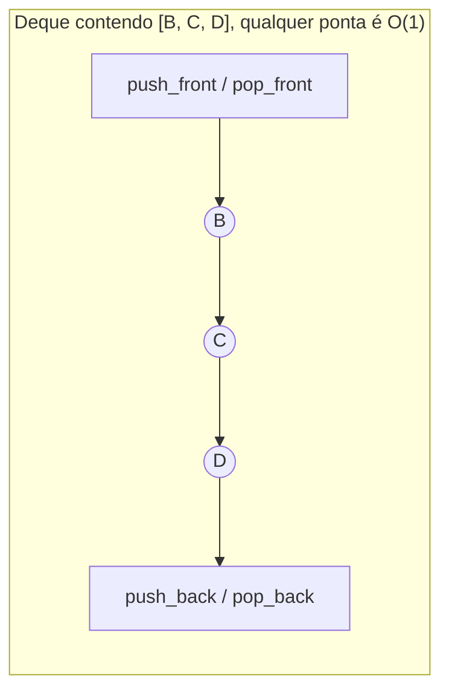
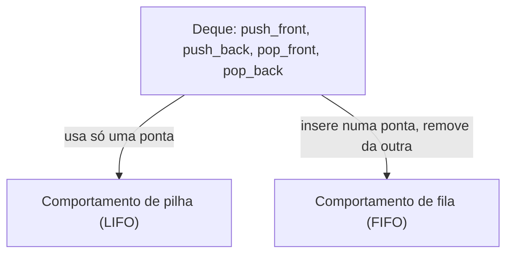

## Objetivos de Aprendizagem

- Definir o TAD Deque (fila de duas pontas) e declarar por que ele generaliza estritamente tanto o TAD Pilha quanto o TAD Fila.
- Explicar como um buffer circular generaliza para suportar inserção e remoção O(1) em ambas as pontas simultaneamente, não só uma.
- Implementar um deque do zero sobre um vetor circular e sobre uma lista duplamente encadeada.
- Demonstrar, só pelo padrão de uso, como um deque restrito a uma ponta se comporta exatamente como uma pilha, e restrito a pontas opostas se comporta exatamente como uma fila.
- Prever qual(is) ponta(s) de um deque uma necessidade algorítmica dada (janela deslizante, desfazer/refazer, work-stealing) deveria usar, e justificar a escolha.

## Contexto e Motivação

O TAD Pilha se compromete com uma ponta tanto para inserção quanto para remoção. O TAD Fila se compromete com pontas opostas: inserção no fim, remoção no início. Uma pergunta natural segue imediatamente: e se um problema precisa das *duas* coisas, inserção e remoção rápidas em qualquer ponta, às vezes o início, às vezes o fim, dependendo do que está acontecendo em tempo de execução? Um algoritmo de janela deslizante que precisa adicionar novos elementos numa borda da janela enquanto descarta os obsoletos da outra borda (e ocasionalmente descarta da borda *nova* também, se acontece de não ajudar) não pode se comprometer de antemão com "início sempre remove, fim sempre insere". O histórico de voltar/avançar de um navegador precisa empilhar novas páginas numa ponta enquanto também consegue desempilhar de qualquer ponta dependendo de se o usuário clica "voltar" ou navega para algo inteiramente novo. Um sistema de desfazer/refazer, um escalonador work-stealing onde trabalhadores ociosos "roubam" da ponta oposta da lista de tarefas de um trabalhador ocupado, e até um verificador simples de palíndromo que compara caracteres das duas pontas para dentro, todos compartilham essa mesma forma: operações que legitimamente pertencem a *qualquer* ponta.

O **deque** (pronunciado "déqui", abreviação de double-ended queue) é o TAD que generaliza tanto a pilha quanto a fila suportando inserção e remoção O(1) nas *duas* pontas, sem nenhuma assimetria favorecendo um lado. Isso não é uma estrutura de compromisso que faz um trabalho medíocre em duas coisas; é uma generalização genuína, no sentido preciso de que uma pilha e uma fila são cada uma apenas um deque usado segundo uma disciplina *restrita*: use só uma ponta, e você tem uma pilha; sempre insira numa ponta e remova da outra, e você tem uma fila. Entender essa relação de contenção vale tanto quanto a mecânica, porque explica por que muitas bibliotecas reais do mundo real (`collections.deque` do Python, `ArrayDeque` do Java) simplesmente expõem uma estrutura flexível e deixam quem chama usá-la como pilha ou fila por convenção, em vez de manter três implementações separadas.

## Teoria Central

### A interface: quatro pontas, não duas

Um TAD Deque é definido por operações tanto no início quanto no fim:

- `push_front(x)` / `push_back(x)` — insere `x` no início ou no fim respectivamente.
- `pop_front()` / `pop_back()` — remove e retorna o elemento do início ou do fim respectivamente.
- `peek_front()` / `peek_back()` — inspeciona sem remover.
- `isEmpty()` — informa se o deque não tem elemento algum.

Não há um único invariante de ordenação análogo ao LIFO de uma pilha ou ao FIFO de uma fila; um deque não faz promessa alguma sobre qual ponta será usada em seguida; essa decisão pertence inteiramente a quem chama. Isso é precisamente o que o torna estritamente mais geral: as garantias de ordenação de uma pilha e de uma fila são *propriedades emergentes de um padrão de uso restrito* sobre um deque, não estrutura adicional que um deque precisa construir internamente.



### Buffer circular, generalizado para as duas pontas

O buffer circular construído para o TAD Fila já rastreava um índice `head` que avança para frente (mod capacidade) ao desenfileirar e uma posição de escrita que avança para frente ao enfileirar. Generalizar para um deque significa que o índice `head` também precisa conseguir se mover **para trás** (mod capacidade) quando `push_front` é chamado, e a posição do fim precisa conseguir se mover para trás quando `pop_back` é chamado:

```python
class CircularArrayDeque:
    def __init__(self, capacity=4):
        self._data = [None] * capacity
        self._head = 0
        self._size = 0

    def _grow(self):
        bigger = [None] * (len(self._data) * 2)
        for i in range(self._size):
            bigger[i] = self._data[(self._head + i) % len(self._data)]
        self._data = bigger
        self._head = 0

    def push_back(self, x):
        if self._size == len(self._data):
            self._grow()
        back = (self._head + self._size) % len(self._data)
        self._data[back] = x
        self._size += 1

    def push_front(self, x):
        if self._size == len(self._data):
            self._grow()
        self._head = (self._head - 1) % len(self._data)   # passo para trás, dá a volta se necessário
        self._data[self._head] = x
        self._size += 1

    def pop_back(self):
        if self._size == 0:
            raise IndexError("pop_back de deque vazio")
        back = (self._head + self._size - 1) % len(self._data)
        x = self._data[back]
        self._data[back] = None
        self._size -= 1
        return x

    def pop_front(self):
        if self._size == 0:
            raise IndexError("pop_front de deque vazio")
        x = self._data[self._head]
        self._data[self._head] = None
        self._head = (self._head + 1) % len(self._data)
        self._size -= 1
        return x

    def is_empty(self):
        return self._size == 0
```

Cada uma dessas quatro operações só toca `head`, um slot de borda, e `size`; nenhum elemento no meio é jamais deslocado, exatamente como no buffer circular da fila, só que agora com o buffer conseguindo crescer em qualquer direção a partir de seu ponto de partida lógico. As quatro são O(1) amortizado, com o mesmo redimensionamento O(n) ocasional de qualquer estrutura apoiada em vetor dinâmico.

### Implementação apoiada em lista duplamente encadeada

Um deque se mapeia tão naturalmente numa lista duplamente encadeada (de `listas-duplamente-encadeadas`), porque a característica definidora de uma lista duplamente encadeada (cada nó guarda tanto um ponteiro `next` quanto um `prev`) é exatamente o que torna remoção de *qualquer* ponta uma operação O(1) sem percurso algum. Uma lista encadeada simples, em contraste, poderia suportar `push_front`/`pop_front` em O(1) facilmente (como `LinkedStack` fazia) mas precisaria de O(n) para achar o nó *antes* da cauda para `pop_back`, já que não tem como andar para trás a partir da cauda. É precisamente por isso que o apoio em lista encadeada de um deque precisa da variante duplamente encadeada, não da simples.

```python
class _DNode:
    __slots__ = ("value", "prev", "next")
    def __init__(self, value):
        self.value = value
        self.prev = None
        self.next = None

class LinkedDeque:
    def __init__(self):
        self._head = None
        self._tail = None
        self._size = 0

    def push_front(self, x):
        node = _DNode(x)
        if self._head is None:
            self._head = self._tail = node
        else:
            node.next = self._head
            self._head.prev = node
            self._head = node
        self._size += 1

    def push_back(self, x):
        node = _DNode(x)
        if self._tail is None:
            self._head = self._tail = node
        else:
            node.prev = self._tail
            self._tail.next = node
            self._tail = node
        self._size += 1

    def pop_front(self):
        if self._head is None:
            raise IndexError("pop_front de deque vazio")
        x = self._head.value
        self._head = self._head.next
        if self._head is None:
            self._tail = None
        else:
            self._head.prev = None
        self._size -= 1
        return x

    def pop_back(self):
        if self._tail is None:
            raise IndexError("pop_back de deque vazio")
        x = self._tail.value
        self._tail = self._tail.prev
        if self._tail is None:
            self._head = None
        else:
            self._tail.next = None
        self._size -= 1
        return x

    def is_empty(self):
        return self._head is None
```

As quatro operações são O(1) no pior caso, sem amortização; o mesmo padrão de troca visto ao longo deste tópico: o apoio em vetor paga custo ocasional de redimensionamento por melhor localidade de cache e menor overhead por elemento, e o apoio encadeado paga um custo de ponteiro por nó (dois ponteiros agora, não um) por tempo uniforme no pior caso.

### Deque abrange pilha e fila

Este é o fato estrutural chave do conceito: uma pilha e uma fila não são estruturas separadas exigindo implementações separadas; são **disciplinas de uso** aplicadas a um deque.

- Use só `push_front` e `pop_front` (ou só `push_back` e `pop_back`), nunca a outra ponta, e o resultado é exatamente uma pilha: o último elemento inserido naquela ponta é sempre o primeiro removido dessa mesma ponta.
- Use `push_back` para inserção e `pop_front` para remoção (ou a imagem espelhada), e o resultado é exatamente uma fila: elementos saem na mesma ordem em que chegaram, pela ponta oposta à que entraram.



É por isso que um deque de biblioteca de propósito geral (`collections.deque` do Python, `ArrayDeque` do Java) é frequentemente a *única* estrutura tipo sequência que uma biblioteca padrão se dá ao trabalho de expor nesse nível, ao lado de um vetor redimensionável simples; uma pilha e uma fila não acrescentam capacidade alguma que um deque já não tivesse; elas só acrescentam uma restrição autoimposta sobre quais métodos um trecho de código escolhe chamar.

## Exemplos Resolvidos

### Exemplo 1: usando um deque como pilha, depois como fila, na mesma instância

**Problema:** usando um único `CircularArrayDeque`, execute `push_back(1)`, `push_back(2)`, `push_back(3)`, depois `pop_back()` duas vezes (disciplina de pilha), depois `push_back(4)`, `push_back(5)`, depois `pop_front()` duas vezes (disciplina de fila). Trace o conteúdo e cada valor retornado.

| Operação | Deque (início → fim) | Retornado | Disciplina em uso |
|---|---|---|---|
| push_back(1) | [1] | — | — |
| push_back(2) | [1, 2] | — | — |
| push_back(3) | [1, 2, 3] | — | — |
| pop_back() | [1, 2] | 3 | pilha (LIFO na ponta do fim) |
| pop_back() | [1] | 2 | pilha (LIFO na ponta do fim) |
| push_back(4) | [1, 4] | — | — |
| push_back(5) | [1, 4, 5] | — | — |
| pop_front() | [4, 5] | 1 | fila (FIFO: insere no fim, remove do início) |
| pop_front() | [5] | 4 | fila (FIFO: insere no fim, remove do início) |

**Raciocínio.** Nenhuma estrutura nova foi introduzida entre as operações estilo pilha e as operações estilo fila; é a instância idêntica de `CircularArrayDeque` durante tudo. O comportamento mudou puramente por causa de *quais métodos foram chamados*, não por alguma mudança na estrutura de dados subjacente. Esta é a demonstração concreta de abrangência: o mesmo objeto pode honrar qualquer disciplina dependendo inteiramente da intenção de quem chama.

### Exemplo 2: máximo de janela deslizante (por que as duas pontas importam)

**Problema:** mantenha um deque de *índices* num vetor tal que o índice do início do deque sempre aponte para o elemento máximo da janela atual, enquanto desliza uma janela de tamanho fixo `k` pelo vetor `[1, 3, -1, -3, 5, 3, 6, 7]` com `k = 3`.

**Abordagem.** Para cada novo índice `i`: (1) desempilhe do *fim* do deque enquanto o valor no índice do fim é menor que o novo elemento (esses valores nunca mais podem ser o máximo, já que o elemento novo e mais recente é tanto maior quanto vai sobreviver a eles na janela; remova-os de consideração de vez); (2) empilhe `i` no fim; (3) desempilhe do início se o índice do início caiu fora da janela atual (é velho demais para ser incluído); (4) uma vez que a janela está cheia, o índice do início nomeia o máximo.

```python
def sliding_window_max(arr, k):
    dq = LinkedDeque()  # guarda índices, início = candidato a máximo atual
    result = []
    for i, val in enumerate(arr):
        while not dq.is_empty() and arr[dq_back_value(dq)] < val:
            dq.pop_back()
        dq.push_back(i)
        if dq_front_value(dq) <= i - k:
            dq.pop_front()
        if i >= k - 1:
            result.append(arr[dq_front_value(dq)])
    return result
```

(`dq_back_value`/`dq_front_value` são funções auxiliares ilustrativas lendo `.value` sem remover; o ponto é a forma do algoritmo, não uma adição literal de API de espiar.)

**Por que um deque especificamente:** `pop_back` é necessário para descartar elementos menores agora irrelevantes da ponta *recente* assim que um maior chega, enquanto `pop_front` é necessário para descartar elementos que envelheceram para fora da janela da ponta *antiga*; as duas operações são genuinamente necessárias, nas duas pontas, no mesmo algoritmo, durante a mesma execução. Uma pilha simples (só uma ponta) não poderia descartar elementos obsoletos do início sem desfazer tudo empilhado depois deles; uma fila simples (papéis fixos por ponta) não poderia descartar elementos finais menores do fim sem violar sua disciplina de "insere só no fim". Essa é precisamente a classe de problema que motiva a existência de um deque em vez de combinar uma pilha e uma fila desajeitadamente.

### Exemplo 3: desfazer/refazer com duas pontas de significado conceitual

**Problema:** modele um histórico de desfazer/refazer onde novas ações são registradas, "desfazer" move a ação mais recente para uma lista de refazer, e "refazer" a move de volta, usando dois deques (ou, mais simplesmente, um deque usado no estilo pilha em cada um de dois papéis).

**Traço.**

```python
undo_stack = LinkedDeque()   # só push_front/pop_front, usado como pilha
redo_stack = LinkedDeque()

def do_action(action):
    undo_stack.push_front(action)
    redo_stack = LinkedDeque()   # uma ação nova invalida o histórico de refazer

def undo():
    action = undo_stack.pop_front()
    redo_stack.push_front(action)
    return action

def redo():
    action = redo_stack.pop_front()
    undo_stack.push_front(action)
    return action
```

Sequência: `do_action("digitar A")`, `do_action("digitar B")`, `undo()` → retorna `"digitar B"`, `undo_stack` agora guarda `["digitar A"]`, `redo_stack` guarda `["digitar B"]`; `redo()` → retorna `"digitar B"`, movendo de volta. **Raciocínio.** Cada um dos dois deques aqui é usado puramente em disciplina de pilha (só `push_front`/`pop_front`); reforçando o ponto do Exemplo 1 de que um deque restrito às operações de uma ponta se comporta indistinguivelmente de uma pilha dedicada, então recorrer a um tipo deque completo mesmo quando só comportamento de pilha é necessário não custa nada e mantém a opção aberta se acesso pelas duas pontas for necessário depois.

## Equívocos Comuns e Armadilhas

- **"Um deque é uma pilha combinada com uma fila, isto é, duas estruturas separadas coladas juntas."** É uma estrutura com quatro operações (duas pontas × inserir/remover); uma pilha e uma fila são cada uma um *subconjunto* do uso dessa mesma estrutura, não uma composição de duas estruturas diferentes. O Exemplo 1 demonstra uma única instância servindo os dois papéis sem mudança interna alguma.
- **"Suportar as duas pontas precisa custar mais que suportar uma, então um deque é assintoticamente mais lento que uma pilha ou fila simples."** Toda operação tanto no apoio de buffer circular quanto no de lista duplamente encadeada permanece O(1) (amortizado ou pior caso respectivamente), limites assintóticos idênticos às estruturas de uma ponta só. A generalização custa um pequeno aumento de fator constante em contabilidade (rastrear as duas bordas, ou armazenar dois ponteiros por nó em vez de um), não um aumento de classe de complexidade.
- **"Um deque construído sobre uma lista encadeada simples funciona bem, só rastreie um ponteiro de cauda, como o apoio encadeado do TAD Fila fazia."** O apoio encadeado de uma fila precisa inserir na cauda (O(1) com um ponteiro de cauda) mas nunca precisa *remover* da cauda. O `pop_back` de um deque precisa sim remover da cauda, o que exige saber o nó *antes* da cauda, inalcançável em O(1) a partir de uma lista encadeada simples, já que não há ponteiro `prev` a seguir para trás. Isso força a lista duplamente encadeada especificamente; substituir por uma lista encadeada simples quebra silenciosamente a garantia O(1) de `pop_back` (ela degrada para O(n), varrendo do início para achar o penúltimo nó).
- **"Como um deque consegue fazer tudo que uma pilha ou fila consegue, nunca há razão para usar o TAD mais estreito."** Restringir uma interface de propósito ainda tem valor mesmo quando uma estrutura mais geral está disponível por baixo; um parâmetro de função tipado como "pilha" em vez de "deque" documenta a todo leitor futuro que só ordem LIFO é usada, e evita que quem chama acidentalmente recorra a `pop_back` em código que todo mundo assumia usar só uma ponta. Os TADs Pilha e Fila continuam úteis como *interfaces*, expressando intenção, mesmo quando um deque é a estrutura que os satisfaz por baixo.
- **"push_front num vetor circular é só push_back ao contrário, então a matemática de módulo é simétrica sem pensar."** `push_front` precisa decrementar `head` *antes* de escrever (`(head - 1) % capacidade`), enquanto `push_back` computa sua posição de escrita e escreve *sem* mover `head` de forma alguma. Aplicar o mesmo padrão "computa posição, depois escreve" ingenuamente às duas pontas sem ajustar para qual delas possui o índice de borda mutável é uma fonte comum de bugs de erro por um ao implementar essa estrutura pela primeira vez.

## Resumo

Um deque suporta inserção e remoção O(1) tanto no início quanto no fim, generalizando os TADs Pilha e Fila em vez de ficar ao lado deles como uma terceira estrutura não relacionada; uma pilha é um deque usado só numa ponta, e uma fila é um deque usado com inserção numa ponta e remoção na outra. O apoio de buffer circular estende a volta em uma única direção da fila para permitir que `head` se mova tanto para trás quanto para frente; o apoio de lista encadeada exige uma lista duplamente encadeada especificamente, porque `pop_back` precisa de acesso O(1) ao nó antes da cauda, que uma lista encadeada simples não pode fornecer. Algoritmos de janela deslizante são a evidência mais clara de que acesso pelas duas pontas é uma necessidade algorítmica genuína, não uma conveniência; eles exigem descartar elementos obsoletos do início e elementos dominados do fim dentro da mesma passagem. Os TADs Pilha e Fila continuam úteis como interfaces mais estreitas, documentadoras de intenção, mesmo quando um deque está disponível, porque restringir quais operações o código cliente pode chamar é em si documentação valiosa da garantia de ordenação de que aquele código depende.

## Documentation Links

- [Sedgewick & Wayne — Stacks and Queues (Princeton lecture slides)](https://algs4.cs.princeton.edu/lectures/keynote/13StacksAndQueues.pdf) — doc
- [ACM/IEEE CS2013 — Software Development Fundamentals (SDF)](https://csed.acm.org/wp-content/uploads/2023/09/SDF-Version-Gamma.pdf) — doc
