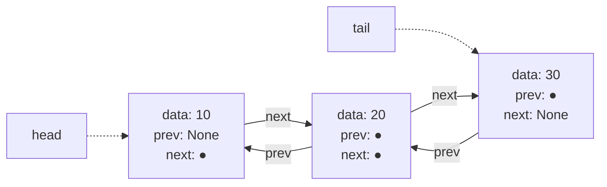
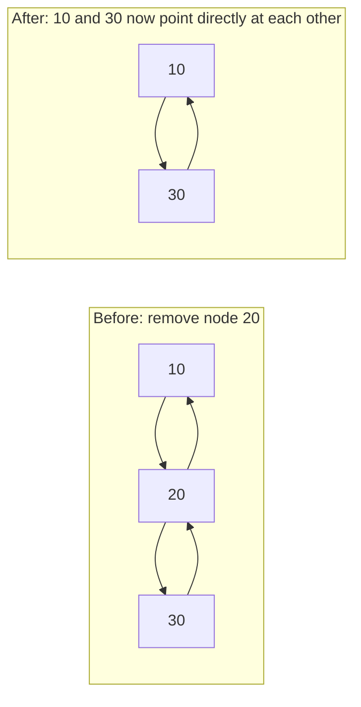

## Learning Objectives

- Explain what a `prev` pointer adds to a linked-list node, and what new operations it makes efficient.
- Implement O(1) removal of a known node and O(1) insertion before or after a known node in a doubly linked list.
- Analyze why a doubly linked list can support O(1) deletion at the tail while a singly linked list cannot.
- Compare the memory overhead of a doubly linked list against a singly linked list and against an array, and predict when that overhead is or isn't worth paying.

## Context & Motivation

The singly linked list's Achilles' heel, identified at the end of the previous concept, is directional: its pointers only ever go forward, from a node to its successor, never backward. This makes certain operations that sound like they should be symmetric — "delete the last element" versus "delete the first element" — wildly asymmetric in cost: deleting the head is O(1), but deleting the tail, even with a `tail` pointer maintained, is O(n), because finding the *new* tail (the node just before the old one) requires walking the entire list from the head, since nothing points backward. The same asymmetry infects any scenario where a node needs to be removed from the middle given only a reference to that node itself, without also holding a reference to its predecessor: a singly linked list offers no way to find that predecessor except by re-traversing from the head.

The **doubly linked list** fixes this by giving every node a second pointer, `prev`, pointing to its predecessor, in addition to the `next` pointer to its successor. This is a small, mechanically simple addition, but it changes the complexity class of an entire category of operations: given a reference to *any* node, its predecessor is now reachable in O(1), which means that node can be spliced out of the list — or a new node spliced in immediately before or after it — using only local pointer surgery, with no traversal from the head required at all. This is exactly the kind of node-in-hand deletion that real-world structures like a browser's back/forward history, a music player's playlist with "previous track," or the internal implementation of Python's `collections.deque` and Java's `LinkedList` rely on. Stanford's CS106B and the broader ACM/IEEE curriculum guidelines both treat the doubly linked list as the natural next step after singly linked lists specifically because the *cost* of the improvement — one extra pointer per node — is concrete and countable, which makes it an unusually clean example of a data-structure design trade-off: more memory per element, spent deliberately, to buy a structurally different (and better) complexity guarantee for an entire class of operations.

## Core Theory

### The node: two pointers instead of one

A doubly linked list's node holds a `prev` pointer alongside `next`:

```python
class DNode:
    def __init__(self, data, prev=None, next=None):
        self.data = data
        self.prev = prev
        self.next = next
```

The list itself typically maintains references to both the **head** (first node, whose `prev` is None) and the **tail** (last node, whose `next` is None), since both ends are now equally cheap to operate on.



### O(1) removal of a known node — the central capability this structure adds

Given a reference to any node `n` (not necessarily the head or tail), it can be spliced out of the list in O(1) using only its own `prev` and `next` pointers — no traversal needed to find its neighbors, because it already points to both of them directly:

```python
def remove_node(n, dll):
    if n.prev is not None:
        n.prev.next = n.next
    else:
        dll.head = n.next          # n was the head

    if n.next is not None:
        n.next.prev = n.prev
    else:
        dll.tail = n.prev          # n was the tail

    n.prev = n.next = None         # good practice: detach n fully
    return n.data
```



This is the capability a singly linked list fundamentally cannot offer without an O(n) traversal: `n.prev` gives immediate, O(1) access to the node that must be updated on the "before" side, which a singly linked list has no way to obtain from `n` alone.

### O(1) insertion before or after a known node

Because both directions are available, a new node can be spliced in on either side of an existing node, again using only local pointer surgery:

```python
def insert_before(n, data, dll):
    new_node = DNode(data, prev=n.prev, next=n)
    if n.prev is not None:
        n.prev.next = new_node
    else:
        dll.head = new_node        # n was the head; new_node is the new head
    n.prev = new_node
    return new_node
```

Each of the four pointer assignments here is O(1); no other node besides `n`, its old predecessor, and the new node itself is touched.

### Why tail operations become O(1)

With a maintained `tail` pointer and `prev` pointers throughout, removing the last element no longer requires finding "the node before the tail" by traversal — it is directly available as `tail.prev`:

```python
def remove_tail(dll):
    if dll.tail is None:
        raise IndexError("list is empty")
    return remove_node(dll.tail, dll)   # dll.tail.prev is already known — O(1)
```

This is the exact operation that was O(n) in a singly linked list (per the previous concept's misconceptions section) — the addition of `prev` pointers is precisely what converts it to O(1), because "the node before the tail" is now a direct field lookup instead of a full re-traversal from the head.

### The cost: one extra pointer per node

Every one of these gains is paid for with a fixed, per-node memory overhead: each node now stores two pointers instead of one. On a 64-bit system where a pointer is 8 bytes, this typically means an extra 8 bytes per node compared to a singly linked list holding the same data — a real, measurable, but bounded (O(1) per element, i.e., O(n) total for n elements) increase, not a change in asymptotic memory complexity, but a real constant-factor cost nonetheless.

## Worked Examples

### Example 1 — removing a node from the middle without any traversal

**Problem:** Given the doubly linked list [10, 20, 30, 40] and a direct reference to the node holding 30 (obtained, say, from a hash table that maps values to node references — a common real-world pattern), remove it in O(1) and show the resulting list.

```python
class DoublyLinkedList:
    def __init__(self):
        self.head = None
        self.tail = None

    def append(self, data):
        new_node = DNode(data, prev=self.tail, next=None)
        if self.tail is not None:
            self.tail.next = new_node
        else:
            self.head = new_node
        self.tail = new_node
        return new_node


dll = DoublyLinkedList()
node_refs = {}
for value in [10, 20, 30, 40]:
    node_refs[value] = dll.append(value)

# Directly remove the node holding 30 — no traversal needed, reference already in hand
remove_node(node_refs[30], dll)

# Traverse forward to confirm
current = dll.head
result = []
while current is not None:
    result.append(current.data)
    current = current.next
print(result)   # [10, 20, 40]
```

**Reasoning.** The removal touched exactly two other nodes — the one before (20) and the one after (40) — rewiring `20.next` to point to `40` and `40.prev` to point to `20`. Nothing about this operation examined node 10, and crucially, nothing had to *search* for nodes 20 and 40 either: they were already directly reachable as `node_refs[30].prev` and `node_refs[30].next`. This is the O(1)-given-a-node-reference guarantee made completely concrete.

### Example 2 — implementing a Deque-like O(1) push/pop at both ends

**Problem:** Using the doubly linked list above, implement `push_front`, `push_back`, `pop_front`, and `pop_back`, and confirm all four are O(1).

```python
def push_front(dll, data):
    new_node = DNode(data, prev=None, next=dll.head)
    if dll.head is not None:
        dll.head.prev = new_node
    else:
        dll.tail = new_node
    dll.head = new_node

def push_back(dll, data):
    dll.append(data)   # reuses DoublyLinkedList.append from Example 1

def pop_front(dll):
    if dll.head is None:
        raise IndexError("empty")
    return remove_node(dll.head, dll)

def pop_back(dll):
    if dll.tail is None:
        raise IndexError("empty")
    return remove_node(dll.tail, dll)


dll = DoublyLinkedList()
push_back(dll, 20)
push_front(dll, 10)
push_back(dll, 30)
# list is now [10, 20, 30]
print(pop_front(dll))   # 10
print(pop_back(dll))    # 30
```

**Reasoning.** Each of the four operations touches only `dll.head`, `dll.tail`, and at most one existing node's `prev` or `next` field — none of them traverses the list. This is precisely why a doubly linked list is the natural backing structure for the Deque ADT (covered later in this discipline): a singly linked list can offer O(1) `push_front`/`pop_front` (as shown in the previous concept) but only O(1) `push_back`, never O(1) `pop_back`, without the `prev` pointers a doubly linked list provides.

### Example 3 — measuring the memory trade-off concretely

**Problem:** For a list of one million integers, estimate the extra memory a doubly linked list's `prev` pointers cost compared to a singly linked list, assuming 8-byte pointers and ignoring per-object overhead differences.

**Reasoning.** A singly linked node stores one `next` pointer (8 bytes) plus its data; a doubly linked node stores that same `next` pointer plus one additional `prev` pointer (8 more bytes) plus the same data. Across 1,000,000 nodes, the extra cost is `1,000,000 * 8 bytes = 8,000,000 bytes ≈ 7.6 MB` — a real, fixed cost proportional to n (O(n) total, i.e., O(1) per node, same asymptotic memory class as the singly linked list, just with a larger constant factor). Whether this is worth paying is a genuine engineering judgment call: if the application frequently needs O(1) removal of a node given only its reference (e.g., an LRU cache's eviction structure, which needs to move an accessed entry to the front and evict from the back in O(1)), the extra ~8 bytes per node is a clearly worthwhile trade for converting an O(n) operation to O(1); if the application only ever traverses forward and never removes arbitrary nodes, the second pointer buys nothing and is pure overhead.

## Common Misconceptions & Pitfalls

- **"A doubly linked list makes indexed access (`get(i)`) fast, since it can search from either end."** It does not change the asymptotic complexity of indexed access at all — `get(i)` is still O(n) in the worst case, because there is still no address-arithmetic shortcut to a numeric index. The best a doubly linked list can do is start traversal from whichever end (head or tail) is closer to index i, at most halving the constant factor — still O(n), not O(1) or O(log n).
- **"Since node removal is O(1), removing a node by value (`remove_by_value(dll, target)`) is also O(1)."** Removing a node once its reference is in hand is O(1); *finding* that node by scanning for a matching value is still an O(n) traversal, exactly as in a singly linked list. The two costs are independent — O(1) removal only pays off when the caller already has a node reference from elsewhere (e.g., a companion hash map), not when the node must first be located by value.
- **"Extra pointers mean a doubly linked list has worse asymptotic memory complexity than a singly linked list."** Both are O(n) total memory for n elements — the doubly linked list's extra `prev` pointer per node is a real, measurable constant-factor increase (Example 3 quantifies it), not a change in asymptotic class.
- **"Forgetting to update both `prev` and `next` during a splice is a minor bug that mostly just causes traversal from the wrong end to fail."** It is a correctness-breaking bug, not a minor one: if `remove_node` updates `n.prev.next` but forgets to update `n.next.prev`, a subsequent backward traversal from `n.next` will still incorrectly reach the removed node `n`, potentially reintroducing it into future forward traversals as well if any pointer still refers to it — silently corrupting the list's structure rather than merely limiting which direction it can be read from.

## Summary

A doubly linked list adds a `prev` pointer to every node alongside the singly linked list's `next` pointer, and this one addition is what makes it possible to remove a node — or insert next to one — in O(1), given only a reference to that node, with no traversal required to find its neighbor on either side. This is precisely the capability a singly linked list lacks, since a `next`-only chain provides no way to reach a node's predecessor except by re-traversing from the head. The gain is not free: every node now carries an extra pointer, a real, bounded (O(1) per element) memory cost, worth paying specifically when an application needs O(1) node-in-hand removal or two-directional traversal — as in a Deque's push/pop at both ends, or an LRU cache's move-to-front-and-evict-from-back pattern — and not worth paying when only forward traversal and head-only modification are ever needed, in which case a singly linked list achieves the same core sequence behavior more cheaply.

## Documentation Links

- [Stanford CS106B — Lecture Schedule](https://web.stanford.edu/class/cs106b/schedule) — doc
- [ACM/IEEE CS2013 — Software Development Fundamentals (SDF)](https://csed.acm.org/wp-content/uploads/2023/09/SDF-Version-Gamma.pdf) — doc
