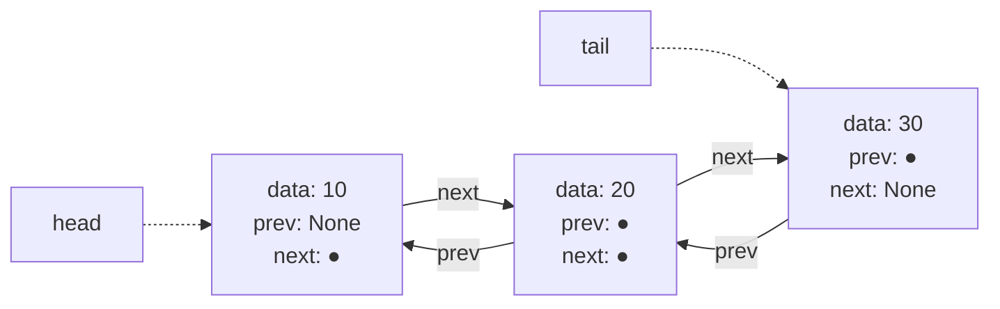
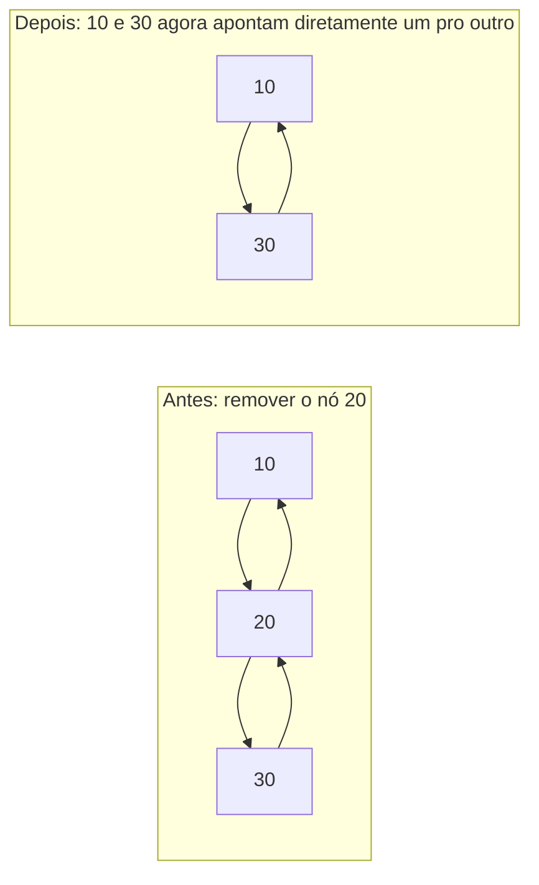

## Objetivos de Aprendizagem

- Explicar o que um ponteiro `prev` acrescenta a um nó de lista encadeada, e que novas operações ele torna eficientes.
- Implementar remoção O(1) de um nó conhecido e inserção O(1) antes ou depois de um nó conhecido numa lista duplamente encadeada.
- Analisar por que uma lista duplamente encadeada consegue suportar remoção O(1) na cauda enquanto uma lista encadeada simples não consegue.
- Comparar o overhead de memória de uma lista duplamente encadeada contra uma lista encadeada simples e contra um vetor, e prever quando esse overhead vale ou não a pena pagar.

## Contexto e Motivação

O calcanhar de Aquiles da lista encadeada simples, identificado no final do conceito anterior, é direcional: seus ponteiros só vão para frente, de um nó para seu sucessor, nunca para trás. Isso torna certas operações que soam como se deveriam ser simétricas ("remover o último elemento" versus "remover o primeiro elemento") extremamente assimétricas em custo: remover a cabeça é O(1), mas remover a cauda, mesmo com um ponteiro `tail` mantido, é O(n), porque achar a *nova* cauda (o nó bem antes da antiga) exige andar a lista inteira a partir da cabeça, já que nada aponta para trás. A mesma assimetria infecta qualquer cenário onde um nó precisa ser removido do meio dado só uma referência ao próprio nó, sem também manter uma referência ao seu predecessor: uma lista encadeada simples não oferece forma de achar esse predecessor exceto repercorrer a partir da cabeça.

A **lista duplamente encadeada** conserta isso dando a todo nó um segundo ponteiro, `prev`, apontando para seu predecessor, além do ponteiro `next` para seu sucessor. Este é um acréscimo pequeno e mecanicamente simples, mas muda a classe de complexidade de uma categoria inteira de operações: dada uma referência a *qualquer* nó, seu predecessor agora é alcançável em O(1), o que significa que esse nó pode ser retirado da lista, ou um novo nó pode ser inserido imediatamente antes ou depois dele, usando só cirurgia local de ponteiros, sem percurso algum a partir da cabeça exigido. Este é exatamente o tipo de remoção nó-em-mãos que estruturas do mundo real como o histórico de voltar/avançar de um navegador, a playlist de um tocador de música com "faixa anterior", ou a implementação interna do `collections.deque` do Python e do `LinkedList` do Java se apoiam. O CS106B de Stanford e as diretrizes curriculares ACM/IEEE mais amplas tratam a lista duplamente encadeada como o próximo passo natural depois de listas encadeadas simples especificamente porque o *custo* da melhoria (um ponteiro extra por nó) é concreto e contável, o que a torna um exemplo incomumente limpo de troca de design de estrutura de dados: mais memória por elemento, gasta deliberadamente, para comprar uma garantia de complexidade estruturalmente diferente (e melhor) para uma classe inteira de operações.

## Teoria Central

### O nó: dois ponteiros em vez de um

O nó de uma lista duplamente encadeada mantém um ponteiro `prev` junto com `next`:

```python
class DNode:
    def __init__(self, data, prev=None, next=None):
        self.data = data
        self.prev = prev
        self.next = next
```

A própria lista tipicamente mantém referências tanto à **cabeça** (primeiro nó, cujo `prev` é None) quanto à **cauda** (último nó, cujo `next` é None), já que as duas extremidades agora são igualmente baratas de operar.



### Remoção O(1) de um nó conhecido: a capacidade central que essa estrutura acrescenta

Dada uma referência a qualquer nó `n` (não necessariamente a cabeça ou a cauda), ele pode ser retirado da lista em O(1) usando só seus próprios ponteiros `prev` e `next`; nenhum percurso é necessário para achar seus vizinhos, porque ele já aponta para os dois diretamente:

```python
def remove_node(n, dll):
    if n.prev is not None:
        n.prev.next = n.next
    else:
        dll.head = n.next          # n era a cabeça

    if n.next is not None:
        n.next.prev = n.prev
    else:
        dll.tail = n.prev          # n era a cauda

    n.prev = n.next = None         # boa prática: desconecta n completamente
    return n.data
```



Essa é a capacidade que uma lista encadeada simples fundamentalmente não pode oferecer sem um percurso O(n): `n.prev` dá acesso imediato e O(1) ao nó que precisa ser atualizado no lado "antes", que uma lista encadeada simples não tem forma de obter a partir de `n` sozinho.

### Inserção O(1) antes ou depois de um nó conhecido

Como as duas direções estão disponíveis, um novo nó pode ser inserido em qualquer lado de um nó existente, novamente usando só cirurgia local de ponteiros:

```python
def insert_before(n, data, dll):
    new_node = DNode(data, prev=n.prev, next=n)
    if n.prev is not None:
        n.prev.next = new_node
    else:
        dll.head = new_node        # n era a cabeça; new_node é a nova cabeça
    n.prev = new_node
    return new_node
```

Cada uma das quatro atribuições de ponteiro aqui é O(1); nenhum outro nó além de `n`, seu antigo predecessor, e o próprio novo nó é tocado.

### Por que operações na cauda se tornam O(1)

Com um ponteiro `tail` mantido e ponteiros `prev` por toda parte, remover o último elemento não exige mais achar "o nó antes da cauda" por percurso; ele está diretamente disponível como `tail.prev`:

```python
def remove_tail(dll):
    if dll.tail is None:
        raise IndexError("lista está vazia")
    return remove_node(dll.tail, dll)   # dll.tail.prev já é conhecido, O(1)
```

Esta é exatamente a operação que era O(n) numa lista encadeada simples (conforme a seção de equívocos do conceito anterior); o acréscimo de ponteiros `prev` é precisamente o que a converte para O(1), porque "o nó antes da cauda" agora é uma consulta direta de campo em vez de um repercurso completo a partir da cabeça.

### O custo: um ponteiro extra por nó

Cada um desses ganhos é pago com um overhead de memória fixo por nó: cada nó agora armazena dois ponteiros em vez de um. Num sistema de 64 bits onde um ponteiro tem 8 bytes, isso tipicamente significa 8 bytes extras por nó comparado a uma lista encadeada simples contendo o mesmo dado, um aumento real, mensurável, mas limitado (O(1) por elemento, isto é, O(n) total para n elementos), não uma mudança na complexidade de memória assintótica, mas um custo de fator constante real ainda assim.

## Exemplos Resolvidos

### Exemplo 1: removendo um nó do meio sem nenhum percurso

**Problema:** dada a lista duplamente encadeada [10, 20, 30, 40] e uma referência direta ao nó contendo 30 (obtida, digamos, de uma tabela hash que mapeia valores para referências de nó, um padrão real e comum), remova ele em O(1) e mostre a lista resultante.

```python
class DoublyLinkedList:
    def __init__(self):
        self.head = None
        self.tail = None

    def append(self, data):
        new_node = DNode(data, prev=self.tail, next=None)
        if self.tail is not None:
            self.tail.next = new_node
        else:
            self.head = new_node
        self.tail = new_node
        return new_node


dll = DoublyLinkedList()
node_refs = {}
for value in [10, 20, 30, 40]:
    node_refs[value] = dll.append(value)

# Remove diretamente o nó contendo 30, sem percurso necessário, referência já em mãos
remove_node(node_refs[30], dll)

# Percorre pra frente pra confirmar
current = dll.head
result = []
while current is not None:
    result.append(current.data)
    current = current.next
print(result)   # [10, 20, 40]
```

**Raciocínio.** A remoção tocou exatamente dois outros nós, o de antes (20) e o de depois (40), religando `20.next` para apontar pra `40` e `40.prev` para apontar pra `20`. Nada nessa operação examinou o nó 10, e crucialmente, nada teve que *buscar* pelos nós 20 e 40 tampouco: eles já eram diretamente alcançáveis como `node_refs[30].prev` e `node_refs[30].next`. Esta é a garantia de O(1)-dada-uma-referência-de-nó tornada completamente concreta.

### Exemplo 2: implementando push/pop O(1) tipo Deque nas duas extremidades

**Problema:** usando a lista duplamente encadeada acima, implemente `push_front`, `push_back`, `pop_front`, e `pop_back`, e confirme que os quatro são O(1).

```python
def push_front(dll, data):
    new_node = DNode(data, prev=None, next=dll.head)
    if dll.head is not None:
        dll.head.prev = new_node
    else:
        dll.tail = new_node
    dll.head = new_node

def push_back(dll, data):
    dll.append(data)   # reusa DoublyLinkedList.append do Exemplo 1

def pop_front(dll):
    if dll.head is None:
        raise IndexError("vazia")
    return remove_node(dll.head, dll)

def pop_back(dll):
    if dll.tail is None:
        raise IndexError("vazia")
    return remove_node(dll.tail, dll)


dll = DoublyLinkedList()
push_back(dll, 20)
push_front(dll, 10)
push_back(dll, 30)
# lista agora é [10, 20, 30]
print(pop_front(dll))   # 10
print(pop_back(dll))    # 30
```

**Raciocínio.** Cada uma das quatro operações toca só `dll.head`, `dll.tail`, e no máximo o campo `prev` ou `next` de um nó existente; nenhuma delas percorre a lista. Essa é precisamente a razão de uma lista duplamente encadeada ser a estrutura de suporte natural para o TAD Deque (coberto mais adiante nesta disciplina): uma lista encadeada simples pode oferecer `push_front`/`pop_front` O(1) (como mostrado no conceito anterior) mas só `push_back` O(1), nunca `pop_back` O(1), sem os ponteiros `prev` que uma lista duplamente encadeada fornece.

### Exemplo 3: medindo a troca de memória concretamente

**Problema:** para uma lista de um milhão de inteiros, estime a memória extra que os ponteiros `prev` de uma lista duplamente encadeada custam comparados a uma lista encadeada simples, assumindo ponteiros de 8 bytes e ignorando diferenças de overhead por objeto.

**Raciocínio.** Um nó encadeado simples armazena um ponteiro `next` (8 bytes) mais seu dado; um nó duplamente encadeado armazena esse mesmo ponteiro `next` mais um ponteiro `prev` adicional (mais 8 bytes) mais o mesmo dado. Em 1.000.000 de nós, o custo extra é `1.000.000 * 8 bytes = 8.000.000 bytes ≈ 7,6 MB`, um custo real e fixo proporcional a n (O(n) total, isto é, O(1) por nó, mesma classe de memória assintótica que a lista encadeada simples, só com um fator constante maior). Se isso vale a pena pagar é uma decisão de julgamento de engenharia genuína: se a aplicação frequentemente precisa de remoção O(1) de um nó dado só sua referência (por exemplo, a estrutura de despejo de um cache LRU, que precisa mover uma entrada acessada para a frente e despejar da traseira em O(1)), o extra de ~8 bytes por nó é claramente uma troca que vale a pena para converter uma operação O(n) em O(1); se a aplicação só percorre para frente e nunca remove nós arbitrários, o segundo ponteiro não compra nada e é overhead puro.

## Equívocos Comuns e Armadilhas

- **"Uma lista duplamente encadeada torna acesso indexado (`get(i)`) rápido, já que pode buscar a partir de qualquer extremidade."** Ela não muda a complexidade assintótica de acesso indexado de forma alguma; `get(i)` ainda é O(n) no pior caso, porque ainda não há atalho de aritmética de endereço para um índice numérico. O máximo que uma lista duplamente encadeada consegue fazer é começar o percurso a partir de qualquer extremidade (cabeça ou cauda) que esteja mais perto do índice i, no máximo reduzindo o fator constante pela metade; ainda O(n), não O(1) nem O(log n).
- **"Como remoção de nó é O(1), remover um nó por valor (`remove_by_value(dll, target)`) também é O(1)."** Remover um nó uma vez que sua referência está em mãos é O(1); *achar* esse nó procurando por um valor correspondente ainda é um percurso O(n), exatamente como numa lista encadeada simples. Os dois custos são independentes; remoção O(1) só compensa quando quem chama já tem uma referência de nó de outro lugar (por exemplo, um mapa hash companheiro), não quando o nó precisa primeiro ser localizado por valor.
- **"Ponteiros extras significam que uma lista duplamente encadeada tem complexidade de memória assintótica pior que uma lista encadeada simples."** As duas são O(n) de memória total para n elementos; o ponteiro `prev` extra por nó da lista duplamente encadeada é um aumento de fator constante real e mensurável (o Exemplo 3 quantifica isso), não uma mudança de classe assintótica.
- **"Esquecer de atualizar tanto `prev` quanto `next` durante uma cirurgia é um bug menor que basicamente só faz percurso a partir da direção errada falhar."** É um bug que quebra corretude, não um menor: se `remove_node` atualiza `n.prev.next` mas esquece de atualizar `n.next.prev`, um percurso subsequente para trás a partir de `n.next` ainda alcançará incorretamente o nó removido `n`, potencialmente reintroduzindo ele em percursos futuros para frente também se qualquer ponteiro ainda se referir a ele, corrompendo silenciosamente a estrutura da lista em vez de meramente limitar de qual direção ela pode ser lida.

## Resumo

Uma lista duplamente encadeada acrescenta um ponteiro `prev` a todo nó junto com o ponteiro `next` da lista encadeada simples, e esse único acréscimo é o que torna possível remover um nó, ou inserir junto a um, em O(1), dada só uma referência a esse nó, sem percurso exigido para achar seu vizinho em qualquer lado. Essa é precisamente a capacidade que uma lista encadeada simples não tem, já que uma cadeia só-`next` não fornece forma de alcançar o predecessor de um nó exceto repercorrendo a partir da cabeça. O ganho não é grátis: todo nó agora carrega um ponteiro extra, um custo de memória real e limitado (O(1) por elemento), que vale a pena pagar especificamente quando uma aplicação precisa de remoção O(1) nó-em-mãos ou percurso em duas direções, como no push/pop nas duas extremidades de um Deque, ou no padrão mover-para-a-frente-e-despejar-da-traseira de um cache LRU, e não vale a pena pagar quando só percurso para frente e modificação só-na-cabeça são sempre necessários, caso em que uma lista encadeada simples alcança o mesmo comportamento central de sequência mais barato.

## Documentation Links

- [Stanford CS106B — Lecture Schedule](https://web.stanford.edu/class/cs106b/schedule) — doc
- [ACM/IEEE CS2013 — Software Development Fundamentals (SDF)](https://csed.acm.org/wp-content/uploads/2023/09/SDF-Version-Gamma.pdf) — doc
