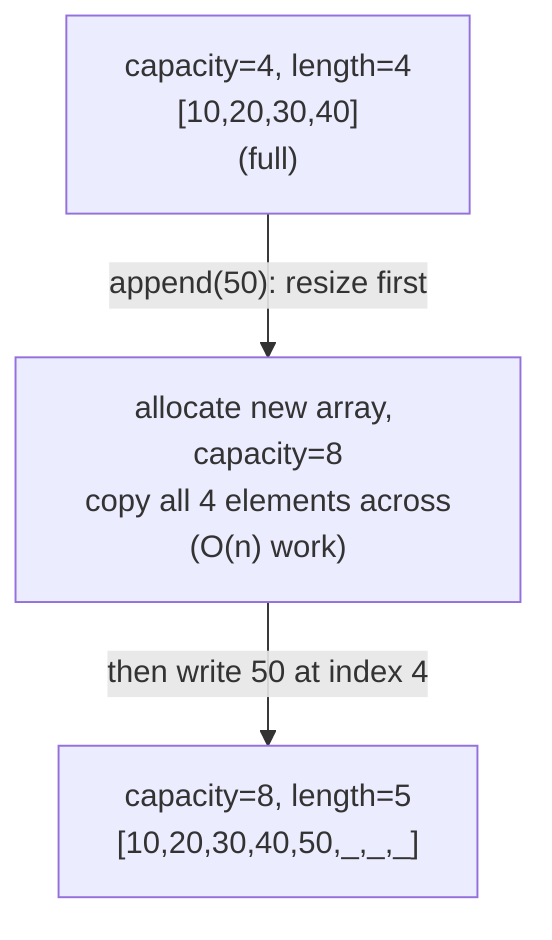

## Learning Objectives

- Explain how a dynamic array simulates growth on top of a fixed-size static array.
- Derive, using the aggregate method, why n consecutive appends cost O(n) total time under a doubling strategy.
- Distinguish "amortized O(1)" from "worst-case O(1)," and identify which single append operations are the expensive ones.
- Predict why a growth strategy that adds a fixed increment (rather than doubling) fails to achieve O(1) amortized append.

## Context & Motivation

Static arrays are fast at indexed access precisely because their size is fixed — but "fixed size" is a serious practical limitation for the overwhelmingly common case of building up a collection one element at a time without knowing its final size in advance. Every language's "growable list" — Python's `list`, Java's `ArrayList`, C++'s `std::vector` — solves this with the same underlying trick: keep a static array as backing storage, but when it fills up, allocate a new, larger static array and copy everything across. The user-facing structure appears to grow seamlessly; underneath, it is periodically and invisibly rebuilt from scratch. This structure is called a **dynamic array**.

The obvious question this raises is a performance one: if appending sometimes triggers a full O(n) copy of every existing element, how can appending still be considered "fast"? The honest answer is nuanced, and getting it right is the entire point of this concept: any *single* append can cost O(n) time, on the rare occasions it triggers a resize — but the strategy of *doubling* the array's capacity each time (rather than growing by some fixed amount) guarantees that these expensive resizes happen rarely enough, and each one is followed by a long enough stretch of cheap O(1) appends, that the *average* cost per append across any sequence of n appends works out to O(1). This average-cost-over-a-sequence idea has a name — **amortized analysis** — and the doubling-strategy argument for dynamic arrays is one of the cleanest, most frequently cited examples of it in all of algorithms coursework; both MIT's 6.006 and Princeton's Algorithms, Part I build their treatment of amortized complexity around exactly this example, because it is fully rigorous, provable from first principles, and immediately useful: understanding why doubling works (and why growing by a fixed increment does not) is the difference between correctly reasoning about a real `ArrayList`'s or `vector`'s performance and being surprised by it in practice. This concept assumes Big-O notation and array mechanics are already understood; the amortized-doubling argument itself is new content, derived carefully below rather than assumed.

## Core Theory

### The doubling strategy

A dynamic array maintains two pieces of state beyond its backing static array: a **length** (how many elements are logically in use) and a **capacity** (how many slots the backing array actually has allocated, which is `>= length`). The core operation, `append(x)`, works as follows:

1. If `length < capacity` (there's spare room), write `x` at index `length`, and increment `length`. This is O(1) — one address computation, one write.
2. If `length == capacity` (the array is full), first **resize**: allocate a brand-new static array of capacity `2 * capacity` (doubling — using 1 as the starting capacity if it was 0), copy all `length` existing elements into the new array (O(n) — every element must be individually copied), discard the old array, and only then proceed with step 1 using the new, larger backing array.



### Why doubling, specifically, and not a fixed increment

Suppose instead the growth strategy added a fixed amount `k` (say, 4 more slots) every time the array filled up, rather than doubling. Starting from capacity 0 and performing n appends triggers a resize roughly every k appends, and each resize copies the *entire current array*, which grows roughly linearly with the number of resizes so far. Summing the copying cost across all `n/k` resizes gives a total copying cost proportional to `k + 2k + 3k + ... + (n/k)k`, which is a sum of `n/k` terms each up to `n`, totaling Θ(n²/k) — quadratic in n for any fixed k. Divided by n appends, that's Θ(n/k) amortized per append — which grows without bound as n grows, i.e., **not** O(1) amortized. Doubling avoids this because the sizes of the successive backing arrays form a geometric sequence (1, 2, 4, 8, ...) rather than an arithmetic one (k, 2k, 3k, ...), and a geometric sequence is dominated by its last (largest) term — its full sum is only a small constant multiple of that last term, not proportional to the number of terms times the average term. This distinction — geometric growth versus arithmetic growth — is the crux of why doubling specifically is what achieves O(1) amortized append, and no fixed-increment strategy can.

### The aggregate method: proving O(1) amortized append rigorously

The **aggregate method** of amortized analysis bounds the *total* cost of a sequence of n operations, then divides by n to get the average (amortized) cost per operation — a valid technique precisely because it makes no claim about any individual operation's cost, only about the average over the whole sequence.

**Claim:** performing n `append` operations on a dynamic array that starts empty and doubles on overflow costs O(n) total time, hence O(1) amortized per append.

**Proof.** Split the total cost into two parts:

- **The O(1) writes.** Every single append, whether or not it triggers a resize, performs exactly one O(1) write of the new element (step 1 above always runs, even after a resize). Across n appends, this contributes exactly n unit-cost writes: O(n) total.

- **The copying cost of all resizes.** A resize is triggered only when the array is full, and doubling means resizes happen when length is 1, 2, 4, 8, 16, ..., i.e., at each power of two up to n. Each resize at capacity `c` copies `c` elements. So the total copying work across all resizes triggered during n appends is at most:

```
1 + 2 + 4 + 8 + ... + n  ≤  2n
```

This is a geometric series with ratio 2; the well-known identity `1 + 2 + 4 + ... + 2^k = 2^(k+1) - 1` bounds the sum by strictly less than twice its largest term. Since the largest resize copies at most n elements (you never need a backing array bigger than roughly n to hold n elements), the entire sum of all copying costs across every resize that ever happens during the n appends is bounded by 2n — a constant factor of n, not n² and not n log n.

**Combining both parts:** total cost of n appends ≤ (n unit writes) + (2n copy operations) = O(n). Dividing by n appends gives O(n)/n = **O(1) amortized cost per append**. ∎

This is the entire argument: it is not a heuristic or an approximation — it is a clean algebraic bound on a geometric sum, and it is exactly why real-world dynamic arrays (Python's `list`, Java's `ArrayList`, C++'s `std::vector`) are documented as offering "amortized O(1)" `append`/`add`/`push_back`, not "O(1)" unqualified.

### Amortized O(1) is not the same as worst-case O(1)

It is essential to keep these two claims distinct. **Worst-case O(1)** would mean *every single* append costs a bounded constant amount of time, with no exceptions. This is false for dynamic arrays: the append that triggers a resize costs O(n) for that one call, full stop — there is no hiding this from a caller who happens to time that particular call. **Amortized O(1)** means only that the *total* cost of any long sequence of appends, divided by the number of appends, is bounded by a constant — individual expensive operations are real, but they are rare enough, and followed by enough cheap operations, that they don't dominate the average. A caller who needs a hard real-time guarantee on every single call (say, in an audio processing loop where one slow call causes an audible glitch) cannot rely on amortized bounds and needs a different structure or strategy (such as pre-allocating capacity up front, or incremental resizing strategies used in some real-time systems).

## Worked Examples

### Example 1 — tracing capacities and total copy-work through 10 appends

**Problem:** Starting from an empty dynamic array (capacity 0), trace the capacity after each of 10 appends, identify which appends trigger a resize, and total the number of element-copies performed.

| Append # | length before | capacity before | Resize? | New capacity | Elements copied |
|---|---|---|---|---|---|
| 1 | 0 | 0 | yes (0→1) | 1 | 0 |
| 2 | 1 | 1 | yes (1→2) | 2 | 1 |
| 3 | 2 | 2 | yes (2→4) | 4 | 2 |
| 4 | 3 | 4 | no | 4 | 0 |
| 5 | 4 | 4 | yes (4→8) | 8 | 4 |
| 6 | 5 | 8 | no | 8 | 0 |
| 7 | 6 | 8 | no | 8 | 0 |
| 8 | 7 | 8 | no | 8 | 0 |
| 9 | 8 | 8 | yes (8→16) | 16 | 8 |
| 10 | 9 | 16 | no | 16 | 0 |

**Total copies:** 0 + 1 + 2 + 4 + 8 = 15. **Total writes:** 10 (one per append). **Total work:** 25 units of work for 10 appends, giving an average of 2.5 units per append — a small constant, consistent with the O(1) amortized bound (and comfortably under the `2n = 20` bound derived in Core Theory for the copying alone, since the array hadn't yet filled its 16-capacity backing store).

**Reasoning.** Only 4 of the 10 appends (#1, #2, #3, #5, #9 — actually 5 of them) triggered a resize, and each resize's cost was proportional to the array's size *at that moment*, which itself was doubling each time — exactly the geometric series `0, 1, 2, 4, 8` from the proof. The other 5 appends were pure O(1) writes with zero copying. This table makes the aggregate method's abstract sum `1+2+4+...` into something countable and concrete.

### Example 2 — implementing a dynamic array from scratch

**Problem:** Implement a minimal dynamic array in Python, using a fixed-capacity list as the raw backing store (not Python's own dynamic resizing), to make the doubling mechanism explicit rather than borrowed.

```python
class DynamicArray:
    def __init__(self):
        self._capacity = 1
        self._length = 0
        self._store = [None] * self._capacity   # raw backing store

    def __len__(self):
        return self._length

    def get(self, i):
        if not (0 <= i < self._length):
            raise IndexError("index out of range")
        return self._store[i]

    def append(self, value):
        if self._length == self._capacity:
            self._resize(2 * self._capacity)
        self._store[self._length] = value
        self._length += 1

    def _resize(self, new_capacity):
        new_store = [None] * new_capacity   # allocate a brand-new backing array
        for i in range(self._length):       # O(n) copy of every existing element
            new_store[i] = self._store[i]
        self._store = new_store
        self._capacity = new_capacity


# Demonstration
d = DynamicArray()
for i in range(6):
    d.append(i * 10)
    print(f"appended {i*10}, length={len(d)}, capacity={d._capacity}")
```

**Output (capacity growth pattern):**
```
appended 0,  length=1, capacity=1
appended 10, length=2, capacity=2
appended 20, length=3, capacity=4
appended 30, length=4, capacity=4
appended 40, length=5, capacity=8
appended 50, length=6, capacity=8
```

**Reasoning.** This matches the trace in Example 1 exactly: capacity only changes on the appends that hit `self._length == self._capacity`, and each such resize doubles capacity and pays for a full copy. The key implementation detail is that `_resize` allocates an entirely *new* array (`new_store = [None] * new_capacity`) — a dynamic array is never actually grown in place, because the backing store is, underneath, a static array that cannot be grown; "growing" a dynamic array always means "build a new, bigger static array and copy."

### Example 3 — the cost of not pre-sizing when the final size is known

**Problem:** A program needs to build an array of exactly 1,000,000 known elements. Compare, in terms of total copy-work, appending them one at a time to a doubling dynamic array that starts at capacity 1, versus allocating a static array of capacity 1,000,000 up front.

**Reasoning.** Using the doubling strategy from an initial capacity of 1, resizes occur at capacities 1, 2, 4, 8, ..., up to just past 1,000,000 — roughly log₂(1,000,000) ≈ 20 resizes, with total copy-work bounded by `2n ≈ 2,000,000` element-copies (per the aggregate-method bound). This is genuinely fine — it's still O(n), just with a constant factor of about 2 — but it is not *zero* extra work. Allocating a static array of exactly capacity 1,000,000 up front and filling it by index costs zero copy-work: every one of the 1,000,000 writes is a plain O(1) indexed write, with no resize ever triggered. Both approaches are O(n) overall, so asymptotically neither is "better" — but this example illustrates a genuinely useful practical takeaway that the Big-O bound alone hides: when the final size is known in advance, most real dynamic-array implementations expose a way to pre-allocate capacity (e.g., specifying an initial capacity), and doing so eliminates the doubling strategy's constant-factor copying overhead entirely, even though both strategies remain O(n) asymptotically.

## Common Misconceptions & Pitfalls

- **"Amortized O(1) means every append is fast."** False, and the most important distinction in this entire concept: the specific append that triggers a resize is genuinely O(n) for that one call — Example 1's appends #1, #2, #3, #5, and #9 each did real, non-trivial copying work. "Amortized O(1)" is a claim about the *average* cost over a long sequence, never a guarantee about any individual call.
- **"Doubling capacity wastes a lot of memory, so growing by a small fixed amount is more efficient overall."** It trades memory efficiency for a real, provable time-complexity regression: as derived in Core Theory, a fixed increment strategy yields Θ(n/k) amortized cost per append — unbounded as n grows — while doubling yields a true constant, O(1). The wasted memory from doubling (at most half the backing array unused at any time) is a real but bounded cost; the time regression from fixed increments is unbounded and gets strictly worse as the array grows.
- **"A dynamic array literally grows the same block of memory in place."** It does not, and cannot in general — see Example 2's `_resize` method — because the backing store is a static array, which by definition has a fixed size once allocated. "Growing" always means allocating an entirely new, larger array and copying every element across, then discarding the old array.
- **"If I know the final size in advance, using a doubling dynamic array is asymptotically wasteful."** Asymptotically, no — both approaches are O(n), as Example 3 shows. Pre-sizing avoids the doubling strategy's copying entirely, which is a genuine, real-world win in constant factors, but it does not change the Big-O classification of either approach.

## Summary

A dynamic array is a static array in disguise: a fixed-capacity backing store that gets discarded and replaced by a new, larger one whenever it fills up, with all existing elements copied across. Doubling the capacity on each resize, rather than growing by a fixed increment, is what makes this strategy achieve O(1) amortized cost per append — proved rigorously by the aggregate method, which bounds the total cost of n appends by summing the O(1) writes (n of them) and the geometric series of copy costs from every resize (at most 2n), for a total of O(n) work across n appends, hence O(1) per append on average. This average conceals real variance: any individual append that triggers a resize costs O(n) for that call alone, which is why "amortized O(1)" is a strictly weaker and different guarantee than "worst-case O(1)." A fixed-increment growth strategy fails to achieve this bound, instead costing Θ(n/k) amortized per append — a direct consequence of arithmetic growth in backing-array sizes rather than doubling's geometric growth.

## Documentation Links

- [Sedgewick & Wayne — Stacks and Queues (Princeton lecture slides)](https://algs4.cs.princeton.edu/lectures/keynote/13StacksAndQueues.pdf) — doc
- [MIT 6.006 — Lecture Notes (OCW)](https://ocw.mit.edu/courses/6-006-introduction-to-algorithms-spring-2020/pages/lecture-notes/) — doc
