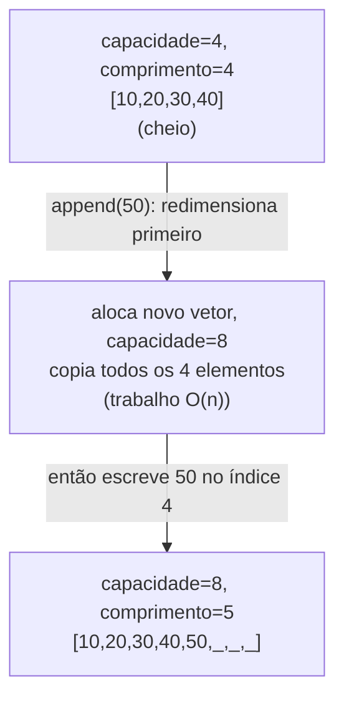

## Objetivos de Aprendizagem

- Explicar como um vetor dinâmico simula crescimento em cima de um vetor estático de tamanho fixo.
- Derivar, usando o método agregado, por que n appends consecutivos custam O(n) de tempo total sob uma estratégia de dobramento.
- Distinguir "O(1) amortizado" de "O(1) no pior caso", e identificar quais operações individuais de append são as caras.
- Prever por que uma estratégia de crescimento que adiciona um incremento fixo (em vez de dobrar) falha em alcançar append O(1) amortizado.

## Contexto e Motivação

Vetores estáticos são rápidos em acesso indexado precisamente porque seu tamanho é fixo, mas "tamanho fixo" é uma limitação prática séria para o caso extremamente comum de construir uma coleção um elemento de cada vez sem saber seu tamanho final de antemão. A "lista crescível" de toda linguagem (a `list` do Python, o `ArrayList` do Java, o `std::vector` do C++) resolve isso com o mesmo truque subjacente: manter um vetor estático como armazenamento de apoio, mas quando ele enche, alocar um vetor estático novo e maior e copiar tudo para lá. A estrutura voltada ao usuário parece crescer sem costura; por baixo, é periódica e invisivelmente reconstruída do zero. Essa estrutura se chama um **vetor dinâmico**.

A pergunta óbvia que isso levanta é uma de desempenho: se dar append às vezes dispara uma cópia O(n) completa de todo elemento existente, como dar append ainda pode ser considerado "rápido"? A resposta honesta é matizada, e acertá-la é o ponto inteiro deste conceito: qualquer append *individual* pode custar tempo O(n), nas raras ocasiões em que dispara um redimensionamento, mas a estratégia de *dobrar* a capacidade do vetor a cada vez (em vez de crescer por alguma quantidade fixa) garante que esses redimensionamentos caros aconteçam raramente o suficiente, e cada um é seguido por um trecho longo o bastante de appends baratos O(1), que o custo *médio* por append ao longo de qualquer sequência de n appends dá O(1). Essa ideia de custo médio ao longo de uma sequência tem um nome, **análise amortizada**, e o argumento da estratégia de dobramento para vetores dinâmicos é um dos exemplos mais limpos e frequentemente citados dela em todo curso de algoritmos; tanto o 6.006 do MIT quanto o Algorithms, Part I de Princeton constroem seu tratamento de complexidade amortizada em torno exatamente desse exemplo, porque é totalmente rigoroso, provável a partir de princípios básicos, e imediatamente útil: entender por que dobrar funciona (e por que crescer por um incremento fixo não funciona) é a diferença entre raciocinar corretamente sobre o desempenho de um `ArrayList` ou `vector` real e ser surpreendido por ele na prática. Este conceito assume que notação Big-O e mecânica de vetor já são entendidas; o próprio argumento de dobramento amortizado é conteúdo novo, derivado cuidadosamente abaixo em vez de assumido.

## Teoria Central

### A estratégia de dobramento

Um vetor dinâmico mantém dois pedaços de estado além de seu vetor estático de apoio: um **comprimento** (quantos elementos estão logicamente em uso) e uma **capacidade** (quantos compartimentos o vetor de apoio de fato tem alocados, que é `>= comprimento`). A operação central, `append(x)`, funciona assim:

1. Se `comprimento < capacidade` (há espaço sobrando), escreva `x` no índice `comprimento`, e incremente `comprimento`. Isso é O(1): um cálculo de endereço, uma escrita.
2. Se `comprimento == capacidade` (o vetor está cheio), primeiro **redimensione**: aloque um vetor estático inteiramente novo com capacidade `2 * capacidade` (dobrando, usando 1 como capacidade inicial se era 0), copie todos os `comprimento` elementos existentes para o novo vetor (O(n): todo elemento precisa ser copiado individualmente), descarte o vetor antigo, e só então prossiga com o passo 1 usando o novo e maior vetor de apoio.



### Por que dobrar, especificamente, e não um incremento fixo

Suponha em vez disso que a estratégia de crescimento adicionasse uma quantidade fixa `k` (digamos, mais 4 compartimentos) toda vez que o vetor enchesse, em vez de dobrar. Partindo de capacidade 0 e realizando n appends dispara um redimensionamento aproximadamente a cada k appends, e cada redimensionamento copia o *vetor atual inteiro*, que cresce aproximadamente linearmente com o número de redimensionamentos até agora. Somando o custo de cópia através de todos os `n/k` redimensionamentos dá um custo total de cópia proporcional a `k + 2k + 3k + ... + (n/k)k`, que é uma soma de `n/k` termos cada um até `n`, totalizando Θ(n²/k), quadrático em n para qualquer k fixo. Dividido por n appends, isso dá Θ(n/k) amortizado por append, que cresce sem limite conforme n cresce, isto é, **não** O(1) amortizado. Dobrar evita isso porque os tamanhos dos vetores de apoio sucessivos formam uma sequência geométrica (1, 2, 4, 8, ...) em vez de uma aritmética (k, 2k, 3k, ...), e uma sequência geométrica é dominada por seu último (maior) termo; sua soma completa é só um pequeno múltiplo constante desse último termo, não proporcional ao número de termos vezes o termo médio. Essa distinção (crescimento geométrico versus crescimento aritmético) é o cerne de por que dobrar especificamente é o que alcança append O(1) amortizado, e nenhuma estratégia de incremento fixo consegue.

### O método agregado: provando append O(1) amortizado rigorosamente

O **método agregado** de análise amortizada limita o custo *total* de uma sequência de n operações, depois divide por n para obter o custo médio (amortizado) por operação, uma técnica válida precisamente porque não faz nenhuma afirmação sobre o custo de nenhuma operação individual, só sobre a média ao longo da sequência inteira.

**Afirmação:** realizar n operações `append` num vetor dinâmico que começa vazio e dobra em overflow custa O(n) de tempo total, portanto O(1) amortizado por append.

**Prova.** Divida o custo total em duas partes:

- **As escritas O(1).** Todo append individual, dispare ou não um redimensionamento, realiza exatamente uma escrita O(1) do novo elemento (o passo 1 acima sempre roda, mesmo depois de um redimensionamento). Através de n appends, isso contribui exatamente n escritas de custo unitário: O(n) no total.

- **O custo de cópia de todos os redimensionamentos.** Um redimensionamento só é disparado quando o vetor está cheio, e dobrar significa que redimensionamentos acontecem quando comprimento é 1, 2, 4, 8, 16, ..., isto é, em cada potência de dois até n. Cada redimensionamento na capacidade `c` copia `c` elementos. Então o trabalho total de cópia através de todos os redimensionamentos disparados durante n appends é no máximo:

```
1 + 2 + 4 + 8 + ... + n  ≤  2n
```

Isso é uma série geométrica de razão 2; a identidade bem conhecida `1 + 2 + 4 + ... + 2^k = 2^(k+1) - 1` limita a soma a estritamente menos que o dobro de seu maior termo. Como o maior redimensionamento copia no máximo n elementos (você nunca precisa de um vetor de apoio maior que aproximadamente n para guardar n elementos), a soma inteira de todos os custos de cópia através de todo redimensionamento que já aconteceu durante os n appends é limitada por 2n, um fator constante de n, não n² e não n log n.

**Combinando as duas partes:** custo total de n appends ≤ (n escritas unitárias) + (2n operações de cópia) = O(n). Dividindo por n appends dá O(n)/n = **O(1) de custo amortizado por append**. ∎

Esse é o argumento inteiro: não é uma heurística nem uma aproximação; é um limite algébrico limpo sobre uma soma geométrica, e é exatamente por que vetores dinâmicos do mundo real (a `list` do Python, o `ArrayList` do Java, o `std::vector` do C++) são documentados como oferecendo `append`/`add`/`push_back` "O(1) amortizado", não "O(1)" sem qualificação.

### O(1) amortizado não é o mesmo que O(1) no pior caso

É essencial manter essas duas afirmações distintas. **O(1) no pior caso** significaria que *todo* append individual custa uma quantidade constante limitada de tempo, sem exceções. Isso é falso para vetores dinâmicos: o append que dispara um redimensionamento custa O(n) para aquela única chamada, ponto final; não há como esconder isso de um chamador que acontece de cronometrar aquela chamada particular. **O(1) amortizado** significa apenas que o custo *total* de qualquer sequência longa de appends, dividido pelo número de appends, é limitado por uma constante; operações caras individuais são reais, mas são raras o suficiente, e seguidas de operações baratas suficientes, que não dominam a média. Um chamador que precisa de uma garantia de tempo real rígida em toda chamada individual (digamos, num laço de processamento de áudio onde uma chamada lenta causa uma falha audível) não pode confiar em limites amortizados e precisa de uma estrutura ou estratégia diferente (como pré-alocar capacidade de antemão, ou estratégias de redimensionamento incremental usadas em alguns sistemas de tempo real).

## Exemplos Resolvidos

### Exemplo 1: traçando capacidades e trabalho total de cópia através de 10 appends

**Problema:** partindo de um vetor dinâmico vazio (capacidade 0), trace a capacidade depois de cada um de 10 appends, identifique quais appends disparam um redimensionamento, e some o número de cópias de elemento realizadas.

| Append # | comprimento antes | capacidade antes | Redimensiona? | Nova capacidade | Elementos copiados |
|---|---|---|---|---|---|
| 1 | 0 | 0 | sim (0→1) | 1 | 0 |
| 2 | 1 | 1 | sim (1→2) | 2 | 1 |
| 3 | 2 | 2 | sim (2→4) | 4 | 2 |
| 4 | 3 | 4 | não | 4 | 0 |
| 5 | 4 | 4 | sim (4→8) | 8 | 4 |
| 6 | 5 | 8 | não | 8 | 0 |
| 7 | 6 | 8 | não | 8 | 0 |
| 8 | 7 | 8 | não | 8 | 0 |
| 9 | 8 | 8 | sim (8→16) | 16 | 8 |
| 10 | 9 | 16 | não | 16 | 0 |

**Total de cópias:** 0 + 1 + 2 + 4 + 8 = 15. **Total de escritas:** 10 (uma por append). **Trabalho total:** 25 unidades de trabalho para 10 appends, dando uma média de 2,5 unidades por append, uma constante pequena, consistente com o limite O(1) amortizado (e confortavelmente abaixo do limite `2n = 20` derivado na Teoria Central só para a cópia, já que o vetor ainda não tinha preenchido seu armazenamento de apoio de capacidade 16).

**Raciocínio.** Só 5 dos 10 appends (#1, #2, #3, #5, #9) dispararam um redimensionamento, e o custo de cada redimensionamento foi proporcional ao tamanho do vetor *naquele momento*, que ele mesmo estava dobrando a cada vez, exatamente a série geométrica `0, 1, 2, 4, 8` da prova. Os outros 5 appends foram escritas O(1) puras com zero cópia. Essa tabela torna a soma abstrata `1+2+4+...` do método agregado em algo contável e concreto.

### Exemplo 2: implementando um vetor dinâmico do zero

**Problema:** implemente um vetor dinâmico mínimo em Python, usando uma lista de capacidade fixa como o armazenamento de apoio cru (não o próprio redimensionamento dinâmico do Python), para tornar o mecanismo de dobramento explícito em vez de emprestado.

```python
class VetorDinamico:
    def __init__(self):
        self._capacidade = 1
        self._comprimento = 0
        self._armazenamento = [None] * self._capacidade   # armazenamento de apoio cru

    def __len__(self):
        return self._comprimento

    def get(self, i):
        if not (0 <= i < self._comprimento):
            raise IndexError("índice fora do intervalo")
        return self._armazenamento[i]

    def append(self, valor):
        if self._comprimento == self._capacidade:
            self._redimensiona(2 * self._capacidade)
        self._armazenamento[self._comprimento] = valor
        self._comprimento += 1

    def _redimensiona(self, nova_capacidade):
        novo_armazenamento = [None] * nova_capacidade   # aloca um vetor de apoio inteiramente novo
        for i in range(self._comprimento):               # cópia O(n) de todo elemento existente
            novo_armazenamento[i] = self._armazenamento[i]
        self._armazenamento = novo_armazenamento
        self._capacidade = nova_capacidade


# Demonstração
d = VetorDinamico()
for i in range(6):
    d.append(i * 10)
    print(f"append {i*10}, comprimento={len(d)}, capacidade={d._capacidade}")
```

**Saída (padrão de crescimento de capacidade):**
```
append 0,  comprimento=1, capacidade=1
append 10, comprimento=2, capacidade=2
append 20, comprimento=3, capacidade=4
append 30, comprimento=4, capacidade=4
append 40, comprimento=5, capacidade=8
append 50, comprimento=6, capacidade=8
```

**Raciocínio.** Isso corresponde exatamente ao traço do Exemplo 1: a capacidade só muda nos appends que atingem `self._comprimento == self._capacidade`, e cada um desses redimensionamentos dobra a capacidade e paga por uma cópia completa. O detalhe chave de implementação é que `_redimensiona` aloca um vetor inteiramente *novo* (`novo_armazenamento = [None] * nova_capacidade`); um vetor dinâmico nunca é de fato crescido no lugar, porque o armazenamento de apoio é, por baixo, um vetor estático que não pode ser crescido; "crescer" um vetor dinâmico sempre significa "construir um vetor estático novo e maior e copiar".

### Exemplo 3: o custo de não pré-dimensionar quando o tamanho final é conhecido

**Problema:** um programa precisa construir um vetor de exatamente 1.000.000 de elementos conhecidos. Compare, em termos de trabalho total de cópia, dar append neles um de cada vez num vetor dinâmico de dobramento que começa em capacidade 1, versus alocar um vetor estático de capacidade 1.000.000 de antemão.

**Raciocínio.** Usando a estratégia de dobramento a partir de uma capacidade inicial de 1, redimensionamentos ocorrem em capacidades 1, 2, 4, 8, ..., até logo passar de 1.000.000, aproximadamente log₂(1.000.000) ≈ 20 redimensionamentos, com trabalho total de cópia limitado por `2n ≈ 2.000.000` cópias de elemento (pelo limite do método agregado). Isso é genuinamente aceitável, ainda é O(n), só com um fator constante de cerca de 2, mas não é trabalho extra *zero*. Alocar um vetor estático de exatamente capacidade 1.000.000 de antemão e preenchê-lo por índice custa zero trabalho de cópia: cada uma das 1.000.000 escritas é uma escrita indexada O(1) comum, sem nenhum redimensionamento jamais disparado. As duas abordagens são O(n) no geral, então assintoticamente nenhuma é "melhor", mas este exemplo ilustra uma conclusão prática genuinamente útil que o limite Big-O sozinho esconde: quando o tamanho final é conhecido de antemão, a maioria das implementações reais de vetor dinâmico expõe uma forma de pré-alocar capacidade (por exemplo, especificando uma capacidade inicial), e fazer isso elimina inteiramente a sobrecarga de cópia de fator constante da estratégia de dobramento, mesmo que as duas estratégias permaneçam O(n) assintoticamente.

## Equívocos Comuns e Armadilhas

- **"O(1) amortizado significa que todo append é rápido."** Falso, e a distinção mais importante deste conceito inteiro: o append específico que dispara um redimensionamento é genuinamente O(n) para aquela única chamada; os appends #1, #2, #3, #5 e #9 do Exemplo 1 cada um fez trabalho de cópia real e não trivial. "O(1) amortizado" é uma afirmação sobre o custo *médio* ao longo de uma sequência longa, nunca uma garantia sobre nenhuma chamada individual.
- **"Dobrar a capacidade desperdiça muita memória, então crescer por uma pequena quantidade fixa é mais eficiente no geral."** Isso troca eficiência de memória por uma regressão real e provável de complexidade de tempo: como derivado na Teoria Central, uma estratégia de incremento fixo produz custo Θ(n/k) amortizado por append (sem limite conforme n cresce), enquanto dobrar produz uma verdadeira constante, O(1). A memória desperdiçada por dobrar (no máximo metade do vetor de apoio não usada em qualquer momento) é um custo real mas limitado; a regressão de tempo dos incrementos fixos é ilimitada e piora estritamente conforme o vetor cresce.
- **"Um vetor dinâmico literalmente cresce o mesmo bloco de memória no lugar."** Não cresce, e não pode em geral; veja o método `_redimensiona` do Exemplo 2, porque o armazenamento de apoio é um vetor estático, que por definição tem um tamanho fixo uma vez alocado. "Crescer" sempre significa alocar um vetor inteiramente novo e maior e copiar todo elemento para lá, depois descartar o vetor antigo.
- **"Se eu sei o tamanho final de antemão, usar um vetor dinâmico de dobramento é assintoticamente desperdiçador."** Assintoticamente, não; as duas abordagens são O(n), como o Exemplo 3 mostra. Pré-dimensionar evita a cópia da estratégia de dobramento inteiramente, o que é uma vitória genuína e real em fatores constantes, mas não muda a classificação Big-O de nenhuma das duas abordagens.

## Resumo

Um vetor dinâmico é um vetor estático disfarçado: um armazenamento de apoio de capacidade fixa que é descartado e substituído por um novo e maior sempre que enche, com todo elemento existente copiado para lá. Dobrar a capacidade a cada redimensionamento, em vez de crescer por um incremento fixo, é o que faz essa estratégia alcançar custo O(1) amortizado por append, provado rigorosamente pelo método agregado, que limita o custo total de n appends somando as escritas O(1) (n delas) e a série geométrica de custos de cópia de todo redimensionamento (no máximo 2n), para um total de O(n) de trabalho através de n appends, portanto O(1) por append em média. Essa média esconde variância real: qualquer append individual que dispara um redimensionamento custa O(n) só para aquela chamada, que é por que "O(1) amortizado" é uma garantia estritamente mais fraca e diferente de "O(1) no pior caso". Uma estratégia de crescimento de incremento fixo falha em alcançar esse limite, custando em vez disso Θ(n/k) amortizado por append, uma consequência direta de crescimento aritmético nos tamanhos de vetor de apoio em vez do crescimento geométrico do dobramento.

## Documentation Links

- [Sedgewick & Wayne — Stacks and Queues (Princeton lecture slides)](https://algs4.cs.princeton.edu/lectures/keynote/13StacksAndQueues.pdf) — doc
- [MIT 6.006 — Lecture Notes (OCW)](https://ocw.mit.edu/courses/6-006-introduction-to-algorithms-spring-2020/pages/lecture-notes/) — doc
