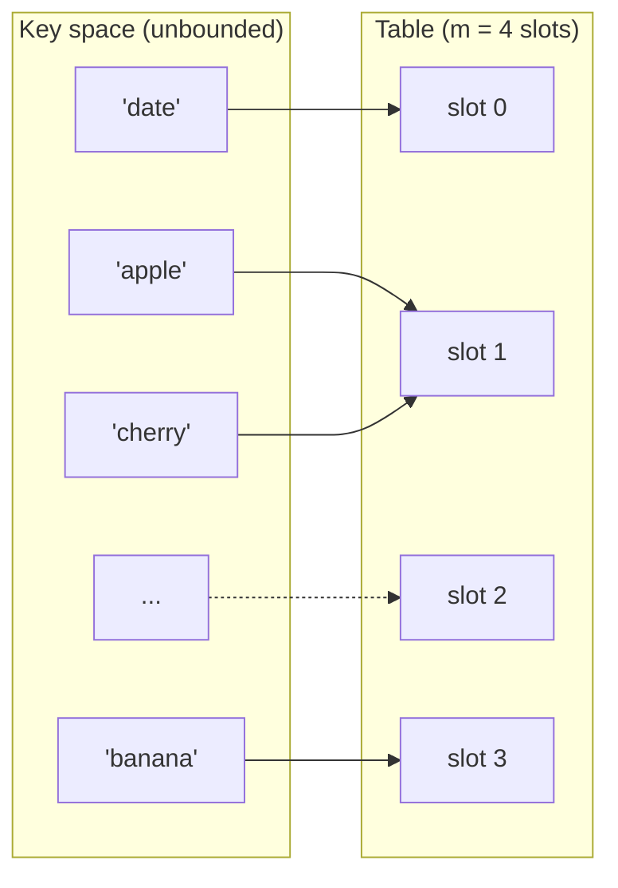

## Learning Objectives

- Explain how a hash function maps a key to an array index, and why this is the mechanism that lets a hash table aim for O(1) average-case lookup.
- Identify the three properties a "good" hash function needs — determinism, uniform distribution, and cheap computation — and explain why each one matters operationally.
- Connect the inevitability of collisions to the pigeonhole principle, and state precisely what that principle does and does not guarantee about a hash function's behavior.
- Implement a simple hash function from scratch in Python and evaluate its distribution over a sample of keys.
- Predict, given a description of a hash function's internals, whether it is likely to produce clustered or well-spread output.

## Context & Motivation

Every data structure covered so far in this course buys speed by committing to some rule about *where* data lives. A static array is fast to index because element i is always at a fixed offset from the start of the block. A binary search tree is fast to search because the ordering invariant tells you, at every node, which of exactly two directions to go. Hashing is the same move applied more aggressively: instead of deriving a location from a value's position in a sequence or its rank in an ordering, a hash table derives a location directly from the *key itself*, using an arithmetic function computed on the key's bits. If that function can be trusted to spread keys out roughly evenly across the available slots, then storing a key and finding it again both cost, on average, a small constant amount of work — no search, no traversal, no comparison against every other stored element. That promise, "give me the key and I'll tell you where it lives without looking anywhere else," is what makes hash tables the default choice for the "map a key to a value" and "have I seen this before" problems in nearly every real system: symbol tables in compilers, caches, database indexes, deduplication, and the `dict` or `HashMap` that sits underneath most high-level languages.

The word "aim for" in that promise is doing real work, though, and this concept exists to be precise about what it can and cannot guarantee. A hash function takes an enormous space of possible keys — every string, every integer, every object a program might construct — and squeezes each one down to a single index within a comparatively tiny array. Two different keys will, sooner or later, produce the same index. This isn't a defect in a particular hash function that a cleverer implementation could avoid; it is a structural certainty that follows from nothing more than counting, the same counting argument this course covers as the pigeonhole principle. Understanding hashing well means holding both halves of this picture at once: a well-designed hash function makes collisions *rare* and *evenly distributed*, which is what makes the O(1) average case real in practice, while accepting that collisions are *mathematically unavoidable* in general, which is what makes collision resolution (the next two concepts in this topic) a required part of any hash table, not an edge case to be designed away.

## Core Theory

### From key space to array index

A hash table is built from two pieces working together: an array of some fixed size `m` (the *table*, or the set of *buckets*), and a **hash function** `h` that takes a key and returns an integer in the range `[0, m - 1]`. Storing a key-value pair means computing `i = h(key)` and placing the pair at index `i`; looking a key up means computing the same `i` and checking what's there. The whole structure only works because `h` is a *function* in the mathematical sense — applying it to the same key always produces the same output, so the index computed when a key was inserted is guaranteed to be the same index consulted later when searching for it.

In practice, hashing a key is usually split into two stages: a **hash code** step that converts an arbitrary key (a string, a tuple, a custom object) into a single large integer, and a **compression** step that reduces that integer down to a valid array index, almost always via the modulo operator: `index = hash_code(key) % m`. Python's built-in `hash()` function performs the first stage for any hashable object; a hash table implementation is responsible for the second stage itself.

```python
def compress(hash_code: int, table_size: int) -> int:
    # Python's % always returns a non-negative result when table_size > 0,
    # even for a negative hash_code, so this is safe to use directly as an index.
    return hash_code % table_size
```

### What makes a hash function "good"

Three properties separate a hash function that makes a hash table fast from one that quietly makes it slow:

1. **Deterministic.** `h(key)` must return the same index every time it is called on an equal key, within a single run of the program. If it didn't, a key inserted at index 3 might be searched for at index 7 later, and the table would silently "lose" data it actually still has. (This is why Python explicitly randomizes string hashing *between separate process runs*, for security reasons, but never *within* a single run — determinism inside one execution is still guaranteed.)
2. **Uniform distribution.** Across the actual population of keys a program is likely to see, `h` should scatter output indices as evenly as possible over `[0, m - 1]`, so that no small subset of slots absorbs a disproportionate share of the keys. A hash function that happens to map most real-world keys to the same handful of indices defeats the purpose of hashing even though it is technically a valid function — the table degenerates toward the performance of a structure where everything piles into one place.
3. **Fast to compute.** The entire performance argument for hash tables rests on `h(key)` costing O(1) (or, for a variable-length key like a string, O(length of the key), which is treated as a small constant relative to the table's size). A hash function that takes as long to compute as a linear scan of the table would defeats its own purpose.

Note what is deliberately *not* on this list: there is no requirement that `h` be reversible, or that similar keys produce similar (or dissimilar) indices, or that `h` avoid collisions altogether. The next section explains why that last one isn't merely omitted but is actually impossible to guarantee.

### The inevitability of collisions

A **collision** occurs when two distinct keys `k1 != k2` hash to the same index: `h(k1) == h(k2)`. It is tempting to think a sufficiently clever hash function could be designed to avoid this. It cannot, in general, and the reason is exactly the pigeonhole principle covered in discrete-math-logic: if there are `n` possible keys that could ever be inserted and `m` array slots, and `n > m`, then by the pigeonhole principle at least two keys must map to the same slot — no matter what function is used to do the mapping. Any hash table over strings, for example, has effectively unbounded `n` (there are infinitely many possible strings) mapped into a finite `m` (the array has some fixed, finite size), so collisions are not just likely but *certain* once enough distinct keys have been inserted.

What the pigeonhole principle does *not* say is anything about which two keys will collide, or how often collisions will happen for a "typical" workload — it is a guarantee about existence, not about frequency or pattern. That gap is exactly where the quality of a hash function still matters enormously in practice: a well-designed hash function makes collisions between a program's *actual* keys rare and spread evenly across the table (so a lookup finds an empty slot on the first check "almost always"), while a poorly designed one can make collisions frequent and lopsided even with `n` well below `m`. The pigeonhole principle guarantees collisions are unavoidable in the worst case; a good hash function is an engineering effort to keep the average case far better than that worst case. This is also precisely why hash tables cannot skip collision resolution as a component — it is mathematically required, not merely a convenience for handling rare edge cases — which is the subject of the next two concepts in this topic.



Here `'apple'` and `'cherry'` both land on slot 1 — a collision — simply because there are more possible keys than slots, exactly as the pigeonhole principle predicts must eventually happen.

### Hashing mutable vs. immutable keys

A subtler consequence of the determinism requirement: a key's hash code must not change while it is stored in the table, because doing so would place it at a slot inconsistent with where a later lookup would compute for the same (now-changed) key. This is why languages that support hash-based structures generally either forbid hashing mutable objects, or place the burden on the programmer to never mutate a key after inserting it — a hash function computed from a list's *current* contents, for instance, becomes wrong the instant the list changes.

## Worked Examples

### Example 1 — building and testing a simple hash function

**Problem:** Implement a hash function for strings from scratch (not using Python's built-in `hash()`), reduce it to a table of size `m = 8`, and check how evenly it distributes a small sample of keys.

**Solution.** A classic simple approach treats a string as a sequence of character codes and combines them using a running multiply-and-add, sometimes called a polynomial hash:

```python
def simple_string_hash(key: str) -> int:
    h = 0
    for ch in key:
        h = h * 31 + ord(ch)   # 31 is a small prime; a common convention
    return h

def compress(hash_code: int, table_size: int) -> int:
    return hash_code % table_size

TABLE_SIZE = 8
keys = ["cat", "dog", "bird", "fish", "ant", "bee", "cow", "owl"]

for key in keys:
    code = simple_string_hash(key)
    index = compress(code, TABLE_SIZE)
    print(f"{key!r:8} -> hash_code={code:12} -> index={index}")
```

Running this (character codes via `ord`) produces a specific index for each key deterministically — the same string always reduces to the same index in this run. Tallying the indices across all 8 keys shows how many land in each of the 8 slots; with a reasonable string sample and a decently mixing hash like this one, the distribution tends to spread across most or all of the 8 slots rather than piling into one or two, though with only 8 sample keys against 8 slots, a collision or two remains plausible on any given sample — exactly the "likely to happen even under uniform distribution once the sample isn't huge" behavior expected from randomness, not a defect.

### Example 2 — a deliberately bad hash function

**Problem:** Show a hash function that is deterministic and cheap to compute, but *not* uniform, and demonstrate the practical consequence.

**Solution.** Suppose a table stores employee records keyed by ID, and the (bad) hash function only looks at the first digit of the ID:

```python
def bad_hash(employee_id: str) -> int:
    return int(employee_id[0])   # only the first digit!

TABLE_SIZE = 10
ids = ["100234", "101876", "102345", "103991", "104502"]

for eid in ids:
    print(f"{eid} -> {bad_hash(eid) % TABLE_SIZE}")
```

Every one of these IDs starts with `1`, so `bad_hash` maps all five of them to index 1, regardless of table size. This satisfies determinism (same ID always gives the same index) and is trivially fast to compute, but it is catastrophically non-uniform for this key population: five keys pile into a single slot while the other nine slots sit empty. A lookup among these five keys now costs the same as scanning a small unsorted list — the O(1) promise has silently degraded to O(n) for this workload, purely because the hash function ignored most of the information available in the key (the later digits, which do vary). This is the practical stakes behind the "uniform distribution" requirement: it is not an abstract nicety, it is what determines whether the table actually performs like a hash table or performs like a much worse structure in disguise.

### Example 3 — connecting to the pigeonhole principle with concrete numbers

**Problem:** A table has `m = 100` slots. A birthday-paradox-style question: after how many *randomly and uniformly* hashed keys are two guaranteed, by the pigeonhole principle alone, to collide? And separately, after how many keys is a collision *likely* (even though not guaranteed) under uniform hashing?

**Guaranteed collision (pigeonhole).** The pigeonhole principle guarantees a collision only once the number of keys exceeds the number of slots: inserting 101 keys into 100 slots guarantees at least one collision, with no assumption about the hash function's quality at all — this is the "certain" bound, and it only kicks in once `n > m`.

**Likely collision (a much smaller number).** This is a different question — not a guarantee, but a probability — and it is answered by the same reasoning as the birthday paradox: even with a perfectly uniform hash function and only `m = 100` slots, the probability that at least two of `n` randomly hashed keys collide exceeds 50% once `n` is around 12–13, and exceeds 95% by around `n = 40` — far fewer than the 101 keys the pigeonhole principle requires for a *guaranteed* collision. This is the gap flagged in Core Theory: pigeonhole gives a hard guarantee only past `n = m`, but real collisions show up, with high probability, at far smaller `n`, purely from the birthday-paradox-like statistics of hashing — which is exactly why every practical hash table implementation must include collision resolution and cannot simply assume "the table is nowhere near full, so no collisions will occur."

## Common Misconceptions & Pitfalls

- **"A good hash function should have zero collisions."** No hash function mapping an unbounded or larger key space into a finite table can guarantee zero collisions — the pigeonhole principle rules this out categorically once more keys than slots exist. The realistic goal is *rare and evenly spread* collisions, handled gracefully by a collision resolution strategy, not their complete elimination.
- **"If two keys are unequal, their hash codes must be unequal too."** This is backwards from the actual required guarantee. The correct invariant is the reverse: *equal* keys must produce *equal* hash codes (this is what determinism demands, and what makes lookup work at all). Unequal keys are allowed — expected, even — to occasionally share a hash code; that shared hash code is precisely a collision, and it is a normal, anticipated event, not a bug.
- **"A hash table with a low load factor can't have collisions."** Collisions can occur even when the table is nearly empty, purely by chance — as Example 3 shows, collisions become *likely* well before the table is anywhere near full. A low load factor makes collisions less frequent on average, not impossible; conflating "unlikely" with "impossible" leads to code that doesn't handle a collision path at all and breaks the first time one occurs.
- **"Using `hash(key) % table_size` in Python gives the same layout across different program runs."** Python deliberately randomizes the hash of strings (and a few other types) with a per-process random seed as a security measure (to prevent hash-flooding denial-of-service attacks against dictionaries), so the *same* string can compress to different indices in two separate runs of the same program, even though within a single run it remains perfectly deterministic. Code that persists raw hash codes across runs, or relies on their exact numeric value being stable, will break.

## Summary

Hashing maps a key directly to an array index using a hash function, aiming to make both storing and retrieving a key-value pair cost a small constant amount of work on average — a fundamentally different strategy from the position- or ordering-based approaches used by arrays and search trees. A good hash function is deterministic (same key always yields the same index), spreads keys uniformly across the table, and is cheap to compute; falling short on uniformity, as the "bad hash" example shows, silently degrades a hash table's real-world performance toward that of a much worse structure even though the O(1) average case remains true in a formal sense for well-distributed workloads. Collisions between distinct keys are not a design flaw to be engineered away but a mathematical certainty once the number of possible keys exceeds the number of table slots — exactly the pigeonhole principle from discrete math applied directly to hashing — and they become *likely*, by birthday-paradox statistics, at far smaller key counts than that hard guarantee requires. Because collisions cannot be avoided, every real hash table needs an explicit strategy for handling them, which is the subject of the next two concepts: separate chaining and open addressing.

## Documentation Links

- [Sedgewick & Wayne — Algorithms, Part I (Princeton, Coursera)](https://www.coursera.org/learn/algorithms-part1) — doc
- [MIT 6.006 — Lecture Notes (OCW)](https://ocw.mit.edu/courses/6-006-introduction-to-algorithms-spring-2020/pages/lecture-notes/) — doc
