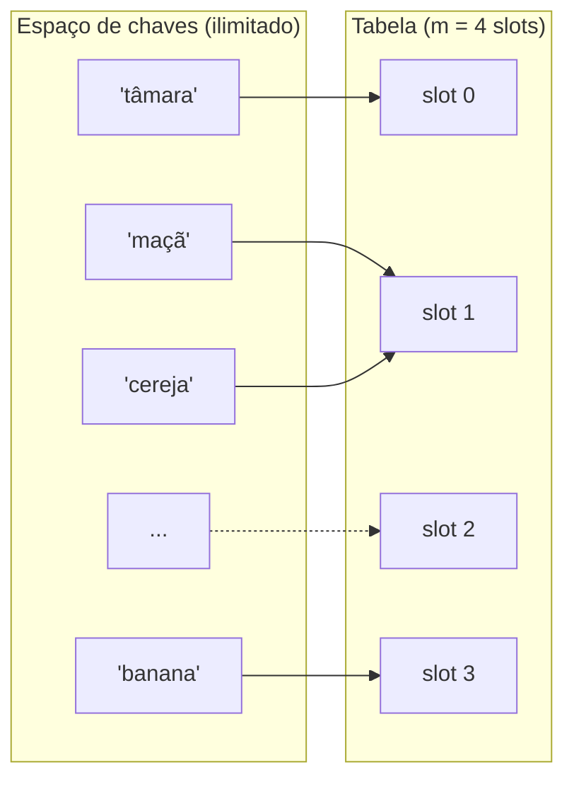

## Objetivos de Aprendizagem

- Explicar como uma função de hash mapeia uma chave para um índice de vetor, e por que esse é o mecanismo que permite que uma tabela hash busque O(1) de busca em caso médio.
- Identificar as três propriedades que uma função de hash "boa" precisa: determinismo, distribuição uniforme, e computação barata, e explicar por que cada uma importa operacionalmente.
- Conectar a inevitabilidade de colisões ao princípio da casa dos pombos, e declarar precisamente o que esse princípio garante e não garante sobre o comportamento de uma função de hash.
- Implementar uma função de hash simples do zero em Python e avaliar sua distribuição sobre uma amostra de chaves.
- Prever, dada uma descrição do funcionamento interno de uma função de hash, se ela provavelmente vai produzir saída agrupada ou bem espalhada.

## Contexto e Motivação

Toda estrutura de dados coberta até agora neste curso compra velocidade se comprometendo com alguma regra sobre *onde* os dados moram. Um vetor estático é rápido de indexar porque o elemento i está sempre num deslocamento fixo a partir do início do bloco. Uma árvore binária de busca é rápida de buscar porque o invariante de ordenação diz, em todo nó, exatamente qual das duas direções seguir. Hashing é o mesmo movimento aplicado mais agressivamente: em vez de derivar uma localização a partir da posição de um valor numa sequência ou de seu ranking numa ordenação, uma tabela hash deriva uma localização diretamente da *própria chave*, usando uma função aritmética computada sobre os bits da chave. Se essa função pode ser confiada a espalhar chaves aproximadamente igualmente pelos slots disponíveis, então armazenar uma chave e encontrá-la de novo custam, em média, uma pequena quantidade constante de trabalho, nenhuma busca, nenhuma travessia, nenhuma comparação contra todo outro elemento armazenado. Essa promessa, "me dê a chave e eu direi onde ela mora sem olhar em nenhum outro lugar", é o que torna tabelas hash a escolha padrão para os problemas "mapear uma chave para um valor" e "já vi isso antes" em quase todo sistema real: tabelas de símbolos em compiladores, caches, índices de banco de dados, deduplicação, e o `dict` ou `HashMap` que fica por baixo da maioria das linguagens de alto nível.

A palavra "buscar" nessa promessa está fazendo trabalho de verdade, porém, e este conceito existe para ser preciso sobre o que ela pode e não pode garantir. Uma função de hash pega um espaço enorme de chaves possíveis (toda string, todo inteiro, todo objeto que um programa poderia construir) e espreme cada uma num único índice dentro de um vetor comparativamente minúsculo. Duas chaves diferentes vão, cedo ou tarde, produzir o mesmo índice. Isso não é um defeito numa função de hash particular que uma implementação mais esperta poderia evitar; é uma certeza estrutural que decorre de nada mais que contagem, o mesmo argumento de contagem que este curso cobre como o princípio da casa dos pombos. Entender hashing bem significa segurar as duas metades desse quadro ao mesmo tempo: uma função de hash bem projetada torna colisões *raras* e *uniformemente distribuídas*, que é o que torna o caso médio O(1) real na prática, enquanto aceita que colisões são *matematicamente inevitáveis* em geral, que é o que torna resolução de colisão (os próximos dois conceitos neste tópico) uma parte exigida de qualquer tabela hash, não um caso extremo a ser projetado para fora.

## Teoria Central

### Do espaço de chaves ao índice de vetor

Uma tabela hash é construída a partir de duas peças trabalhando juntas: um vetor de algum tamanho fixo `m` (a *tabela*, ou o conjunto de *baldes*), e uma **função de hash** `h` que pega uma chave e retorna um inteiro na faixa `[0, m - 1]`. Armazenar um par chave-valor significa computar `i = h(chave)` e colocar o par no índice `i`; buscar uma chave significa computar o mesmo `i` e checar o que está lá. A estrutura inteira só funciona porque `h` é uma *função* no sentido matemático; aplicá-la à mesma chave sempre produz a mesma saída, então o índice computado quando uma chave foi inserida é garantido ser o mesmo índice consultado depois ao buscá-la.

Na prática, dar hash numa chave geralmente é dividido em dois estágios: um passo de **código de hash** que converte uma chave arbitrária (uma string, uma tupla, um objeto customizado) num único inteiro grande, e um passo de **compressão** que reduz esse inteiro a um índice de vetor válido, quase sempre via o operador módulo: `índice = código_de_hash(chave) % m`. A função embutida `hash()` do Python executa o primeiro estágio para qualquer objeto que suporta hash; uma implementação de tabela hash é responsável pelo segundo estágio ela mesma.

```python
def comprime(codigo_hash: int, tamanho_tabela: int) -> int:
    # O % do Python sempre retorna um resultado não negativo quando
    # tamanho_tabela > 0, mesmo para um codigo_hash negativo, então
    # é seguro usar diretamente como índice.
    return codigo_hash % tamanho_tabela
```

### O que torna uma função de hash "boa"

Três propriedades separam uma função de hash que torna uma tabela hash rápida de uma que silenciosamente a torna lenta:

1. **Determinística.** `h(chave)` precisa retornar o mesmo índice toda vez que é chamada numa chave igual, dentro de uma única execução do programa. Se não fosse, uma chave inserida no índice 3 poderia ser buscada no índice 7 mais tarde, e a tabela silenciosamente "perderia" dados que de fato ainda tem. (É por isso que o Python explicitamente aleatoriza o hashing de strings *entre execuções separadas de processo*, por razões de segurança, mas nunca *dentro* de uma única execução; determinismo dentro de uma execução ainda é garantido.)
2. **Distribuição uniforme.** Através da população real de chaves que um programa provavelmente vai ver, `h` deveria espalhar índices de saída o mais uniformemente possível sobre `[0, m - 1]`, para que nenhum pequeno subconjunto de slots absorva uma parcela desproporcional das chaves. Uma função de hash que acontece de mapear a maioria das chaves do mundo real para o mesmo punhado de índices derrota o propósito de hashing mesmo sendo tecnicamente uma função válida; a tabela degenera em direção ao desempenho de uma estrutura onde tudo se amontoa num único lugar.
3. **Rápida de computar.** O argumento de desempenho inteiro para tabelas hash se apoia em `h(chave)` custar O(1) (ou, para uma chave de comprimento variável como uma string, O(comprimento da chave), que é tratado como uma pequena constante em relação ao tamanho da tabela). Uma função de hash que leva tanto para computar quanto uma varredura linear da tabela derrotaria seu próprio propósito.

Note o que deliberadamente *não* está nessa lista: não há exigência de que `h` seja reversível, ou que chaves similares produzam índices similares (ou dissimilares), ou que `h` evite colisões completamente. A próxima seção explica por que essa última não é meramente omitida mas de fato impossível de garantir.

### A inevitabilidade de colisões

Uma **colisão** ocorre quando duas chaves distintas `k1 != k2` dão hash para o mesmo índice: `h(k1) == h(k2)`. É tentador pensar que uma função de hash suficientemente esperta poderia ser projetada para evitar isso. Ela não pode, em geral, e a razão é exatamente o princípio da casa dos pombos coberto em discrete-math-logic: se existem `n` chaves possíveis que poderiam algum dia ser inseridas e `m` slots de vetor, e `n > m`, então pelo princípio da casa dos pombos pelo menos duas chaves precisam mapear para o mesmo slot, não importa qual função seja usada para fazer o mapeamento. Qualquer tabela hash sobre strings, por exemplo, tem `n` efetivamente ilimitado (existem infinitas strings possíveis) mapeado num `m` finito (o vetor tem algum tamanho fixo e finito), então colisões não são só prováveis mas *certas* uma vez que chaves distintas suficientes tenham sido inseridas.

O que o princípio da casa dos pombos *não* diz é nada sobre quais duas chaves vão colidir, ou com que frequência colisões vão acontecer para uma carga de trabalho "típica"; é uma garantia sobre existência, não sobre frequência ou padrão. Essa lacuna é exatamente onde a qualidade de uma função de hash ainda importa enormemente na prática: uma função de hash bem projetada torna colisões entre as chaves *reais* de um programa raras e uniformemente espalhadas pela tabela (então uma busca encontra um slot vazio na primeira checagem "quase sempre"), enquanto uma mal projetada pode tornar colisões frequentes e desiguais mesmo com `n` bem abaixo de `m`. O princípio da casa dos pombos garante que colisões são inevitáveis no pior caso; uma boa função de hash é um esforço de engenharia para manter o caso médio muito melhor que esse pior caso. É também precisamente por isso que tabelas hash não podem pular resolução de colisão como um componente; é matematicamente exigida, não meramente uma conveniência para tratar casos extremos raros, que é o assunto dos próximos dois conceitos neste tópico.



Aqui `'maçã'` e `'cereja'` caem os dois no slot 1, uma colisão, simplesmente porque há mais chaves possíveis que slots, exatamente como o princípio da casa dos pombos prevê que precisa eventualmente acontecer.

### Dando hash em chaves mutáveis vs. imutáveis

Uma consequência mais sutil da exigência de determinismo: o código de hash de uma chave não pode mudar enquanto ela está armazenada na tabela, porque fazer isso a colocaria num slot inconsistente com onde uma busca posterior computaria para a mesma chave (agora mudada). É por isso que linguagens que suportam estruturas baseadas em hash geralmente ou proíbem dar hash em objetos mutáveis, ou colocam o fardo no programador de nunca mutar uma chave depois de inseri-la; uma função de hash computada a partir do conteúdo *atual* de uma lista, por exemplo, se torna errada no instante em que a lista muda.

## Exemplos Resolvidos

### Exemplo 1: construindo e testando uma função de hash simples

**Problema:** implemente uma função de hash para strings do zero (sem usar o `hash()` embutido do Python), reduza-a a uma tabela de tamanho `m = 8`, e cheque quão uniformemente ela distribui uma pequena amostra de chaves.

**Solução.** Uma abordagem simples clássica trata uma string como uma sequência de códigos de caractere e os combina usando um multiplica-e-soma corrente, às vezes chamado hash polinomial:

```python
def hash_string_simples(chave: str) -> int:
    h = 0
    for ch in chave:
        h = h * 31 + ord(ch)   # 31 é um primo pequeno; uma convenção comum
    return h

def comprime(codigo_hash: int, tamanho_tabela: int) -> int:
    return codigo_hash % tamanho_tabela

TAMANHO_TABELA = 8
chaves = ["gato", "cachorro", "passaro", "peixe", "formiga", "abelha", "vaca", "coruja"]

for chave in chaves:
    codigo = hash_string_simples(chave)
    indice = comprime(codigo, TAMANHO_TABELA)
    print(f"{chave!r:10} -> codigo_hash={codigo:12} -> indice={indice}")
```

Rodar isso (códigos de caractere via `ord`) produz um índice específico para cada chave deterministicamente; a mesma string sempre se reduz ao mesmo índice nesta execução. Contar os índices através das 8 chaves mostra quantas caem em cada um dos 8 slots; com uma amostra de strings razoável e um hash que mistura decentemente como este, a distribuição tende a se espalhar pela maioria ou todos os 8 slots em vez de se amontoar em um ou dois, embora com apenas 8 chaves de amostra contra 8 slots, uma colisão ou duas continua plausível em qualquer amostra dada, exatamente o comportamento de "provável de acontecer mesmo sob distribuição uniforme quando a amostra não é enorme" esperado de aleatoriedade, não um defeito.

### Exemplo 2: uma função de hash deliberadamente ruim

**Problema:** mostre uma função de hash que é determinística e barata de computar, mas *não* uniforme, e demonstre a consequência prática.

**Solução.** Suponha que uma tabela armazena registros de funcionários chaveados por ID, e a função de hash (ruim) só olha o primeiro dígito do ID:

```python
def hash_ruim(id_funcionario: str) -> int:
    return int(id_funcionario[0])   # só o primeiro dígito!

TAMANHO_TABELA = 10
ids = ["100234", "101876", "102345", "103991", "104502"]

for eid in ids:
    print(f"{eid} -> {hash_ruim(eid) % TAMANHO_TABELA}")
```

Todos esses IDs começam com `1`, então `hash_ruim` mapeia os cinco para o índice 1, independentemente do tamanho da tabela. Isso satisfaz determinismo (o mesmo ID sempre dá o mesmo índice) e é trivialmente rápido de computar, mas é catastroficamente não uniforme para essa população de chaves: cinco chaves se amontoam num único slot enquanto os outros nove slots ficam vazios. Uma busca entre essas cinco chaves agora custa o mesmo que varrer uma pequena lista não ordenada; a promessa O(1) silenciosamente se degradou para O(n) para essa carga de trabalho, puramente porque a função de hash ignorou a maior parte da informação disponível na chave (os dígitos posteriores, que de fato variam). Essa é a aposta prática por trás da exigência de "distribuição uniforme": não é um capricho abstrato, é o que determina se a tabela de fato se comporta como uma tabela hash ou se comporta como uma estrutura muito pior disfarçada.

### Exemplo 3: conectando ao princípio da casa dos pombos com números concretos

**Problema:** uma tabela tem `m = 100` slots. Uma pergunta no estilo paradoxo do aniversário: depois de quantas chaves com hash *aleatório e uniforme* duas são garantidas, só pelo princípio da casa dos pombos, a colidir? E separadamente, depois de quantas chaves uma colisão é *provável* (embora não garantida) sob hashing uniforme?

**Colisão garantida (casa dos pombos).** O princípio da casa dos pombos garante uma colisão só quando o número de chaves excede o número de slots: inserir 101 chaves em 100 slots garante pelo menos uma colisão, sem nenhuma suposição sobre a qualidade da função de hash de forma alguma; esse é o limite "certo", e só entra em ação quando `n > m`.

**Colisão provável (um número bem menor).** Essa é uma pergunta diferente, não uma garantia, mas uma probabilidade, e é respondida pelo mesmo raciocínio do paradoxo do aniversário: mesmo com uma função de hash perfeitamente uniforme e apenas `m = 100` slots, a probabilidade de que pelo menos duas de `n` chaves com hash aleatório colidam excede 50% quando `n` está por volta de 12 a 13, e excede 95% por volta de `n = 40`, muito menos que as 101 chaves que o princípio da casa dos pombos exige para uma colisão *garantida*. Essa é a lacuna sinalizada na Teoria Central: casa dos pombos dá uma garantia forte só depois de `n = m`, mas colisões reais aparecem, com alta probabilidade, em `n` muito menores, puramente pelas estatísticas ao estilo paradoxo do aniversário do hashing, que é exatamente por que toda implementação prática de tabela hash precisa incluir resolução de colisão e não pode simplesmente assumir "a tabela está longe de cheia, então não vão ocorrer colisões".

## Equívocos Comuns e Armadilhas

- **"Uma boa função de hash deveria ter zero colisões."** Nenhuma função de hash mapeando um espaço de chaves ilimitado ou maior numa tabela finita pode garantir zero colisões; o princípio da casa dos pombos descarta isso categoricamente assim que existem mais chaves que slots. O objetivo realista é colisões *raras e uniformemente espalhadas*, tratadas graciosamente por uma estratégia de resolução de colisão, não sua eliminação completa.
- **"Se duas chaves são diferentes, seus códigos de hash também precisam ser diferentes."** Isso está invertido em relação à garantia realmente exigida. O invariante correto é o reverso: chaves *iguais* precisam produzir códigos de hash *iguais* (isso é o que determinismo exige, e o que faz a busca funcionar de forma alguma). Chaves diferentes têm permissão, são até esperadas, de ocasionalmente compartilhar um código de hash; esse código de hash compartilhado é precisamente uma colisão, e é um evento normal e antecipado, não um bug.
- **"Uma tabela hash com um fator de carga baixo não pode ter colisões."** Colisões podem ocorrer mesmo quando a tabela está quase vazia, puramente por acaso; como o Exemplo 3 mostra, colisões se tornam *prováveis* bem antes de a tabela estar perto de cheia. Um fator de carga baixo torna colisões menos frequentes em média, não impossíveis; confundir "improvável" com "impossível" leva a código que não trata um caminho de colisão de forma alguma e quebra na primeira vez que uma ocorre.
- **"Usar `hash(chave) % tamanho_tabela` em Python dá o mesmo layout através de execuções diferentes do programa."** O Python deliberadamente aleatoriza o hash de strings (e alguns outros tipos) com uma semente aleatória por processo como medida de segurança (para prevenir ataques de negação de serviço por inundação de hash contra dicionários), então a *mesma* string pode comprimir para índices diferentes em duas execuções separadas do mesmo programa, mesmo que dentro de uma única execução permaneça perfeitamente determinística. Código que persiste códigos de hash crus através de execuções, ou depende de seu valor numérico exato ser estável, vai quebrar.

## Resumo

Hashing mapeia uma chave diretamente para um índice de vetor usando uma função de hash, buscando fazer com que tanto armazenar quanto recuperar um par chave-valor custem uma pequena quantidade constante de trabalho em média, uma estratégia fundamentalmente diferente das abordagens baseadas em posição ou ordenação usadas por vetores e árvores de busca. Uma boa função de hash é determinística (a mesma chave sempre produz o mesmo índice), espalha chaves uniformemente pela tabela, e é barata de computar; ficar aquém em uniformidade, como o exemplo do "hash ruim" mostra, silenciosamente degrada o desempenho de mundo real de uma tabela hash em direção ao de uma estrutura muito pior mesmo que o caso médio O(1) permaneça verdadeiro num sentido formal para cargas de trabalho bem distribuídas. Colisões entre chaves distintas não são uma falha de projeto a ser eliminada por engenharia mas uma certeza matemática assim que o número de chaves possíveis excede o número de slots da tabela, exatamente o princípio da casa dos pombos da matemática discreta aplicado diretamente a hashing, e se tornam *prováveis*, pelas estatísticas do paradoxo do aniversário, em contagens de chaves muito menores que aquela garantia forte exige. Como colisões não podem ser evitadas, toda tabela hash real precisa de uma estratégia explícita para tratá-las, que é o assunto dos próximos dois conceitos: encadeamento separado e endereçamento aberto.

## Documentation Links

- [Sedgewick & Wayne — Algorithms, Part I (Princeton, Coursera)](https://www.coursera.org/learn/algorithms-part1) — doc
- [MIT 6.006 — Lecture Notes (OCW)](https://ocw.mit.edu/courses/6-006-introduction-to-algorithms-spring-2020/pages/lecture-notes/) — doc
