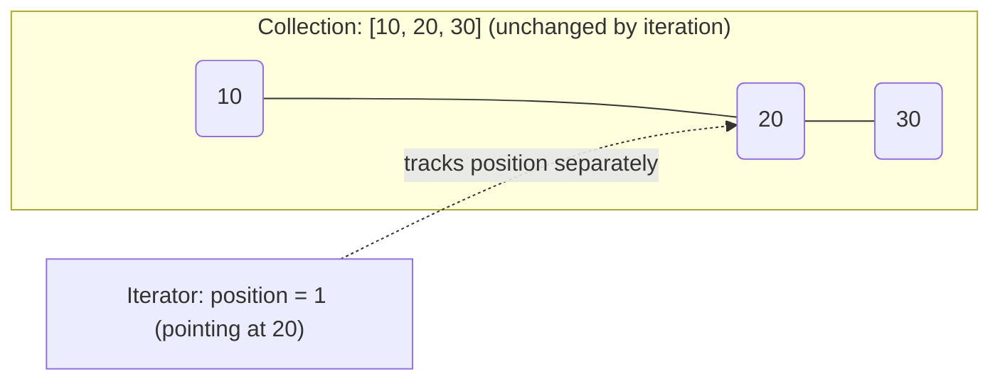
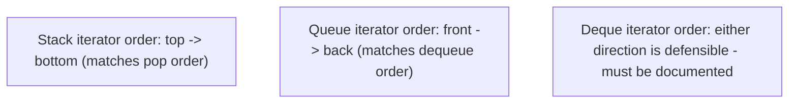

## Learning Objectives

- Explain what it means to traverse a collection "uniformly" and why exposing a single, consistent traversal interface matters even when different collections store data completely differently underneath.
- Distinguish an iterator's state (position, remaining elements) from the collection it traverses, and explain why an iterator, not the collection itself, is what advances.
- Implement an iterator from scratch for an array-backed structure and for a linked-node-backed structure, exposing the same `has_next()` / `next()` interface for both.
- Analyze the risk of mutating a collection while an active iterator traverses it, and predict when this produces incorrect results or an error.
- Compare iterating a stack, a queue, and a deque, and justify why each one's "natural" iteration order follows directly from its ADT contract rather than being an arbitrary choice.

## Context & Motivation

Every structure covered so far in this discipline — a dynamic array, a singly or doubly linked list, a stack, a queue, a deque — stores its elements differently underneath, but there is a recurring need that cuts across all of them: at some point, code needs to look at *every* element, one at a time, in some order, without caring how that structure happens to be laid out in memory. Printing the contents of a stack for debugging, summing every element of a queue, checking whether a deque contains a particular value — none of these tasks care whether the structure is array-backed with contiguous memory or linked-node-backed with pointers scattered across the heap. If every one of these tasks had to be written differently depending on the backing (`for i in range(size): print(array[i])` for an array-backed stack, versus `node = head; while node: print(node.value); node = node.next` for a linked-node-backed one), then every piece of code that ever wants to "look at everything" would need to know — and keep tracking — exactly how each collection it touches is implemented. Changing a stack's backing from array to linked list later would then require rewriting every loop that ever iterated over it.

The **iterator** is the abstraction that solves this by giving traversal itself the same treatment the ADTs in this discipline gave storage: define a uniform interface — "is there a next element?" and "give me the next element" — and let each collection implement that interface however its own internal structure demands, hidden behind the interface. A caller who only ever calls `has_next()` and `next()` cannot tell, and does not need to care, whether the values are coming out of contiguous array slots or by following `next` pointers through scattered nodes. This connects directly back to the stack, queue, and deque covered earlier in this discipline: each of those ADTs deliberately restricted its *mutating* interface (push/pop, enqueue/dequeue) to protect its ordering guarantee, but a caller who wants to merely *inspect* every element — without popping the whole stack just to look at it — needs a separate, non-destructive traversal mechanism. An iterator is exactly that: a way to walk through a stack's, queue's, or deque's contents without disturbing the structure at all, and without the caller ever learning whether it's array- or list-backed underneath.

## Core Theory

### The interface: what an iterator promises, and nothing more

An iterator, as a minimal contract, exposes:

- `has_next()` — report whether at least one more element remains to be visited.
- `next()` — return the next element in the traversal order, and advance the iterator's internal position so the *following* call to `next()` returns the element after that.

Crucially, the iterator holds its own **position** state, entirely separate from the collection itself. The collection does not know or care whether zero, one, or several iterators are currently traversing it (barring the mutation hazard discussed below) — each iterator independently tracks "where am I" without altering the underlying data.



Two independent iterators created on the same collection can be at two entirely different positions simultaneously — one might have already visited all three elements while another has visited none — because each iterator's position is its own private state, not shared with the collection or with each other.

### Array-backed iteration

For an array-backed structure, "position" is naturally just an integer index. The iterator needs a reference to the underlying array (or the structure that owns it) and its current index; `has_next()` compares the index against the count of valid elements, and `next()` reads the current slot and increments.

```python
class ArrayIterator:
    def __init__(self, data, size):
        self._data = data
        self._size = size
        self._pos = 0

    def has_next(self):
        return self._pos < self._size

    def next(self):
        if not self.has_next():
            raise StopIteration("no more elements")
        x = self._data[self._pos]
        self._pos += 1
        return x
```

Attaching this to the `ArrayStack` from `the-stack-adt` requires deciding an iteration *order* — most naturally, top-to-bottom (matching the order `pop()` would remove elements), which means the iterator should start at `size - 1` and walk downward rather than starting at index 0 and walking up:

```python
class ArrayStack:
    # ... push/pop/peek/is_empty as before ...
    def __iter__(self):
        pos = self._size - 1
        while pos >= 0:
            yield self._data[pos]
            pos -= 1
```

(Python's `yield` here produces exactly the `has_next()`/`next()` behavior automatically — each `yield` is one `next()` call, and the generator's exhaustion is `has_next()` becoming false — but the underlying idea, a position that advances independently of the collection, is identical to the explicit class above.)

### Linked-node-backed iteration

For a linked-node-backed structure, "position" is naturally a reference to the current node, not an integer — there is no meaningful index to compute, only "which node am I at." `has_next()` checks whether the current node reference is non-null; `next()` reads the current node's value and reassigns the position to `current.next`.

```python
class LinkedIterator:
    def __init__(self, head):
        self._current = head

    def has_next(self):
        return self._current is not None

    def next(self):
        if not self.has_next():
            raise StopIteration("no more elements")
        x = self._current.value
        self._current = self._current.next
        return x
```

Attaching this to `LinkedStack` from `the-stack-adt` needs no special-casing for order — the head *is* the top, so a straightforward head-to-tail walk already matches top-to-bottom, the same order the array-backed version had to simulate by walking backward through indices:

```python
class LinkedStack:
    # ... push/pop/peek/is_empty as before ...
    def __iter__(self):
        node = self._head
        while node is not None:
            yield node.value
            node = node.next
```

The key point that both examples make together: the *caller-facing* interface (`has_next()`/`next()`, or Python's `for x in stack`) is identical for both backings, even though what "position" *means* internally — an integer index versus a node reference — is completely different. This is exactly the same separation of contract from implementation that the Stack, Queue, and Deque ADTs established for their own mutating operations, now applied to traversal.

### Iteration order follows from the ADT's contract, not from convenience

A stack's iterator conventionally visits elements top-to-bottom (matching pop order) because that is the order meaningful to a stack's own semantics; a queue's iterator conventionally visits front-to-back (matching dequeue order) for the same reason. A deque's iterator can reasonably go either front-to-back or back-to-front, since the deque itself makes no single-direction promise — the "natural" order is genuinely ambiguous in a way it is not for a stack or queue, and a deque implementation should document explicitly which direction its default iteration uses.



### The mutation hazard

Because an iterator's position is separate state, referencing indices or node pointers that describe the collection *as it was* when the iterator last checked, a structural mutation to the collection during iteration can leave the iterator's position pointing somewhere that no longer means what it used to. For an array-backed collection, removing an element shifts every later index down by one, so an iterator's saved index now refers to the *wrong* element (typically causing a skipped or duplicated visit, not a crash). For a linked-node-backed collection, removing the very node an iterator currently points at can leave that iterator holding a reference to a node that has been detached from the list entirely (its `next` pointer no longer leads anywhere useful) — in an unmanaged setting this often does not crash immediately, which makes it more dangerous, not less: the bug surfaces later, far from its cause, as data that is silently wrong rather than an error that is easy to trace.

## Worked Examples

### Example 1 — iterating an ArrayStack and a LinkedStack, same output

**Problem:** Push `1, 2, 3` (in that order) onto both an `ArrayStack` and a `LinkedStack`, then iterate each and record the sequence of values produced. Confirm both produce the same order despite the different `__iter__` mechanics above.

**ArrayStack trace.** After the three pushes, `self._data = [1, 2, 3, ...]`, `self._size = 3`. The array `__iter__` starts at `pos = size - 1 = 2` and walks downward: visits `self._data[2] = 3`, then `self._data[1] = 2`, then `self._data[0] = 1`. Output: `3, 2, 1`.

**LinkedStack trace.** After the three pushes (each push makes the new value the head), the chain is `head -> 3 -> 2 -> 1 -> None`. The linked `__iter__` starts at `node = head` and walks forward: visits `3`, then `2`, then `1`. Output: `3, 2, 1`.

**Reasoning.** Both produce the identical sequence `3, 2, 1` — top-to-bottom, matching what repeated `pop()` calls would have returned — even though one iterator counts an index downward through contiguous memory and the other follows `next` pointers forward through scattered nodes. This is the concrete demonstration that the *caller-visible behavior* (the traversal order guaranteed by the Stack ADT's own semantics) is independent of *how* each backing achieves it internally.

### Example 2 — iterating a Queue and observing FIFO order preserved

**Problem:** Enqueue `A, B, C` onto a `CircularArrayQueue` (from `the-queue-adt`), then iterate it and confirm the order visited matches the order `dequeue()` would produce, without actually calling `dequeue()` at all.

```python
class CircularArrayQueue:
    # ... enqueue/dequeue/peek/is_empty as before ...
    def __iter__(self):
        for i in range(self._size):
            yield self._data[(self._head + i) % len(self._data)]
```

**Trace.** After the three enqueues, suppose `self._head = 0` and `self._data[0:3] = [A, B, C]`. The iterator visits `i = 0`: `(0+0) % capacity = 0` → `A`; `i = 1`: index 1 → `B`; `i = 2`: index 2 → `C`. Output: `A, B, C` — the same order three successive `dequeue()` calls would return, but the queue itself is left completely untouched (`self._size` is still 3, `self._head` is still 0) because the iterator only *read* through `self._data`, never modified `self._head` or `self._size`.

**Reasoning.** This is exactly the motivating case from Context & Motivation: inspecting a queue's full contents (e.g., for a debug print, or to check "does this queue contain X") without destroying it by repeatedly dequeuing and having to re-enqueue everything afterward. The iterator's `(head + i) % capacity` arithmetic correctly accounts for wraparound in the circular buffer — the same modulo logic the queue's own `enqueue`/`dequeue` used — so the iterator remains correct even when the queue's logical front is not at physical index 0.

### Example 3 — the mutation hazard, demonstrated concretely

**Problem:** Show a concrete case where mutating an `ArrayStack` while iterating it produces a wrong result, using Python-style manual iteration rather than the safe `for` loop.

```python
stack = ArrayStack()
for v in [1, 2, 3, 4]:
    stack.push(v)
# stack contents (bottom to top): [1, 2, 3, 4]; iteration order (top to bottom) would be 4,3,2,1

it = stack.__iter__()          # a generator, position starts effectively at pos = 3
first = next(it)                # visits index 3 -> 4; generator's internal pos becomes 2 next
stack.pop()                     # size becomes 3; removes the 4 that was already visited... but also shifts what "top" means
second = next(it)                # generator resumes at its saved pos = 2, reading self._data[2]
```

**What goes wrong.** Before the `pop()`, `self._data = [1, 2, 3, 4]` and the generator's suspended position was about to read index `2` (value `3`) next. The `pop()` call decrements `self._size` to 3 and clears `self._data[3]` — it does not shift any elements (recall from `the-stack-adt` that array-stack pop never shifts), so `self._data[2]` is still `3`. In this particular case the generator's next read (`second = 3`) happens to still be correct, purely because array-stack `pop()` never disturbs indices below the removed one. But if the same experiment is repeated on a queue's array (where `dequeue()` can shift which index is logically "the front" in some naive implementations) or on a linked structure where popping detaches the very node an iterator was about to read `.next` from, the saved position can point at data that has been cleared, reused, or detached — producing a skipped element, a duplicated element, or a reference to a node no longer reachable from the collection at all.

**Lesson.** Whether mutation-during-iteration happens to "work" depends delicately on exactly how the specific backing's mutation operation is implemented — which is precisely the kind of implementation detail the iterator abstraction was supposed to let callers ignore. The safe rule, independent of backing, is: never mutate a collection while an iterator over it is still in use, unless the iterator is explicitly documented to support that (some real-world iterators do, by design, support safe removal — but only the operations they explicitly document, never arbitrary mutation).

## Common Misconceptions & Pitfalls

- **"An iterator is just a fancy name for a loop counter."** A loop counter (`for i in range(n)`) only works when the collection supports direct indexing — it does not work at all for a linked-node-backed structure with no meaningful index. An iterator generalizes the *concept* a loop counter provides (a way to say "give me the next thing") to any backing, including ones with no indices at all, which is exactly why `LinkedIterator` above tracks a node reference instead of an integer.
- **"Iterating a stack or queue must consume it, the same way pop() or dequeue() does."** A correctly designed iterator is non-destructive — Example 2 demonstrated a queue left with identical `size` and `head` after full iteration. Confusing "traverse and observe" with "traverse and remove" leads to code that empties a structure it only meant to inspect, then finds it unexpectedly empty afterward.
- **"Since the caller-facing interface is uniform, the iteration order must also be identical across backings."** The interface (`has_next()`/`next()`) being uniform says nothing about what order is *chosen* — Example 1 showed both stack backings had to deliberately choose top-to-bottom order (the array version by counting index downward, the linked version by following `next` forward from the head, which happens to already be top-to-bottom for that structure) to match the Stack ADT's own semantics. A careless array-backed iterator that just walked index 0 upward would produce bottom-to-top order — technically uniform in interface, but wrong relative to what a stack's iteration is expected to mean.
- **"Two iterators on the same collection interfere with each other."** As established in Core Theory, each iterator's position is its own private state; creating a second iterator on a collection an existing iterator is mid-traversal on does not disturb the first iterator's progress, provided neither iterator (nor anything else) mutates the collection meanwhile. The danger is mutation, not the mere existence of multiple iterators.
- **"Mutating a collection during iteration always crashes immediately, so it's easy to catch in testing."** Example 3 showed a case where mutation-during-iteration silently produced a *correct-looking* result purely by accident of how that particular backing's `pop()` happened to be implemented — and a different backing or a different mutating operation could just as easily produce a silently *wrong* result rather than a crash. The absence of an immediate crash in testing is not evidence that mutate-while-iterating is safe; it is evidence that this particular test case didn't happen to expose the hazard.

## Summary

An iterator generalizes traversal the same way the Stack, Queue, and Deque ADTs generalized their own mutating operations: define a uniform interface — `has_next()` and `next()` — and let each collection's own backing (contiguous array indices, or linked node references) implement it however its internal structure demands, entirely hidden from the caller. An iterator's position is its own private state, independent of the collection and of any other iterator traversing the same collection, which is what allows non-destructive inspection of a stack's, queue's, or deque's contents without disturbing push/pop or enqueue/dequeue semantics at all. The iteration order a well-designed iterator uses is not arbitrary — it follows from the ADT's own contract (top-to-bottom for a stack, front-to-back for a queue, either direction, explicitly documented, for a deque). The one real hazard is mutating a collection while an iterator over it is active, which can silently invalidate the iterator's saved position — the failure mode ranges from a skipped or duplicated element to a stale reference, and whether it happens to look correct in a given test case depends delicately on implementation details the iterator abstraction exists specifically to hide.

## Documentation Links

- [Sedgewick & Wayne — Stacks and Queues (Princeton lecture slides)](https://algs4.cs.princeton.edu/lectures/keynote/13StacksAndQueues.pdf) — doc
- [Sedgewick & Wayne — Algorithms, Part I (Princeton, Coursera)](https://www.coursera.org/learn/algorithms-part1) — doc
