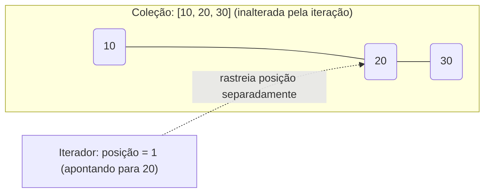
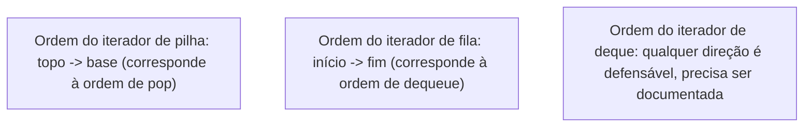

## Objetivos de Aprendizagem

- Explicar o que significa percorrer uma coleção "uniformemente" e por que expor uma única interface de percurso consistente importa mesmo quando coleções diferentes armazenam dados de formas completamente diferentes por baixo.
- Distinguir o estado de um iterador (posição, elementos restantes) da coleção que ele percorre, e explicar por que o iterador, não a coleção em si, é o que avança.
- Implementar um iterador do zero para uma estrutura apoiada em vetor e para uma apoiada em nós encadeados, expondo a mesma interface `has_next()` / `next()` para as duas.
- Analisar o risco de mutar uma coleção enquanto um iterador ativo a percorre, e prever quando isso produz resultados incorretos ou um erro.
- Comparar iterar uma pilha, uma fila e um deque, e justificar por que a ordem de iteração "natural" de cada uma decorre diretamente de seu contrato de TAD em vez de ser uma escolha arbitrária.

## Contexto e Motivação

Toda estrutura coberta até agora nesta disciplina (um vetor dinâmico, uma lista encadeada simples ou dupla, uma pilha, uma fila, um deque) armazena seus elementos de forma diferente por baixo, mas há uma necessidade recorrente que atravessa todas elas: em algum momento, o código precisa olhar para *todo* elemento, um de cada vez, em alguma ordem, sem se importar com como aquela estrutura acontece de estar disposta na memória. Imprimir o conteúdo de uma pilha para depuração, somar todo elemento de uma fila, checar se um deque contém um valor particular; nenhuma dessas tarefas se importa se a estrutura é apoiada em vetor com memória contígua ou apoiada em nós encadeados com ponteiros espalhados pelo heap. Se cada uma dessas tarefas tivesse que ser escrita diferente dependendo do apoio (`for i in range(size): print(array[i])` para uma pilha apoiada em vetor, versus `node = head; while node: print(node.value); node = node.next` para uma apoiada em nós encadeados), então todo trecho de código que já quisesse "olhar para tudo" precisaria saber, e continuar rastreando, exatamente como cada coleção que toca é implementada. Mudar o apoio de uma pilha de vetor para lista encadeada depois exigiria então reescrever todo laço que já a percorreu.

O **iterador** é a abstração que resolve isso dando ao próprio percurso o mesmo tratamento que os TADs desta disciplina deram ao armazenamento: defina uma interface uniforme ("há um próximo elemento?" e "me dê o próximo elemento") e deixe cada coleção implementar essa interface como sua própria estrutura interna exigir, escondida atrás da interface. Quem chama e só chama `has_next()` e `next()` não consegue dizer, e não precisa se importar, se os valores estão saindo de slots de vetor contíguos ou seguindo ponteiros `next` através de nós espalhados. Isso se conecta diretamente de volta à pilha, fila e deque cobertos anteriormente nesta disciplina: cada um desses TADs deliberadamente restringiu sua interface *mutante* (push/pop, enqueue/dequeue) para proteger sua garantia de ordenação, mas quem chama e só quer *inspecionar* todo elemento, sem desempilhar a pilha inteira só para olhar, precisa de um mecanismo de percurso separado e não destrutivo. Um iterador é exatamente isso: uma forma de andar pelo conteúdo de uma pilha, fila ou deque sem perturbar a estrutura de forma alguma, e sem quem chama jamais descobrir se é apoiada em vetor ou em lista por baixo.

## Teoria Central

### A interface: o que um iterador promete, e nada mais

Um iterador, como contrato mínimo, expõe:

- `has_next()` — informa se pelo menos mais um elemento resta a visitar.
- `next()` — retorna o próximo elemento na ordem de percurso, e avança a posição interna do iterador de forma que a chamada *seguinte* a `next()` retorne o elemento depois desse.

Crucialmente, o iterador guarda seu próprio estado de **posição**, inteiramente separado da própria coleção. A coleção não sabe nem se importa se zero, um, ou vários iteradores estão atualmente a percorrendo (exceto pelo risco de mutação discutido abaixo); cada iterador rastreia independentemente "onde estou" sem alterar os dados subjacentes.



Dois iteradores independentes criados na mesma coleção podem estar em duas posições inteiramente diferentes simultaneamente; um pode já ter visitado os três elementos enquanto outro não visitou nenhum, porque a posição de cada iterador é seu próprio estado privado, não compartilhado com a coleção nem entre si.

### Iteração apoiada em vetor

Para uma estrutura apoiada em vetor, "posição" é naturalmente só um índice inteiro. O iterador precisa de uma referência ao vetor subjacente (ou à estrutura que o possui) e seu índice atual; `has_next()` compara o índice contra a contagem de elementos válidos, e `next()` lê o slot atual e incrementa.

```python
class ArrayIterator:
    def __init__(self, data, size):
        self._data = data
        self._size = size
        self._pos = 0

    def has_next(self):
        return self._pos < self._size

    def next(self):
        if not self.has_next():
            raise StopIteration("nenhum elemento restante")
        x = self._data[self._pos]
        self._pos += 1
        return x
```

Anexar isso ao `ArrayStack` de `o-tad-pilha` exige decidir uma *ordem* de iteração; mais naturalmente, do topo para a base (correspondendo à ordem em que `pop()` removeria elementos), o que significa que o iterador deveria começar em `size - 1` e andar para baixo em vez de começar no índice 0 e andar para cima:

```python
class ArrayStack:
    # ... push/pop/peek/is_empty como antes ...
    def __iter__(self):
        pos = self._size - 1
        while pos >= 0:
            yield self._data[pos]
            pos -= 1
```

(O `yield` do Python aqui produz exatamente o comportamento `has_next()`/`next()` automaticamente; cada `yield` é uma chamada de `next()`, e o esgotamento do gerador é `has_next()` se tornando falso, mas a ideia subjacente, uma posição que avança independentemente da coleção, é idêntica à classe explícita acima.)

### Iteração apoiada em nós encadeados

Para uma estrutura apoiada em nós encadeados, "posição" é naturalmente uma referência ao nó atual, não um inteiro; não há índice significativo a computar, só "em qual nó estou". `has_next()` checa se a referência de nó atual é não nula; `next()` lê o valor do nó atual e reatribui a posição para `current.next`.

```python
class LinkedIterator:
    def __init__(self, head):
        self._current = head

    def has_next(self):
        return self._current is not None

    def next(self):
        if not self.has_next():
            raise StopIteration("nenhum elemento restante")
        x = self._current.value
        self._current = self._current.next
        return x
```

Anexar isso ao `LinkedStack` de `o-tad-pilha` não precisa de tratamento especial para ordem; o início *é* o topo, então uma caminhada direta do início até a cauda já corresponde a topo-para-base, a mesma ordem que a versão apoiada em vetor precisou simular andando para trás pelos índices:

```python
class LinkedStack:
    # ... push/pop/peek/is_empty como antes ...
    def __iter__(self):
        node = self._head
        while node is not None:
            yield node.value
            node = node.next
```

O ponto chave que os dois exemplos fazem juntos: a interface *voltada para quem chama* (`has_next()`/`next()`, ou o `for x in stack` do Python) é idêntica para os dois apoios, mesmo que o que "posição" *significa* internamente (um índice inteiro versus uma referência de nó) seja completamente diferente. Essa é exatamente a mesma separação de contrato e implementação que os TADs Pilha, Fila e Deque estabeleceram para suas próprias operações mutantes, agora aplicada ao percurso.

### A ordem de iteração decorre do contrato do TAD, não da conveniência

O iterador de uma pilha convencionalmente visita elementos do topo para a base (correspondendo à ordem de pop) porque essa é a ordem significativa para a própria semântica de uma pilha; o iterador de uma fila convencionalmente visita do início para o fim (correspondendo à ordem de dequeue) pela mesma razão. O iterador de um deque pode razoavelmente ir tanto do início para o fim quanto do fim para o início, já que o próprio deque não faz promessa de direção única; a ordem "natural" é genuinamente ambígua de um jeito que não é para uma pilha ou fila, e uma implementação de deque deveria documentar explicitamente qual direção sua iteração padrão usa.



### O perigo da mutação

Como a posição de um iterador é estado separado, referenciando índices ou ponteiros de nó que descrevem a coleção *como ela estava* na última checagem do iterador, uma mutação estrutural na coleção durante a iteração pode deixar a posição do iterador apontando para algo que não significa mais o que costumava significar. Para uma coleção apoiada em vetor, remover um elemento desloca todo índice posterior uma posição para baixo, então o índice salvo de um iterador agora se refere ao elemento *errado* (tipicamente causando uma visita pulada ou duplicada, não uma quebra). Para uma coleção apoiada em nós encadeados, remover exatamente o nó para o qual um iterador atualmente aponta pode deixar aquele iterador segurando uma referência a um nó que foi inteiramente desconectado da lista (seu ponteiro `next` não leva mais a lugar algum útil); num ambiente não gerenciado isso frequentemente não quebra imediatamente, o que o torna mais perigoso, não menos: o bug aparece depois, longe de sua causa, como dados silenciosamente errados em vez de um erro fácil de rastrear.

## Exemplos Resolvidos

### Exemplo 1: iterando um ArrayStack e um LinkedStack, mesma saída

**Problema:** empilhe `1, 2, 3` (nessa ordem) tanto num `ArrayStack` quanto num `LinkedStack`, depois itere cada um e registre a sequência de valores produzida. Confirme que os dois produzem a mesma ordem apesar da mecânica diferente de `__iter__` acima.

**Traço do ArrayStack.** Depois das três inserções, `self._data = [1, 2, 3, ...]`, `self._size = 3`. O `__iter__` do vetor começa em `pos = size - 1 = 2` e anda para baixo: visita `self._data[2] = 3`, depois `self._data[1] = 2`, depois `self._data[0] = 1`. Saída: `3, 2, 1`.

**Traço do LinkedStack.** Depois das três inserções (cada push torna o novo valor o início), a cadeia é `head -> 3 -> 2 -> 1 -> None`. O `__iter__` encadeado começa em `node = head` e anda para frente: visita `3`, depois `2`, depois `1`. Saída: `3, 2, 1`.

**Raciocínio.** Os dois produzem a sequência idêntica `3, 2, 1` (topo para base, correspondendo ao que chamadas repetidas de `pop()` teriam retornado), mesmo que um iterador conte um índice para baixo através de memória contígua e o outro siga ponteiros `next` para frente através de nós espalhados. Esta é a demonstração concreta de que o *comportamento visível a quem chama* (a ordem de percurso garantida pela própria semântica do TAD Pilha) é independente de *como* cada apoio a alcança internamente.

### Exemplo 2: iterando uma Fila e observando a ordem FIFO preservada

**Problema:** enfileire `A, B, C` num `CircularArrayQueue` (de `o-tad-fila`), depois o itere e confirme que a ordem visitada corresponde à ordem que `dequeue()` produziria, sem de fato chamar `dequeue()` em nenhum momento.

```python
class CircularArrayQueue:
    # ... enqueue/dequeue/peek/is_empty como antes ...
    def __iter__(self):
        for i in range(self._size):
            yield self._data[(self._head + i) % len(self._data)]
```

**Traço.** Depois das três inserções, suponha `self._head = 0` e `self._data[0:3] = [A, B, C]`. O iterador visita `i = 0`: `(0+0) % capacidade = 0` → `A`; `i = 1`: índice 1 → `B`; `i = 2`: índice 2 → `C`. Saída: `A, B, C`, a mesma ordem que três chamadas sucessivas de `dequeue()` retornariam, mas a própria fila fica completamente intocada (`self._size` continua 3, `self._head` continua 0) porque o iterador só *leu* através de `self._data`, nunca modificou `self._head` ou `self._size`.

**Raciocínio.** Este é exatamente o caso motivador do Contexto e Motivação: inspecionar o conteúdo completo de uma fila (por exemplo, para uma impressão de depuração, ou para checar "esta fila contém X") sem destruí-la desenfileirando repetidamente e tendo que reenfileirar tudo depois. A aritmética `(head + i) % capacidade` do iterador contabiliza corretamente a volta no buffer circular (a mesma lógica de módulo que o próprio `enqueue`/`dequeue` da fila usava), então o iterador permanece correto mesmo quando o início lógico da fila não está no índice físico 0.

### Exemplo 3: o perigo da mutação, demonstrado concretamente

**Problema:** mostre um caso concreto onde mutar um `ArrayStack` enquanto o itera produz um resultado errado, usando iteração manual estilo Python em vez do laço `for` seguro.

```python
stack = ArrayStack()
for v in [1, 2, 3, 4]:
    stack.push(v)
# conteúdo da pilha (base para topo): [1, 2, 3, 4]; ordem de iteração (topo para base) seria 4,3,2,1

it = stack.__iter__()          # um gerador, posição começa efetivamente em pos = 3
first = next(it)                # visita índice 3 -> 4; pos interno do gerador vira 2 em seguida
stack.pop()                     # size vira 3; remove o 4 que já tinha sido visitado... mas também desloca o que "topo" significa
second = next(it)                # gerador retoma em sua posição salva pos = 2, lendo self._data[2]
```

**O que dá errado.** Antes do `pop()`, `self._data = [1, 2, 3, 4]` e a posição suspensa do gerador estava prestes a ler o índice `2` (valor `3`) em seguida. A chamada `pop()` decrementa `self._size` para 3 e limpa `self._data[3]`; ela não desloca nenhum elemento (lembre de `o-tad-pilha` que o pop de pilha em vetor nunca desloca), então `self._data[2]` ainda é `3`. Neste caso particular a próxima leitura do gerador (`second = 3`) acontece de ainda estar correta, puramente porque o `pop()` de pilha em vetor nunca perturba índices abaixo do removido. Mas se o mesmo experimento for repetido no vetor de uma fila (onde `dequeue()` pode deslocar qual índice é logicamente "o início" em algumas implementações ingênuas) ou numa estrutura encadeada onde desempilhar desconecta exatamente o nó de que um iterador estava prestes a ler `.next`, a posição salva pode apontar para dados que foram limpos, reusados, ou desconectados, produzindo um elemento pulado, um elemento duplicado, ou uma referência a um nó não mais alcançável da coleção de forma alguma.

**Lição.** Se mutação durante iteração acontece de "funcionar" depende delicadamente de exatamente como a operação de mutação daquele apoio específico é implementada, que é precisamente o tipo de detalhe de implementação que a abstração de iterador deveria deixar quem chama ignorar. A regra segura, independente do apoio, é: nunca mute uma coleção enquanto um iterador sobre ela ainda está em uso, a menos que o iterador esteja explicitamente documentado como suportando isso (alguns iteradores do mundo real de fato suportam, por design, remoção segura, mas só as operações que documentam explicitamente, nunca mutação arbitrária).

## Equívocos Comuns e Armadilhas

- **"Um iterador é só um nome chique para um contador de laço."** Um contador de laço (`for i in range(n)`) só funciona quando a coleção suporta indexação direta; não funciona de forma alguma para uma estrutura apoiada em nós encadeados sem índice significativo algum. Um iterador generaliza o *conceito* que um contador de laço fornece (uma forma de dizer "me dê a próxima coisa") para qualquer apoio, incluindo os sem índices algum, que é exatamente por que o `LinkedIterator` acima rastreia uma referência de nó em vez de um inteiro.
- **"Iterar uma pilha ou fila precisa consumi-la, do mesmo jeito que pop() ou dequeue() fazem."** Um iterador corretamente projetado é não destrutivo; o Exemplo 2 demonstrou uma fila deixada com `size` e `head` idênticos depois da iteração completa. Confundir "percorrer e observar" com "percorrer e remover" leva a código que esvazia uma estrutura que só pretendia inspecionar, e então a acha inesperadamente vazia depois.
- **"Como a interface voltada para quem chama é uniforme, a ordem de iteração também precisa ser idêntica através dos apoios."** A interface (`has_next()`/`next()`) ser uniforme não diz nada sobre qual ordem é *escolhida*; o Exemplo 1 mostrou que os dois apoios de pilha precisaram deliberadamente escolher ordem topo-para-base (a versão em vetor contando índice para baixo, a versão encadeada seguindo `next` para frente a partir do início, que acontece de já ser topo-para-base para aquela estrutura) para corresponder à própria semântica do TAD Pilha. Um iterador apoiado em vetor descuidado que simplesmente andasse o índice 0 para cima produziria ordem base-para-topo, tecnicamente uniforme em interface, mas errada em relação ao que a iteração de uma pilha deveria significar.
- **"Dois iteradores na mesma coleção interferem um com o outro."** Como estabelecido na Teoria Central, a posição de cada iterador é seu próprio estado privado; criar um segundo iterador numa coleção que um iterador existente está percorrendo no meio não perturba o progresso do primeiro iterador, desde que nenhum dos dois iteradores (nem qualquer outra coisa) mute a coleção enquanto isso. O perigo é a mutação, não a mera existência de múltiplos iteradores.
- **"Mutar uma coleção durante a iteração sempre quebra imediatamente, então é fácil de pegar em teste."** O Exemplo 3 mostrou um caso onde mutação durante iteração silenciosamente produziu um resultado *aparentemente correto* puramente por acidente de como o `pop()` daquele apoio particular acontecia de ser implementado; um apoio diferente ou uma operação de mutação diferente poderia com a mesma facilidade produzir um resultado silenciosamente *errado* em vez de uma quebra. A ausência de uma quebra imediata em teste não é evidência de que mutar-durante-iteração é seguro; é evidência de que aquele caso de teste particular não acontecia de expor o perigo.

## Resumo

Um iterador generaliza percurso do mesmo jeito que os TADs Pilha, Fila e Deque generalizaram suas próprias operações mutantes: defina uma interface uniforme (`has_next()` e `next()`) e deixe o próprio apoio de cada coleção (índices de vetor contíguos, ou referências de nó encadeadas) a implementar como sua estrutura interna exigir, inteiramente escondida de quem chama. A posição de um iterador é seu próprio estado privado, independente da coleção e de qualquer outro iterador percorrendo a mesma coleção, que é o que permite inspeção não destrutiva do conteúdo de uma pilha, fila ou deque sem perturbar a semântica de push/pop ou enqueue/dequeue de forma alguma. A ordem de iteração que um iterador bem projetado usa não é arbitrária; decorre do próprio contrato do TAD (topo-para-base para uma pilha, início-para-fim para uma fila, qualquer direção, explicitamente documentada, para um deque). O único perigo real é mutar uma coleção enquanto um iterador sobre ela está ativo, o que pode invalidar silenciosamente a posição salva do iterador; o modo de falha vai de um elemento pulado ou duplicado até uma referência obsoleta, e se acontece de parecer correto num dado caso de teste depende delicadamente de detalhes de implementação que a abstração de iterador existe especificamente para esconder.

## Documentation Links

- [Sedgewick & Wayne — Stacks and Queues (Princeton lecture slides)](https://algs4.cs.princeton.edu/lectures/keynote/13StacksAndQueues.pdf) — doc
- [Sedgewick & Wayne — Algorithms, Part I (Princeton, Coursera)](https://www.coursera.org/learn/algorithms-part1) — doc
