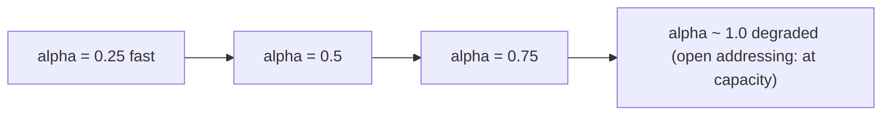

## Learning Objectives

- Define load factor precisely as `n / m` and explain why it is the single number that best predicts a hash table's real performance.
- Explain why performance degrades as load factor rises, distinguishing the chaining case from the open-addressing case.
- Implement rehashing from scratch in Python: allocating a larger table and reinserting every existing entry.
- Analyze why rehashing's amortized cost is O(1) per insertion using the same doubling argument used for dynamic arrays.
- Predict when a hash table should trigger a rehash for either growth or shrinkage, and why an asymmetric threshold avoids thrashing.

## Context & Motivation

The two collision-resolution concepts just covered both ended on the same warning: chaining's average chain length grows in direct proportion to how full the table gets, and open addressing's probe counts grow even faster than that, degrading sharply as the table approaches capacity. Both facts point to the same underlying quantity mattering more than anything else about a hash table's real-world speed — not the number of entries alone, not the table size alone, but the *ratio* between them. That ratio is the load factor, and this concept is about taking it seriously as the one number a hash table implementation must actively manage, rather than something to observe passively after performance has already degraded.

This is also where hash tables connect back to a pattern this course has already built the machinery to understand. A dynamic array facing a full backing array doesn't refuse further appends — it allocates a bigger array and copies everything over, and the earlier concept on dynamic arrays proved that doing this by *doubling* the capacity, rather than growing by a fixed increment, keeps the amortized cost of each append at O(1) even though any single doubling operation itself costs O(n). A hash table facing a load factor that has crept too high faces an almost identical decision, with an almost identical solution — allocate a bigger table and move every entry into it — and the argument for why this remains cheap on average is, essentially, the very same amortized-analysis argument, applied to a different structure. Seeing that connection explicitly is the point of this concept: rehashing is not a new idea bolted onto hash tables, it is the dynamic array's resizing story told again in a setting where "resizing" also means recomputing where everything goes, not just copying it into a bigger box.

## Core Theory

### Defining load factor

The **load factor** of a hash table is `alpha = n / m`, where `n` is the number of key-value pairs currently stored and `m` is the number of slots (buckets, in a chaining table; array slots, in an open-addressed one) the table currently has. It is a single dimensionless number that captures, on average, "how full is this table" — `alpha = 0.5` means, on average, half as many entries as slots; `alpha = 2.0` means twice as many entries as slots (only meaningful under chaining, since open addressing cannot exceed `alpha = 1.0` at all, as the previous concept established).

Load factor is not merely descriptive — both prior concepts showed it is the direct input to the performance formulas for each scheme: chaining's expected cost per operation is O(1 + alpha) (a small constant plus the average chain length); open addressing's expected number of probes under linear probing grows roughly like `1 / (1 - alpha)`, a function that stays small while `alpha` is modest but blows up sharply as `alpha` approaches 1. Both formulas say the same thing in different units: a hash table's O(1) average-case promise is not unconditional, it is conditional on `alpha` being kept bounded by a small constant, and that boundedness has to be actively maintained as `n` grows, because `m` is fixed unless something changes it.



### Why performance degrades, chaining vs. open addressing

The mechanism is different for the two schemes, and it's worth being precise about each:

- **Chaining.** As `alpha` rises, buckets simply hold more entries on average, so the linked list walked during lookup gets longer — a smooth, roughly linear degradation that has no hard limit and no discontinuity: `alpha = 5` just means average chains of length 5, still O(1 + alpha), just a larger constant.
- **Open addressing.** As `alpha` rises, empty slots become scarcer, so probe sequences must travel farther on average to find one — and primary clustering, discussed in the previous concept, makes this worse than the scarcity of empty slots alone would suggest, since occupied runs actively funnel new collisions to their own far end. This degradation is not linear; it accelerates sharply as `alpha` approaches 1, and at `alpha = 1` the table is not merely slow, it is entirely full and cannot accept another insertion at all.

This asymmetry is why open-addressed tables are conventionally rehashed at a noticeably lower threshold (commonly around `alpha = 0.7`) than chaining tables (which can often tolerate `alpha` up to 1.0 or beyond before rehashing, since chaining degrades gracefully rather than hitting a wall).

### The rehashing procedure

**Rehashing** is the process of replacing a hash table's backing storage with a new one of a different size, and moving every existing entry into it. Concretely: allocate a new array of size `m'` (typically `m' = 2m`, mirroring the doubling strategy from dynamic arrays), then for *every* entry currently stored, recompute its index using the new table size (`h(key) % m'`, not merely copying its old index over) and insert it into the new array using whatever collision-resolution rule the table uses. Only once every entry has been moved is the old array discarded.

```python
class ChainingHashTableWithRehashing:
    def __init__(self, table_size: int = 8, max_load_factor: float = 0.75):
        self.table_size = table_size
        self.buckets = [[] for _ in range(table_size)]   # each bucket: a plain Python list of (key, value)
        self.count = 0
        self.max_load_factor = max_load_factor

    def _index(self, key, table_size) -> int:
        return hash(key) % table_size

    def put(self, key, value) -> None:
        i = self._index(key, self.table_size)
        for idx, (k, _) in enumerate(self.buckets[i]):
            if k == key:
                self.buckets[i][idx] = (key, value)
                return
        self.buckets[i].append((key, value))
        self.count += 1
        if self.count / self.table_size > self.max_load_factor:
            self._rehash(self.table_size * 2)

    def _rehash(self, new_table_size: int) -> None:
        old_buckets = self.buckets
        self.table_size = new_table_size
        self.buckets = [[] for _ in range(new_table_size)]
        for bucket in old_buckets:
            for key, value in bucket:
                i = self._index(key, self.table_size)   # recomputed against the NEW size
                self.buckets[i].append((key, value))
        # count is unchanged: rehashing moves entries, it does not add or remove any

    def get(self, key):
        i = self._index(key, self.table_size)
        for k, v in self.buckets[i]:
            if k == key:
                return v
        raise KeyError(key)
```

The critical detail — easy to get wrong — is that `h(key) % m'` is *recomputed* for every entry against the *new* table size, not simply copied from the old table's index. Since `m` changed, an entry's old index has no necessary relationship to its correct index in the new, larger table; skipping this recomputation would silently scatter entries to the wrong slots.

### Amortized cost: the same argument as dynamic array doubling

A single rehash touching `n` entries costs O(n) — every entry must be recomputed and reinserted. Taken in isolation, this looks like it could make some individual `put` call arbitrarily expensive as the table grows, exactly the same shape of concern that a naive analysis of dynamic array appends runs into. And the resolution is exactly the same: because rehashing doubles the table size every time it triggers, the *number of insertions since the last rehash* also doubles each time, so the expensive O(n) rehash steps become exponentially rarer relative to how many cheap O(1) insertions occurred to earn them. Summing the total work across a sequence of `n` insertions — the O(1) cost of each individual insertion, plus the O(1), O(2), O(4), O(8), ..., O(n) cost of the rehashes triggered along the way — gives a geometric series that sums to O(n) total, exactly as it does for dynamic array doubling. Dividing that O(n) total by the `n` insertions gives O(1) amortized cost per insertion, even though any single insertion that happens to trigger a rehash costs O(n) in that one moment. This is not a coincidental resemblance to the dynamic-arrays-and-amortized-resizing concept — it is literally the same proof technique (a geometric series driven by a doubling threshold) applied to a structure that also needs to recompute indices during the copy, rather than merely copying values across unchanged.

### Shrinking, and avoiding thrashing

A load factor that has grown too high triggers a rehash upward; a load factor that has dropped too low (many deletions after a period of many insertions) can, in principle, trigger a rehash downward too, to reclaim memory a table no longer needs. The same halving-on-shrink strategy used for dynamic arrays applies here, and for the identical reason: shrinking by exactly the same factor used for growing (e.g., halving whenever `alpha` drops below some low threshold like 0.25, mirroring a doubling trigger at 0.75) risks **thrashing** — repeatedly growing and shrinking across the same narrow band of `n` if insertions and deletions alternate near the threshold. The standard fix is asymmetry: choose the shrink threshold meaningfully lower than the grow threshold (e.g., grow at `alpha > 0.75`, shrink only at `alpha < 0.25`, rather than shrink at `alpha < 0.5`), so that a sequence of insertions and deletions hovering around one value of `n` doesn't repeatedly cross both triggers.

## Worked Examples

### Example 1 — tracing a rehash trigger and its cost

**Problem:** Using `ChainingHashTableWithRehashing` with an initial `table_size = 4` and `max_load_factor = 0.75`, insert 4 keys and trace exactly when a rehash fires and what it costs.

**Trace.** Inserting key 1: `count = 1`, `1/4 = 0.25`, no rehash. Key 2: `count = 2`, `2/4 = 0.5`, no rehash. Key 3: `count = 3`, `3/4 = 0.75`, which is *not strictly greater than* `0.75`, so no rehash (the check is `>`, not `>=`). Key 4: `count = 4`, `4/4 = 1.0 > 0.75` — rehash triggers. `_rehash(8)` runs: a new array of 8 buckets is allocated, and all 4 existing entries are pulled from the old 4-bucket array and reinserted with indices recomputed against the new size 8. This one `put` call costs O(4) instead of the usual O(1) for the reinsertion work, but the table is now back down to `alpha = 4/8 = 0.5`, leaving headroom for several more O(1) insertions before the next rehash fires (which won't happen until `count/8 > 0.75`, i.e., `count > 6`).

### Example 2 — the amortized-cost bookkeeping, numerically

**Problem:** Starting from an empty table with `table_size = 1` and doubling on every rehash, insert 16 keys one at a time. Sum the total work done across all 16 insertions (each insertion itself costs O(1) aside from any rehash it triggers), and compute the amortized cost per insertion.

**Reasoning.** A rehash fires (roughly, ignoring the exact threshold fraction for simplicity) each time the table fills up: after 1 entry (rehash to size 2, cost 1), after 2 entries (rehash to size 4, cost 2), after 4 entries (rehash to size 8, cost 4), after 8 entries (rehash to size 16, cost 8). Total rehashing work: `1 + 2 + 4 + 8 = 15`. Total insertion work (the O(1) baseline cost of each of the 16 `put` calls, separate from any rehashing): 16. Grand total: `15 + 16 = 31` units of work across 16 insertions. Amortized cost per insertion: `31 / 16 ≈ 1.9`, a small constant — not the O(n) that a single worst-case insertion (the one that triggers the biggest rehash) might suggest in isolation. This is the exact geometric-series pattern (`1 + 2 + 4 + ... + n/2 < n`) that the dynamic-arrays-and-amortized-resizing concept proves in general; the numbers here are that same proof instantiated concretely.

### Example 3 — asymmetric thresholds preventing thrashing

**Problem:** A table currently holds `n = 6` entries in `m = 8` slots (`alpha = 0.75`, right at a hypothetical single shared grow/shrink threshold of 0.75/0.75... suppose instead the design mistakenly used the *same* threshold, 0.5, for both growing and shrinking). Show how alternating insert/delete operations near this shared threshold cause thrashing, then show how an asymmetric threshold fixes it.

**Shared-threshold design (broken).** Suppose grow triggers at `alpha > 0.5` and shrink triggers at `alpha < 0.5`, with `m = 8` and `n` hovering at 4 (`alpha = 0.5` exactly, the boundary). One insertion pushes `n = 5`, `alpha = 0.625 > 0.5` — rehash grows to `m = 16`. One deletion right after brings `n = 4`, `alpha = 0.25 < 0.5` — rehash shrinks back to `m = 8`. If insertions and deletions keep alternating in this neighborhood, *every single operation* triggers a full O(n) rehash — the amortized-cost argument from Example 2 collapses completely, because the doubling/halving is firing far too often relative to how much `n` actually changes each time.

**Asymmetric-threshold design (fixed).** Suppose instead grow triggers only at `alpha > 0.75` and shrink only at `alpha < 0.25`, with `m = 8`. The same `n` hovering around 4–5 now sits comfortably in the middle of this band (`alpha` between 0.25 and 0.75 covers `n` from 2 to 6 without triggering anything), so the identical sequence of alternating insertions and deletions triggers zero rehashes at all. This is precisely why real implementations use a gap between grow and shrink thresholds rather than a single shared value — the gap creates a buffer zone that absorbs ordinary fluctuation in `n` without repeatedly paying for a resize.

## Common Misconceptions & Pitfalls

- **"Load factor above 1 always means something is broken."** This is only true for open addressing, where `alpha <= 1` is a hard structural limit. Under chaining, `alpha > 1` is completely valid — it just means buckets average more than one entry each, degrading performance gracefully rather than signaling any error. Conflating the two schemes' capacity rules leads to unnecessary panic over a chaining table's healthy `alpha = 2`.
- **"Rehashing just copies each entry to the same relative position in the bigger array."** As the from-scratch implementation makes explicit, an entry's index must be *recomputed* with `hash(key) % new_size`, not copied from its old index — since the modulus changed, the old and new indices are generally unrelated. Skipping recomputation (e.g., naively copying old_table[i] to new_table[i]) leaves most entries unfindable at their new, uncorrelated positions.
- **"Since any single rehash costs O(n), hash tables don't really offer O(1) insertion — that's a lie."** This confuses worst-case single-operation cost with amortized cost across a sequence of operations. Example 2's arithmetic shows precisely why the O(n) cost of individual rehashes, spread out geometrically rarely, averages down to O(1) per insertion overall — the identical resolution used for dynamic array doubling, and for the same underlying reason (a doubling threshold makes expensive operations exponentially rare).
- **"A shrink threshold set symmetrically with the grow threshold (e.g., grow above 0.75, shrink below 0.75) is just being consistent."** Example 3 demonstrates this specific setup causes thrashing — repeated, wasteful rehashing — whenever `n` oscillates near the shared boundary. A deliberately asymmetric gap between grow and shrink thresholds is a required design choice, not an arbitrary inconsistency.

## Summary

Load factor, `alpha = n/m`, is the single ratio that governs a hash table's real performance: chaining degrades smoothly as `alpha` climbs (longer average chains), while open addressing degrades sharply as `alpha` approaches its hard ceiling of 1 (scarcer empty slots, worsened by clustering). Rehashing — allocating a larger table and reinserting every entry with indices recomputed against the new size — is how a table keeps `alpha` bounded as `n` grows, and doubling the table size on each rehash makes the amortized cost of this process O(1) per insertion, by exactly the same geometric-series argument proved for dynamic array resizing in this same discipline: expensive O(n) rehash events become exponentially rarer as the table grows, so their total cost, spread across all the insertions that led up to them, averages out to a small constant. A table that also shrinks on heavy deletion needs an asymmetric gap between its grow and shrink thresholds, or it risks thrashing — rehashing repeatedly for no net benefit whenever `n` oscillates near a single shared threshold.

## Documentation Links

- [Sedgewick & Wayne — Algorithms, Part I (Princeton, Coursera)](https://www.coursera.org/learn/algorithms-part1) — doc
- [MIT 6.006 — Lecture Notes (OCW)](https://ocw.mit.edu/courses/6-006-introduction-to-algorithms-spring-2020/pages/lecture-notes/) — doc
