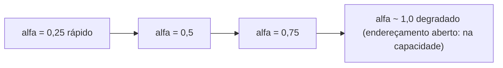

## Objetivos de Aprendizagem

- Definir fator de carga precisamente como `n / m` e explicar por que é o único número que melhor prevê o desempenho real de uma tabela hash.
- Explicar por que desempenho se degrada conforme fator de carga sobe, distinguindo o caso de encadeamento do caso de endereçamento aberto.
- Implementar rehashing do zero em Python: alocar uma tabela maior e reinserir toda entrada existente.
- Analisar por que o custo amortizado de rehashing é O(1) por inserção usando o mesmo argumento de dobramento usado para vetores dinâmicos.
- Prever quando uma tabela hash deveria disparar um rehash tanto para crescimento quanto para encolhimento, e por que um limiar assimétrico evita thrashing.

## Contexto e Motivação

Os dois conceitos de resolução de colisão recém cobertos terminaram ambos com o mesmo aviso: o comprimento médio de cadeia do encadeamento cresce em proporção direta a quão cheia a tabela fica, e as contagens de sondagem do endereçamento aberto crescem ainda mais rápido que isso, degradando fortemente conforme a tabela se aproxima da capacidade. Os dois fatos apontam para a mesma quantidade subjacente importando mais que qualquer outra coisa sobre a velocidade de mundo real de uma tabela hash, não o número de entradas sozinho, não o tamanho da tabela sozinho, mas a *razão* entre eles. Essa razão é o fator de carga, e este conceito trata de levá-la a sério como o único número que uma implementação de tabela hash precisa gerenciar ativamente, em vez de algo a observar passivamente depois que o desempenho já se degradou.

Esse é também o ponto onde tabelas hash se conectam de volta a um padrão que este curso já construiu a maquinaria para entender. Um vetor dinâmico enfrentando um vetor de suporte cheio não recusa mais anexações; ele aloca um vetor maior e copia tudo, e o conceito anterior sobre vetores dinâmicos provou que fazer isso *dobrando* a capacidade, em vez de crescer por um incremento fixo, mantém o custo amortizado de cada anexação em O(1) mesmo que qualquer operação de dobramento em si custe O(n). Uma tabela hash enfrentando um fator de carga que subiu alto demais enfrenta uma decisão quase idêntica, com uma solução quase idêntica (alocar uma tabela maior e mover toda entrada para ela), e o argumento de por que isso permanece barato em média é, essencialmente, o mesmo argumento de análise amortizada, aplicado a uma estrutura diferente. Ver essa conexão explicitamente é o ponto deste conceito: rehashing não é uma ideia nova colada em tabelas hash, é a história de redimensionamento do vetor dinâmico contada de novo num cenário onde "redimensionar" também significa recomputar para onde tudo vai, não só copiá-lo para uma caixa maior.

## Teoria Central

### Definindo fator de carga

O **fator de carga** de uma tabela hash é `alfa = n / m`, onde `n` é o número de pares chave-valor atualmente armazenados e `m` é o número de slots (baldes, numa tabela de encadeamento; slots de vetor, numa de endereçamento aberto) que a tabela atualmente tem. É um único número adimensional que captura, em média, "quão cheia essa tabela está"; `alfa = 0,5` significa, em média, metade tantas entradas quanto slots; `alfa = 2,0` significa o dobro de entradas que slots (só significativo sob encadeamento, já que endereçamento aberto não pode exceder `alfa = 1,0` de forma alguma, como o conceito anterior estabeleceu).

Fator de carga não é meramente descritivo; os dois conceitos anteriores mostraram que é a entrada direta para as fórmulas de desempenho de cada esquema: o custo esperado por operação do encadeamento é O(1 + alfa) (uma pequena constante mais o comprimento médio da cadeia); o número esperado de sondagens do endereçamento aberto sob sondagem linear cresce aproximadamente como `1 / (1 - alfa)`, uma função que permanece pequena enquanto `alfa` é modesto mas explode fortemente conforme `alfa` se aproxima de 1. As duas fórmulas dizem a mesma coisa em unidades diferentes: a promessa de caso médio O(1) de uma tabela hash não é incondicional, é condicional a `alfa` ser mantido limitado por uma pequena constante, e essa limitação precisa ser ativamente mantida conforme `n` cresce, porque `m` é fixo a menos que algo o mude.



### Por que desempenho se degrada, encadeamento vs. endereçamento aberto

O mecanismo é diferente para os dois esquemas, e vale a pena ser preciso sobre cada um:

- **Encadeamento.** Conforme `alfa` sobe, baldes simplesmente seguram mais entradas em média, então a lista encadeada percorrida durante a busca fica mais longa, uma degradação suave e aproximadamente linear que não tem limite rígido nem descontinuidade: `alfa = 5` só significa cadeias médias de comprimento 5, ainda O(1 + alfa), só uma constante maior.
- **Endereçamento aberto.** Conforme `alfa` sobe, slots vazios se tornam mais escassos, então sequências de sondagem precisam viajar mais em média para encontrar um, e agrupamento primário, discutido no conceito anterior, torna isso pior do que a escassez de slots vazios sozinha sugeriria, já que sequências ocupadas ativamente canalizam novas colisões para seu próprio final distante. Essa degradação não é linear; acelera fortemente conforme `alfa` se aproxima de 1, e em `alfa = 1` a tabela não está meramente lenta, está inteiramente cheia e não pode aceitar outra inserção de forma alguma.

Essa assimetria é por que tabelas de endereçamento aberto são convencionalmente rehashadas num limiar notavelmente mais baixo (comumente por volta de `alfa = 0,7`) do que tabelas de encadeamento (que frequentemente podem tolerar `alfa` até 1,0 ou além antes de rehashing, já que encadeamento se degrada graciosamente em vez de bater numa parede).

### O procedimento de rehashing

**Rehashing** é o processo de substituir o armazenamento de suporte de uma tabela hash por um novo de tamanho diferente, e mover toda entrada existente para ele. Concretamente: aloque um novo vetor de tamanho `m'` (tipicamente `m' = 2m`, espelhando a estratégia de dobramento de vetores dinâmicos), depois para *toda* entrada atualmente armazenada, recompute seu índice usando o novo tamanho de tabela (`h(chave) % m'`, não meramente copiando seu índice antigo) e insira-a no novo vetor usando qualquer regra de resolução de colisão que a tabela usa. Só uma vez que toda entrada foi movida o vetor antigo é descartado.

```python
class TabelaHashEncadeadaComRehashing:
    def __init__(self, tamanho_tabela: int = 8, fator_carga_maximo: float = 0.75):
        self.tamanho_tabela = tamanho_tabela
        self.baldes = [[] for _ in range(tamanho_tabela)]   # cada balde: uma lista Python simples de (chave, valor)
        self.contagem = 0
        self.fator_carga_maximo = fator_carga_maximo

    def _indice(self, chave, tamanho_tabela) -> int:
        return hash(chave) % tamanho_tabela

    def put(self, chave, valor) -> None:
        i = self._indice(chave, self.tamanho_tabela)
        for idx, (k, _) in enumerate(self.baldes[i]):
            if k == chave:
                self.baldes[i][idx] = (chave, valor)
                return
        self.baldes[i].append((chave, valor))
        self.contagem += 1
        if self.contagem / self.tamanho_tabela > self.fator_carga_maximo:
            self._rehash(self.tamanho_tabela * 2)

    def _rehash(self, novo_tamanho_tabela: int) -> None:
        baldes_antigos = self.baldes
        self.tamanho_tabela = novo_tamanho_tabela
        self.baldes = [[] for _ in range(novo_tamanho_tabela)]
        for balde in baldes_antigos:
            for chave, valor in balde:
                i = self._indice(chave, self.tamanho_tabela)   # recomputado contra o NOVO tamanho
                self.baldes[i].append((chave, valor))
        # contagem não muda: rehashing move entradas, não adiciona nem remove nenhuma

    def get(self, chave):
        i = self._indice(chave, self.tamanho_tabela)
        for k, v in self.baldes[i]:
            if k == chave:
                return v
        raise KeyError(chave)
```

O detalhe crítico, fácil de errar, é que `h(chave) % m'` é *recomputado* para toda entrada contra o *novo* tamanho de tabela, não simplesmente copiado do índice da tabela antiga. Como `m` mudou, o índice antigo de uma entrada não tem relação necessária com seu índice correto na nova tabela maior; pular essa recomputação silenciosamente espalharia entradas para slots errados.

### Custo amortizado: o mesmo argumento do dobramento de vetor dinâmico

Um único rehash tocando `n` entradas custa O(n); toda entrada precisa ser recomputada e reinserida. Tomado isoladamente, isso parece que poderia tornar alguma chamada individual de `put` arbitrariamente cara conforme a tabela cresce, exatamente a mesma forma de preocupação que uma análise ingênua de anexações de vetor dinâmico encontra. E a resolução é exatamente a mesma: porque rehashing dobra o tamanho da tabela toda vez que dispara, o *número de inserções desde o último rehash* também dobra a cada vez, então os passos caros de rehash O(n) se tornam exponencialmente mais raros em relação a quantas inserções baratas O(1) ocorreram para merecê-los. Somar o trabalho total através de uma sequência de `n` inserções (o custo O(1) de cada inserção individual, mais o custo O(1), O(2), O(4), O(8), ..., O(n) dos rehashes disparados ao longo do caminho) dá uma série geométrica que soma O(n) total, exatamente como acontece para dobramento de vetor dinâmico. Dividir esse total O(n) pelas `n` inserções dá custo amortizado O(1) por inserção, mesmo que qualquer inserção individual que aconteça de disparar um rehash custe O(n) naquele momento específico. Isso não é uma semelhança coincidente com o conceito de vetores dinâmicos e redimensionamento amortizado; é literalmente a mesma técnica de prova (uma série geométrica conduzida por um limiar de dobramento) aplicada a uma estrutura que também precisa recomputar índices durante a cópia, em vez de meramente copiar valores inalterados.

### Encolhendo, e evitando thrashing

Um fator de carga que cresceu alto demais dispara um rehash para cima; um fator de carga que caiu baixo demais (muitas remoções depois de um período de muitas inserções) pode, em princípio, disparar um rehash para baixo também, para recuperar memória que uma tabela não precisa mais. A mesma estratégia de reduzir pela metade ao encolher usada para vetores dinâmicos se aplica aqui, e pela razão idêntica: encolher exatamente pelo mesmo fator usado para crescer (por exemplo, reduzir pela metade sempre que `alfa` cai abaixo de algum limiar baixo como 0,25, espelhando um gatilho de dobramento em 0,75) arrisca **thrashing**, crescer e encolher repetidamente através da mesma faixa estreita de `n` se inserções e remoções alternarem perto do limiar. A correção padrão é assimetria: escolha o limiar de encolhimento significativamente mais baixo que o limiar de crescimento (por exemplo, cresça em `alfa > 0,75`, encolha só em `alfa < 0,25`, em vez de encolher em `alfa < 0,5`), para que uma sequência de inserções e remoções pairando ao redor de um valor de `n` não cruze repetidamente os dois gatilhos.

## Exemplos Resolvidos

### Exemplo 1: traçando um gatilho de rehash e seu custo

**Problema:** usando `TabelaHashEncadeadaComRehashing` com `tamanho_tabela = 4` inicial e `fator_carga_maximo = 0,75`, insira 4 chaves e trace exatamente quando um rehash dispara e o que custa.

**Traço.** Inserindo a chave 1: `contagem = 1`, `1/4 = 0,25`, sem rehash. Chave 2: `contagem = 2`, `2/4 = 0,5`, sem rehash. Chave 3: `contagem = 3`, `3/4 = 0,75`, que *não é estritamente maior que* `0,75`, então sem rehash (a checagem é `>`, não `>=`). Chave 4: `contagem = 4`, `4/4 = 1,0 > 0,75`, rehash dispara. `_rehash(8)` roda: um novo vetor de 8 baldes é alocado, e todas as 4 entradas existentes são puxadas do vetor antigo de 4 baldes e reinseridas com índices recomputados contra o novo tamanho 8. Essa única chamada `put` custa O(4) em vez do usual O(1) para o trabalho de reinserção, mas a tabela agora está de volta em `alfa = 4/8 = 0,5`, deixando margem para várias inserções O(1) a mais antes do próximo rehash disparar (que não vai acontecer até `contagem/8 > 0,75`, ou seja, `contagem > 6`).

### Exemplo 2: a contabilidade de custo amortizado, numericamente

**Problema:** começando de uma tabela vazia com `tamanho_tabela = 1` e dobrando a cada rehash, insira 16 chaves uma de cada vez. Some o trabalho total feito através de todas as 16 inserções (cada inserção em si custa O(1) além de qualquer rehash que dispare), e compute o custo amortizado por inserção.

**Raciocínio.** Um rehash dispara (aproximadamente, ignorando a fração exata do limiar para simplicidade) cada vez que a tabela enche: depois de 1 entrada (rehash para tamanho 2, custo 1), depois de 2 entradas (rehash para tamanho 4, custo 2), depois de 4 entradas (rehash para tamanho 8, custo 4), depois de 8 entradas (rehash para tamanho 16, custo 8). Trabalho total de rehashing: `1 + 2 + 4 + 8 = 15`. Trabalho total de inserção (o custo básico O(1) de cada uma das 16 chamadas `put`, separado de qualquer rehashing): 16. Total geral: `15 + 16 = 31` unidades de trabalho através de 16 inserções. Custo amortizado por inserção: `31 / 16 ≈ 1,9`, uma pequena constante, não o O(n) que uma única inserção de pior caso (aquela que dispara o maior rehash) poderia sugerir isoladamente. Este é o exato padrão de série geométrica (`1 + 2 + 4 + ... + n/2 < n`) que o conceito de vetores dinâmicos e redimensionamento amortizado prova em geral; os números aqui são essa mesma prova instanciada concretamente.

### Exemplo 3: limiares assimétricos prevenindo thrashing

**Problema:** uma tabela atualmente segura `n = 6` entradas em `m = 8` slots (`alfa = 0,75`, bem num limiar único hipotético compartilhado de crescimento/encolhimento de 0,75/0,75... suponha em vez disso que o projeto erroneamente usou o *mesmo* limiar, 0,5, tanto para crescer quanto para encolher). Mostre como operações alternadas de inserção/remoção perto desse limiar compartilhado causam thrashing, depois mostre como um limiar assimétrico corrige isso.

**Projeto de limiar compartilhado (quebrado).** Suponha que crescimento dispare em `alfa > 0,5` e encolhimento dispare em `alfa < 0,5`, com `m = 8` e `n` pairando em 4 (`alfa = 0,5` exatamente, o limite). Uma inserção empurra `n = 5`, `alfa = 0,625 > 0,5`, rehash cresce para `m = 16`. Uma remoção logo depois traz `n = 4`, `alfa = 0,25 < 0,5`, rehash encolhe de volta para `m = 8`. Se inserções e remoções continuam alternando nessa vizinhança, *toda operação individual* dispara um rehash O(n) completo; o argumento de custo amortizado do Exemplo 2 colapsa completamente, porque o dobramento/redução pela metade está disparando com frequência demais em relação a quanto `n` de fato muda a cada vez.

**Projeto de limiar assimétrico (corrigido).** Suponha em vez disso que o crescimento dispare só em `alfa > 0,75` e o encolhimento só em `alfa < 0,25`, com `m = 8`. O mesmo `n` pairando ao redor de 4 a 5 agora fica confortavelmente no meio dessa faixa (`alfa` entre 0,25 e 0,75 cobre `n` de 2 a 6 sem disparar nada), então a sequência idêntica de inserções e remoções alternadas dispara zero rehashes de forma alguma. É precisamente por isso que implementações reais usam uma lacuna entre os limiares de crescimento e encolhimento em vez de um único valor compartilhado; a lacuna cria uma zona de amortecimento que absorve flutuação comum em `n` sem repetidamente pagar por um redimensionamento.

## Equívocos Comuns e Armadilhas

- **"Fator de carga acima de 1 sempre significa que algo está quebrado."** Isso só é verdade para endereçamento aberto, onde `alfa <= 1` é um limite estrutural rígido. Sob encadeamento, `alfa > 1` é completamente válido; só significa que baldes têm em média mais de uma entrada cada, degradando desempenho graciosamente em vez de sinalizar qualquer erro. Confundir as regras de capacidade dos dois esquemas leva a pânico desnecessário sobre um `alfa = 2` saudável numa tabela de encadeamento.
- **"Rehashing só copia cada entrada para a mesma posição relativa no vetor maior."** Como a implementação do zero deixa explícito, o índice de uma entrada precisa ser *recomputado* com `hash(chave) % novo_tamanho`, não copiado de seu índice antigo; já que o módulo mudou, os índices antigo e novo geralmente não têm relação. Pular a recomputação (por exemplo, ingenuamente copiar vetor_antigo[i] para vetor_novo[i]) deixa a maioria das entradas impossíveis de encontrar em suas novas posições sem correlação.
- **"Já que qualquer rehash individual custa O(n), tabelas hash não oferecem de fato inserção O(1); isso é mentira."** Isso confunde custo de pior caso de uma única operação com custo amortizado através de uma sequência de operações. A aritmética do Exemplo 2 mostra precisamente por que o custo O(n) de rehashes individuais, espalhados geometricamente com raridade, se reduz em média para O(1) por inserção no geral; a resolução idêntica usada para dobramento de vetor dinâmico, e pela mesma razão subjacente (um limiar de dobramento torna operações caras exponencialmente raras).
- **"Um limiar de encolhimento definido simetricamente com o limiar de crescimento (por exemplo, crescer acima de 0,75, encolher abaixo de 0,75) só está sendo consistente."** O Exemplo 3 demonstra que essa configuração específica causa thrashing (rehashing repetido e desperdiçado) sempre que `n` oscila perto do limite compartilhado. Uma lacuna deliberadamente assimétrica entre os limiares de crescimento e encolhimento é uma escolha de projeto exigida, não uma inconsistência arbitrária.

## Resumo

Fator de carga, `alfa = n/m`, é a única razão que governa o desempenho real de uma tabela hash: encadeamento se degrada suavemente conforme `alfa` sobe (cadeias médias mais longas), enquanto endereçamento aberto se degrada fortemente conforme `alfa` se aproxima de seu teto rígido de 1 (slots vazios mais escassos, piorados por agrupamento). Rehashing (alocar uma tabela maior e reinserir toda entrada com índices recomputados contra o novo tamanho) é como uma tabela mantém `alfa` limitado conforme `n` cresce, e dobrar o tamanho da tabela a cada rehash torna o custo amortizado desse processo O(1) por inserção, pelo exato mesmo argumento de série geométrica provado para redimensionamento de vetor dinâmico nesta mesma disciplina: eventos de rehash caros O(n) se tornam exponencialmente mais raros conforme a tabela cresce, então seu custo total, espalhado através de todas as inserções que levaram até eles, se reduz em média a uma pequena constante. Uma tabela que também encolhe sob remoção pesada precisa de uma lacuna assimétrica entre seus limiares de crescimento e encolhimento, ou arrisca thrashing, rehashing repetidamente sem benefício líquido sempre que `n` oscila perto de um único limiar compartilhado.

## Documentation Links

- [Sedgewick & Wayne — Algorithms, Part I (Princeton, Coursera)](https://www.coursera.org/learn/algorithms-part1) — doc
- [MIT 6.006 — Lecture Notes (OCW)](https://ocw.mit.edu/courses/6-006-introduction-to-algorithms-spring-2020/pages/lecture-notes/) — doc
