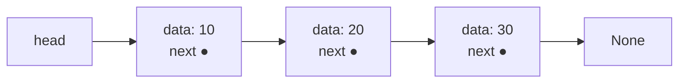
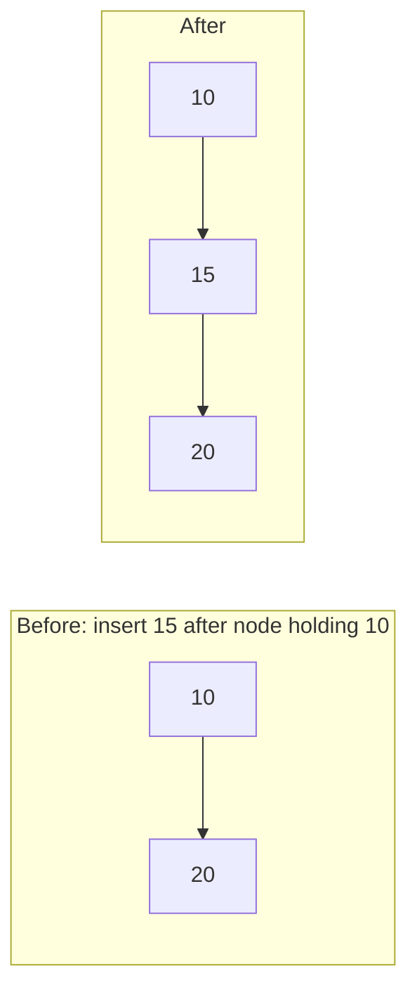

## Learning Objectives

- Explain how a singly linked list represents a sequence using nodes and pointers instead of contiguous memory.
- Implement node insertion and deletion at the head and at an arbitrary position, from scratch.
- Analyze why accessing an element by index is O(n) in a linked list even though insertion at a known position is O(1).
- Compare a linked list's memory layout to a static array's, and predict the consequence for random access versus insertion.

## Context & Motivation

Static and dynamic arrays both depend on one non-negotiable requirement: all of their elements must live in one contiguous block of memory. That requirement is exactly what makes indexed access O(1) — but it is also exactly what makes inserting or removing an element in the middle expensive, since everything after the change has to physically shift to preserve contiguity. The **singly linked list** is built around abandoning that requirement entirely. Instead of one block holding every element back-to-back, a linked list is a chain of individually allocated **nodes**, scattered anywhere in memory, each one holding a piece of data and a pointer to the next node in the sequence. Nothing about a node's location in memory has anything to do with its position in the logical sequence — the sequence's order lives entirely in the chain of pointers, not in any address arithmetic.

This is a genuine trade, not a strict improvement: giving up contiguity means giving up O(1) indexed access — to reach the fifth element, there is no formula analogous to `base + i * size`; the only way to get there is to start at the first node and follow four `next` pointers, one hop at a time, which is O(n) in the worst case. What is gained in exchange is that once a particular node is *already in hand* — reached via a reference, not via an index — inserting a new node right after it, or removing it, is O(1): no shifting of any other element is required, because nothing else in memory needs to move. Rewiring one or two pointers is all it takes. This is the structural counterpoint to everything static and dynamic arrays are good and bad at, and Stanford's CS106B introduces linked lists specifically as this counterpoint — not as a replacement for arrays, but as a second point in the same design space, optimized for a different access pattern. Understanding singly linked lists precisely, at the level of what a `Node` actually is and how pointer rewiring actually works, is what makes the array-versus-linked-list trade-off (the final concept in this sequence) a matter of genuine engineering judgment rather than memorized rules of thumb.

## Core Theory

### The Node: the atomic unit of a linked list

A singly linked list has no single block of memory representing the whole sequence. Instead, it is built from individually allocated **nodes**, each one a small object holding exactly two things: a piece of data, and a reference (pointer) to the *next* node in the sequence, or a special null/None value if it is the last node. The list itself keeps only a reference to the first node, called the **head** (and, in many implementations, also a reference to the last node, the **tail**, to make appending fast).

```python
class Node:
    def __init__(self, data, next=None):
        self.data = data
        self.next = next
```



Each node can be allocated anywhere in memory — there is no requirement, and generally no reality, of them being adjacent. The only thing connecting `data: 10` to `data: 20` is the pointer stored inside the first node; there is no address arithmetic that could locate `data: 20` without first reading that pointer.

### Traversal: the only way to reach a node

Because nodes are not contiguous, there is exactly one way to reach the k-th node: start at `head` and follow `next` pointers k times.

```python
def get(head, index):
    current = head
    steps = 0
    while current is not None:
        if steps == index:
            return current.data
        current = current.next
        steps += 1
    raise IndexError("index out of range")
```

This is O(n) in the worst case (reaching the last node requires n-1 hops) — there is no faster way, because nothing about a node's memory address encodes its logical position. This is the direct structural opposite of a static array's `base + i * size` formula.

### O(1) insertion and deletion — but only at a known node

The payoff for giving up random access is that once a reference to a specific node is already held, insertion or deletion next to it requires only pointer rewiring, never shifting other elements.

**Inserting at the head** (the simplest and most common O(1) case):

```python
def insert_at_head(head, data):
    new_node = Node(data, next=head)   # new node points to the old head
    return new_node                     # new node IS the new head
```

**Inserting after a given node** `prev` (prev already held, e.g., from a prior traversal):

```python
def insert_after(prev, data):
    new_node = Node(data, next=prev.next)   # new node points to what prev used to point to
    prev.next = new_node                     # prev now points to new node
```



**Deleting the node after a given node** `prev`:

```python
def delete_after(prev):
    if prev.next is None:
        raise IndexError("nothing to delete")
    removed = prev.next
    prev.next = prev.next.next   # skip over the removed node
    return removed.data
```

Both `insert_after` and `delete_after` touch a fixed, small number of pointers — O(1) — regardless of how long the list is, *provided* `prev` is already a reference in hand. This proviso matters enormously: finding `prev` in the first place, if it's not already known, requires an O(n) traversal, and the "O(1)" applies only to the pointer rewiring itself, not to any search that had to happen first.

### The critical special case: deleting or inserting at the head requires no `prev` at all

Because the head is the list's designated entry point, operations there need no traversal whatsoever: `insert_at_head` above never touches an existing node's pointer, and deleting the head is equally direct:

```python
def delete_head(head):
    if head is None:
        raise IndexError("list is empty")
    return head.next   # the new head; the old head node is simply discarded
```

This is the reason a singly linked list is a natural fit for a Stack ADT (push/pop at one end, covered as its own concept later): both `insert_at_head` and `delete_head` are unconditionally O(1), with no traversal needed at all — unlike insertion or deletion at the *tail*, which (without a maintained tail pointer with a `prev`-like reference — impossible in a purely singly linked list without traversal) requires walking the entire list to find the second-to-last node first.

## Worked Examples

### Example 1 — building a list from scratch and traversing it

**Problem:** Build the sequence [10, 20, 30] as a singly linked list by inserting at the head three times, then print it by traversal, and explain why the insertion order had to be reversed.

```python
head = None
for value in [30, 20, 10]:            # insert in reverse order
    head = insert_at_head(head, value)

# Traverse and print
current = head
result = []
while current is not None:
    result.append(current.data)
    current = current.next
print(result)   # [10, 20, 30]
```

**Reasoning.** `insert_at_head` always places the new node at the front, pushing everything else back — so to end up with `[10, 20, 30]` in that final order, the values had to be inserted in the *reverse* order (30 first, ending up deepest in the list; 10 last, ending up at the front). This is a direct, unavoidable consequence of head-insertion's mechanics: it is the exact mirror image of how repeatedly pushing onto a stack, then popping everything off, reverses order — because that is precisely what head-insertion is.

### Example 2 — inserting at an arbitrary index (combining traversal with O(1) rewiring)

**Problem:** Implement `insert_at_index(head, index, value)` for a singly linked list, and use it to insert 99 at index 2 in the list [10, 20, 30, 40].

```python
def insert_at_index(head, index, value):
    if index == 0:
        return insert_at_head(head, value)

    prev = head
    for _ in range(index - 1):        # walk to the node just BEFORE the target index
        if prev is None:
            raise IndexError("index out of range")
        prev = prev.next
    if prev is None:
        raise IndexError("index out of range")

    insert_after(prev, value)
    return head


# Build [10, 20, 30, 40]
head = None
for value in [40, 30, 20, 10]:
    head = insert_at_head(head, value)

head = insert_at_index(head, 2, 99)

current = head
result = []
while current is not None:
    result.append(current.data)
    current = current.next
print(result)   # [10, 20, 99, 30, 40]
```

**Reasoning.** This example makes the two-phase cost of "insert at index i" explicit and visible: phase one (the `for` loop) is an O(i) traversal to reach the node just before the target position — genuinely linear work, exactly like a linked list's general access cost — and phase two (`insert_after`) is O(1) pointer rewiring once `prev` is in hand. The overall cost of `insert_at_index` is therefore O(i), not O(1) — the O(1) claim for linked-list insertion applies strictly to the rewiring step alone, never to locating the insertion point from an index, which is precisely the nuance Example 3 in the misconceptions section below exists to correct.

### Example 3 — implementing a Stack ADT on top of a singly linked list

**Problem:** Using only `insert_at_head` and `delete_head`, implement a Stack ADT (`push`, `pop`, `peek`) and verify LIFO order.

```python
class LinkedStack:
    def __init__(self):
        self._head = None

    def push(self, value):
        self._head = insert_at_head(self._head, value)   # O(1), no traversal

    def pop(self):
        if self._head is None:
            raise IndexError("pop from empty stack")
        value = self._head.data
        self._head = delete_head(self._head)              # O(1), no traversal
        return value

    def peek(self):
        if self._head is None:
            raise IndexError("peek at empty stack")
        return self._head.data


s = LinkedStack()
for v in [1, 2, 3]:
    s.push(v)
print(s.pop(), s.pop(), s.pop())   # 3 2 1 — LIFO order confirmed
```

**Reasoning.** Every operation here touches only the head — never any other node — so every operation is genuinely O(1), with no hidden traversal anywhere, unlike Example 2's index-based insertion. This is exactly the point made in Core Theory about the head being a "free" O(1) access point requiring no traversal at all, and it is why a singly linked list is a perfectly natural, efficient backing structure for the Stack ADT introduced as its own concept later in this discipline.

## Common Misconceptions & Pitfalls

- **"Insertion into a linked list is always O(1) — that's the whole point of linked lists."** Only true for insertion at an *already-held* node reference (most commonly the head). As Example 2 shows explicitly, inserting at a numeric index requires an O(i) traversal to locate the insertion point before the O(1) rewiring can happen — the overall operation is O(i), not O(1), unless the position is already known as a node reference rather than an index.
- **"A singly linked list can efficiently delete or insert at the tail if you just keep a `tail` pointer."** Keeping a `tail` pointer makes *inserting* at the end O(1) (append after `tail`, then update `tail` to the new node). It does **not** help *deleting* the last node in O(1), because after removing the tail node, the new tail must be the node before it — and in a singly linked list, there is no way to get from a node to its predecessor without traversing from the head. This asymmetry (O(1) append at tail, but O(n) delete at tail) is a direct, checkable consequence of pointers only going one direction, and it is exactly what doubly linked lists (the next concept) are built to fix.
- **"Traversal and indexed access are basically the same cost as an array's, just written differently."** They are not the same complexity class. An array's `a[i]` is O(1) via direct address computation; a linked list's `get(i)` (Core Theory) is O(n), because there is no address formula — only sequential pointer-following from the head. Writing `list[i]`-style syntax on top of a linked list can hide this cost from a reader but never removes it.
- **"Losing a reference to the head means the list can still be recovered."** If the variable holding `head` is overwritten or lost before any other node holds a reference to the first node, every node in the list becomes unreachable (and, in garbage-collected languages, eligible for collection) — there is no way to reconstruct `head` from the remaining nodes, since nothing points backward to it. This is a real, checkable bug pattern: e.g., writing `head = head.next` before saving `head`'s original value elsewhere silently discards the entire original list from that point on.

## Summary

A singly linked list represents a sequence as a chain of independently allocated nodes, each holding data and a pointer to the next node, with the list itself tracking only the head. This abandons the array's contiguous-memory guarantee, which is precisely why indexed access degrades to O(n) traversal — there is no address-arithmetic shortcut, only pointer-following one hop at a time. In exchange, once a specific node is already held by reference, inserting or deleting immediately after it is O(1) pure pointer rewiring, with no shifting of any other element required — most usefully and unconditionally true at the head, which needs no traversal at all to reach. This combination — expensive access by position, cheap modification at a known point, and especially cheap operations at the head — makes singly linked lists a natural backing structure for ADTs like the stack, and sets up the exact trade-offs that doubly linked lists and the array-versus-linked-list comparison, both covered next, build directly on.

## Documentation Links

- [Stanford CS106B — Lecture Schedule](https://web.stanford.edu/class/cs106b/schedule) — doc
- [ACM/IEEE CS2013 — Software Development Fundamentals (SDF)](https://csed.acm.org/wp-content/uploads/2023/09/SDF-Version-Gamma.pdf) — doc
