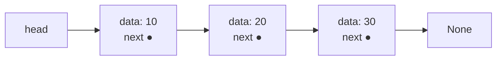
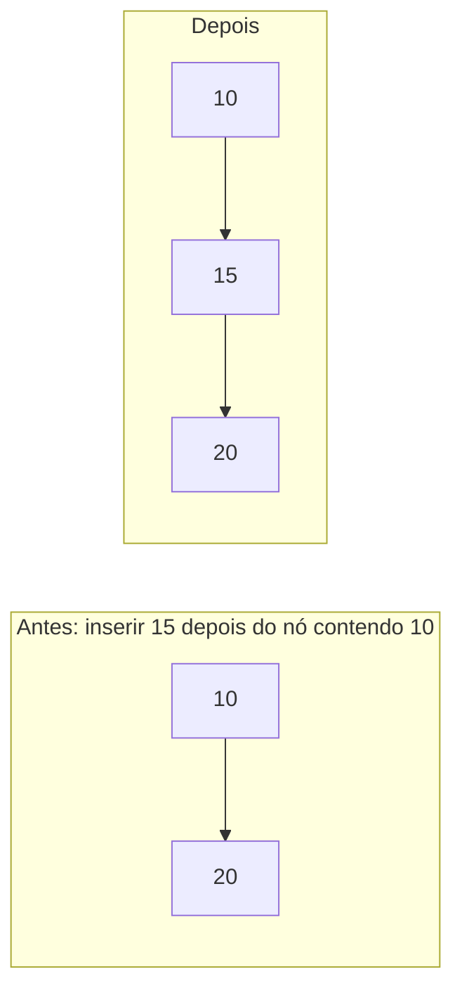

## Objetivos de Aprendizagem

- Explicar como uma lista encadeada simples representa uma sequência usando nós e ponteiros em vez de memória contígua.
- Implementar inserção e remoção de nó na cabeça e numa posição arbitrária, do zero.
- Analisar por que acessar um elemento por índice é O(n) numa lista encadeada mesmo que inserção numa posição conhecida seja O(1).
- Comparar o layout de memória de uma lista encadeada com o de um vetor estático, e prever a consequência para acesso aleatório versus inserção.

## Contexto e Motivação

Vetores estáticos e dinâmicos dependem ambos de um requisito inegociável: todos os seus elementos precisam viver num único bloco contíguo de memória. Esse requisito é exatamente o que torna acesso indexado O(1), mas também é exatamente o que torna inserir ou remover um elemento no meio caro, já que tudo depois da mudança precisa fisicamente deslocar para preservar contiguidade. A **lista encadeada simples** é construída em torno de abandonar esse requisito completamente. Em vez de um bloco contendo todo elemento lado a lado, uma lista encadeada é uma cadeia de **nós** alocados individualmente, espalhados em qualquer lugar da memória, cada um contendo um pedaço de dado e um ponteiro para o próximo nó da sequência. Nada sobre a localização de um nó na memória tem qualquer relação com sua posição na sequência lógica; a ordem da sequência vive inteiramente na cadeia de ponteiros, não em nenhuma aritmética de endereço.

Essa é uma troca genuína, não uma melhoria estrita: abrir mão de contiguidade significa abrir mão de acesso indexado O(1); para alcançar o quinto elemento, não há fórmula análoga a `base + i * tamanho`; a única forma de chegar lá é começar no primeiro nó e seguir quatro ponteiros `próximo`, um salto de cada vez, que é O(n) no pior caso. O que se ganha em troca é que uma vez que um nó particular já esteja *em mãos* (alcançado via uma referência, não via um índice), inserir um novo nó logo depois dele, ou removê-lo, é O(1): nenhum deslocamento de nenhum outro elemento é exigido, porque nada mais na memória precisa se mover. Religar um ou dois ponteiros é tudo que é necessário. Esse é o contraponto estrutural a tudo em que vetores estáticos e dinâmicos são bons e ruins, e o CS106B de Stanford introduz listas encadeadas especificamente como esse contraponto, não como uma substituta para vetores, mas como um segundo ponto no mesmo espaço de design, otimizado para um padrão de acesso diferente. Entender listas encadeadas simples com precisão, no nível do que um `Node` de fato é e como o rewiring de ponteiros de fato funciona, é o que torna a troca vetor-versus-lista-encadeada (o conceito final desta sequência) uma questão de julgamento de engenharia genuíno em vez de regras práticas decoradas.

## Teoria Central

### O Node: a unidade atômica de uma lista encadeada

Uma lista encadeada simples não tem um único bloco de memória representando a sequência inteira. Em vez disso, é construída a partir de **nós** alocados individualmente, cada um um pequeno objeto contendo exatamente duas coisas: um pedaço de dado, e uma referência (ponteiro) para o *próximo* nó da sequência, ou um valor especial nulo/None se for o último nó. A própria lista mantém só uma referência ao primeiro nó, chamada a **cabeça** (head), e, em muitas implementações, também uma referência ao último nó, a **cauda** (tail), para tornar anexar rápido.

```python
class Node:
    def __init__(self, data, next=None):
        self.data = data
        self.next = next
```



Cada nó pode ser alocado em qualquer lugar da memória; não há exigência, e geralmente não há realidade, de eles serem adjacentes. A única coisa conectando `data: 10` a `data: 20` é o ponteiro armazenado dentro do primeiro nó; não há aritmética de endereço que pudesse localizar `data: 20` sem primeiro ler esse ponteiro.

### Percurso: a única forma de alcançar um nó

Como os nós não são contíguos, há exatamente uma forma de alcançar o k-ésimo nó: começar em `head` e seguir ponteiros `next` k vezes.

```python
def get(head, index):
    current = head
    steps = 0
    while current is not None:
        if steps == index:
            return current.data
        current = current.next
        steps += 1
    raise IndexError("índice fora do intervalo")
```

Isso é O(n) no pior caso (alcançar o último nó exige n-1 saltos); não há forma mais rápida, porque nada sobre o endereço de memória de um nó codifica sua posição lógica. Este é o oposto estrutural direto da fórmula `base + i * tamanho` de um vetor estático.

### Inserção e remoção O(1), mas só num nó conhecido

O retorno de abrir mão de acesso aleatório é que uma vez que uma referência a um nó específico já é mantida, inserção ou remoção junto a ele exige só rewiring de ponteiros, nunca deslocar outros elementos.

**Inserindo na cabeça** (o caso O(1) mais simples e mais comum):

```python
def insert_at_head(head, data):
    new_node = Node(data, next=head)   # novo nó aponta pra antiga cabeça
    return new_node                     # novo nó É a nova cabeça
```

**Inserindo depois de um nó dado** `prev` (prev já mantido, por exemplo, de um percurso anterior):

```python
def insert_after(prev, data):
    new_node = Node(data, next=prev.next)   # novo nó aponta pro que prev costumava apontar
    prev.next = new_node                     # prev agora aponta pro novo nó
```



**Removendo o nó depois de um nó dado** `prev`:

```python
def delete_after(prev):
    if prev.next is None:
        raise IndexError("nada para remover")
    removed = prev.next
    prev.next = prev.next.next   # pula por cima do nó removido
    return removed.data
```

Tanto `insert_after` quanto `delete_after` tocam um número fixo e pequeno de ponteiros, O(1), independentemente de quão longa a lista seja, *desde que* `prev` já seja uma referência em mãos. Essa condição importa enormemente: achar `prev` em primeiro lugar, se ainda não é conhecido, exige um percurso O(n), e o "O(1)" se aplica só ao próprio rewiring de ponteiros, nunca a qualquer busca que teve que acontecer antes.

### O caso especial crítico: remover ou inserir na cabeça não exige nenhum `prev`

Como a cabeça é o ponto de entrada designado da lista, operações lá não exigem percurso algum: o `insert_at_head` acima nunca toca o ponteiro de um nó existente, e remover a cabeça é igualmente direto:

```python
def delete_head(head):
    if head is None:
        raise IndexError("lista está vazia")
    return head.next   # a nova cabeça; o antigo nó da cabeça é simplesmente descartado
```

Essa é a razão de uma lista encadeada simples ser um encaixe natural para um TAD Pilha (push/pop numa extremidade, coberto como seu próprio conceito depois): tanto `insert_at_head` quanto `delete_head` são incondicionalmente O(1), sem percurso necessário de forma alguma, diferente de inserção ou remoção na *cauda*, que (sem uma referência de cauda mantida com algo tipo um ponteiro `prev`, impossível numa lista puramente encadeada simples sem percurso) exige andar a lista inteira para achar o penúltimo nó primeiro.

## Exemplos Resolvidos

### Exemplo 1: construindo uma lista do zero e percorrendo ela

**Problema:** construa a sequência [10, 20, 30] como uma lista encadeada simples inserindo na cabeça três vezes, depois imprima ela por percurso, e explique por que a ordem de inserção teve que ser invertida.

```python
head = None
for value in [30, 20, 10]:            # insere em ordem reversa
    head = insert_at_head(head, value)

# Percorre e imprime
current = head
result = []
while current is not None:
    result.append(current.data)
    current = current.next
print(result)   # [10, 20, 30]
```

**Raciocínio.** `insert_at_head` sempre coloca o novo nó na frente, empurrando tudo mais para trás, então para acabar com `[10, 20, 30]` nessa ordem final, os valores tiveram que ser inseridos na ordem *reversa* (30 primeiro, acabando mais fundo na lista; 10 por último, acabando na frente). Esta é uma consequência direta e inevitável da mecânica da inserção na cabeça: é o espelho exato de como empilhar repetidamente numa pilha, depois desempilhar tudo, inverte a ordem, porque é exatamente isso que inserção na cabeça é.

### Exemplo 2: inserindo num índice arbitrário (combinando percurso com rewiring O(1))

**Problema:** implemente `insert_at_index(head, index, value)` para uma lista encadeada simples, e use ela para inserir 99 no índice 2 na lista [10, 20, 30, 40].

```python
def insert_at_index(head, index, value):
    if index == 0:
        return insert_at_head(head, value)

    prev = head
    for _ in range(index - 1):        # anda até o nó bem ANTES do índice alvo
        if prev is None:
            raise IndexError("índice fora do intervalo")
        prev = prev.next
    if prev is None:
        raise IndexError("índice fora do intervalo")

    insert_after(prev, value)
    return head


# Constrói [10, 20, 30, 40]
head = None
for value in [40, 30, 20, 10]:
    head = insert_at_head(head, value)

head = insert_at_index(head, 2, 99)

current = head
result = []
while current is not None:
    result.append(current.data)
    current = current.next
print(result)   # [10, 20, 99, 30, 40]
```

**Raciocínio.** Este exemplo torna explícito e visível o custo de duas fases de "inserir no índice i": a fase um (o laço `for`) é um percurso O(i) até alcançar o nó bem antes da posição alvo, trabalho genuinamente linear, exatamente como o custo de acesso geral de uma lista encadeada, e a fase dois (`insert_after`) é rewiring de ponteiros O(1) uma vez que `prev` está em mãos. O custo geral de `insert_at_index` é portanto O(i), não O(1); a afirmação O(1) para inserção em lista encadeada se aplica estritamente ao passo de rewiring sozinho, nunca a localizar o ponto de inserção a partir de um índice, que é precisamente a nuance que o Exemplo 3 na seção de equívocos abaixo existe para corrigir.

### Exemplo 3: implementando um TAD Pilha em cima de uma lista encadeada simples

**Problema:** usando só `insert_at_head` e `delete_head`, implemente um TAD Pilha (`push`, `pop`, `peek`) e verifique a ordem LIFO.

```python
class LinkedStack:
    def __init__(self):
        self._head = None

    def push(self, value):
        self._head = insert_at_head(self._head, value)   # O(1), sem percurso

    def pop(self):
        if self._head is None:
            raise IndexError("pop numa pilha vazia")
        value = self._head.data
        self._head = delete_head(self._head)              # O(1), sem percurso
        return value

    def peek(self):
        if self._head is None:
            raise IndexError("peek numa pilha vazia")
        return self._head.data


s = LinkedStack()
for v in [1, 2, 3]:
    s.push(v)
print(s.pop(), s.pop(), s.pop())   # 3 2 1, ordem LIFO confirmada
```

**Raciocínio.** Toda operação aqui toca só a cabeça, nunca nenhum outro nó, então toda operação é genuinamente O(1), sem nenhum percurso escondido em nenhum lugar, diferente da inserção baseada em índice do Exemplo 2. Esse é exatamente o ponto feito na Teoria Central sobre a cabeça ser um ponto de acesso "grátis" O(1) que não exige percurso algum, e é por isso que uma lista encadeada simples é uma estrutura de suporte perfeitamente natural e eficiente para o TAD Pilha introduzido como seu próprio conceito mais adiante nesta disciplina.

## Equívocos Comuns e Armadilhas

- **"Inserção numa lista encadeada é sempre O(1), esse é todo o propósito de listas encadeadas."** Só é verdade para inserção numa referência de nó *já mantida* (mais comumente a cabeça). Como o Exemplo 2 mostra explicitamente, inserir num índice numérico exige um percurso O(i) para localizar o ponto de inserção antes que o rewiring O(1) possa acontecer; a operação geral é O(i), não O(1), a menos que a posição já seja conhecida como uma referência de nó em vez de um índice.
- **"Uma lista encadeada simples pode remover ou inserir na cauda eficientemente se você só mantiver um ponteiro `tail`."** Manter um ponteiro `tail` torna *inserir* no final O(1) (anexar depois de `tail`, depois atualizar `tail` para o novo nó). Isso **não** ajuda a *remover* o último nó em O(1), porque depois de remover o nó da cauda, a nova cauda precisa ser o nó antes dele, e numa lista encadeada simples, não há forma de ir de um nó ao seu predecessor sem percorrer a partir da cabeça. Essa assimetria (anexar O(1) na cauda, mas remover O(n) na cauda) é uma consequência direta e checável de os ponteiros só irem numa direção, e é exatamente o que listas duplamente encadeadas (o próximo conceito) são construídas para consertar.
- **"Percurso e acesso indexado são basicamente o mesmo custo de um vetor, só escritos diferente."** Não são a mesma classe de complexidade. O `a[i]` de um vetor é O(1) via cálculo direto de endereço; o `get(i)` de uma lista encadeada (Teoria Central) é O(n), porque não há fórmula de endereço, só seguimento sequencial de ponteiros a partir da cabeça. Escrever sintaxe estilo `lista[i]` em cima de uma lista encadeada pode esconder esse custo de um leitor mas nunca o remove.
- **"Perder uma referência à cabeça significa que a lista ainda pode ser recuperada."** Se a variável mantendo `head` é sobrescrita ou perdida antes de qualquer outro nó manter uma referência ao primeiro nó, todo nó na lista se torna inalcançável (e, em linguagens com coleta de lixo, elegível para coleta); não há forma de reconstruir `head` a partir dos nós restantes, já que nada aponta de volta para ele. Este é um padrão de bug real e checável: por exemplo, escrever `head = head.next` antes de salvar o valor original de `head` em outro lugar descarta silenciosamente a lista original inteira a partir desse ponto.

## Resumo

Uma lista encadeada simples representa uma sequência como uma cadeia de nós alocados independentemente, cada um contendo dado e um ponteiro para o próximo nó, com a própria lista rastreando só a cabeça. Isso abandona a garantia de memória contígua do vetor, que é precisamente por que acesso indexado degrada para percurso O(n); não há atalho de aritmética de endereço, só seguimento de ponteiro um salto de cada vez. Em troca, uma vez que um nó específico já é mantido por referência, inserir ou remover imediatamente depois dele é rewiring de ponteiro O(1) puro, sem deslocamento de nenhum outro elemento exigido, o mais útil e incondicionalmente verdadeiro na cabeça, que não exige percurso algum para alcançar. Essa combinação (acesso caro por posição, modificação barata num ponto conhecido, e operações especialmente baratas na cabeça) torna listas encadeadas simples uma estrutura de suporte natural para TADs como a pilha, e estabelece as trocas exatas que listas duplamente encadeadas e a comparação vetor-versus-lista-encadeada, ambas cobertas a seguir, constroem diretamente em cima.

## Documentation Links

- [Stanford CS106B — Lecture Schedule](https://web.stanford.edu/class/cs106b/schedule) — doc
- [ACM/IEEE CS2013 — Software Development Fundamentals (SDF)](https://csed.acm.org/wp-content/uploads/2023/09/SDF-Version-Gamma.pdf) — doc
