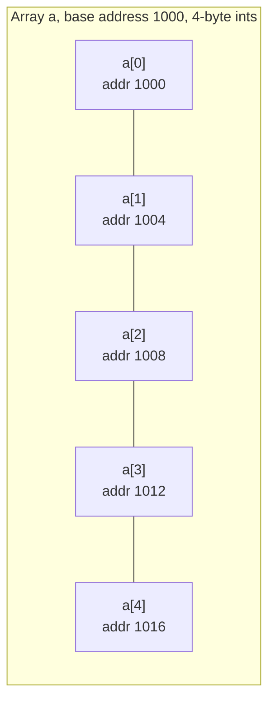
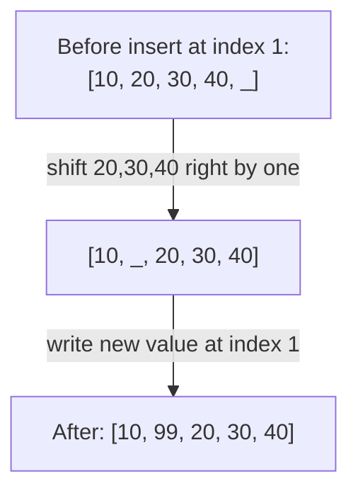

## Learning Objectives

- Explain why contiguous memory layout is what makes O(1) indexed access possible in a static array.
- Derive the address-calculation formula an array uses to compute the location of `a[i]` from a base address.
- Analyze which array operations are O(1) and which are O(n), and explain the memory-layout reason for each.
- Predict the runtime consequences of an array's fixed size, including out-of-bounds behavior and the cost of insertion or deletion at arbitrary positions.

## Context & Motivation

The static array is usually the very first data structure anyone meets, often without being told it *is* one — `int[] scores = new int[10]` looks so close to ordinary variable declaration that its most important property, contiguous memory, tends to go unstated. That property is not a minor implementation detail; it is the entire reason arrays are fast at the one thing they are famous for: random access. Reading `a[7]` from a million-element array takes exactly the same amount of time as reading `a[0]` — not because the computer is clever about search, but because it never searches at all. It computes an address directly from the index and jumps straight there. This is the single fact from which almost everything else about arrays follows, and MIT's 6.006 introductory algorithms course builds its entire early treatment of sequences around making this concrete: an array is not "a list of things" in the abstract sense — it's a fixed, unbroken run of equally-sized memory slots, and indexing is arithmetic, not search.

Understanding *why* this works, in terms of actual memory addresses, matters for a reason beyond curiosity: it explains exactly which operations an array is good at and which it is fundamentally bad at, in a way that memorizing a complexity table never does. Once the address-arithmetic mechanism is genuinely understood, it becomes obvious — not memorized — that inserting a new element at the front of an array requires physically moving every other element over by one slot, because there is no way to "make room" inside a block of memory that is already fully occupied and contiguous. Nothing about the array is flexible about its own boundaries; that rigidity is the price paid for the speed of indexed access, and every later data structure in this discipline exists, in one way or another, as an answer to a different point on that same trade-off. Grasping static arrays precisely, before moving to dynamic arrays that hide a static array's rigidity behind a resizing strategy, is the necessary foundation for that whole story. This concept assumes Big-O notation is already familiar ground from `programming-computational-thinking`; the goal here is applying that notation correctly to a structure whose behavior is fully explained by how memory actually works.

## Core Theory

### Definition: contiguous, fixed-size, homogeneous

A **static array** is a fixed-size block of memory divided into equal-sized slots, laid out contiguously (back-to-back, with no gaps), each slot holding one element of the same fixed type (and therefore the same fixed size in bytes). "Static" here refers to size: once allocated, the array occupies exactly that many slots for its entire lifetime — it can be neither grown nor shrunk. This is distinct from a *dynamic* array (covered next), which simulates growth by allocating a new, larger static array and copying data across when needed.

### Address arithmetic: why indexing is O(1)

The mechanism behind O(1) indexed access is direct address computation. If an array's first element lives at memory address `base`, and each element occupies `size` bytes, then the address of element `a[i]` is:

```
address(a[i]) = base + i * size
```

This is a single multiplication and a single addition — a fixed amount of work regardless of how large `i` is or how large the array is. There is no traversal, no comparison, no search: the hardware computes this address directly and reads (or writes) that location. This is precisely why array indexing is O(1) — the *time* to compute an address does not depend on the array's size or on which index is requested.



`address(a[3]) = 1000 + 3 * 4 = 1012` — computed directly, without visiting `a[0]`, `a[1]`, or `a[2]` first.

### Why insertion and deletion in the middle are O(n)

Contiguity is a double-edged property: it is exactly what makes address arithmetic possible, and it is exactly what makes inserting or removing an element at an arbitrary position expensive. Because there are no gaps between slots, inserting a new element at position `i` requires first shifting every element from index `i` onward one slot to the right to open up space — and deleting an element at position `i` requires shifting every element after it one slot to the left to close the gap. Both operations touch, in the worst case (inserting/deleting near the front), essentially every element in the array — O(n) work — even though the "logical" change (one element added or removed) sounds small.



### Fixed capacity and out-of-bounds access

Because a static array's size is fixed at allocation time, accessing `a[i]` for `i < 0` or `i >= length` is undefined or explicitly erroneous behavior, depending on the language — it reaches outside the block of memory the array actually owns. Some languages (Java, Python) raise a runtime exception (`ArrayIndexOutOfBoundsException`, `IndexError`); others (raw C) simply read or write whatever bytes happen to sit at that computed address, which is a well-known source of memory-corruption bugs. Either way, the underlying cause is the same: the address-arithmetic formula from above does not know or care where the array's boundaries are — it will happily compute an address past the end of the allocated block, and it is the language runtime's job (or lack thereof) to check that the computed address is still inside the array before honoring the access.

### Complexity summary for static array operations

| Operation | Complexity | Why |
|---|---|---|
| Access by index, `a[i]` | O(1) | Direct address computation |
| Update by index, `a[i] = x` | O(1) | Direct address computation |
| Search for a value (unsorted) | O(n) | Must check elements one by one, no shortcut |
| Insert / delete at front or middle | O(n) | Must shift all subsequent elements |
| Insert / delete at the end (if there's already free capacity) | O(1) | No shift needed — nothing after it to move |

## Worked Examples

### Example 1 — computing an address by hand

**Problem:** An array of 8-byte doubles begins at memory address 2000. What is the address of `a[5]`, and how many bytes does the entire array (10 elements) occupy?

**Solution.** Using `address(a[i]) = base + i * size`:

```
address(a[5]) = 2000 + 5 * 8 = 2000 + 40 = 2040
```

The array occupies `10 * 8 = 80` bytes total, spanning addresses 2000 through 2079 (inclusive), since the last element `a[9]` starts at `2000 + 9*8 = 2072` and occupies 8 bytes (2072–2079).

**Reasoning.** This is exactly the calculation a compiled program performs at the machine-code level every time an indexed array access appears in source code — no loop, no comparison, just one multiply and one add, which is why the operation is O(1) independent of whether the array holds 10 elements or 10 million.

### Example 2 — implementing insert-at-index from scratch to see the O(n) cost directly

**Problem:** Implement `insert_at(arr, i, value, length)` for a fixed-capacity array (Python list used here purely as a raw memory block, with no built-in `insert`), and count how many element-moves it performs.

```python
def insert_at(arr, i, value, length, capacity):
    """
    arr: a preallocated list of size `capacity` (simulating a static array)
    length: number of elements currently in use (logical size)
    Returns the new logical length. Raises if no room.
    """
    if length >= capacity:
        raise OverflowError("array is full — a static array cannot grow")
    if not (0 <= i <= length):
        raise IndexError("insertion index out of bounds")

    moves = 0
    # Shift everything from the end down to index i, one slot right,
    # working BACKWARD so we don't overwrite values before reading them.
    j = length
    while j > i:
        arr[j] = arr[j - 1]
        moves += 1
        j -= 1

    arr[i] = value
    return length + 1, moves


# Demo: capacity 6, currently holding [10, 20, 30, 40], insert 99 at index 1
arr = [10, 20, 30, 40, None, None]
new_length, moves = insert_at(arr, 1, 99, length=4, capacity=6)
print(arr[:new_length])   # [10, 99, 20, 30, 40]
print(moves)              # 3  (elements 40, 30, 20 each moved one slot right)
```

**Reasoning.** Inserting one element at index 1 into a 4-element array required moving 3 existing elements — every element from the insertion point to the current end. In general, inserting at index `i` into a length-`n` array moves `n - i` elements, which is O(n) in the worst case (`i = 0`, inserting at the front, moves all `n` elements) and O(1) in the best case (`i = n`, inserting at the very end, moves zero elements — assuming spare capacity exists, which a *static* array of fixed capacity may not have at all). The backward-iteration detail (`j` starts at `length` and decreases) is not cosmetic: shifting forward instead would overwrite `arr[i+1]` with `arr[i]`'s new value before reading `arr[i+1]`'s original value, silently corrupting data — a genuine bug that shows up if the loop direction is gotten wrong.

### Example 3 — why linear search is the best an unsorted array can do

**Problem:** Given an unsorted static array, implement `contains(arr, length, target)` and explain why no array-based trick avoids O(n) in the worst case without additional structure (like sorting).

```python
def contains(arr, length, target):
    for i in range(length):
        if arr[i] == target:
            return True
    return False
```

**Reasoning.** Address arithmetic gives O(1) access *to a known index* — it does nothing to help find *which* index holds a target value, because the address formula takes an index as input, not a value. Without any ordering guarantee on the array's contents, the target could be anywhere, including the very last slot checked, or nowhere at all (which is only discoverable after checking every slot). So the search must, in the worst case, examine all `n` elements: O(n). This is exactly why `SortedBag.contains` from a companion concept can achieve O(log n) via binary search — sorting imposes structure that lets each comparison eliminate half the remaining candidates — but an unsorted static array has no such structure to exploit, and O(1) random access by index does not translate into O(1) or even O(log n) search by value.

## Common Misconceptions & Pitfalls

- **"Arrays are fast at everything because indexing is O(1)."** Indexing *by known index* is O(1); nothing else automatically inherits that speed. Search by value is O(n) (Example 3); insertion/deletion away from the end is O(n) (Example 2). Conflating "array" with "fast" without specifying *which* operation is one of the most common early mistakes.
- **"Inserting one element into an array is a cheap, constant-cost operation."** As Example 2 demonstrates concretely by counting moves, inserting near the front of an n-element array can require shifting up to n-1 existing elements — genuinely O(n) work for what looks like a "small" logical change.
- **"A static array can just grow if it needs more room."** By definition it cannot — its size is fixed at allocation. Code that appears to "grow" an array (like Python's `list.append()`) is actually working with a *dynamic* array under the hood, an entirely different data structure covered next, which allocates a brand-new, larger static array and copies the old contents across.
- **"Out-of-bounds access will always throw a clear error."** Whether it does depends entirely on the language runtime performing a bounds check before honoring the computed address — the address-arithmetic formula itself has no concept of array boundaries and will compute an address past the end without complaint; languages without automatic bounds checking (like raw C arrays) can silently read or corrupt unrelated memory.

## Summary

A static array is a fixed-size, contiguous block of memory, and its defining performance property — O(1) access to any index — follows directly and only from that contiguity: the address of `a[i]` is computed as `base + i * size`, a fixed amount of arithmetic independent of array size or index. That same contiguity is exactly what makes insertion and deletion at arbitrary positions expensive: with no gaps in memory, opening or closing a gap for one element requires physically shifting every subsequent element, which is O(n). Search for a value in an unsorted array gets no benefit from O(1) indexed access, since indexing requires already knowing the index, and remains O(n) in the worst case. Every one of these properties — the O(1) access, the O(n) shifting, the fixed capacity — traces back to the same root cause: a static array is a single unbroken block of same-sized slots, nothing more and nothing less.

## Documentation Links

- [MIT 6.006 — Lecture Notes (OCW)](https://ocw.mit.edu/courses/6-006-introduction-to-algorithms-spring-2020/pages/lecture-notes/) — doc
- [ACM/IEEE CS2013 — Software Development Fundamentals (SDF)](https://csed.acm.org/wp-content/uploads/2023/09/SDF-Version-Gamma.pdf) — doc
