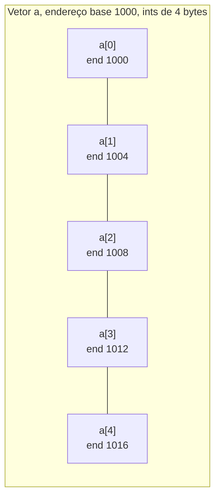
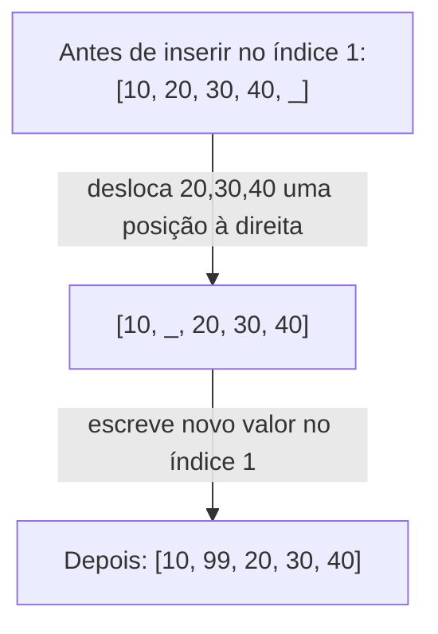

## Objetivos de Aprendizagem

- Explicar por que layout de memória contíguo é o que torna possível acesso indexado O(1) num vetor estático.
- Derivar a fórmula de cálculo de endereço que um vetor usa para computar a localização de `a[i]` a partir de um endereço base.
- Analisar quais operações de vetor são O(1) e quais são O(n), e explicar a razão de layout de memória para cada uma.
- Prever as consequências de tempo de execução do tamanho fixo de um vetor, incluindo comportamento fora dos limites e o custo de inserção ou remoção em posições arbitrárias.

## Contexto e Motivação

O vetor estático geralmente é a primeiríssima estrutura de dados que qualquer um encontra, frequentemente sem ser informado de que *é* uma: `int[] notas = new int[10]` parece tão próximo de uma declaração de variável comum que sua propriedade mais importante, memória contígua, costuma passar sem menção. Essa propriedade não é um detalhe menor de implementação; é a razão inteira de vetores serem rápidos na única coisa pela qual são famosos: acesso aleatório. Ler `a[7]` de um vetor de um milhão de elementos leva exatamente o mesmo tempo que ler `a[0]`, não porque o computador é esperto sobre busca, mas porque ele nunca busca de forma alguma. Ele computa um endereço diretamente a partir do índice e pula direto para lá. Esse é o único fato do qual quase tudo mais sobre vetores decorre, e o curso introdutório de algoritmos 6.006 do MIT constrói todo seu tratamento inicial de sequências em torno de tornar isso concreto: um vetor não é "uma lista de coisas" no sentido abstrato; é uma sequência fixa e ininterrupta de compartimentos de memória de tamanho igual, e indexação é aritmética, não busca.

Entender *por que* isso funciona, em termos de endereços de memória reais, importa por uma razão além de curiosidade: explica exatamente em quais operações um vetor é bom e em quais é fundamentalmente ruim, de um jeito que decorar uma tabela de complexidade nunca faz. Uma vez que o mecanismo de aritmética de endereço é genuinamente entendido, fica óbvio (não decorado) que inserir um novo elemento no início de um vetor exige mover fisicamente todo outro elemento um compartimento adiante, porque não há como "abrir espaço" dentro de um bloco de memória que já está completamente ocupado e contíguo. Nada no vetor é flexível quanto a suas próprias fronteiras; essa rigidez é o preço pago pela velocidade do acesso indexado, e toda estrutura de dados posterior nesta disciplina existe, de uma forma ou de outra, como uma resposta a um ponto diferente desse mesmo trade-off. Compreender vetores estáticos com precisão, antes de passar para vetores dinâmicos que escondem a rigidez de um vetor estático atrás de uma estratégia de redimensionamento, é a base necessária para toda essa história. Este conceito assume que notação Big-O já é território familiar de `programming-computational-thinking`; o objetivo aqui é aplicar essa notação corretamente a uma estrutura cujo comportamento é completamente explicado por como memória de fato funciona.

## Teoria Central

### Definição: contíguo, tamanho fixo, homogêneo

Um **vetor estático** é um bloco de memória de tamanho fixo dividido em compartimentos de tamanho igual, dispostos contiguamente (lado a lado, sem lacunas), cada compartimento guardando um elemento do mesmo tipo fixo (e portanto do mesmo tamanho fixo em bytes). "Estático" aqui se refere a tamanho: uma vez alocado, o vetor ocupa exatamente aquele número de compartimentos por toda sua vida útil; não pode ser nem crescido nem encolhido. Isso é distinto de um vetor *dinâmico* (coberto a seguir), que simula crescimento alocando um novo vetor estático maior e copiando dados quando necessário.

### Aritmética de endereço: por que indexação é O(1)

O mecanismo por trás do acesso indexado O(1) é cálculo direto de endereço. Se o primeiro elemento de um vetor vive no endereço de memória `base`, e cada elemento ocupa `size` bytes, então o endereço do elemento `a[i]` é:

```
endereço(a[i]) = base + i * size
```

Isso é uma única multiplicação e uma única adição, uma quantidade fixa de trabalho independentemente de quão grande `i` seja ou quão grande o vetor seja. Não há percurso, não há comparação, não há busca: o hardware computa esse endereço diretamente e lê (ou escreve) naquela localização. É precisamente por isso que indexação de vetor é O(1): o *tempo* para computar um endereço não depende do tamanho do vetor nem de qual índice é solicitado.



`endereço(a[3]) = 1000 + 3 * 4 = 1012`, computado diretamente, sem visitar `a[0]`, `a[1]`, ou `a[2]` primeiro.

### Por que inserção e remoção no meio são O(n)

Contiguidade é uma propriedade de dois gumes: é exatamente o que torna a aritmética de endereço possível, e é exatamente o que torna inserir ou remover um elemento numa posição arbitrária caro. Como não há lacunas entre compartimentos, inserir um novo elemento na posição `i` exige primeiro deslocar todo elemento a partir do índice `i` em diante um compartimento para a direita para abrir espaço, e remover um elemento na posição `i` exige deslocar todo elemento depois dele um compartimento para a esquerda para fechar a lacuna. As duas operações tocam, no pior caso (inserir/remover perto do início), essencialmente todo elemento do vetor, trabalho O(n), mesmo que a mudança "lógica" (um elemento adicionado ou removido) pareça pequena.



### Capacidade fixa e acesso fora dos limites

Como o tamanho de um vetor estático é fixo no momento da alocação, acessar `a[i]` para `i < 0` ou `i >= comprimento` é comportamento indefinido ou explicitamente erro, dependendo da linguagem; alcança fora do bloco de memória que o vetor de fato possui. Algumas linguagens (Java, Python) lançam uma exceção em tempo de execução (`ArrayIndexOutOfBoundsException`, `IndexError`); outras (C cru) simplesmente leem ou escrevem quaisquer bytes que aconteçam de estar naquele endereço computado, o que é uma fonte bem conhecida de bugs de corrupção de memória. De qualquer forma, a causa subjacente é a mesma: a fórmula de aritmética de endereço acima não sabe nem se importa onde as fronteiras do vetor estão; ela vai calcular alegremente um endereço além do fim do bloco alocado, e é trabalho do runtime da linguagem (ou a falta dele) checar que o endereço computado ainda está dentro do vetor antes de honrar o acesso.

### Resumo de complexidade para operações de vetor estático

| Operação | Complexidade | Por quê |
|---|---|---|
| Acesso por índice, `a[i]` | O(1) | Cálculo direto de endereço |
| Atualização por índice, `a[i] = x` | O(1) | Cálculo direto de endereço |
| Busca por um valor (não ordenado) | O(n) | Precisa checar elementos um por um, sem atalho |
| Inserir/remover no início ou meio | O(n) | Precisa deslocar todos os elementos subsequentes |
| Inserir/remover no final (se já há capacidade livre) | O(1) | Nenhum deslocamento necessário, nada depois para mover |

## Exemplos Resolvidos

### Exemplo 1: computando um endereço à mão

**Problema:** um vetor de doubles de 8 bytes começa no endereço de memória 2000. Qual é o endereço de `a[5]`, e quantos bytes o vetor inteiro (10 elementos) ocupa?

**Solução.** Usando `endereço(a[i]) = base + i * size`:

```
endereço(a[5]) = 2000 + 5 * 8 = 2000 + 40 = 2040
```

O vetor ocupa `10 * 8 = 80` bytes no total, abrangendo os endereços 2000 a 2079 (inclusive), já que o último elemento `a[9]` começa em `2000 + 9*8 = 2072` e ocupa 8 bytes (2072-2079).

**Raciocínio.** Esse é exatamente o cálculo que um programa compilado executa no nível de código de máquina toda vez que um acesso indexado a vetor aparece no código-fonte; nenhum laço, nenhuma comparação, só uma multiplicação e uma adição, que é por que a operação é O(1) independentemente de o vetor conter 10 elementos ou 10 milhões.

### Exemplo 2: implementando inserir-no-índice do zero para ver o custo O(n) diretamente

**Problema:** implemente `insert_at(arr, i, value, length)` para um vetor de capacidade fixa (lista Python usada aqui puramente como um bloco de memória cru, sem o `insert` embutido), e conte quantos movimentos de elemento ela realiza.

```python
def insert_at(arr, i, value, length, capacity):
    """
    arr: uma lista pré-alocada de tamanho `capacity` (simulando um vetor estático)
    length: número de elementos atualmente em uso (tamanho lógico)
    Retorna o novo comprimento lógico. Lança exceção se não há espaço.
    """
    if length >= capacity:
        raise OverflowError("vetor está cheio: um vetor estático não pode crescer")
    if not (0 <= i <= length):
        raise IndexError("índice de inserção fora dos limites")

    moves = 0
    # Desloca tudo do final até o índice i, uma posição à direita,
    # trabalhando DE TRÁS PARA FRENTE para não sobrescrever valores antes de lê-los.
    j = length
    while j > i:
        arr[j] = arr[j - 1]
        moves += 1
        j -= 1

    arr[i] = value
    return length + 1, moves


# Demo: capacidade 6, atualmente contendo [10, 20, 30, 40], insere 99 no índice 1
arr = [10, 20, 30, 40, None, None]
new_length, moves = insert_at(arr, 1, 99, length=4, capacity=6)
print(arr[:new_length])   # [10, 99, 20, 30, 40]
print(moves)              # 3 (elementos 40, 30, 20 cada um movido uma posição à direita)
```

**Raciocínio.** Inserir um elemento no índice 1 num vetor de 4 elementos exigiu mover 3 elementos existentes: todo elemento do ponto de inserção até o final atual. Em geral, inserir no índice `i` num vetor de comprimento `n` move `n - i` elementos, que é O(n) no pior caso (`i = 0`, inserindo no início, move todos os `n` elementos) e O(1) no melhor caso (`i = n`, inserindo bem no final, move zero elementos, assumindo que existe capacidade sobrando, o que um vetor *estático* de capacidade fixa pode não ter de forma alguma). O detalhe da iteração para trás (`j` começa em `length` e diminui) não é cosmético: deslocar para frente em vez disso sobrescreveria `arr[i+1]` com o novo valor de `arr[i]` antes de ler o valor original de `arr[i+1]`, corrompendo dados silenciosamente, um bug genuíno que aparece se a direção do laço for invertida por engano.

### Exemplo 3: por que busca linear é o melhor que um vetor não ordenado consegue fazer

**Problema:** dado um vetor estático não ordenado, implemente `contains(arr, length, target)` e explique por que nenhum truque baseado em vetor evita O(n) no pior caso sem estrutura adicional (como ordenação).

```python
def contains(arr, length, target):
    for i in range(length):
        if arr[i] == target:
            return True
    return False
```

**Raciocínio.** Aritmética de endereço dá acesso O(1) *a um índice conhecido*; ela não ajuda em nada a encontrar *qual* índice guarda um valor alvo, porque a fórmula de endereço recebe um índice como entrada, não um valor. Sem nenhuma garantia de ordenação sobre o conteúdo do vetor, o alvo poderia estar em qualquer lugar, incluindo o exato último compartimento checado, ou em lugar nenhum (o que só é descobrível depois de checar todo compartimento). Então a busca precisa, no pior caso, examinar todos os `n` elementos: O(n). É exatamente por isso que `BolsaOrdenada.contains` de um conceito irmão consegue alcançar O(log n) via busca binária (ordenação impõe estrutura que permite que cada comparação elimine metade dos candidatos restantes), mas um vetor estático não ordenado não tem tal estrutura para explorar, e acesso aleatório O(1) por índice não se traduz em busca O(1) ou sequer O(log n) por valor.

## Equívocos Comuns e Armadilhas

- **"Vetores são rápidos em tudo porque indexação é O(1)."** Indexação *por índice conhecido* é O(1); nada mais herda automaticamente essa velocidade. Busca por valor é O(n) (Exemplo 3); inserção/remoção longe do final é O(n) (Exemplo 2). Confundir "vetor" com "rápido" sem especificar *qual* operação é um dos erros iniciais mais comuns.
- **"Inserir um elemento num vetor é uma operação barata, de custo constante."** Como o Exemplo 2 demonstra concretamente contando movimentos, inserir perto do início de um vetor de n elementos pode exigir deslocar até n-1 elementos existentes, trabalho genuinamente O(n) para o que parece uma mudança lógica "pequena".
- **"Um vetor estático pode simplesmente crescer se precisar de mais espaço."** Por definição não pode; seu tamanho é fixo na alocação. Código que parece "crescer" um vetor (como o `list.append()` do Python) está de fato trabalhando com um vetor *dinâmico* por baixo, uma estrutura de dados inteiramente diferente coberta a seguir, que aloca um vetor estático novo e maior e copia o conteúdo antigo para lá.
- **"Acesso fora dos limites sempre vai lançar um erro claro."** Se lança depende inteiramente de o runtime da linguagem realizar uma checagem de limites antes de honrar o endereço computado; a própria fórmula de aritmética de endereço não tem nenhuma noção de fronteiras de vetor e vai calcular um endereço além do fim sem reclamar; linguagens sem checagem automática de limites (como vetores C crus) podem silenciosamente ler ou corromper memória não relacionada.

## Resumo

Um vetor estático é um bloco de memória contíguo e de tamanho fixo, e sua propriedade de desempenho definidora (acesso O(1) a qualquer índice) decorre direta e unicamente dessa contiguidade: o endereço de `a[i]` é computado como `base + i * size`, uma quantidade fixa de aritmética independente do tamanho do vetor ou do índice. Essa mesma contiguidade é exatamente o que torna inserção e remoção em posições arbitrárias caras: sem lacunas na memória, abrir ou fechar uma lacuna para um elemento exige deslocar fisicamente todo elemento subsequente, que é O(n). Busca por um valor num vetor não ordenado não recebe nenhum benefício do acesso indexado O(1), já que indexar exige já conhecer o índice, e permanece O(n) no pior caso. Cada uma dessas propriedades (o acesso O(1), o deslocamento O(n), a capacidade fixa) remonta à mesma causa raiz: um vetor estático é um único bloco ininterrupto de compartimentos de mesmo tamanho, nem mais nem menos.

## Documentation Links

- [MIT 6.006 — Lecture Notes (OCW)](https://ocw.mit.edu/courses/6-006-introduction-to-algorithms-spring-2020/pages/lecture-notes/) — doc
- [ACM/IEEE CS2013 — Software Development Fundamentals (SDF)](https://csed.acm.org/wp-content/uploads/2023/09/SDF-Version-Gamma.pdf) — doc
