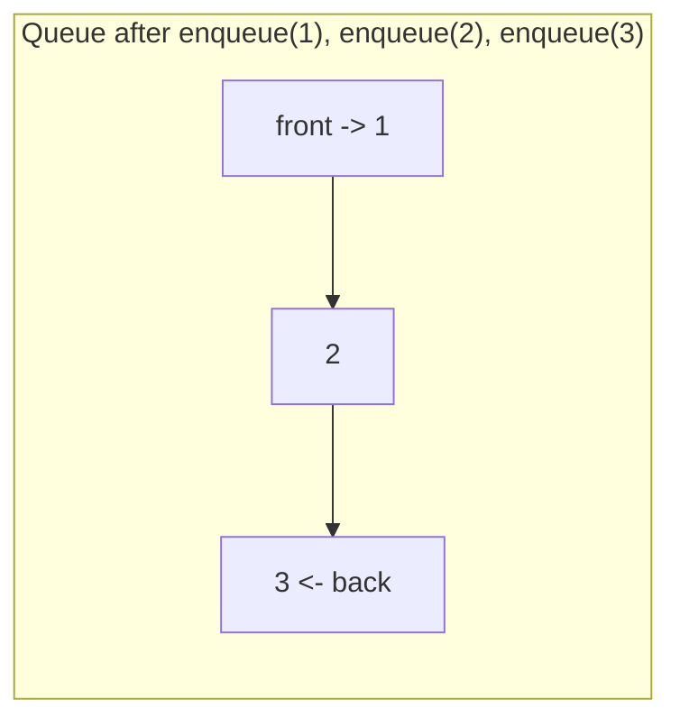
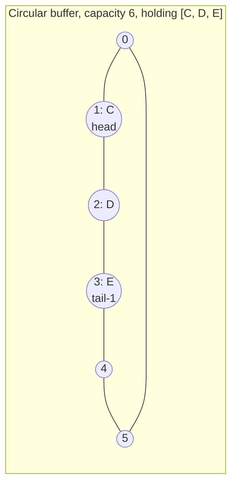

## Learning Objectives

- Define the Queue ADT by its interface (enqueue, dequeue, peek, isEmpty) and explain why FIFO ordering, not any particular storage layout, is the defining contract.
- Explain concretely why a naive array-backed queue that always removes from index 0 forces an O(n) shift on every dequeue.
- Implement a circular-buffer array-backed queue that achieves O(1) enqueue and dequeue by tracking head and tail indices modulo capacity.
- Implement a linked-list-backed queue using head and tail pointers, and compare its trade-offs against the circular buffer.
- Apply the Queue ADT to task scheduling and identify why FIFO order matches "first come, first served" fairness.

## Context & Motivation

Think about a single-file line at a ticket counter. The person who has been waiting longest is served next; someone who just joined the back of the line does not get served before people who arrived earlier. This is the opposite ordering rule from a stack: instead of Last-In-First-Out, it is **First-In-First-Out (FIFO)**. Whenever "fairness by arrival order" matters — a print queue processing jobs in the order they were submitted, a customer-service system routing requests, an operating system scheduler deciding which waiting process runs next — FIFO is the ordering guarantee that makes the system behave predictably and fairly. The Queue ADT is the abstraction that captures exactly this guarantee, with the same discipline the Stack ADT applied to LIFO: define the operations and the ordering contract, and let the implementation vary underneath.

Where the queue gets genuinely interesting — and where a surprising amount of real engineering judgment lives — is in how it is actually implemented on top of an array. A stack was easy to back with an array because both its operations touch the *same* end (the last occupied slot). A queue's two operations touch *opposite* ends: `enqueue` adds at the back, `dequeue` removes from the front. If "the front" is naively kept at array index 0, removing from the front means every remaining element has to shift down by one slot to close the gap — an O(n) operation, every single time. For a queue meant to be a cheap, constant-time primitive, this is a real performance defect, not a cosmetic one: a queue that silently degrades to O(n) per operation under load is a queue that cannot be trusted for high-throughput scheduling. The fix — letting the front pointer simply move forward through the array and wrap around when it runs off the end, rather than dragging the data back to meet a fixed front slot — is the **circular buffer**, and understanding why it is necessary, not just how to code it, is the substantive content of this concept.

## Core Theory

### The interface: what a queue promises, and nothing more

A Queue ADT is defined by its **operations**:

- `enqueue(x)` — add element `x` to the back (tail) of the queue.
- `dequeue()` — remove and return the element at the front (head) of the queue; undefined (or an explicit error) if the queue is empty.
- `peek()` (sometimes `front()`) — return the front element without removing it.
- `isEmpty()` — report whether the queue currently holds zero elements.

The defining invariant is **FIFO**: of all elements currently in the queue, `dequeue()` always returns the one that was enqueued *earliest* among those still present — the exact opposite selection rule from a stack's `pop()`.



`dequeue()` on this queue returns `1` first (the earliest arrival), then `2`, then `3` — the same order they were enqueued in, unlike a stack's reversal.

### Why the naive array-backed queue is O(n)

Suppose a queue is backed by an array where `front` is always kept at index 0 and new elements are appended after the last occupied slot. `enqueue` is a cheap append — O(1) amortized, same as a stack push. But `dequeue` must remove `array[0]` and then physically move every other element one slot to the left so that index 0 is occupied again:

```python
class NaiveArrayQueue:
    def __init__(self):
        self._data = []

    def enqueue(self, x):
        self._data.append(x)          # O(1) amortized

    def dequeue(self):
        if not self._data:
            raise IndexError("dequeue from empty queue")
        x = self._data[0]
        # shifting every remaining element down by one — this is the O(n) cost
        for i in range(1, len(self._data)):
            self._data[i - 1] = self._data[i]
        self._data.pop()
        return x
```

If the queue holds n elements, this shift touches all n − 1 remaining elements on *every* `dequeue` call — not occasionally, as with array resizing's amortized cost, but every single time. A workload of n enqueues followed by n dequeues costs O(n) total for the enqueues but O(n²) total for the dequeues (n, then n−1, then n−2, … down to 1 element shifted). This is a genuinely different and worse cost profile than the amortized O(1) a queue is supposed to offer — it is not a minor inefficiency, it defeats the purpose of using an array-backed queue at all for any workload with many dequeues.

### The circular buffer fix

The shifting is only necessary because "front" was pinned to index 0. Nothing requires that — the fix is to let a `head` index track wherever the front logically is, and advance it (rather than moving data) on every dequeue. Symmetrically, a `tail` index tracks where the next enqueue should write. Both indices march forward through a fixed-size array and **wrap around to 0** when they run past the end — hence "circular."



Here `head` points at index 1 (`C`, the oldest surviving element) and the next enqueue will write at index 4; if `head` or the write position ever passes index 5, it wraps back to index 0 rather than requiring any data to move.

```python
class CircularArrayQueue:
    def __init__(self, capacity=4):
        self._data = [None] * capacity
        self._head = 0     # index of the front element
        self._size = 0

    def _grow(self):
        bigger = [None] * (len(self._data) * 2)
        for i in range(self._size):
            bigger[i] = self._data[(self._head + i) % len(self._data)]
        self._data = bigger
        self._head = 0

    def enqueue(self, x):
        if self._size == len(self._data):
            self._grow()
        tail = (self._head + self._size) % len(self._data)
        self._data[tail] = x
        self._size += 1

    def dequeue(self):
        if self._size == 0:
            raise IndexError("dequeue from empty queue")
        x = self._data[self._head]
        self._data[self._head] = None
        self._head = (self._head + 1) % len(self._data)
        self._size -= 1
        return x

    def peek(self):
        if self._size == 0:
            raise IndexError("peek at empty queue")
        return self._data[self._head]

    def is_empty(self):
        return self._size == 0
```

Both `enqueue` and `dequeue` are now O(1) — `dequeue` only ever advances `head` by one slot (with a modulo wrap) and never touches any other element. The one remaining O(n) event is the occasional resize when the buffer fills, which — exactly as with a dynamic array — is amortized O(1) per operation over a long sequence, because a resize of size n cannot recur until n more operations have happened.

### Linked-list-backed implementation

A queue maps just as naturally onto a linked list, provided the list keeps a pointer to **both** ends: `enqueue` appends at the `tail` pointer, `dequeue` removes from the `head` pointer. Because both ends are tracked directly, no circular indexing or capacity is needed at all.

```python
class _Node:
    __slots__ = ("value", "next")
    def __init__(self, value, next=None):
        self.value = value
        self.next = next

class LinkedQueue:
    def __init__(self):
        self._head = None
        self._tail = None
        self._size = 0

    def enqueue(self, x):
        node = _Node(x)
        if self._tail is None:
            self._head = self._tail = node
        else:
            self._tail.next = node
            self._tail = node
        self._size += 1

    def dequeue(self):
        if self._head is None:
            raise IndexError("dequeue from empty queue")
        x = self._head.value
        self._head = self._head.next
        if self._head is None:
            self._tail = None    # queue is now empty; tail must follow
        self._size -= 1
        return x

    def is_empty(self):
        return self._head is None
```

Both `enqueue` and `dequeue` are O(1) worst-case, no amortization, no resizing — the trade-off against the circular buffer is again memory overhead (a pointer per node) and cache locality, not asymptotic speed. Both backings honor the identical FIFO contract, exactly as both a resizing array and a linked list honored the Stack ADT's LIFO contract.

## Worked Examples

### Example 1 — tracing enqueue/dequeue order

**Problem:** Starting from an empty queue, execute `enqueue(A)`, `enqueue(B)`, `enqueue(C)`, `dequeue()`, `enqueue(D)`, `dequeue()`, `dequeue()` in order. What does each `dequeue()` return, and what remains?

| Operation | Queue after (front listed first) | Returned |
|---|---|---|
| enqueue(A) | [A] | — |
| enqueue(B) | [A, B] | — |
| enqueue(C) | [A, B, C] | — |
| dequeue() | [B, C] | A |
| enqueue(D) | [B, C, D] | — |
| dequeue() | [C, D] | B |
| dequeue() | [D] | C |

**Reasoning.** Unlike the stack trace from `the-stack-adt`, each `dequeue()` returns elements in the *same relative order* they were enqueued (A, then B, then C) — FIFO preserves arrival order rather than reversing it. `D`, enqueued after two dequeues had already happened, correctly waits behind `C` and has not been returned yet. Final state: queue holds `[D]`.

### Example 2 — walking through why the naive queue degrades

**Problem:** Enqueue 5 elements into a `NaiveArrayQueue`, then dequeue all 5. Count the total number of element-shifts performed across all 5 dequeues, and compare against a `CircularArrayQueue` performing the same workload.

**Naive queue.** After 5 enqueues, `self._data = [A, B, C, D, E]`.

| dequeue call | element removed | remaining before shift | shifts performed |
|---|---|---|---|
| 1st | A | [B,C,D,E] | 4 |
| 2nd | B | [C,D,E] | 3 |
| 3rd | C | [D,E] | 2 |
| 4th | D | [E] | 1 |
| 5th | E | [] | 0 |

Total shifts: 4 + 3 + 2 + 1 + 0 = 10, which for n = 5 is n(n−1)/2 — quadratic in n. For n = 1000 this would be roughly 500,000 element moves just to drain the queue once.

**Circular buffer queue.** Each `dequeue()` performs exactly one assignment (`self._data[self._head] = None`) and one index update (`head = (head+1) % capacity`) — no shifting of any other element, regardless of how many elements are in the queue. Total work across all 5 dequeues: 5 constant-time operations, not 10 element-moves that grow with n. This is the concrete demonstration of why the circular buffer isn't a micro-optimization — it changes the total cost of draining n elements from O(n²) to O(n).

### Example 3 — a queue for task scheduling

**Problem:** A simple task scheduler needs to run tasks in the order they were submitted, one at a time, with new tasks arriving while others are still waiting. Model this with a queue and trace 4 submissions interleaved with 2 runs.

```python
scheduler = CircularArrayQueue()
scheduler.enqueue("send-email")
scheduler.enqueue("resize-image")
scheduler.enqueue("backup-db")

# Worker picks up the next task to run — it must be the oldest waiting one
next_task = scheduler.dequeue()   # "send-email" — submitted first, runs first
print(next_task)

scheduler.enqueue("send-report")  # arrives while backup-db and resize-image still wait

next_task = scheduler.dequeue()   # "resize-image" — next oldest, still ahead of send-report
print(next_task)
```

**Reasoning.** `send-report` arrives after `resize-image` and `backup-db` are already waiting, so even though it is now the "newest" task, it must wait behind both — FIFO order means arrival time alone determines priority, with no regard to *when* the queue happened to be checked. After this trace, the queue holds `["backup-db", "send-report"]` in that order. This is precisely the "first come, first served" fairness guarantee that makes a queue, not a stack, the right structure for task scheduling — a stack would run the *most recently* submitted task first, which would let a burst of new submissions starve tasks that had been waiting patiently. (The same FIFO discipline is what lets breadth-first search visit graph vertices in order of distance from a source, a use of the Queue ADT explored in a later algorithms discipline.)

## Common Misconceptions & Pitfalls

- **"An array-backed queue is naturally O(1) the same way an array-backed stack is."** A stack's push/pop both touch the same end, so no shifting is ever needed. A queue's enqueue and dequeue touch opposite ends — without a circular buffer (or a linked list with a tail pointer), a naive front-at-index-0 implementation is O(n) per dequeue, as demonstrated concretely in Example 2. Assuming array-backing automatically gives a queue the same performance profile as a stack is a common and costly mistake.
- **"The circular buffer's wraparound is a minor implementation detail."** It is the entire mechanism that avoids shifting — without `% capacity` wraparound on both `head` and the write position, the buffer would either run off the end of the array or require the naive shift again once `head` reaches the last index. The modulo arithmetic is load-bearing, not cosmetic.
- **"isEmpty() and 'head == tail' mean the same thing in a circular buffer."** In a fixed-capacity circular buffer without an explicit `size` counter, `head == tail` is ambiguous — it could mean the buffer is empty *or* completely full (both leave head and tail coinciding after wraparound). This is why the `CircularArrayQueue` implementation above tracks `size` explicitly rather than inferring emptiness from index comparison — a genuinely common source of off-by-one bugs in circular buffer code that skips the counter.
- **"A queue and a stack are basically the same structure with the same use cases."** They enforce opposite ordering rules (FIFO vs LIFO) and are suited to opposite kinds of problems: a stack matches "undo the most recent action" or "match the most recently opened bracket," while a queue matches "serve whoever has waited longest." Reaching for a stack when a queue's fairness guarantee is actually needed (or vice versa) produces code that behaves correctly on tiny test cases but returns elements in the wrong order under any real, order-sensitive workload.
- **"Since both enqueue and dequeue are O(1), a queue never has a slow operation."** Both are O(1) *amortized* on the circular array backing — an occasional resize is still O(n), just infrequent enough to average out, exactly as with a dynamic array. A latency-sensitive system that cannot tolerate any single O(n) pause should either pre-size the buffer or use the linked-list backing, which has no resize step at all.

## Summary

A Queue ADT is defined by its FIFO contract — enqueue at the back, dequeue from the front, in strict first-come-first-served order — independent of storage. Backing a queue with a plain array and pinning "front" to index 0 forces an O(n) shift on every dequeue, degrading a full drain of n elements to O(n²) total work; a circular buffer fixes this by letting `head` and the enqueue position advance and wrap modulo the array's capacity, restoring O(1) amortized enqueue and dequeue with no data movement at all. A linked-list backing with both head and tail pointers achieves the same O(1) worst-case bounds without any resizing, at the cost of per-node pointer overhead. Task scheduling is the canonical application because "run whoever has waited longest" is precisely the FIFO guarantee a queue provides, and the same guarantee underlies breadth-first traversal order in later algorithmic contexts. The one substantive engineering lesson here — beyond the interface itself — is that a queue's two-ended access pattern makes its array implementation qualitatively harder to get right than a stack's single-ended one, and the circular buffer is the standard, necessary fix.

## Documentation Links

- [Sedgewick & Wayne — Stacks and Queues (Princeton lecture slides)](https://algs4.cs.princeton.edu/lectures/keynote/13StacksAndQueues.pdf) — doc
- [Stanford CS106B — Lecture Schedule](https://web.stanford.edu/class/cs106b/schedule) — doc
