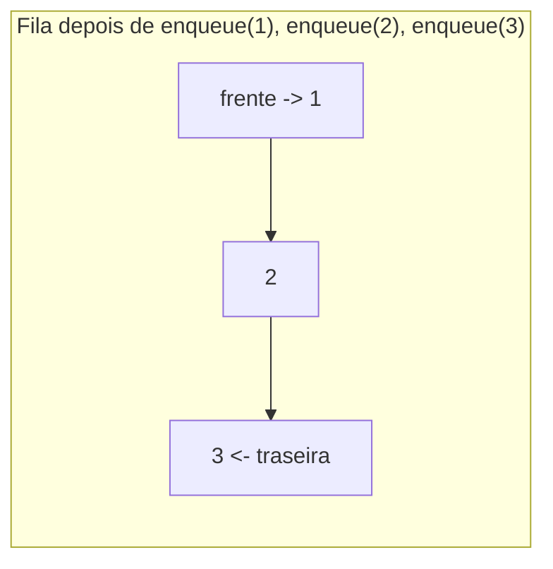
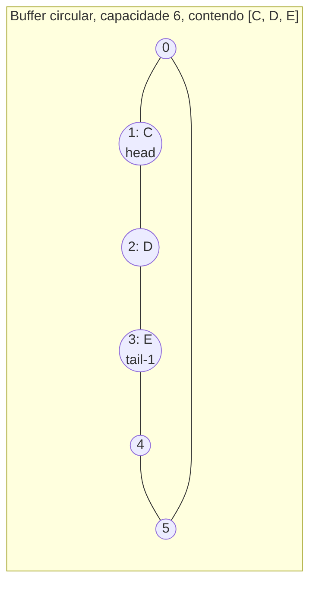

## Objetivos de Aprendizagem

- Definir o TAD Fila por sua interface (enqueue, dequeue, peek, isEmpty) e explicar por que ordenação FIFO, não algum layout de armazenamento particular, é o contrato definidor.
- Explicar concretamente por que uma fila ingênua com suporte em vetor que sempre remove do índice 0 força um deslocamento O(n) a cada dequeue.
- Implementar uma fila com suporte em vetor de buffer circular que alcança enqueue e dequeue O(1) rastreando índices de cabeça e cauda módulo a capacidade.
- Implementar uma fila com suporte em lista encadeada usando ponteiros de cabeça e cauda, e comparar suas trocas contra o buffer circular.
- Aplicar o TAD Fila a escalonamento de tarefas e identificar por que ordem FIFO corresponde à justiça de "primeiro a chegar, primeiro a ser servido".

## Contexto e Motivação

Pense numa fila única num guichê de bilhetes. A pessoa que está esperando há mais tempo é atendida a seguir; alguém que acabou de entrar no fim da fila não é atendido antes de pessoas que chegaram antes. Esta é a regra de ordenação oposta à de uma pilha: em vez de Last-In-First-Out, é **First-In-First-Out (FIFO)**. Sempre que "justiça por ordem de chegada" importa (uma fila de impressão processando trabalhos na ordem em que foram enviados, um sistema de atendimento ao cliente roteando solicitações, um escalonador de sistema operacional decidindo qual processo esperando roda a seguir), FIFO é a garantia de ordenação que faz o sistema se comportar de forma previsível e justa. O TAD Fila é a abstração que captura exatamente essa garantia, com a mesma disciplina que o TAD Pilha aplicou a LIFO: definir as operações e o contrato de ordenação, e deixar a implementação variar por baixo.

Onde a fila fica genuinamente interessante, e onde uma quantidade surpreendente de julgamento real de engenharia vive, é em como ela é de fato implementada em cima de um vetor. Uma pilha era fácil de suportar com um vetor porque suas duas operações tocam a *mesma* extremidade (o último slot ocupado). As duas operações de uma fila tocam extremidades *opostas*: `enqueue` adiciona na traseira, `dequeue` remove da frente. Se "a frente" é ingenuamente mantida no índice 0 do vetor, remover da frente significa que todo elemento restante precisa deslocar uma casa para baixo para fechar a lacuna, uma operação O(n), toda vez. Para uma fila que deveria ser um primitivo barato de tempo constante, isso é um defeito de desempenho real, não cosmético: uma fila que silenciosamente degrada para O(n) por operação sob carga é uma fila que não pode ser confiada para escalonamento de alto rendimento. A correção (deixar o ponteiro da frente simplesmente se mover para frente através do vetor e dar a volta quando chega ao fim, em vez de arrastar o dado de volta para encontrar um slot de frente fixo) é o **buffer circular**, e entender por que ele é necessário, não só como codificá-lo, é o conteúdo substancial deste conceito.

## Teoria Central

### A interface: o que uma fila promete, e nada mais

Um TAD Fila é definido por suas **operações**:

- `enqueue(x)`: adiciona o elemento `x` à traseira (cauda) da fila.
- `dequeue()`: remove e retorna o elemento na frente (cabeça) da fila; indefinido (ou um erro explícito) se a fila está vazia.
- `peek()` (às vezes `front()`): retorna o elemento da frente sem removê-lo.
- `isEmpty()`: informa se a fila atualmente contém zero elementos.

O invariante definidor é **FIFO**: de todos os elementos atualmente na fila, `dequeue()` sempre retorna aquele que foi enfileirado *mais cedo* entre os ainda presentes, a regra de seleção exatamente oposta ao `pop()` de uma pilha.



`dequeue()` nessa fila retorna `1` primeiro (a chegada mais antiga), depois `2`, depois `3`, a mesma ordem em que foram enfileirados, diferente da inversão de uma pilha.

### Por que a fila ingênua com suporte em vetor é O(n)

Suponha que uma fila é suportada por um vetor onde `front` é sempre mantido no índice 0 e novos elementos são anexados depois do último slot ocupado. `enqueue` é um anexar barato, O(1) amortizado, igual a um push de pilha. Mas `dequeue` precisa remover `array[0]` e então fisicamente mover todo outro elemento uma casa para a esquerda para que o índice 0 fique ocupado de novo:

```python
class NaiveArrayQueue:
    def __init__(self):
        self._data = []

    def enqueue(self, x):
        self._data.append(x)          # O(1) amortizado

    def dequeue(self):
        if not self._data:
            raise IndexError("dequeue numa fila vazia")
        x = self._data[0]
        # desloca todo elemento restante uma casa pra baixo, este é o custo O(n)
        for i in range(1, len(self._data)):
            self._data[i - 1] = self._data[i]
        self._data.pop()
        return x
```

Se a fila contém n elementos, esse deslocamento toca todos os n − 1 elementos restantes em *toda* chamada de `dequeue`, não ocasionalmente, como no custo amortizado de redimensionamento de vetor, mas toda vez. Uma carga de trabalho de n enqueues seguidos de n dequeues custa O(n) total para os enqueues mas O(n²) total para os dequeues (n, depois n−1, depois n−2, … até 1 elemento deslocado). Este é um perfil de custo genuinamente diferente e pior do que o O(1) amortizado que uma fila deveria oferecer; não é uma ineficiência menor, ela derrota o propósito de usar uma fila com suporte em vetor de forma alguma para qualquer carga de trabalho com muitos dequeues.

### A correção do buffer circular

O deslocamento só é necessário porque "frente" foi fixada no índice 0. Nada exige isso; a correção é deixar um índice `head` rastrear onde a frente logicamente está, e avançá-lo (em vez de mover dado) a cada dequeue. Simetricamente, um índice `tail` rastreia onde o próximo enqueue deve escrever. Os dois índices marcham para frente através de um vetor de tamanho fixo e **dão a volta para 0** quando passam do fim, daí "circular".



Aqui `head` aponta pro índice 1 (`C`, o elemento sobrevivente mais antigo) e o próximo enqueue vai escrever no índice 4; se `head` ou a posição de escrita jamais passa do índice 5, dá a volta de volta pro índice 0 em vez de exigir qualquer dado se mover.

```python
class CircularArrayQueue:
    def __init__(self, capacity=4):
        self._data = [None] * capacity
        self._head = 0     # índice do elemento da frente
        self._size = 0

    def _grow(self):
        bigger = [None] * (len(self._data) * 2)
        for i in range(self._size):
            bigger[i] = self._data[(self._head + i) % len(self._data)]
        self._data = bigger
        self._head = 0

    def enqueue(self, x):
        if self._size == len(self._data):
            self._grow()
        tail = (self._head + self._size) % len(self._data)
        self._data[tail] = x
        self._size += 1

    def dequeue(self):
        if self._size == 0:
            raise IndexError("dequeue numa fila vazia")
        x = self._data[self._head]
        self._data[self._head] = None
        self._head = (self._head + 1) % len(self._data)
        self._size -= 1
        return x

    def peek(self):
        if self._size == 0:
            raise IndexError("peek numa fila vazia")
        return self._data[self._head]

    def is_empty(self):
        return self._size == 0
```

Tanto `enqueue` quanto `dequeue` agora são O(1): `dequeue` só sempre avança `head` uma casa (com uma volta módulo) e nunca toca nenhum outro elemento. O único evento O(n) restante é o redimensionamento ocasional quando o buffer enche, que, exatamente como num vetor dinâmico, é O(1) amortizado por operação ao longo de uma sequência longa, porque um redimensionamento de tamanho n não pode se repetir até que mais n operações tenham acontecido.

### Implementação com suporte em lista encadeada

Uma fila se mapeia igualmente naturalmente sobre uma lista encadeada, desde que a lista mantenha um ponteiro para **as duas** extremidades: `enqueue` anexa no ponteiro `tail`, `dequeue` remove do ponteiro `head`. Como as duas extremidades são rastreadas diretamente, nenhuma indexação circular ou capacidade é necessária de forma alguma.

```python
class _Node:
    __slots__ = ("value", "next")
    def __init__(self, value, next=None):
        self.value = value
        self.next = next

class LinkedQueue:
    def __init__(self):
        self._head = None
        self._tail = None
        self._size = 0

    def enqueue(self, x):
        node = _Node(x)
        if self._tail is None:
            self._head = self._tail = node
        else:
            self._tail.next = node
            self._tail = node
        self._size += 1

    def dequeue(self):
        if self._head is None:
            raise IndexError("dequeue numa fila vazia")
        x = self._head.value
        self._head = self._head.next
        if self._head is None:
            self._tail = None    # fila agora está vazia; tail precisa seguir
        self._size -= 1
        return x

    def is_empty(self):
        return self._head is None
```

Tanto `enqueue` quanto `dequeue` são O(1) no pior caso, sem amortização, sem redimensionamento; a troca contra o buffer circular é de novo overhead de memória (um ponteiro por nó) e localidade de cache, não velocidade assintótica. Os dois suportes honram o contrato FIFO idêntico, exatamente como tanto um vetor redimensionável quanto uma lista encadeada honraram o contrato LIFO do TAD Pilha.

## Exemplos Resolvidos

### Exemplo 1: traçando a ordem de enqueue/dequeue

**Problema:** partindo de uma fila vazia, execute `enqueue(A)`, `enqueue(B)`, `enqueue(C)`, `dequeue()`, `enqueue(D)`, `dequeue()`, `dequeue()` em ordem. O que cada `dequeue()` retorna, e o que resta?

| Operação | Fila depois (frente listada primeiro) | Retornado |
|---|---|---|
| enqueue(A) | [A] | — |
| enqueue(B) | [A, B] | — |
| enqueue(C) | [A, B, C] | — |
| dequeue() | [B, C] | A |
| enqueue(D) | [B, C, D] | — |
| dequeue() | [C, D] | B |
| dequeue() | [D] | C |

**Raciocínio.** Diferente do traço de pilha em `the-stack-adt`, cada `dequeue()` retorna elementos na *mesma ordem relativa* em que foram enfileirados (A, depois B, depois C); FIFO preserva a ordem de chegada em vez de invertê-la. `D`, enfileirado depois de dois dequeues já terem acontecido, corretamente espera atrás de `C` e ainda não foi retornado. Estado final: a fila contém `[D]`.

### Exemplo 2: percorrendo por que a fila ingênua degrada

**Problema:** enfileire 5 elementos numa `NaiveArrayQueue`, depois desenfileire os 5. Conte o número total de deslocamentos de elemento realizados através de todos os 5 dequeues, e compare contra uma `CircularArrayQueue` realizando a mesma carga de trabalho.

**Fila ingênua.** Depois de 5 enqueues, `self._data = [A, B, C, D, E]`.

| chamada de dequeue | elemento removido | restante antes do deslocamento | deslocamentos realizados |
|---|---|---|---|
| 1ª | A | [B,C,D,E] | 4 |
| 2ª | B | [C,D,E] | 3 |
| 3ª | C | [D,E] | 2 |
| 4ª | D | [E] | 1 |
| 5ª | E | [] | 0 |

Total de deslocamentos: 4 + 3 + 2 + 1 + 0 = 10, que para n = 5 é n(n−1)/2, quadrático em n. Para n = 1000 isso seria aproximadamente 500.000 movimentos de elemento só para esvaziar a fila uma vez.

**Fila com buffer circular.** Cada `dequeue()` realiza exatamente uma atribuição (`self._data[self._head] = None`) e uma atualização de índice (`head = (head+1) % capacidade`), sem deslocamento de nenhum outro elemento, independentemente de quantos elementos estão na fila. Trabalho total através de todos os 5 dequeues: 5 operações de tempo constante, não 10 movimentos de elemento que crescem com n. Esta é a demonstração concreta de por que o buffer circular não é uma micro-otimização; ele muda o custo total de esvaziar n elementos de O(n²) para O(n).

### Exemplo 3: uma fila para escalonamento de tarefas

**Problema:** um escalonador de tarefas simples precisa rodar tarefas na ordem em que foram enviadas, uma de cada vez, com novas tarefas chegando enquanto outras ainda esperam. Modele isso com uma fila e trace 4 submissões intercaladas com 2 execuções.

```python
scheduler = CircularArrayQueue()
scheduler.enqueue("send-email")
scheduler.enqueue("resize-image")
scheduler.enqueue("backup-db")

# O worker pega a próxima tarefa pra rodar, precisa ser a mais antiga esperando
next_task = scheduler.dequeue()   # "send-email", enviada primeiro, roda primeiro
print(next_task)

scheduler.enqueue("send-report")  # chega enquanto backup-db e resize-image ainda esperam

next_task = scheduler.dequeue()   # "resize-image", próxima mais antiga, ainda na frente de send-report
print(next_task)
```

**Raciocínio.** `send-report` chega depois que `resize-image` e `backup-db` já estão esperando, então mesmo sendo agora a tarefa "mais nova", ela precisa esperar atrás das duas; ordem FIFO significa que o momento de chegada sozinho determina prioridade, sem consideração por *quando* a fila acontece de ser checada. Depois deste traço, a fila contém `["backup-db", "send-report"]` nessa ordem. Esta é precisamente a garantia de justiça "primeiro a chegar, primeiro a ser servido" que faz de uma fila, não uma pilha, a estrutura certa para escalonamento de tarefas; uma pilha rodaria a tarefa enviada *mais recentemente* primeiro, o que deixaria uma rajada de novas submissões esfomear tarefas que estavam esperando pacientemente. (A mesma disciplina FIFO é o que permite busca em largura visitar vértices de grafo em ordem de distância a partir de uma origem, um uso do TAD Fila explorado numa disciplina de algoritmos posterior.)

## Equívocos Comuns e Armadilhas

- **"Uma fila com suporte em vetor é naturalmente O(1) do mesmo jeito que uma pilha com suporte em vetor."** O push e pop de uma pilha tocam a mesma extremidade, então nenhum deslocamento é jamais necessário. O enqueue e dequeue de uma fila tocam extremidades opostas; sem um buffer circular (ou uma lista encadeada com ponteiro de cauda), uma implementação ingênua com frente-no-índice-0 é O(n) por dequeue, como demonstrado concretamente no Exemplo 2. Assumir que suporte em vetor automaticamente dá a uma fila o mesmo perfil de desempenho de uma pilha é um erro comum e custoso.
- **"A volta do buffer circular é um detalhe de implementação menor."** É o mecanismo inteiro que evita deslocamento; sem a volta `% capacidade` tanto em `head` quanto na posição de escrita, o buffer ou passaria do fim do vetor ou exigiria o deslocamento ingênuo de novo assim que `head` alcançasse o último índice. A aritmética de módulo é estrutural, não cosmética.
- **"isEmpty() e 'head == tail' significam a mesma coisa num buffer circular."** Num buffer circular de capacidade fixa sem um contador `size` explícito, `head == tail` é ambíguo; pode significar que o buffer está vazio *ou* completamente cheio (os dois deixam head e tail coincidindo depois de uma volta). É por isso que a implementação `CircularArrayQueue` acima rastreia `size` explicitamente em vez de inferir vazio a partir de comparação de índice, uma fonte genuinamente comum de bugs de erro de um em código de buffer circular que pula o contador.
- **"Uma fila e uma pilha são basicamente a mesma estrutura com os mesmos casos de uso."** Elas impõem regras de ordenação opostas (FIFO vs LIFO) e são adequadas a tipos opostos de problemas: uma pilha corresponde a "desfazer a ação mais recente" ou "corresponder ao colchete mais recentemente aberto", enquanto uma fila corresponde a "servir quem esperou mais tempo". Recorrer a uma pilha quando a garantia de justiça de uma fila é de fato necessária (ou vice-versa) produz código que se comporta corretamente em casos de teste minúsculos mas retorna elementos na ordem errada sob qualquer carga de trabalho real e sensível a ordem.
- **"Como tanto enqueue quanto dequeue são O(1), uma fila nunca tem uma operação lenta."** As duas são O(1) *amortizado* no suporte de vetor circular; um redimensionamento ocasional ainda é O(n), só infrequente o suficiente para tirar a média, exatamente como num vetor dinâmico. Um sistema sensível a latência que não pode tolerar nenhuma pausa O(n) única deveria ou pré-dimensionar o buffer ou usar o suporte em lista encadeada, que não tem passo de redimensionamento algum.

## Resumo

Um TAD Fila é definido por seu contrato FIFO (enqueue na traseira, dequeue da frente, em ordem estrita de primeiro-a-chegar-primeiro-a-ser-servido), independente de armazenamento. Suportar uma fila com um vetor simples e fixar "frente" no índice 0 força um deslocamento O(n) a cada dequeue, degradando um esvaziamento completo de n elementos para O(n²) de trabalho total; um buffer circular corrige isso deixando `head` e a posição de enqueue avançarem e darem a volta módulo a capacidade do vetor, restaurando enqueue e dequeue O(1) amortizado sem movimento de dado algum. Um suporte em lista encadeada com ponteiros de cabeça e cauda alcança os mesmos limites O(1) de pior caso sem redimensionamento algum, ao custo de overhead de ponteiro por nó. Escalonamento de tarefas é a aplicação canônica porque "rodar quem esperou mais tempo" é precisamente a garantia FIFO que uma fila fornece, e a mesma garantia sustenta a ordem de percurso em largura em contextos algorítmicos posteriores. A lição de engenharia substancial aqui, além da interface em si, é que o padrão de acesso de duas extremidades de uma fila torna sua implementação em vetor qualitativamente mais difícil de acertar que a de extremidade única de uma pilha, e o buffer circular é a correção padrão e necessária.

## Documentation Links

- [Sedgewick & Wayne — Stacks and Queues (Princeton lecture slides)](https://algs4.cs.princeton.edu/lectures/keynote/13StacksAndQueues.pdf) — doc
- [Stanford CS106B — Lecture Schedule](https://web.stanford.edu/class/cs106b/schedule) — doc
