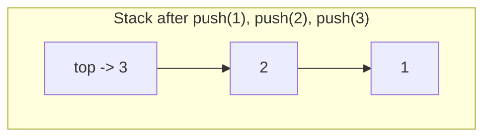

## Learning Objectives

- Define the Stack ADT purely by its interface (push, pop, peek, isEmpty) and explain why LIFO ordering is the defining contract, not an implementation detail.
- Implement a stack from scratch on top of both a resizing array and a singly linked list, and identify which operations each backing makes trivial versus costly.
- Analyze the time complexity of every stack operation under each backing, including the amortized cost of push on a resizing array.
- Apply the Stack ADT to balanced-parentheses checking and postfix expression evaluation, narrating why the LIFO discipline is exactly what each problem needs.
- Predict the output of a sequence of push/pop operations and diagnose bugs that arise from popping an empty stack or confusing push order with output order.

## Context & Motivation

Picture the "undo" button in a text editor. Every edit you make gets remembered, and pressing undo always reverses the *most recent* edit first — never the oldest one, never one picked at random. If undo instead removed edits in the order they were made (oldest first), the feature would be nearly useless: you would have to undo your entire session to get back one keystroke. The property that makes undo work is that the last thing added is the first thing removed — Last-In-First-Out, or LIFO. This is not a coincidence of how text editors happen to be built; it is a direct instance of a data structure that recurs constantly across computing: the **stack**.

The same LIFO discipline governs how every programming language runtime tracks function calls. When function `A` calls function `B`, which calls function `C`, the runtime must resume `C`'s caller (`B`) before it can resume `B`'s caller (`A`) — the most recently entered call is the first one to complete and return. This is why it is called the "call stack," and why a function that calls itself too many times without a base case produces a "stack overflow": each call pushes a new frame, and the frames pile up until the stack's storage is exhausted. Compilers exploit the same discipline to check whether parentheses, brackets, and braces are properly nested, and to evaluate arithmetic expressions written in postfix notation without ever needing to look ahead or backtrack.

What all of these examples share is that the *only* operation that ever matters is "give me back what I most recently set aside." A stack does not need to support looking up the 5th element, searching by value, or removing from the middle — restricting the interface to just push, pop, and peek is not a limitation but the entire point: it is what makes a stack a clean, minimal abstraction with an unambiguous contract, and (as the prerequisite `arrays-vs-linked-lists` concept established) that same contract can be honored equally well by a contiguous array or a chain of linked nodes, because nothing about "add to one end, remove from that same end" cares which underlying representation is doing the work.

## Core Theory

### The interface: what a stack promises, and nothing more

A Stack ADT is defined by its **operations**, independent of any implementation:

- `push(x)` — add element `x` to the top of the stack.
- `pop()` — remove and return the element at the top of the stack; undefined (or an explicit error) if the stack is empty.
- `peek()` (sometimes called `top()`) — return the element at the top without removing it.
- `isEmpty()` — report whether the stack currently holds zero elements.

The defining invariant is **Last-In-First-Out (LIFO)**: of all the elements currently in the stack, `pop()` always returns the one that was pushed most recently among those still present. Nothing in this contract mentions arrays, nodes, or memory layout — that is deliberate. A caller who only ever uses these four operations cannot tell, and should not need to care, how the stack is actually stored.



`pop()` on this stack returns `3` first (the most recently pushed), then `2`, then `1` — the reverse of push order.

### Array-backed implementation

Because push and pop only ever touch one end of the sequence, a stack maps naturally onto a resizing array (as covered in `dynamic-arrays-and-amortized-resizing`) where that one end is the *last occupied slot*, not the first. Treating the last index as the "top" means push is `array[size] = x; size += 1` — an append, not an insert at the front — and pop is `size -= 1; return array[size]`. No shifting of existing elements is ever required, because nothing before the last slot is ever touched.

```python
class ArrayStack:
    def __init__(self):
        self._data = [None] * 4   # fixed-capacity buffer, grown on demand
        self._size = 0

    def _grow(self):
        bigger = [None] * (len(self._data) * 2)
        for i in range(self._size):
            bigger[i] = self._data[i]
        self._data = bigger

    def push(self, x):
        if self._size == len(self._data):
            self._grow()
        self._data[self._size] = x
        self._size += 1

    def pop(self):
        if self._size == 0:
            raise IndexError("pop from empty stack")
        self._size -= 1
        x = self._data[self._size]
        self._data[self._size] = None   # avoid holding a stale reference
        return x

    def peek(self):
        if self._size == 0:
            raise IndexError("peek at empty stack")
        return self._data[self._size - 1]

    def is_empty(self):
        return self._size == 0
```

`push` and `pop` are both O(1) *amortized* — the occasional O(n) resize when the buffer fills up is exactly the amortized-doubling analysis from the prerequisite concept, spread across many O(1) operations. `peek` and `isEmpty` are O(1) worst-case, with no resizing possible.

### Linked-list-backed implementation

The same contract is honored, with no amortization at all, by pushing and popping at the **head** of a singly linked list (from `singly-linked-lists`). The head is the only node a caller ever touches, so both operations are O(1) worst-case — no growth step, no shifting, ever.

```python
class _Node:
    __slots__ = ("value", "next")
    def __init__(self, value, next=None):
        self.value = value
        self.next = next

class LinkedStack:
    def __init__(self):
        self._head = None
        self._size = 0

    def push(self, x):
        self._head = _Node(x, self._head)   # new node becomes the head
        self._size += 1

    def pop(self):
        if self._head is None:
            raise IndexError("pop from empty stack")
        x = self._head.value
        self._head = self._head.next
        self._size -= 1
        return x

    def peek(self):
        if self._head is None:
            raise IndexError("peek at empty stack")
        return self._head.value

    def is_empty(self):
        return self._head is None
```

The two implementations are interchangeable from the caller's point of view — same method names, same LIFO behavior, same asymptotic O(1) push/pop — which is exactly the point of separating the ADT's contract from its backing. Choosing between them in practice is a question of memory overhead (each linked node carries an extra pointer) versus worst-case guarantees (the array occasionally pays for a resize; the list never does) — a trade-off, not a correctness difference.

### Why the interface restriction matters

A stack could technically be implemented by a general-purpose list that also supports indexing, insertion in the middle, and search — but exposing those extra operations would let a caller violate the LIFO discipline by, say, removing an element from the middle. Restricting the public interface to push/pop/peek/isEmpty is what lets every user of a stack *rely* on LIFO order without auditing the code that uses it — the abstraction's value comes precisely from what it refuses to let you do.

## Worked Examples

### Example 1 — tracing push/pop order

**Problem:** Starting from an empty stack, execute `push(A)`, `push(B)`, `push(C)`, `pop()`, `push(D)`, `pop()`, `pop()` in order. What is returned by each `pop()`, and what remains on the stack at the end?

**Step by step.**

| Operation | Stack after (top listed first) | Returned |
|---|---|---|
| push(A) | [A] | — |
| push(B) | [B, A] | — |
| push(C) | [C, B, A] | — |
| pop() | [B, A] | C |
| push(D) | [D, B, A] | — |
| pop() | [B, A] | D |
| pop() | [A] | B |

**Reasoning.** Each `pop()` removes whatever was pushed most recently among what remains — never the oldest surviving element. Note that `C` and `D` are popped in the reverse of the order they entered relative to each other, and `A` — pushed first — is still sitting at the bottom, untouched, because nothing has popped deep enough to reach it. Final state: stack holds `[A]`.

### Example 2 — balanced parentheses checking

**Problem:** Given a string of brackets like `"{[()()]}"`, determine whether every opening bracket has a matching closing bracket in the correct nested order, using a stack.

**Approach.** Scan the string left to right. On an opening bracket (`(`, `[`, `{`), push it. On a closing bracket, pop the stack and check that the popped opening bracket matches the closing one (`)` matches `(`, and so on); if the stack is empty when a closing bracket arrives, or the popped bracket doesn't match, the string is unbalanced. At the end, the string is balanced only if the stack is empty (every opener found its closer).

**Trace on `"{[()()]}"`:**

```python
def is_balanced(s):
    pairs = {')': '(', ']': '[', '}': '{'}
    stack = ArrayStack()
    for ch in s:
        if ch in '([{':
            stack.push(ch)
        elif ch in ')]}':
            if stack.is_empty() or stack.pop() != pairs[ch]:
                return False
    return stack.is_empty()
```

| char | action | stack (top first) |
|---|---|---|
| `{` | push | [{] |
| `[` | push | [[, {] |
| `(` | push | [(, [, {] |
| `)` | pop, matches `(` | [[, {] |
| `(` | push | [(, [, {] |
| `)` | pop, matches `(` | [[, {] |
| `]` | pop, matches `[` | [{] |
| `}` | pop, matches `{` | [] |

Stack is empty at the end → balanced. **Why a stack specifically:** the *most recently opened, still-unclosed* bracket is exactly the one that must be closed next in valid nesting — that is a LIFO relationship by definition, so a stack is not merely a convenient tool here but the structure that mirrors the problem's own rule.

### Example 3 — evaluating a postfix expression

**Problem:** Evaluate the postfix (Reverse Polish Notation) expression `3 4 + 2 *`, which represents `(3 + 4) * 2`, using a stack.

**Approach.** Scan tokens left to right. On seeing a number, push it. On seeing an operator, pop the top two operands (the second-popped is the left operand, the first-popped is the right operand, since it was pushed more recently), apply the operator, and push the result back.

```python
def eval_postfix(tokens):
    stack = ArrayStack()
    for tok in tokens:
        if tok in '+-*/':
            right = stack.pop()
            left = stack.pop()
            if tok == '+': stack.push(left + right)
            elif tok == '-': stack.push(left - right)
            elif tok == '*': stack.push(left * right)
            elif tok == '/': stack.push(left / right)
        else:
            stack.push(float(tok))
    return stack.pop()
```

**Trace on `["3", "4", "+", "2", "*"]`:**

| token | action | stack (top first) |
|---|---|---|
| `3` | push 3 | [3] |
| `4` | push 4 | [4, 3] |
| `+` | pop 4, pop 3, push 3+4=7 | [7] |
| `2` | push 2 | [2, 7] |
| `*` | pop 2, pop 7, push 7*2=14 | [14] |

Final `pop()` returns `14`, matching `(3 + 4) * 2 = 14`. The stack lets the evaluator process the expression in a single left-to-right pass with no lookahead, because postfix notation places every operator immediately after the operands it needs — exactly what pushing operands and reducing on each operator captures.

## Common Misconceptions & Pitfalls

- **"A stack is defined by being array-backed (or list-backed)."** The backing is an implementation choice, not part of the ADT. Both `ArrayStack` and `LinkedStack` above satisfy the identical push/pop/peek/isEmpty contract with identical O(1) amortized or worst-case behavior; code that only calls those four methods cannot distinguish which one it's using, and shouldn't try to.
- **"pop() and peek() are the same thing."** `peek()` looks without removing; `pop()` removes and returns. Confusing them causes a classic bug: calling `peek()` in a loop expecting the stack to shrink, when it never does, produces an infinite loop.
- **"Popping an empty stack just returns None or does nothing."** In a correct implementation this is an explicit error condition (an exception, or a caller-checked `isEmpty()` guard), not a silent no-op — silently returning a sentinel value hides a caller bug (asking for something that was never pushed) instead of surfacing it. Forgetting the empty check before `pop()` is one of the most common stack bugs in balanced-parentheses-style checkers: an input with a stray closing bracket and no matching opener needs the empty check to reject it correctly, rather than crashing or reporting a false positive.
- **"The order elements come out of a stack matches the order they were meant to be processed in."** By construction it is the *reverse* — this is a common trip-up when someone pushes items expecting to process them in push order and then reads back last-in-first-out output. If FIFO order is actually needed, the right structure is a queue, not a stack — using the wrong ADT for the desired order is a design bug, not a stack bug.
- **"A resizing-array stack has worse worst-case performance than a linked-list stack because of resizing, so it's simply the worse choice."** The array version's *amortized* cost is still O(1) per push, and it has better cache locality and lower per-element memory overhead (no per-node pointer). The linked-list version avoids any single expensive operation but pays a pointer's worth of extra memory per element. Neither dominates the other outright — the trade-off, not a strict ranking, is the content to remember.

## Summary

A Stack ADT is defined entirely by its LIFO contract — push, pop, peek, isEmpty — independent of how it is stored. Backing it with a resizing array (treating the last occupied index as "top") gives O(1) amortized push/pop with occasional resize cost; backing it with a singly linked list (treating the head as "top") gives O(1) worst-case push/pop with a per-node memory overhead. Both satisfy the identical interface and are freely interchangeable from a caller's perspective. Balanced-parentheses checking and postfix expression evaluation are canonical applications precisely because both problems have an inherent "most recently opened / most recently pending" relationship that mirrors LIFO order exactly, which is also why the function call stack and undo history work the same way. The recurring pitfall is treating the backing as part of the contract, or forgetting that pop/peek must handle the empty case explicitly rather than silently.

## Documentation Links

- [Sedgewick & Wayne — Stacks and Queues (Princeton lecture slides)](https://algs4.cs.princeton.edu/lectures/keynote/13StacksAndQueues.pdf) — doc
- [Stanford CS106B — Lecture Schedule](https://web.stanford.edu/class/cs106b/schedule) — doc
