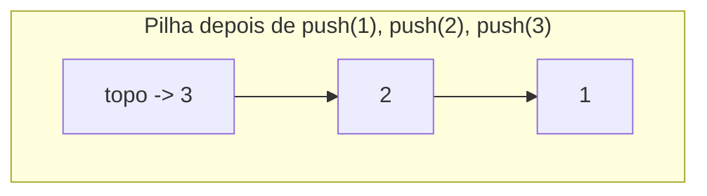

## Objetivos de Aprendizagem

- Definir o TAD Pilha puramente por sua interface (push, pop, peek, isEmpty) e explicar por que ordenação LIFO é o contrato definidor, não um detalhe de implementação.
- Implementar uma pilha do zero em cima tanto de um vetor redimensionável quanto de uma lista encadeada simples, e identificar quais operações cada suporte torna triviais versus custosas.
- Analisar a complexidade de tempo de toda operação de pilha sob cada suporte, incluindo o custo amortizado de push num vetor redimensionável.
- Aplicar o TAD Pilha a checagem de parênteses balanceados e avaliação de expressão pós-fixa, narrando por que a disciplina LIFO é exatamente o que cada problema precisa.
- Prever a saída de uma sequência de operações push/pop e diagnosticar bugs que surgem de fazer pop numa pilha vazia ou confundir ordem de push com ordem de saída.

## Contexto e Motivação

Imagine o botão "desfazer" num editor de texto. Toda edição que você faz é lembrada, e apertar desfazer sempre reverte a edição *mais recente* primeiro, nunca a mais antiga, nunca uma escolhida aleatoriamente. Se desfazer em vez disso removesse edições na ordem em que foram feitas (mais antiga primeiro), a funcionalidade seria quase inútil: você teria que desfazer sua sessão inteira para recuperar uma tecla digitada. A propriedade que faz desfazer funcionar é que a última coisa adicionada é a primeira coisa removida: Last-In-First-Out, ou LIFO. Isso não é coincidência de como editores de texto acontecem de ser construídos; é uma instância direta de uma estrutura de dados que reaparece constantemente por toda a computação: a **pilha**.

A mesma disciplina LIFO governa como todo runtime de linguagem de programação rastreia chamadas de função. Quando a função `A` chama a função `B`, que chama a função `C`, o runtime precisa retomar quem chamou `C` (`B`) antes de poder retomar quem chamou `B` (`A`); a chamada entrada mais recentemente é a primeira a completar e retornar. É por isso que se chama "pilha de chamadas" (call stack), e por que uma função que chama a si mesma vezes demais sem um caso base produz um "estouro de pilha" (stack overflow): cada chamada empilha um novo frame, e os frames se acumulam até o armazenamento da pilha se esgotar. Compiladores exploram a mesma disciplina para checar se parênteses, colchetes e chaves estão devidamente aninhados, e para avaliar expressões aritméticas escritas em notação pós-fixa sem nunca precisar olhar à frente ou retroceder.

O que todos esses exemplos compartilham é que a *única* operação que sempre importa é "me devolva o que eu mais recentemente deixei de lado". Uma pilha não precisa suportar procurar o 5º elemento, buscar por valor, ou remover do meio; restringir a interface a só push, pop e peek não é uma limitação mas todo o ponto: é o que torna uma pilha uma abstração limpa e mínima com um contrato sem ambiguidade, e (como o conceito pré-requisito `arrays-vs-linked-lists` estabeleceu) esse mesmo contrato pode ser honrado igualmente bem por um vetor contíguo ou uma cadeia de nós encadeados, porque nada sobre "adicionar numa extremidade, remover dessa mesma extremidade" se importa com qual representação subjacente está fazendo o trabalho.

## Teoria Central

### A interface: o que uma pilha promete, e nada mais

Um TAD Pilha é definido por suas **operações**, independente de qualquer implementação:

- `push(x)`: adiciona o elemento `x` ao topo da pilha.
- `pop()`: remove e retorna o elemento no topo da pilha; indefinido (ou um erro explícito) se a pilha está vazia.
- `peek()` (às vezes chamado `top()`): retorna o elemento no topo sem removê-lo.
- `isEmpty()`: informa se a pilha atualmente contém zero elementos.

O invariante definidor é **Last-In-First-Out (LIFO)**: de todos os elementos atualmente na pilha, `pop()` sempre retorna aquele que foi empilhado mais recentemente entre os ainda presentes. Nada nesse contrato menciona vetores, nós, ou layout de memória; isso é deliberado. Quem chama que só usa essas quatro operações não consegue distinguir, e não deveria precisar se importar, como a pilha é de fato armazenada.



`pop()` nessa pilha retorna `3` primeiro (o mais recentemente empilhado), depois `2`, depois `1`, o reverso da ordem de push.

### Implementação com suporte em vetor

Como push e pop só sempre tocam uma extremidade da sequência, uma pilha se mapeia naturalmente sobre um vetor redimensionável (como coberto em `dynamic-arrays-and-amortized-resizing`) onde essa extremidade é o *último slot ocupado*, não o primeiro. Tratar o último índice como o "topo" significa que push é `array[size] = x; size += 1`, um anexar, não uma inserção na frente, e pop é `size -= 1; return array[size]`. Nenhum deslocamento de elementos existentes é jamais exigido, porque nada antes do último slot é jamais tocado.

```python
class ArrayStack:
    def __init__(self):
        self._data = [None] * 4   # buffer de capacidade fixa, cresce sob demanda
        self._size = 0

    def _grow(self):
        bigger = [None] * (len(self._data) * 2)
        for i in range(self._size):
            bigger[i] = self._data[i]
        self._data = bigger

    def push(self, x):
        if self._size == len(self._data):
            self._grow()
        self._data[self._size] = x
        self._size += 1

    def pop(self):
        if self._size == 0:
            raise IndexError("pop numa pilha vazia")
        self._size -= 1
        x = self._data[self._size]
        self._data[self._size] = None   # evita manter uma referência obsoleta
        return x

    def peek(self):
        if self._size == 0:
            raise IndexError("peek numa pilha vazia")
        return self._data[self._size - 1]

    def is_empty(self):
        return self._size == 0
```

`push` e `pop` são ambos O(1) *amortizado*; o redimensionamento O(n) ocasional quando o buffer enche é exatamente a análise de duplicação amortizada do conceito pré-requisito, espalhada por muitas operações O(1). `peek` e `isEmpty` são O(1) no pior caso, sem redimensionamento possível.

### Implementação com suporte em lista encadeada

O mesmo contrato é honrado, sem amortização alguma, empilhando e desempilhando na **cabeça** de uma lista encadeada simples (de `singly-linked-lists`). A cabeça é o único nó que quem chama sempre toca, então as duas operações são O(1) no pior caso; nenhum passo de crescimento, nenhum deslocamento, jamais.

```python
class _Node:
    __slots__ = ("value", "next")
    def __init__(self, value, next=None):
        self.value = value
        self.next = next

class LinkedStack:
    def __init__(self):
        self._head = None
        self._size = 0

    def push(self, x):
        self._head = _Node(x, self._head)   # novo nó se torna a cabeça
        self._size += 1

    def pop(self):
        if self._head is None:
            raise IndexError("pop numa pilha vazia")
        x = self._head.value
        self._head = self._head.next
        self._size -= 1
        return x

    def peek(self):
        if self._head is None:
            raise IndexError("peek numa pilha vazia")
        return self._head.value

    def is_empty(self):
        return self._head is None
```

As duas implementações são intercambiáveis do ponto de vista de quem chama: mesmos nomes de método, mesmo comportamento LIFO, mesmo push/pop assintótico O(1); que é exatamente o ponto de separar o contrato do TAD do seu suporte. Escolher entre elas na prática é uma questão de overhead de memória (cada nó encadeado carrega um ponteiro extra) versus garantias de pior caso (o vetor ocasionalmente paga por um redimensionamento; a lista nunca paga); uma troca, não uma diferença de corretude.

### Por que a restrição de interface importa

Uma pilha poderia tecnicamente ser implementada por uma lista de propósito geral que também suporta indexação, inserção no meio, e busca, mas expor essas operações extras permitiria que quem chama violasse a disciplina LIFO removendo, digamos, um elemento do meio. Restringir a interface pública a push/pop/peek/isEmpty é o que permite que todo usuário de uma pilha *conte* com a ordem LIFO sem auditar o código que a usa; o valor da abstração vem precisamente do que ela se recusa a deixar você fazer.

## Exemplos Resolvidos

### Exemplo 1: traçando a ordem de push/pop

**Problema:** partindo de uma pilha vazia, execute `push(A)`, `push(B)`, `push(C)`, `pop()`, `push(D)`, `pop()`, `pop()` em ordem. O que é retornado por cada `pop()`, e o que resta na pilha no final?

**Passo a passo.**

| Operação | Pilha depois (topo listado primeiro) | Retornado |
|---|---|---|
| push(A) | [A] | — |
| push(B) | [B, A] | — |
| push(C) | [C, B, A] | — |
| pop() | [B, A] | C |
| push(D) | [D, B, A] | — |
| pop() | [B, A] | D |
| pop() | [A] | B |

**Raciocínio.** Todo `pop()` remove o que quer que tenha sido empilhado mais recentemente entre o que resta, nunca o elemento sobrevivente mais antigo. Note que `C` e `D` são desempilhados na ordem reversa em que entraram um em relação ao outro, e `A`, empilhado primeiro, ainda está sentado no fundo, intocado, porque nada desempilhou fundo o suficiente para alcançá-lo. Estado final: a pilha contém `[A]`.

### Exemplo 2: checagem de parênteses balanceados

**Problema:** dada uma string de colchetes como `"{[()()]}"`, determine se todo colchete de abertura tem um colchete de fechamento correspondente na ordem de aninhamento correta, usando uma pilha.

**Abordagem.** Percorra a string da esquerda para a direita. Num colchete de abertura (`(`, `[`, `{`), empilhe-o. Num colchete de fechamento, desempilhe a pilha e cheque que o colchete de abertura desempilhado corresponde ao de fechamento (`)` corresponde a `(`, e assim por diante); se a pilha está vazia quando um colchete de fechamento chega, ou o colchete desempilhado não corresponde, a string está desbalanceada. No final, a string está balanceada só se a pilha está vazia (todo abridor achou seu fechador).

**Traço em `"{[()()]}"`:**

```python
def is_balanced(s):
    pairs = {')': '(', ']': '[', '}': '{'}
    stack = ArrayStack()
    for ch in s:
        if ch in '([{':
            stack.push(ch)
        elif ch in ')]}':
            if stack.is_empty() or stack.pop() != pairs[ch]:
                return False
    return stack.is_empty()
```

| char | ação | pilha (topo primeiro) |
|---|---|---|
| `{` | push | [{] |
| `[` | push | [[, {] |
| `(` | push | [(, [, {] |
| `)` | pop, corresponde a `(` | [[, {] |
| `(` | push | [(, [, {] |
| `)` | pop, corresponde a `(` | [[, {] |
| `]` | pop, corresponde a `[` | [{] |
| `}` | pop, corresponde a `{` | [] |

Pilha está vazia no final → balanceada. **Por que uma pilha especificamente:** o colchete *mais recentemente aberto, ainda não fechado* é exatamente aquele que precisa ser fechado a seguir num aninhamento válido; essa é uma relação LIFO por definição, então uma pilha não é meramente uma ferramenta conveniente aqui mas a estrutura que espelha a própria regra do problema.

### Exemplo 3: avaliando uma expressão pós-fixa

**Problema:** avalie a expressão pós-fixa (notação polonesa reversa) `3 4 + 2 *`, que representa `(3 + 4) * 2`, usando uma pilha.

**Abordagem.** Percorra tokens da esquerda para a direita. Ao ver um número, empilhe-o. Ao ver um operador, desempilhe os dois operandos do topo (o segundo desempilhado é o operando esquerdo, o primeiro desempilhado é o operando direito, já que foi empilhado mais recentemente), aplique o operador, e empilhe o resultado de volta.

```python
def eval_postfix(tokens):
    stack = ArrayStack()
    for tok in tokens:
        if tok in '+-*/':
            right = stack.pop()
            left = stack.pop()
            if tok == '+': stack.push(left + right)
            elif tok == '-': stack.push(left - right)
            elif tok == '*': stack.push(left * right)
            elif tok == '/': stack.push(left / right)
        else:
            stack.push(float(tok))
    return stack.pop()
```

**Traço em `["3", "4", "+", "2", "*"]`:**

| token | ação | pilha (topo primeiro) |
|---|---|---|
| `3` | push 3 | [3] |
| `4` | push 4 | [4, 3] |
| `+` | pop 4, pop 3, push 3+4=7 | [7] |
| `2` | push 2 | [2, 7] |
| `*` | pop 2, pop 7, push 7*2=14 | [14] |

`pop()` final retorna `14`, correspondendo a `(3 + 4) * 2 = 14`. A pilha permite que o avaliador processe a expressão numa única passagem da esquerda para a direita sem lookahead algum, porque a notação pós-fixa coloca todo operador imediatamente depois dos operandos que ele precisa, exatamente o que empilhar operandos e reduzir a cada operador captura.

## Equívocos Comuns e Armadilhas

- **"Uma pilha é definida por ter suporte em vetor (ou suporte em lista)."** O suporte é uma escolha de implementação, não parte do TAD. Tanto `ArrayStack` quanto `LinkedStack` acima satisfazem o contrato idêntico push/pop/peek/isEmpty com comportamento idêntico O(1) amortizado ou pior caso; código que só chama esses quatro métodos não consegue distinguir qual está usando, e não deveria tentar.
- **"pop() e peek() são a mesma coisa."** `peek()` olha sem remover; `pop()` remove e retorna. Confundi-los causa um bug clássico: chamar `peek()` num laço esperando que a pilha encolha, quando nunca encolhe, produz um laço infinito.
- **"Fazer pop numa pilha vazia só retorna None ou não faz nada."** Numa implementação correta isso é uma condição de erro explícita (uma exceção, ou uma guarda `isEmpty()` checada por quem chama), não um no-op silencioso; retornar silenciosamente um valor sentinela esconde um bug de quem chama (pedir algo que nunca foi empilhado) em vez de expô-lo. Esquecer a checagem de vazio antes de `pop()` é um dos bugs de pilha mais comuns em checadores estilo parênteses-balanceados: uma entrada com um colchete de fechamento perdido e sem abridor correspondente precisa da checagem de vazio pra rejeitar corretamente, em vez de travar ou reportar um falso positivo.
- **"A ordem em que elementos saem de uma pilha corresponde à ordem em que deveriam ser processados."** Por construção é o *reverso*; esse é um tropeço comum quando alguém empilha itens esperando processá-los na ordem de push e depois lê de volta a saída last-in-first-out. Se ordem FIFO é de fato necessária, a estrutura certa é uma fila, não uma pilha; usar o TAD errado para a ordem desejada é um bug de design, não um bug de pilha.
- **"Uma pilha com vetor redimensionável tem desempenho de pior caso pior que uma pilha com lista encadeada por causa do redimensionamento, então é simplesmente a escolha pior."** O custo *amortizado* da versão em vetor ainda é O(1) por push, e ela tem melhor localidade de cache e overhead de memória por elemento menor (sem ponteiro por nó). A versão em lista encadeada evita qualquer operação única cara mas paga o valor de um ponteiro de memória extra por elemento. Nenhuma domina a outra completamente; a troca, não uma classificação estrita, é o conteúdo a lembrar.

## Resumo

Um TAD Pilha é definido inteiramente por seu contrato LIFO (push, pop, peek, isEmpty), independente de como é armazenado. Dar-lhe suporte com um vetor redimensionável (tratando o último índice ocupado como "topo") dá push/pop O(1) amortizado com custo ocasional de redimensionamento; dar-lhe suporte com uma lista encadeada simples (tratando a cabeça como "topo") dá push/pop O(1) no pior caso com um overhead de memória por nó. As duas satisfazem a interface idêntica e são livremente intercambiáveis da perspectiva de quem chama. Checagem de parênteses balanceados e avaliação de expressão pós-fixa são aplicações canônicas precisamente porque os dois problemas têm uma relação inerente de "mais recentemente aberto / mais recentemente pendente" que espelha exatamente a ordem LIFO, que é também por que a pilha de chamadas de função e o histórico de desfazer funcionam do mesmo jeito. A armadilha recorrente é tratar o suporte como parte do contrato, ou esquecer que pop/peek precisam tratar o caso vazio explicitamente em vez de silenciosamente.

## Documentation Links

- [Sedgewick & Wayne — Stacks and Queues (Princeton lecture slides)](https://algs4.cs.princeton.edu/lectures/keynote/13StacksAndQueues.pdf) — doc
- [Stanford CS106B — Lecture Schedule](https://web.stanford.edu/class/cs106b/schedule) — doc
