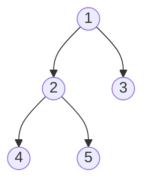
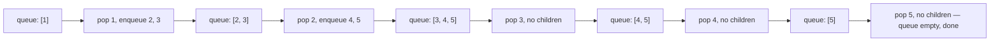
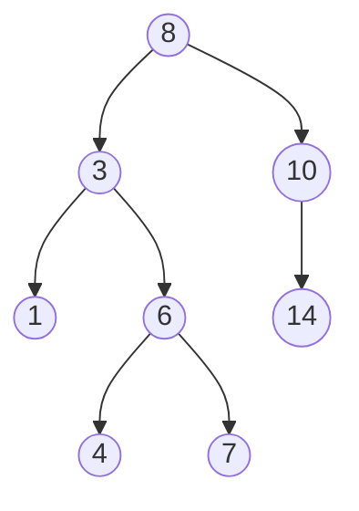
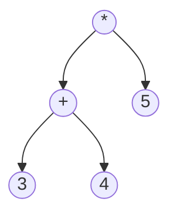

## Learning Objectives

- Implement preorder, inorder, and postorder traversal recursively, and state the root/left/right visiting order each one follows.
- Implement level-order traversal iteratively, using a queue, and explain why it cannot be written the same recursive way as the other three.
- Trace, by hand, the exact output sequence each of the four traversals produces on a given binary tree.
- Explain why inorder traversal of a binary search tree always produces values in sorted order, and predict what a non-sorted inorder output implies about a tree.
- Choose the correct traversal order for a given task (e.g., copying a tree, deleting a tree, evaluating an expression tree, printing level by level).

## Context & Motivation

The previous concept established that a binary tree is a rooted, node-and-pointer structure with at most two children per node. Having a structure is not the same as being able to do anything useful with it — the very first capability any tree-based program needs is a systematic way to visit every node exactly once. That is what a **traversal** is: an order for visiting all n nodes of a tree, and the fact that a binary tree naturally splits into "this node," "its left subtree," and "its right subtree" means there are exactly a handful of sensible orders in which those three pieces can be visited, differing only in when the current node itself gets processed relative to its two subtrees.

Three of the four standard traversals — preorder, inorder, postorder — are naturally recursive, and this is not a coincidence or a stylistic choice; it falls directly out of the recursive structure of the tree itself. The `recursion` concept from this curriculum's programming-computational-thinking discipline established the two pieces every correct recursive function needs: a base case simple enough to answer with no further self-reference, and a recursive case that shrinks the problem and trusts smaller calls to do their part correctly. A binary tree traversal is close to the cleanest possible illustration of that pattern: the base case is the empty tree (there is nothing to visit, so return immediately, no output produced), and the recursive case is "process this node, and trust the recursive calls on the left and right subtrees to correctly visit everything within them" — precisely the "leap of faith" that concept describes, applied to a tree instead of a list or a number. The three traversals differ only in *where*, relative to the two recursive calls, "process this node" is inserted.

The fourth traversal, level-order, breaks this pattern entirely and is worth understanding as a deliberate contrast, not an oversight: it visits nodes breadth-first, level by level, top to bottom and left to right within each level, and doing so requires an explicit queue and an iterative loop rather than recursion — because recursion naturally follows one path deep before backtracking (depth-first), while level-order fundamentally needs to interleave progress across many different branches at the same depth simultaneously, which a queue's first-in-first-out discipline handles directly and a simple call stack does not. Beyond being useful in its own right (printing a tree level by level, finding the shortest path in an unweighted tree-shaped structure), level-order is included here specifically so its contrast with the other three sharpens exactly what "naturally recursive" does and does not mean: a problem being tree-shaped does not automatically make recursion the right tool — it makes recursion the right tool exactly when the natural sub-problems are "everything below this node," which preorder/inorder/postorder have and level-order does not.

## Core Theory

### Preorder: root, then left, then right

**Preorder** visits the current node *before* either subtree:

```python
def preorder(node, output):
    if node is None:               # base case: empty (sub)tree, nothing to do
        return
    output.append(node.value)      # process root first
    preorder(node.left, output)    # then everything in the left subtree
    preorder(node.right, output)   # then everything in the right subtree
```

Preorder is the natural order for tasks where a node must be handled *before* its descendants are — for instance, copying a tree (you need the parent node to exist before you can attach children to it) or serializing a tree to a format that will be read back top-down.

### Inorder: left, then root, then right

**Inorder** visits the current node *between* its two subtrees:

```python
def inorder(node, output):
    if node is None:
        return
    inorder(node.left, output)     # everything in the left subtree first
    output.append(node.value)      # then this node
    inorder(node.right, output)    # then everything in the right subtree
```

Inorder has a special property that matters enormously for the next concept in this discipline: **run on a binary search tree, inorder traversal visits every value in sorted order, with no sorting step required.** This falls directly out of the BST invariant (covered fully next) — everything smaller than a node lives in its left subtree, everything larger lives in its right subtree — combined with inorder's exact visiting order: recursively emit everything smaller (the left subtree, in sorted order by the same argument, one level down), then this node, then everything larger (the right subtree, in sorted order). If an inorder traversal of a tree that is *supposed* to be a binary search tree ever produces an out-of-order sequence, that is a direct, checkable sign that the BST invariant has been violated somewhere in the tree.

### Postorder: left, then right, then root

**Postorder** visits the current node *after* both subtrees:

```python
def postorder(node, output):
    if node is None:
        return
    postorder(node.left, output)   # everything in the left subtree first
    postorder(node.right, output)  # then everything in the right subtree
    output.append(node.value)      # then this node, last
```

Postorder is the natural order for tasks where a node must be handled *after* its descendants — most concretely, deleting a tree node by node (a node cannot be safely freed while its children still need to be reached through it), or evaluating an arithmetic expression tree (an operator node needs both of its operand subtrees' values computed before it can apply itself).



On this tree: preorder visits 1, 2, 4, 5, 3 (root first, then dive left all the way, backtrack, then right); inorder visits 4, 2, 5, 1, 3 (fully empty left subtrees before the node, so leaves surface first on the left side); postorder visits 4, 5, 2, 3, 1 (root always last, since it has to wait for everything below it).

### Level-order: breadth-first with an explicit queue

**Level-order** (or breadth-first) traversal visits the root, then all nodes at depth 1 left to right, then all nodes at depth 2 left to right, and so on. It cannot be written as a simple recursive function the way the other three can, because recursion naturally commits to going all the way down one branch before returning to consider a sibling branch (this is exactly what a call stack does — depth-first, by construction). Visiting breadth-first instead requires holding, at every moment, the *entire frontier* of nodes at the current depth simultaneously, which a **queue** does directly: enqueue the root; then repeatedly dequeue a node, process it, and enqueue its (non-null) children, until the queue is empty.

```python
from collections import deque

def level_order(root):
    output = []
    if root is None:
        return output
    queue = deque([root])
    while queue:
        node = queue.popleft()       # FIFO: oldest-enqueued node processed first
        output.append(node.value)
        if node.left is not None:
            queue.append(node.left)
        if node.right is not None:
            queue.append(node.right)
    return output
```

On the same tree above, level-order visits 1, 2, 3, 4, 5 — depth 0 (1), then depth 1 left to right (2, 3), then depth 2 left to right (4, 5) — an order none of the three recursive traversals produce, since all three of them fully finish node 2's entire subtree (including depth-2 node 4) before ever reaching node 3 at depth 1.



## Worked Examples

### Example 1 — Tracing all four traversals on one tree

**Problem:** For the tree below, list the output of preorder, inorder, postorder, and level-order.



**Preorder (root, left, right).** Start at 8: visit 8. Recurse left into 3's subtree: visit 3; recurse left into 1's subtree: visit 1 (leaf, no further recursion); recurse right into 6's subtree: visit 6; recurse left into 4 (leaf): visit 4; recurse right into 7 (leaf): visit 7. Back up to 8; recurse right into 10's subtree: visit 10; recurse left: none; recurse right into 14 (leaf): visit 14.
Result: `8, 3, 1, 6, 4, 7, 10, 14`.

**Inorder (left, root, right).** Fully resolve 8's left subtree before 8 itself: within 3's subtree, fully resolve 3's left (just 1) before 3, so 1, then 3, then 3's right subtree (6's subtree): within that, 4 before 6 before 7. So 8's whole left side gives 1, 3, 4, 6, 7. Then 8 itself. Then 8's right subtree (10's subtree): 10 has no left child, so just 10, then 10's right subtree: 14.
Result: `1, 3, 4, 6, 7, 8, 10, 14` — notice this is exactly sorted order, which is expected since this happens to be a valid binary search tree (verified in the next concept).

**Postorder (left, right, root).** Resolve every subtree fully before its own root, root always last. Within 6's subtree: 4, 7, then 6. Within 3's subtree: 1, then (4, 7, 6), then 3 → 1, 4, 7, 6, 3. Within 10's subtree: no left, so just 14, then 10 → 14, 10. Whole tree: (1, 4, 7, 6, 3), (14, 10), then 8 last.
Result: `1, 4, 7, 6, 3, 14, 10, 8`.

**Level-order.** Depth 0: 8. Depth 1, left to right: 3, 10. Depth 2, left to right: 1, 6, 14. Depth 3, left to right: 4, 7.
Result: `8, 3, 10, 1, 6, 14, 4, 7`.

### Example 2 — Using inorder to check the BST invariant

**Problem:** A tree is claimed to be a valid binary search tree. Its inorder traversal produces `2, 5, 4, 9, 12`. Is the claim true?

**Reasoning.** By the fact established in Core Theory, inorder traversal of a genuinely valid BST always produces a fully sorted sequence. Checking `2, 5, 4, 9, 12` for sortedness: `2 ≤ 5` holds, but `5 ≤ 4` fails — the sequence is not sorted.

**Conclusion.** Since a valid BST's inorder traversal is always sorted, and this one is not, the tree is **not** a valid binary search tree — somewhere, a node with value 4 has ended up positioned such that it is reachable after a 5 in inorder order (meaning it sits in 5's right subtree, or some ancestor relationship places it there), violating the "everything greater is to the right" rule. This is a genuinely useful, cheap correctness check: running inorder traversal and testing the output for sortedness is a standard way to validate that BST operations haven't silently corrupted the invariant.

### Example 3 — Evaluating an arithmetic expression tree with postorder

**Problem:** The expression `(3 + 4) * 5` is represented as a tree where leaves are numbers and internal nodes are operators, each with exactly two children (its operands). Evaluate it using postorder traversal.



**Why postorder specifically.** An operator node cannot be evaluated until both of its operand subtrees have produced a value — exactly the "process this node after both subtrees" order postorder guarantees. Preorder or inorder would visit the `*` or `+` nodes before their operands were ready, which doesn't make sense for evaluation.

**Trace.** Postorder visits: left subtree of `*` first, which is the `+` subtree — within that, left (3), right (4), then `+` itself: evaluate `3 + 4 = 7`. Then the right subtree of `*` (5). Then `*` itself, now that both its operands (the just-computed 7, and 5) are available: evaluate `7 * 5 = 35`.
Result: `35` — obtained by a postorder-driven evaluation where every operator fires exactly when both its operand values are already known, never before.

## Common Misconceptions & Pitfalls

- **"Preorder, inorder, and postorder are three unrelated algorithms to memorize separately."** They are the same three-line recursive skeleton (recurse left, recurse right, process the node) with the single line "process the node" moved to one of three positions relative to the two recursive calls. Once the skeleton is understood as one pattern with a moving insertion point, all three follow from remembering only the name-to-order mapping (pre = before both, in = between them, post = after both), not three separate algorithms.
- **"Inorder traversal produces sorted order for any binary tree."** This is only true for a binary tree that additionally satisfies the BST invariant (Example 1's tree happened to be a BST, which is why its inorder output was sorted). Inorder traversal on an arbitrary binary tree with no ordering invariant produces left-root-right order, which need not be sorted at all — sortedness is a consequence of the BST property, not of inorder traversal by itself.
- **"Level-order could just as easily be written recursively, like the other three, if I use a helper that tracks depth."** While it is possible to produce level-order output via a depth-tracking recursive helper that appends to per-depth buckets, doing so still fundamentally simulates the same breadth-first bookkeeping a queue provides directly — recursion's call stack, by itself, does not give you "the entire current frontier," which a queue does natively. The straightforward, standard implementation is the iterative queue-based one shown here, precisely because it doesn't have to fight the tool (a stack) to do a stack-unfriendly job.
- **"The order I choose doesn't really matter — any traversal that visits every node gets the job done."** All four traversals visit the same set of n nodes exactly once, but for tasks like deleting a tree (postorder — never orphan a subtree by freeing its parent first), copying a tree (preorder — build the parent before its children exist to attach to it), or evaluating an expression tree (postorder — operands before operators), choosing the wrong order produces either wrong results or an outright crash (e.g., attempting to access a child through a node already freed).

## Summary

A traversal visits every node of a binary tree exactly once, and three of the four standard orders — preorder (root, left, right), inorder (left, root, right), postorder (left, right, root) — are the same minimal recursive skeleton with "process the node" moved to a different position, directly mirroring the base-case/recursive-case, "trust the smaller calls" pattern this curriculum's recursion concept established generally. Inorder traversal carries a special, forward-looking fact: run on a binary search tree, it always produces values in sorted order, a direct consequence of the BST invariant covered in the next concept. Level-order breaks the recursive pattern entirely, visiting breadth-first via an explicit queue rather than depth-first via the call stack, because holding an entire depth's frontier simultaneously is exactly what a FIFO queue provides and a simple recursive call stack does not. Choosing the right traversal for a task — postorder for deletion or evaluation, preorder for copying, inorder for sorted output, level-order for level-by-level processing — is a matter of matching the traversal's node-versus-subtree ordering to what the task actually needs available, and in what order.

## Documentation Links

- [Stanford CS106B — Lecture Schedule](https://web.stanford.edu/class/cs106b/schedule) — doc
- [MIT 6.006 — Lecture Notes (OCW)](https://ocw.mit.edu/courses/6-006-introduction-to-algorithms-spring-2020/pages/lecture-notes/) — doc
