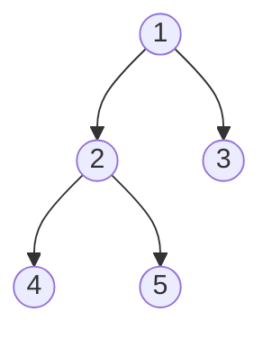
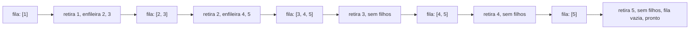
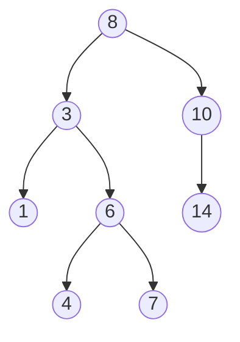
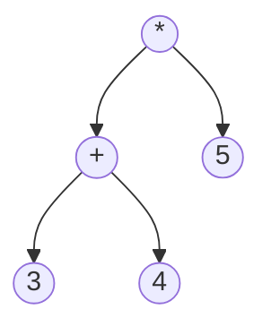

## Objetivos de Aprendizagem

- Implementar percurso em pré-ordem, em-ordem e pós-ordem recursivamente, e declarar a ordem de visita raiz/esquerda/direita que cada um segue.
- Implementar percurso em largura (nível por nível) iterativamente, usando uma fila, e explicar por que não pode ser escrito da mesma forma recursiva que os outros três.
- Traçar, à mão, a sequência exata de saída que cada um dos quatro percursos produz numa árvore binária dada.
- Explicar por que percurso em-ordem numa árvore binária de busca sempre produz valores em ordem crescente, e prever o que uma saída em-ordem não ordenada implica sobre uma árvore.
- Escolher a ordem de percurso correta para uma tarefa dada (por exemplo, copiar uma árvore, apagar uma árvore, avaliar uma árvore de expressão, imprimir nível por nível).

## Contexto e Motivação

O conceito anterior estabeleceu que uma árvore binária é uma estrutura enraizada, de nó e ponteiro, com no máximo dois filhos por nó. Ter uma estrutura não é o mesmo que conseguir fazer algo útil com ela; a primeiríssima capacidade que qualquer programa baseado em árvore precisa é uma forma sistemática de visitar todo nó exatamente uma vez. Isso é o que um **percurso** é: uma ordem para visitar todos os n nós de uma árvore, e o fato de uma árvore binária naturalmente se dividir em "este nó", "sua subárvore esquerda" e "sua subárvore direita" significa que há exatamente um punhado de ordens sensatas em que essas três partes podem ser visitadas, diferindo só em quando o próprio nó atual é processado em relação às suas duas subárvores.

Três dos quatro percursos padrão (pré-ordem, em-ordem, pós-ordem) são naturalmente recursivos, e isso não é coincidência nem escolha estilística; decorre diretamente da estrutura recursiva da própria árvore. O conceito `recursão` da disciplina de programação e pensamento computacional deste currículo estabeleceu as duas peças que toda função recursiva correta precisa: um caso base simples o bastante para responder sem autorreferência adicional, e um caso recursivo que reduz o problema e confia em chamadas menores para fazer sua parte corretamente. Um percurso de árvore binária está perto da ilustração mais limpa possível desse padrão: o caso base é a árvore vazia (não há nada a visitar, então retorne imediatamente, nenhuma saída produzida), e o caso recursivo é "processe este nó, e confie que as chamadas recursivas nas subárvores esquerda e direita visitam corretamente tudo dentro delas", precisamente o "salto de fé" que aquele conceito descreve, aplicado a uma árvore em vez de uma lista ou um número. Os três percursos diferem só em *onde*, em relação às duas chamadas recursivas, "processe este nó" é inserido.

O quarto percurso, em largura, quebra esse padrão completamente e vale a pena entender como um contraste deliberado, não uma omissão: ele visita nós em largura, nível por nível, de cima para baixo e da esquerda para a direita dentro de cada nível, e fazer isso exige uma fila explícita e um laço iterativo em vez de recursão, porque recursão naturalmente segue um caminho até o fundo antes de retroceder (em profundidade, por construção de uma pilha de chamadas), enquanto percurso em largura fundamentalmente precisa intercalar progresso através de muitos ramos diferentes na mesma profundidade simultaneamente, algo que a disciplina primeiro-a-entrar-primeiro-a-sair de uma fila trata diretamente e uma pilha de chamadas simples não. Além de ser útil por si só (imprimir uma árvore nível por nível, achar o caminho mais curto numa estrutura em forma de árvore sem peso), percurso em largura está incluído aqui especificamente para que seu contraste com os outros três esclareça exatamente o que "naturalmente recursivo" significa e o que não significa: um problema ter forma de árvore não torna recursão automaticamente a ferramenta certa; torna recursão a ferramenta certa exatamente quando os subproblemas naturais são "tudo abaixo deste nó", que pré-ordem/em-ordem/pós-ordem têm e percurso em largura não.

## Teoria Central

### Pré-ordem: raiz, depois esquerda, depois direita

**Pré-ordem** visita o nó atual *antes* de qualquer subárvore:

```python
def preorder(node, output):
    if node is None:               # caso base: (sub)árvore vazia, nada a fazer
        return
    output.append(node.value)      # processa a raiz primeiro
    preorder(node.left, output)    # depois tudo na subárvore esquerda
    preorder(node.right, output)   # depois tudo na subárvore direita
```

Pré-ordem é a ordem natural para tarefas onde um nó precisa ser tratado *antes* de seus descendentes; por exemplo, copiar uma árvore (você precisa que o nó pai exista antes de conseguir anexar filhos a ele) ou serializar uma árvore para um formato que será lido de volta de cima para baixo.

### Em-ordem: esquerda, depois raiz, depois direita

**Em-ordem** visita o nó atual *entre* suas duas subárvores:

```python
def inorder(node, output):
    if node is None:
        return
    inorder(node.left, output)     # tudo na subárvore esquerda primeiro
    output.append(node.value)      # depois este nó
    inorder(node.right, output)    # depois tudo na subárvore direita
```

Em-ordem tem uma propriedade especial que importa enormemente para o próximo conceito desta disciplina: **rodado numa árvore binária de busca, percurso em-ordem visita todo valor em ordem crescente, sem passo de ordenação necessário.** Isso decorre diretamente do invariante de ABB (coberto por completo a seguir): tudo menor que um nó mora em sua subárvore esquerda, tudo maior mora em sua subárvore direita, combinado com a ordem de visita exata de em-ordem: emite recursivamente tudo menor (a subárvore esquerda, em ordem crescente pelo mesmo argumento, um nível abaixo), depois este nó, depois tudo maior (a subárvore direita, em ordem crescente). Se um percurso em-ordem de uma árvore que *deveria* ser uma árvore binária de busca alguma vez produz uma sequência fora de ordem, isso é um sinal direto e checável de que o invariante de ABB foi violado em algum lugar da árvore.

### Pós-ordem: esquerda, depois direita, depois raiz

**Pós-ordem** visita o nó atual *depois* das duas subárvores:

```python
def postorder(node, output):
    if node is None:
        return
    postorder(node.left, output)   # tudo na subárvore esquerda primeiro
    postorder(node.right, output)  # depois tudo na subárvore direita
    output.append(node.value)      # depois este nó, por último
```

Pós-ordem é a ordem natural para tarefas onde um nó precisa ser tratado *depois* de seus descendentes; mais concretamente, apagar uma árvore nó por nó (um nó não pode ser liberado com segurança enquanto seus filhos ainda precisam ser alcançados através dele), ou avaliar uma árvore de expressão aritmética (um nó operador precisa que os valores das duas subárvores de operando estejam computados antes de poder se aplicar).



Nesta árvore: pré-ordem visita 1, 2, 4, 5, 3 (raiz primeiro, depois mergulha à esquerda até o fim, retrocede, depois à direita); em-ordem visita 4, 2, 5, 1, 3 (esvazia completamente subárvores esquerdas antes do nó, então folhas aparecem primeiro do lado esquerdo); pós-ordem visita 4, 5, 2, 3, 1 (raiz sempre por último, já que precisa esperar tudo abaixo dela).

### Em largura: primeiro em largura com uma fila explícita

Percurso **em largura** (ou primeiro em largura) visita a raiz, depois todos os nós na profundidade 1 da esquerda para a direita, depois todos os nós na profundidade 2 da esquerda para a direita, e assim por diante. Não pode ser escrito como uma função recursiva simples do jeito que os outros três podem, porque recursão naturalmente se compromete a ir até o fundo de um ramo antes de voltar para considerar um ramo irmão (isso é exatamente o que uma pilha de chamadas faz, em profundidade, por construção). Visitar em largura em vez disso exige manter, a todo momento, a *fronteira inteira* de nós na profundidade atual simultaneamente, o que uma **fila** faz diretamente: enfileire a raiz; depois repetidamente desenfileire um nó, processe-o, e enfileire seus filhos (não nulos), até a fila estar vazia.

```python
from collections import deque

def level_order(root):
    output = []
    if root is None:
        return output
    queue = deque([root])
    while queue:
        node = queue.popleft()       # FIFO: nó enfileirado há mais tempo processado primeiro
        output.append(node.value)
        if node.left is not None:
            queue.append(node.left)
        if node.right is not None:
            queue.append(node.right)
    return output
```

Na mesma árvore acima, percurso em largura visita 1, 2, 3, 4, 5: profundidade 0 (1), depois profundidade 1 da esquerda para a direita (2, 3), depois profundidade 2 da esquerda para a direita (4, 5), uma ordem que nenhum dos três percursos recursivos produz, já que todos os três terminam completamente toda a subárvore do nó 2 (incluindo o nó de profundidade 2, 4) antes de sequer alcançar o nó 3 na profundidade 1.



## Exemplos Resolvidos

### Exemplo 1: traçando os quatro percursos numa árvore

**Problema:** para a árvore abaixo, liste a saída de pré-ordem, em-ordem, pós-ordem e em largura.



**Pré-ordem (raiz, esquerda, direita).** Comece em 8: visite 8. Recorra à esquerda na subárvore de 3: visite 3; recorra à esquerda na subárvore de 1: visite 1 (folha, sem mais recursão); recorra à direita na subárvore de 6: visite 6; recorra à esquerda em 4 (folha): visite 4; recorra à direita em 7 (folha): visite 7. Volte a 8; recorra à direita na subárvore de 10: visite 10; recorra à esquerda: nenhuma; recorra à direita em 14 (folha): visite 14.
Resultado: `8, 3, 1, 6, 4, 7, 10, 14`.

**Em-ordem (esquerda, raiz, direita).** Resolva completamente a subárvore esquerda de 8 antes do próprio 8: dentro da subárvore de 3, resolva completamente a esquerda de 3 (só 1) antes de 3, então 1, depois 3, depois a subárvore direita de 3 (subárvore de 6): dentro dessa, 4 antes de 6 antes de 7. Então todo o lado esquerdo de 8 dá 1, 3, 4, 6, 7. Depois o próprio 8. Depois a subárvore direita de 8 (subárvore de 10): 10 não tem filho esquerdo, então só 10, depois a subárvore direita de 10: 14.
Resultado: `1, 3, 4, 6, 7, 8, 10, 14`, note que isso é exatamente ordem crescente, o que é esperado já que esta acontece de ser uma árvore binária de busca válida (verificado no próximo conceito).

**Pós-ordem (esquerda, direita, raiz).** Resolva toda subárvore completamente antes de sua própria raiz, raiz sempre por último. Dentro da subárvore de 6: 4, 7, depois 6. Dentro da subárvore de 3: 1, depois (4, 7, 6), depois 3 → 1, 4, 7, 6, 3. Dentro da subárvore de 10: sem esquerda, então só 14, depois 10 → 14, 10. Árvore inteira: (1, 4, 7, 6, 3), (14, 10), depois 8 por último.
Resultado: `1, 4, 7, 6, 3, 14, 10, 8`.

**Em largura.** Profundidade 0: 8. Profundidade 1, esquerda para direita: 3, 10. Profundidade 2, esquerda para direita: 1, 6, 14. Profundidade 3, esquerda para direita: 4, 7.
Resultado: `8, 3, 10, 1, 6, 14, 4, 7`.

### Exemplo 2: usando em-ordem para checar o invariante de ABB

**Problema:** uma árvore é declarada como uma árvore binária de busca válida. Seu percurso em-ordem produz `2, 5, 4, 9, 12`. A afirmação é verdadeira?

**Raciocínio.** Pelo fato estabelecido na Teoria Central, percurso em-ordem de uma ABB genuinamente válida sempre produz uma sequência totalmente ordenada. Checando `2, 5, 4, 9, 12` quanto a estar ordenada: `2 ≤ 5` vale, mas `5 ≤ 4` falha; a sequência não está ordenada.

**Conclusão.** Como o percurso em-ordem de uma ABB válida é sempre ordenado, e este não é, a árvore **não** é uma árvore binária de busca válida; em algum lugar, um nó com valor 4 acabou posicionado de forma que é alcançável depois de um 5 na ordem em-ordem (significando que ele está na subárvore direita de 5, ou alguma relação de ancestralidade o coloca lá), violando a regra "tudo maior está à direita". Essa é uma checagem de corretude genuinamente útil e barata: rodar percurso em-ordem e testar a saída quanto a estar ordenada é uma forma padrão de validar que operações de ABB não corromperam silenciosamente o invariante.

### Exemplo 3: avaliando uma árvore de expressão aritmética com pós-ordem

**Problema:** a expressão `(3 + 4) * 5` é representada como uma árvore onde folhas são números e nós internos são operadores, cada um com exatamente dois filhos (seus operandos). Avalie usando percurso pós-ordem.



**Por que pós-ordem especificamente.** Um nó operador não pode ser avaliado até que as duas subárvores de seus operandos tenham produzido um valor, exatamente a ordem "processe este nó depois das duas subárvores" que pós-ordem garante. Pré-ordem ou em-ordem visitariam os nós `*` ou `+` antes de seus operandos estarem prontos, o que não faz sentido para avaliação.

**Traço.** Pós-ordem visita: a subárvore esquerda de `*` primeiro, que é a subárvore de `+`; dentro dessa, esquerda (3), direita (4), depois o próprio `+`: avalia `3 + 4 = 7`. Depois a subárvore direita de `*` (5). Depois o próprio `*`, agora que os dois operandos (o 7 recém-computado, e 5) estão disponíveis: avalia `7 * 5 = 35`.
Resultado: `35`, obtido por uma avaliação conduzida por pós-ordem onde todo operador dispara exatamente quando os dois valores de seus operandos já são conhecidos, nunca antes.

## Equívocos Comuns e Armadilhas

- **"Pré-ordem, em-ordem e pós-ordem são três algoritmos não relacionados a decorar separadamente."** São o mesmo esqueleto recursivo de três linhas (recorra à esquerda, recorra à direita, processe o nó) com a única linha "processe o nó" movida para uma de três posições em relação às duas chamadas recursivas. Uma vez que o esqueleto é entendido como um padrão com um ponto de inserção móvel, os três decorrem só de lembrar o mapeamento nome-para-ordem (pré = antes das duas, em = entre elas, pós = depois das duas), não três algoritmos separados.
- **"Percurso em-ordem produz ordem crescente para qualquer árvore binária."** Isso só é verdade para uma árvore binária que adicionalmente satisfaz o invariante de ABB (a árvore do Exemplo 1 acontecia de ser uma ABB, que é por que sua saída em-ordem estava ordenada). Percurso em-ordem numa árvore binária arbitrária sem invariante de ordenação produz ordem esquerda-raiz-direita, que não precisa estar ordenada de forma alguma; estar ordenada é consequência da propriedade de ABB, não do percurso em-ordem por si só.
- **"Percurso em largura poderia igualmente ser escrito recursivamente, como os outros três, se eu usar um auxiliar que rastreia profundidade."** Embora seja possível produzir saída em largura via um auxiliar recursivo que rastreia profundidade e anexa a baldes por profundidade, fazer isso ainda fundamentalmente simula a mesma contabilidade em largura que uma fila fornece diretamente; a pilha de chamadas da recursão, por si só, não dá a você "a fronteira atual inteira", que uma fila dá nativamente. A implementação direta e padrão é a iterativa baseada em fila mostrada aqui, precisamente porque não precisa lutar contra a ferramenta (uma pilha) para fazer um trabalho hostil a pilhas.
- **"A ordem que eu escolho não importa muito, qualquer percurso que visita todo nó cumpre a tarefa."** Os quatro percursos visitam o mesmo conjunto de n nós exatamente uma vez, mas para tarefas como apagar uma árvore (pós-ordem, nunca deixe órfã uma subárvore liberando seu pai primeiro), copiar uma árvore (pré-ordem, construa o pai antes de seus filhos existirem para anexar a ele), ou avaliar uma árvore de expressão (pós-ordem, operandos antes de operadores), escolher a ordem errada produz ou resultados errados ou uma quebra direta (por exemplo, tentar acessar um filho através de um nó já liberado).

## Resumo

Um percurso visita todo nó de uma árvore binária exatamente uma vez, e três das quatro ordens padrão (pré-ordem: raiz, esquerda, direita; em-ordem: esquerda, raiz, direita; pós-ordem: esquerda, direita, raiz) são o mesmo esqueleto recursivo mínimo com "processe o nó" movido para uma posição diferente, espelhando diretamente o padrão de caso-base/caso-recursivo, "confie nas chamadas menores" que o conceito de recursão deste currículo estabeleceu de forma geral. Percurso em-ordem carrega um fato especial e prospectivo: rodado numa árvore binária de busca, sempre produz valores em ordem crescente, uma consequência direta do invariante de ABB coberto no próximo conceito. Percurso em largura quebra o padrão recursivo completamente, visitando em largura via uma fila explícita em vez de em profundidade via a pilha de chamadas, porque manter a fronteira inteira de uma profundidade simultaneamente é exatamente o que uma fila FIFO fornece e uma pilha de chamadas recursiva simples não. Escolher o percurso certo para uma tarefa (pós-ordem para remoção ou avaliação, pré-ordem para cópia, em-ordem para saída ordenada, em largura para processamento nível por nível) é uma questão de corresponder a ordenação nó-versus-subárvore do percurso ao que a tarefa de fato precisa disponível, e em que ordem.

## Documentation Links

- [Stanford CS106B — Lecture Schedule](https://web.stanford.edu/class/cs106b/schedule) — doc
- [MIT 6.006 — Lecture Notes (OCW)](https://ocw.mit.edu/courses/6-006-introduction-to-algorithms-spring-2020/pages/lecture-notes/) — doc
