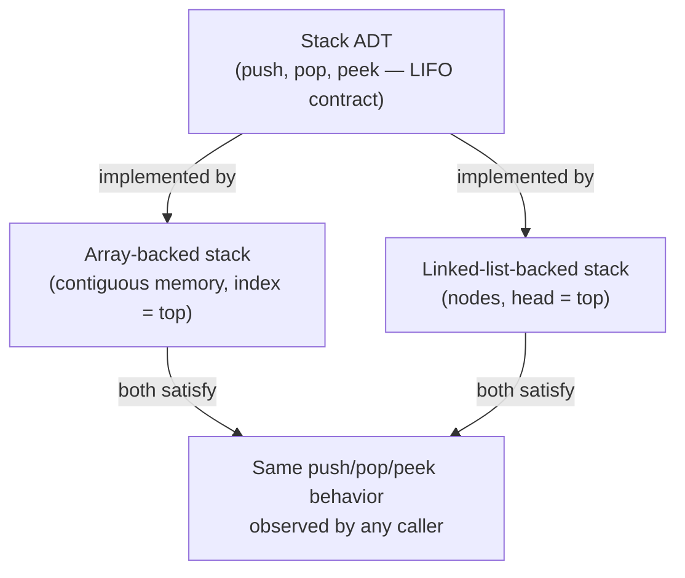

## Learning Objectives

- Explain the distinction between an Abstract Data Type (ADT) and a data structure.
- Identify the operations that define a given ADT independently of any particular implementation.
- Compare two different implementations of the same ADT and predict which operations each one makes cheap or expensive.
- Analyze why separating "what" from "how" lets a program's correctness reasoning stay stable while its performance characteristics change underneath it.

## Context & Motivation

Every programmer, early on, learns to use a "list" or a "stack" or a "map" — call `.append()`, call `.push()`, call `.get()` — without ever being told exactly what machine instructions run underneath. That gap is not an accident or a shortcut: it is the entire point of a foundational idea in computer science called the Abstract Data Type, or ADT. An ADT specifies a set of operations and the rules that govern how those operations behave — what a stack's `push` and `pop` do to each other, what a queue's `enqueue` and `dequeue` guarantee about order — without saying one word about arrays, pointers, memory addresses, or any other implementation detail. A **data structure**, by contrast, is a concrete, in-memory way of laying out data and implementing those operations. The same ADT — say, "a sequence of items you can access by position" — can be built as a static array, a dynamic array, a singly linked list, or a doubly linked list, and a program written against the ADT's operations should not need to change no matter which of these sits underneath it.

This separation is not academic ceremony. It is the reason software can evolve. If application code manipulates raw array indices directly, swapping the underlying representation for a linked list later means rewriting every call site that assumed contiguous memory and O(1) indexing. If application code instead calls `push`, `pop`, `peek` — the vocabulary of the Stack ADT — the implementation underneath can change from an array-backed stack to a linked-list-backed stack without touching a single caller. This is precisely the discipline Sedgewick and Wayne build their *Algorithms, Part I* course around, and it is why Stanford's CS106B treats the ADT/implementation split as one of the very first ideas taught, before any specific data structure: get the vocabulary of "interface versus implementation" fixed first, and every subsequent data structure becomes an instance of a pattern already understood, rather than a new thing learned from scratch.

The practical stakes show up constantly. A team building a text editor's undo feature does not care, at the API level, whether "undo history" is array-backed or list-backed — they care that they can `push` a new edit and `pop` the most recent one, in that exact order, in constant time. The choice of underlying data structure is a performance and engineering decision made once, deliberately, and hidden behind the ADT's operations. Understanding that this separation exists — and exactly where the line falls — is the single most useful mental model for everything the rest of this discipline builds: static arrays, dynamic arrays, linked lists, stacks, queues, and hash tables are all, from this point forward, going to be introduced as "here is an ADT's contract" followed by "here is one way (sometimes several ways) to satisfy that contract in memory."

## Core Theory

### Defining an ADT: operations and behavioral contracts

An Abstract Data Type is defined by two things, and only two things:

1. **A set of operations** — the names of the actions that can be performed (e.g., `push(x)`, `pop()`, `peek()` for a stack), each with a signature (what it takes in, what it returns).
2. **A behavioral contract** — the rules governing how those operations relate to each other and what they guarantee, independent of how they are implemented. For a stack: "the most recently pushed item not yet popped is the one `pop` returns" (Last-In-First-Out). For a queue: "the earliest item enqueued and not yet dequeued is the one `dequeue` returns" (First-In-First-Out).

Crucially, an ADT's definition says nothing about time complexity, memory layout, or even what language it is implemented in. Two implementations of the "Stack ADT" are both, unambiguously, stacks, as long as they satisfy the LIFO contract — even if one is O(1) per operation and another is (badly) O(n) per operation. Complexity is a property of an *implementation*, not of the ADT itself.

### Data structure: the concrete realization

A **data structure** is a specific way of organizing data in memory together with the algorithms that implement an ADT's operations on top of that organization. "Array" and "linked list" are data structures; "List ADT" (a sequence supporting indexed access, insertion, and deletion) is the abstraction that both of them can implement. This is why it is entirely coherent to say "arrays and linked lists both implement the List ADT" — they satisfy the same contract with different memory layouts and, consequently, different performance trade-offs.



### Why the separation matters: interchangeability and encapsulation

Because caller code only ever invokes the ADT's operations — never reaches into the implementation's internals — the implementation can be replaced freely as long as the contract holds. This is the same principle object-oriented design calls encapsulation, and it long predates objects: it is really an insistence that a *specification* (what the operations promise) be kept separate from a *realization* (how those promises are kept in memory). The ACM/IEEE CS2013 curriculum guidelines list this ADT/implementation separation as a core learning outcome of "Software Development Fundamentals" precisely because so much of a working programmer's later skill — choosing the right structure for a job, reasoning about performance, refactoring safely — depends on internalizing that operations and implementations are different things that happen to be connected by a contract, not one and the same thing.

### Specifying an ADT precisely: preconditions, postconditions, and complexity as a promise (not the definition)

A rigorous ADT specification usually states, for each operation: its **preconditions** (what must be true to call it — e.g., `pop()` on a stack requires the stack be non-empty), its **postconditions** (what is true after it runs — e.g., after `push(x)`, the top of the stack is `x`), and, separately, a **complexity guarantee** that the ADT's *documentation* promises even though the *definition* does not require it (e.g., "any correct implementation of this ADT used in this course must support `push`/`pop` in O(1)"). This last point is worth being precise about: nothing about the word "stack" mathematically forces O(1) operations — a stack implemented by re-sorting a giant array on every push would still, technically, be a stack. In practice, though, an ADT is almost always paired with an expected complexity, and choosing an implementation that fails to meet that expectation is considered a bug in engineering practice, even though it is not a violation of the ADT's bare behavioral contract.

## Worked Examples

### Example 1 — Same ADT, two implementations, different costs

**Problem:** Define a minimal "Bag ADT" — an unordered collection supporting `add(x)` and `contains(x)` — and implement it two ways: as an unsorted list and as a sorted list. Compare `contains` performance.

```python
# Implementation A: unsorted underlying list
class UnsortedBag:
    def __init__(self):
        self._items = []

    def add(self, x):
        self._items.append(x)          # O(1)

    def contains(self, x):
        for item in self._items:       # O(n) — must check every item,
            if item == x:              # since nothing tells us where
                return True             # to stop early
        return False


# Implementation B: sorted underlying list
class SortedBag:
    def __init__(self):
        self._items = []

    def add(self, x):
        # insert x keeping self._items sorted
        lo, hi = 0, len(self._items)
        while lo < hi:
            mid = (lo + hi) // 2
            if self._items[mid] < x:
                lo = mid + 1
            else:
                hi = mid
        self._items.insert(lo, x)      # O(n) — shifting elements to insert

    def contains(self, x):
        lo, hi = 0, len(self._items)
        while lo < hi:                 # O(log n) — binary search
            mid = (lo + hi) // 2
            if self._items[mid] == x:
                return True
            elif self._items[mid] < x:
                lo = mid + 1
            else:
                hi = mid
        return False
```

**Reasoning.** Both classes satisfy the exact same Bag ADT contract: `add(x)` makes `x` a member; `contains(x)` reports membership. A caller using only `add` and `contains` cannot, from behavior alone, tell which one it's holding. But their costs diverge sharply: `UnsortedBag.add` is O(1) while `SortedBag.add` is O(n) (shifting to maintain order); `UnsortedBag.contains` is O(n) while `SortedBag.contains` is O(log n). Neither implementation is "more correct" — the ADT contract doesn't prefer one. The choice between them is a pure engineering trade-off made based on which operation is called more often in the actual application, and that choice is exactly the kind of decision the ADT/implementation split is designed to let you make (and later change) without touching caller code.

### Example 2 — Detecting a contract violation

**Problem:** A junior developer writes a class named `Stack` but implements `pop()` to remove and return the *oldest* remaining item instead of the *most recently pushed* one. Is this still a Stack?

```python
class BrokenStack:
    def __init__(self):
        self._items = []

    def push(self, x):
        self._items.append(x)

    def pop(self):
        return self._items.pop(0)   # removes the FRONT, not the back!
```

**Reasoning.** Naming a class `Stack` does not make it satisfy the Stack ADT's contract. The defining behavioral rule of the Stack ADT is Last-In-First-Out: the most recently pushed, not-yet-popped element is the one `pop` returns. `BrokenStack.pop()` removes index 0 — the *first* item ever pushed that's still present — which is First-In-First-Out behavior, i.e., a Queue's contract, not a Stack's. This is a genuine, checkable violation: push 1, 2, 3; a correct stack's `pop()` sequence is 3, 2, 1; `BrokenStack`'s `pop()` sequence is 1, 2, 3. The lesson: an ADT's identity is determined entirely by its behavioral contract, never by a class name, a comment, or an implementer's intent.

### Example 3 — Choosing an implementation from the ADT's usage pattern

**Problem:** A priority task scheduler needs a structure where the operation "give me the highest-priority task" (`extract_max`) is called far more often than "add a new task" (`insert`). Two people implementing the ADT propose: (A) keep tasks in an unsorted array, or (B) keep tasks in an array sorted descending by priority. Which better fits the *usage pattern*, given the ADT itself permits either?

**Reasoning.** Under implementation A, `insert` is O(1) (append to the end) but `extract_max` is O(n) (must scan for the maximum). Under implementation B, `insert` is O(n) (must find the insertion point and shift), but `extract_max` is O(1) (it's always at the front). Since the ADT's contract ("insert a task"; "extract the highest-priority task") is satisfied by both, the ADT gives no basis for preferring one — the deciding factor is entirely the *usage pattern* stated in the problem: `extract_max` dominates, so implementation B, which makes that operation cheap at the cost of a rarer, more expensive `insert`, is the better engineering choice. (In practice, neither is optimal — a binary heap, covered later in this curriculum, achieves O(log n) for both — but the point here is that the ADT's contract alone never picks a winner between A and B; only measured or anticipated usage does.)

## Common Misconceptions & Pitfalls

- **"The ADT and the data structure are the same thing — 'stack' means an array-backed stack."** This conflates the two ideas the whole topic exists to separate. As Example 1 shows, an unsorted list and a sorted list both correctly implement a Bag ADT while having opposite performance profiles; there is no single "the" data structure that an ADT name refers to.
- **"If a class is named after an ADT, it correctly implements that ADT."** Example 2 demonstrates a `Stack`-named class that actually behaves like a queue. The only reliable test of whether something implements an ADT is checking its *behavior* against the contract, never its name, its docstring, or its author's stated intent.
- **"An ADT's definition specifies its time complexity."** It does not — see the "Bag with resorting" thought experiment in Core Theory. Complexity is an expected, documented property of a *good* implementation, and violating an expected complexity is a real engineering problem, but it is not a violation of the ADT's bare mathematical definition, which is silent on complexity entirely.
- **"Since ADTs are just interfaces, there's no reason to think carefully about implementation."** The opposite is true: because callers are insulated from implementation details, the *implementer* carries the full weight of getting performance right — a poor implementation choice (as in Example 3, picking the array orientation that mismatches the usage pattern) silently costs every caller, all of whom have no visibility into why their code is slow, since the ADT's interface gives no hint about what's happening underneath.

## Summary

An Abstract Data Type specifies a set of operations and the behavioral contract governing them — what they do and how they relate to each other — without saying anything about memory layout or performance. A data structure is a concrete, in-memory realization of that contract, and any number of different data structures can correctly implement the same ADT while offering wildly different performance trade-offs, as the unsorted-versus-sorted Bag example showed. This separation is what lets application code stay stable while the underlying implementation is swapped or optimized, and it is why every data structure covered in the rest of this discipline — static and dynamic arrays, singly and doubly linked lists — will be framed first as an implementation choice for one or more ADTs (a Sequence, a Stack, a Queue) rather than as a freestanding topic. Correctness is judged against the contract alone; performance is judged against the ADT's *expected* complexity, a separate, engineering-level promise layered on top of, but not part of, the mathematical definition.

## Documentation Links

- [Sedgewick & Wayne — Algorithms, Part I (Princeton, Coursera)](https://www.coursera.org/learn/algorithms-part1) — doc
- [Stanford CS106B — Lecture Schedule](https://web.stanford.edu/class/cs106b/schedule) — doc
