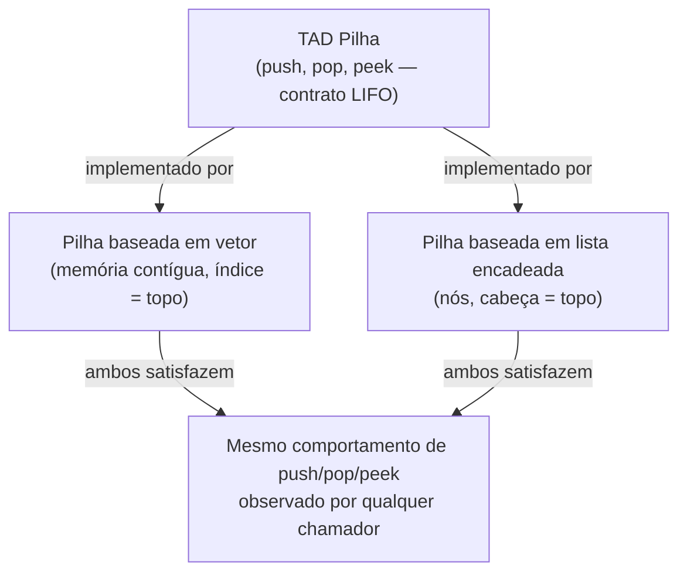

## Objetivos de Aprendizagem

- Explicar a distinção entre um Tipo Abstrato de Dados (TAD) e uma estrutura de dados.
- Identificar as operações que definem um dado TAD independentemente de qualquer implementação particular.
- Comparar duas implementações diferentes do mesmo TAD e prever quais operações cada uma torna baratas ou caras.
- Analisar por que separar "o quê" de "como" permite que o raciocínio de corretude de um programa permaneça estável enquanto suas características de desempenho mudam por baixo.

## Contexto e Motivação

Todo programador, cedo, aprende a usar uma "lista" ou uma "pilha" ou um "mapa" (chamar `.append()`, chamar `.push()`, chamar `.get()`) sem nunca ser informado exatamente quais instruções de máquina rodam por baixo. Essa lacuna não é um acidente ou um atalho: é o ponto inteiro de uma ideia fundamental em Ciência da Computação chamada Tipo Abstrato de Dados, ou TAD. Um TAD especifica um conjunto de operações e as regras que governam como essas operações se comportam (o que o `push` e o `pop` de uma pilha fazem um em relação ao outro, o que o `enqueue` e o `dequeue` de uma fila garantem sobre ordem) sem dizer uma palavra sobre vetores, ponteiros, endereços de memória, ou qualquer outro detalhe de implementação. Uma **estrutura de dados**, em contraste, é uma forma concreta e em memória de organizar dados e implementar essas operações. O mesmo TAD, digamos, "uma sequência de itens que você pode acessar por posição", pode ser construído como um vetor estático, um vetor dinâmico, uma lista encadeada simples, ou uma lista duplamente encadeada, e um programa escrito contra as operações do TAD não deveria precisar mudar não importa qual dessas esteja por baixo.

Essa separação não é cerimônia acadêmica. É a razão de software conseguir evoluir. Se o código da aplicação manipula índices de vetor crus diretamente, trocar a representação subjacente por uma lista encadeada depois significa reescrever todo ponto de chamada que assumiu memória contígua e indexação O(1). Se o código da aplicação em vez disso chama `push`, `pop`, `peek` (o vocabulário do TAD Pilha), a implementação por baixo pode mudar de uma pilha baseada em vetor para uma pilha baseada em lista encadeada sem tocar num único chamador. Essa é precisamente a disciplina em torno da qual Sedgewick e Wayne constroem seu curso *Algorithms, Part I*, e é por que o CS106B de Stanford trata a divisão TAD/implementação como uma das primeiríssimas ideias ensinadas, antes de qualquer estrutura de dados específica: fixe o vocabulário de "interface versus implementação" primeiro, e toda estrutura de dados subsequente vira uma instância de um padrão já entendido, em vez de uma coisa nova aprendida do zero.

As implicações práticas aparecem constantemente. Um time construindo o recurso de desfazer de um editor de texto não se importa, no nível da API, se o "histórico de desfazer" é baseado em vetor ou em lista; se importa que pode dar `push` numa nova edição e `pop` na mais recente, nessa ordem exata, em tempo constante. A escolha da estrutura de dados subjacente é uma decisão de desempenho e engenharia feita uma vez, deliberadamente, e escondida atrás das operações do TAD. Entender que essa separação existe, e exatamente onde a linha cai, é o modelo mental mais útil para tudo que o resto desta disciplina constrói: vetores estáticos, vetores dinâmicos, listas encadeadas, pilhas, filas e tabelas hash vão todas, daqui pra frente, ser introduzidas como "aqui está o contrato de um TAD" seguido de "aqui está uma forma (às vezes várias formas) de satisfazer esse contrato em memória".

## Teoria Central

### Definindo um TAD: operações e contratos comportamentais

Um Tipo Abstrato de Dados é definido por duas coisas, e só duas coisas:

1. **Um conjunto de operações**: os nomes das ações que podem ser realizadas (por exemplo, `push(x)`, `pop()`, `peek()` para uma pilha), cada uma com uma assinatura (o que ela recebe, o que ela retorna).
2. **Um contrato comportamental**: as regras governando como essas operações se relacionam entre si e o que elas garantem, independentemente de como são implementadas. Para uma pilha: "o item empilhado mais recentemente e ainda não desempilhado é o que `pop` retorna" (Último a Entrar, Primeiro a Sair, LIFO). Para uma fila: "o item enfileirado há mais tempo e ainda não desenfileirado é o que `dequeue` retorna" (Primeiro a Entrar, Primeiro a Sair, FIFO).

Crucialmente, a definição de um TAD não diz nada sobre complexidade de tempo, layout de memória, ou mesmo em que linguagem é implementado. Duas implementações do "TAD Pilha" são ambas, sem ambiguidade, pilhas, desde que satisfaçam o contrato LIFO, mesmo que uma seja O(1) por operação e outra seja (mal) O(n) por operação. Complexidade é uma propriedade de uma *implementação*, não do TAD em si.

### Estrutura de dados: a realização concreta

Uma **estrutura de dados** é uma forma específica de organizar dados em memória junto com os algoritmos que implementam as operações de um TAD em cima dessa organização. "Vetor" e "lista encadeada" são estruturas de dados; "TAD Sequência" (uma sequência suportando acesso indexado, inserção e remoção) é a abstração que ambas podem implementar. É por isso que é inteiramente coerente dizer "vetores e listas encadeadas ambos implementam o TAD Sequência": eles satisfazem o mesmo contrato com layouts de memória diferentes e, consequentemente, trade-offs de desempenho diferentes.



### Por que a separação importa: intercambiabilidade e encapsulamento

Como o código chamador só invoca as operações do TAD, nunca acessa os internos da implementação, a implementação pode ser trocada livremente desde que o contrato se mantenha. Esse é o mesmo princípio que o design orientado a objetos chama de encapsulamento, e é bem anterior a objetos: é de fato uma insistência em que uma *especificação* (o que as operações prometem) seja mantida separada de uma *realização* (como essas promessas são cumpridas em memória). As diretrizes curriculares ACM/IEEE CS2013 listam essa separação TAD/implementação como um resultado de aprendizagem central de "Software Development Fundamentals" precisamente porque tanto da habilidade posterior de um programador em atividade (escolher a estrutura certa para um trabalho, raciocinar sobre desempenho, refatorar com segurança) depende de internalizar que operações e implementações são coisas diferentes que acontecem de estar conectadas por um contrato, não uma única e mesma coisa.

### Especificando um TAD com precisão: pré-condições, pós-condições, e complexidade como uma promessa (não a definição)

Uma especificação rigorosa de TAD geralmente declara, para cada operação: suas **pré-condições** (o que precisa ser verdade para chamá-la, por exemplo, `pop()` numa pilha exige que a pilha seja não vazia), suas **pós-condições** (o que é verdade depois dela rodar, por exemplo, depois de `push(x)`, o topo da pilha é `x`), e, separadamente, uma **garantia de complexidade** que a *documentação* do TAD promete mesmo que a *definição* não a exija (por exemplo, "qualquer implementação correta deste TAD usada neste curso precisa suportar `push`/`pop` em O(1)"). Vale a pena ser preciso sobre esse último ponto: nada na palavra "pilha" força matematicamente operações O(1); uma pilha implementada reordenando um vetor gigante a cada push ainda seria, tecnicamente, uma pilha. Na prática, porém, um TAD é quase sempre pareado com uma complexidade esperada, e escolher uma implementação que falha em atender essa expectativa é considerado um bug na prática de engenharia, mesmo não sendo uma violação do contrato comportamental cru do TAD.

## Exemplos Resolvidos

### Exemplo 1: mesmo TAD, duas implementações, custos diferentes

**Problema:** defina um "TAD Bolsa" mínimo (uma coleção não ordenada suportando `add(x)` e `contains(x)`) e implemente-o de duas formas: como uma lista não ordenada e como uma lista ordenada. Compare o desempenho de `contains`.

```python
# Implementação A: lista subjacente não ordenada
class BolsaNaoOrdenada:
    def __init__(self):
        self._items = []

    def add(self, x):
        self._items.append(x)          # O(1)

    def contains(self, x):
        for item in self._items:       # O(n): precisa checar todo item,
            if item == x:              # já que nada nos diz onde
                return True             # parar antecipadamente
        return False


# Implementação B: lista subjacente ordenada
class BolsaOrdenada:
    def __init__(self):
        self._items = []

    def add(self, x):
        # insere x mantendo self._items ordenado
        lo, hi = 0, len(self._items)
        while lo < hi:
            mid = (lo + hi) // 2
            if self._items[mid] < x:
                lo = mid + 1
            else:
                hi = mid
        self._items.insert(lo, x)      # O(n): deslocando elementos para inserir

    def contains(self, x):
        lo, hi = 0, len(self._items)
        while lo < hi:                 # O(log n): busca binária
            mid = (lo + hi) // 2
            if self._items[mid] == x:
                return True
            elif self._items[mid] < x:
                lo = mid + 1
            else:
                hi = mid
        return False
```

**Raciocínio.** As duas classes satisfazem exatamente o mesmo contrato de TAD Bolsa: `add(x)` faz de `x` um membro; `contains(x)` reporta pertinência. Um chamador usando só `add` e `contains` não consegue, só pelo comportamento, dizer qual delas está segurando. Mas seus custos divergem drasticamente: `BolsaNaoOrdenada.add` é O(1) enquanto `BolsaOrdenada.add` é O(n) (deslocando para manter a ordem); `BolsaNaoOrdenada.contains` é O(n) enquanto `BolsaOrdenada.contains` é O(log n). Nenhuma das implementações é "mais correta"; o contrato do TAD não prefere nenhuma. A escolha entre elas é um trade-off puro de engenharia feito com base em qual operação é chamada com mais frequência na aplicação real, e essa escolha é exatamente o tipo de decisão que a divisão TAD/implementação foi projetada para permitir que você faça (e depois mude) sem tocar no código chamador.

### Exemplo 2: detectando uma violação de contrato

**Problema:** um desenvolvedor júnior escreve uma classe chamada `Stack` mas implementa `pop()` para remover e retornar o item remanescente *mais antigo* em vez do *mais recentemente empilhado*. Isso ainda é uma Pilha?

```python
class PilhaQuebrada:
    def __init__(self):
        self._items = []

    def push(self, x):
        self._items.append(x)

    def pop(self):
        return self._items.pop(0)   # remove a FRENTE, não o fundo!
```

**Raciocínio.** Nomear uma classe `Stack` não a faz satisfazer o contrato do TAD Pilha. A regra comportamental definidora do TAD Pilha é Último a Entrar, Primeiro a Sair: o elemento empilhado mais recentemente e ainda não desempilhado é o que `pop` retorna. `PilhaQuebrada.pop()` remove o índice 0, o *primeiro* item já empilhado que ainda está presente, que é comportamento Primeiro a Entrar, Primeiro a Sair, ou seja, o contrato de uma Fila, não de uma Pilha. Essa é uma violação genuína e checável: empilhe 1, 2, 3; a sequência de `pop()` de uma pilha correta é 3, 2, 1; a sequência de `pop()` de `PilhaQuebrada` é 1, 2, 3. A lição: a identidade de um TAD é determinada inteiramente por seu contrato comportamental, nunca por um nome de classe, um comentário, ou a intenção de quem implementou.

### Exemplo 3: escolhendo uma implementação a partir do padrão de uso do TAD

**Problema:** um escalonador de tarefas com prioridade precisa de uma estrutura onde a operação "me dê a tarefa de maior prioridade" (`extract_max`) é chamada muito mais frequentemente que "adicione uma nova tarefa" (`insert`). Duas pessoas implementando o TAD propõem: (A) manter tarefas num vetor não ordenado, ou (B) manter tarefas num vetor ordenado decrescentemente por prioridade. Qual se encaixa melhor no *padrão de uso*, dado que o próprio TAD permite qualquer uma das duas?

**Raciocínio.** Sob a implementação A, `insert` é O(1) (anexar ao final) mas `extract_max` é O(n) (precisa varrer procurando o máximo). Sob a implementação B, `insert` é O(n) (precisa achar o ponto de inserção e deslocar), mas `extract_max` é O(1) (está sempre na frente). Como o contrato do TAD ("insira uma tarefa"; "extraia a tarefa de maior prioridade") é satisfeito por ambas, o TAD não dá base para preferir uma; o fator decisivo é inteiramente o *padrão de uso* declarado no problema: `extract_max` domina, então a implementação B, que torna essa operação barata ao custo de um `insert` mais raro e mais caro, é a melhor escolha de engenharia. (Na prática, nenhuma das duas é ótima; um heap binário, coberto mais adiante neste currículo, alcança O(log n) para as duas; mas o ponto aqui é que o contrato do TAD sozinho nunca escolhe um vencedor entre A e B; só o uso medido ou antecipado escolhe.)

## Equívocos Comuns e Armadilhas

- **"O TAD e a estrutura de dados são a mesma coisa, 'pilha' significa uma pilha baseada em vetor."** Isso confunde as duas ideias que o tópico inteiro existe para separar. Como o Exemplo 1 mostra, uma lista não ordenada e uma lista ordenada implementam corretamente um TAD Bolsa enquanto têm perfis de desempenho opostos; não existe uma única "a" estrutura de dados à qual o nome de um TAD se refere.
- **"Se uma classe leva o nome de um TAD, ela implementa esse TAD corretamente."** O Exemplo 2 demonstra uma classe chamada `Stack` que na verdade se comporta como uma fila. O único teste confiável de se algo implementa um TAD é checar seu *comportamento* contra o contrato, nunca seu nome, sua docstring, ou a intenção declarada de quem a escreveu.
- **"A definição de um TAD especifica sua complexidade de tempo."** Não especifica; veja o experimento mental "Bolsa com reordenação" na Teoria Central. Complexidade é uma propriedade esperada e documentada de uma *boa* implementação, e violar uma complexidade esperada é um problema real de engenharia, mas não é uma violação da definição matemática crua do TAD, que é silenciosa sobre complexidade inteiramente.
- **"Como TADs são só interfaces, não há razão para pensar cuidadosamente sobre implementação."** O oposto é verdade: como os chamadores estão isolados dos detalhes de implementação, quem implementa carrega todo o peso de acertar o desempenho; uma escolha de implementação ruim (como no Exemplo 3, escolher a orientação de vetor que não combina com o padrão de uso) custa silenciosamente a todo chamador, nenhum dos quais tem visibilidade sobre por que seu código está lento, já que a interface do TAD não dá nenhuma pista sobre o que está acontecendo por baixo.

## Resumo

Um Tipo Abstrato de Dados especifica um conjunto de operações e o contrato comportamental que as governa (o que elas fazem e como se relacionam entre si) sem dizer nada sobre layout de memória ou desempenho. Uma estrutura de dados é uma realização concreta, em memória, desse contrato, e qualquer número de estruturas de dados diferentes pode implementar corretamente o mesmo TAD enquanto oferece trade-offs de desempenho radicalmente diferentes, como o exemplo Bolsa não-ordenada-versus-ordenada mostrou. Essa separação é o que permite que o código da aplicação permaneça estável enquanto a implementação subjacente é trocada ou otimizada, e é por isso que toda estrutura de dados coberta no resto desta disciplina (vetores estáticos e dinâmicos, listas encadeadas simples e duplas) vai ser enquadrada primeiro como uma escolha de implementação para um ou mais TADs (uma Sequência, uma Pilha, uma Fila) em vez de como um tópico isolado. Corretude é julgada contra o contrato sozinho; desempenho é julgado contra a complexidade *esperada* do TAD, uma promessa separada, de nível de engenharia, sobreposta a, mas não parte de, a definição matemática.

## Documentation Links

- [Sedgewick & Wayne — Algorithms, Part I (Princeton, Coursera)](https://www.coursera.org/learn/algorithms-part1) — doc
- [Stanford CS106B — Lecture Schedule](https://web.stanford.edu/class/cs106b/schedule) — doc
