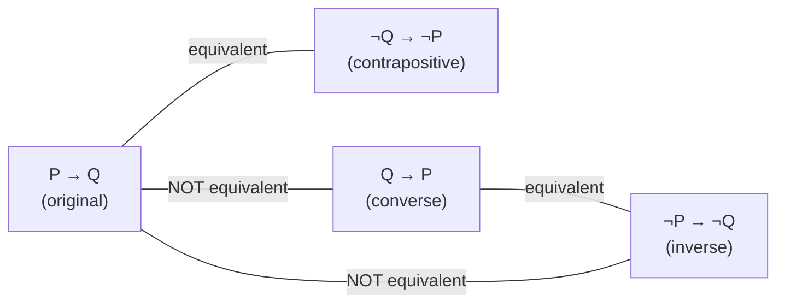

## Learning Objectives

- Explain the logical structure of a direct proof of "if P then Q," and identify the hypothesis and goal at each step.
- State the contrapositive of a conditional statement correctly, and explain why it is logically equivalent to the original.
- Prove a conditional statement by contraposition when reasoning forward from P is awkward or underdetermined.
- Compare a direct proof and a contrapositive proof of the same claim, and identify which is the more natural fit for a given statement.
- Identify the converse and the inverse of a conditional statement, and explain why neither is logically equivalent to the original.

## Context & Motivation

Most claims worth proving in computer science and mathematics have the shape "if P, then Q" — if this input satisfies some property, the algorithm produces this output; if a graph has this structure, it has this many edges; if a number has this form, it has this divisibility property. Two proof techniques handle this shape directly, and the choice between them is one of the first real strategic decisions a proof-writer has to make: **direct proof**, which starts from P and reasons forward until Q is reached, and **proof by contraposition**, which proves the logically equivalent statement "if not Q, then not P" instead. They always prove the same thing — that is the entire point of contraposition being available as an option — but one of the two is frequently much easier to actually carry out for a given claim, and learning to recognize which is a skill in its own right.

The reason contraposition earns a place alongside direct proof, rather than being a curiosity, is that "assume P, derive Q" is not always the most tractable direction to reason in. Some hypotheses are hard to use directly because they describe what something *is not* or hand over very little concrete structure to work with, while their negations hand over exactly the structure needed. The classic case is any claim of the form "if n² is even, then n is even": assuming n² is even gives very little to grab onto algebraically, but assuming the *negation* of the conclusion — n is odd — immediately hands over a concrete algebraic form (n = 2k+1) that can be squared and inspected directly. Recognizing this pattern — hypothesis awkward to unpack directly, conclusion's negation algebraically concrete — is exactly the signal that a proof should reach for contraposition rather than forcing a direct argument.

Stanford's CS103 treats this pairing as one of the foundational moves in the entire course, precisely because so much of theoretical computer science is built from conditional claims: correctness proofs ("if the algorithm halts, the output satisfies the invariant"), complexity results ("if a problem is in P, then..."), and structural claims about graphs, automata, and formal languages almost all reduce, at the level of a single lemma, to proving some "if P then Q." Mastering the direct/contrapositive choice at this stage is mastering the tool that the overwhelming majority of later proofs in the course will be built from.

## Core Theory

### The logical shape of a direct proof

A conditional statement P → Q ("if P then Q") is proved directly by assuming P holds, then constructing a chain of intermediate statements R₁, R₂, ..., Rₖ, Q, where each statement in the chain follows from the ones before it (together with P and previously established facts) by a justified step, ending at Q. Symbolically, the proof establishes P → R₁, R₁ → R₂, ..., Rₖ → Q, and chains them by the transitivity of implication to conclude P → Q. Crucially, P is *assumed*, not proved — the claim being established is conditional, so nothing requires showing P is actually true, only that Q follows whenever it is.

The skeleton of a direct proof is always: "Let [the objects the statement quantifies over] be arbitrary. Suppose P holds [unpack what that means by definition]. [Chain of justified algebraic/logical steps]. Therefore Q holds [matching the definition of Q]." The universally-quantified variable (often n, or an arbitrary element of a set) is fixed but arbitrary — the argument must not depend on any special property of the particular value chosen, or the proof only establishes the claim for that one value rather than for all of them.

### The contrapositive, and why it is equivalent

Given a conditional P → Q, its **contrapositive** is ¬Q → ¬P ("if not Q, then not P"). These two statements are **logically equivalent** — each is true in exactly the cases the other is true — which can be verified by a truth table:

| P | Q | P → Q | ¬Q | ¬P | ¬Q → ¬P |
|---|---|-------|-----|-----|---------|
| T | T | T | F | F | T |
| T | F | F | T | F | F |
| F | T | T | F | T | T |
| F | F | T | T | T | T |

The two boxed columns (P → Q and ¬Q → ¬P) agree on every row, which is exactly the definition of logical equivalence. Because they are equivalent, proving one *is* proving the other — a proof of ¬Q → ¬P is, by that equivalence, a complete and valid proof of P → Q, with no additional step required to "translate back." This is the entire logical license behind proof by contraposition: it is not a weaker substitute for a direct proof, it is a full proof of the original statement, just approached from the other end.

It is essential to distinguish the contrapositive from two statements that are *not* equivalent to P → Q:

- The **converse**, Q → P, which reverses the direction and is, in general, a completely different claim that can be false even when P → Q is true (if n is a multiple of 4, then n is even — true; if n is even, then n is a multiple of 4 — false, witnessed by n = 6).
- The **inverse**, ¬P → ¬Q, which negates both sides without reversing them, and is logically equivalent to the converse (not to the original) — so it inherits the same failure mode.

### Choosing between direct proof and contraposition

The choice is purely strategic, never a matter of which one is "more rigorous" — both, done correctly, are fully rigorous proofs of the same statement. The heuristic that experienced proof-writers use: try assuming P directly first, since it is usually the more natural starting point; switch to assuming ¬Q instead specifically when P is a negative or existential statement that is awkward to unpack ("n is not a perfect square," "there is no largest prime factor"), or when Q's negation immediately supplies a concrete algebraic form to work with while P itself does not. The parity example above is the textbook illustration: "n² is even" (the hypothesis, P) gives no immediate algebraic handle, since being told a square is even says relatively little about the number being squared without more work, while "n is odd" (¬Q, the negation of the conclusion) immediately supplies n = 2k + 1, a concrete form that can be manipulated directly.

### Proving a biconditional by combining both directions

A statement of the form "P if and only if Q" (P ↔ Q) requires proving *two* conditionals: P → Q and Q → P, and the two need not use the same technique — one direction might go by direct proof, the other by contraposition, according to whichever is more natural for that direction. This is a common structure in later theorems (e.g., characterizing exactly which integers satisfy some property) and is worth flagging now: seeing "if and only if" in a claim is a signal that the proof has two separate halves to complete, not one.

## Worked Examples

### Example 1 — a direct proof where the hypothesis unpacks cleanly

**Claim:** for all integers a, b, and c, if a divides b and b divides c, then a divides c.

*Proof.* Let a, b, c be arbitrary integers, and suppose a divides b and b divides c. By the definition of divisibility, a | b means there exists an integer k such that b = ak, and b | c means there exists an integer m such that c = bm. Substituting the first equation into the second:

c = bm = (ak)m = a(km)

Since k and m are integers, km is an integer, so c = a(km) exhibits c as a times an integer, which is exactly the definition of a | c. Since a, b, c were arbitrary, the claim holds for all integers satisfying the hypotheses. ∎

This is a direct proof because the hypothesis (a | b and b | c) unpacks immediately into two concrete equations that combine by substitution — there is no awkwardness to route around, so contraposition would add nothing here.

### Example 2 — the same claim style, but where contraposition is clearly the right tool

**Claim:** for every integer n, if n² is even, then n is even.

Attempting this directly: assume n² is even, so n² = 2j for some integer j. This gives very little to work with — solving for n involves a square root, and there is no clean way to conclude n = 2(something) from n² = 2j alone without essentially re-deriving number-theoretic facts about square roots of even numbers, which is circular relative to what's being proved.

Switching to the contrapositive instead: the contrapositive of "n² even → n even" is "n not even → n² not even," i.e., "if n is odd, then n² is odd."

*Proof (of the contrapositive).* Let n be an arbitrary integer, and suppose n is odd. By definition, there exists an integer k such that n = 2k + 1. Then:

n² = (2k + 1)² = 4k² + 4k + 1 = 2(2k² + 2k) + 1

Since 2k² + 2k is an integer, n² has the form 2·(some integer) + 1, which is exactly the definition of odd. So n odd implies n² odd. ∎

Because "n odd → n² odd" is the contrapositive of "n² even → n even," and the two are logically equivalent, this proof of the contrapositive is a complete, valid proof of the original claim — no further step is needed. This example is the standard illustration of exactly the heuristic from Core Theory: the negated conclusion (n odd) supplies a usable algebraic form (2k+1) that the original hypothesis (n² even) does not supply nearly as directly.

### Example 3 — a claim where both directions of a biconditional need separate treatment

**Claim:** for every integer n, n is even if and only if n² is even.

This is a biconditional, so it splits into two conditionals to prove separately.

*(→) If n is even, then n² is even.* Suppose n is even, so n = 2k for some integer k. Then n² = 4k² = 2(2k²), and since 2k² is an integer, n² is even. This direction goes through cleanly as a direct proof.

*(←) If n² is even, then n is even.* This is exactly Example 2's claim, already established above by proving its contrapositive ("n odd → n² odd").

Combining both directions: n is even ⟺ n² is even. ∎

This example makes the point from Core Theory concrete: the two halves of one biconditional used two different techniques — direct proof for one direction, contraposition for the other — each chosen because it was the natural fit for that particular direction, not because of any rule requiring consistency between them.

## Common Misconceptions & Pitfalls

- **"Proving the converse of a statement proves the statement."** If a | b, then a | bc for any integer c — true, by a direct proof similar to Example 1. Its converse, "if a | bc, then a | b," is false in general: 4 | (2 × 6) = 12, but 4 does not divide 2. Proving a converse establishes nothing about the original statement; they are independent claims.
- **"Contraposition means negating P and Q without swapping their order."** That produces the inverse, ¬P → ¬Q, not the contrapositive — and the inverse is equivalent to the converse, not to the original statement, so a "proof by contraposition" that actually proves the inverse has silently proved a different, non-equivalent claim.
- **"A direct proof is always cleaner or preferred over contraposition."** Example 2 shows the opposite can be true: forcing a direct argument on "n² even → n even" leads to an awkward, nearly circular argument, while the contrapositive is short and clean. Neither technique is inherently better; the claim itself determines which unpacks more easily.
- **"Once one direction of a biconditional is proved, the other direction follows automatically."** Example 3 required two separate arguments; P → Q and Q → P are independent claims with independent proofs (as the converse pitfall above underscores), and a biconditional proof is incomplete until both halves are actually established.
- **"Assuming ¬Q in a contrapositive proof means assuming the original claim is false."** It does not — it means assuming ¬Q as the hypothesis of a *new*, logically equivalent conditional (¬Q → ¬P), which is then proved by ordinary direct methods; this is entirely different from proof by contradiction, which assumes the negation of the *entire* implication and searches for an outright impossibility (covered separately).

## Summary

A conditional claim P → Q can be proved directly, by assuming P and reasoning forward to Q, or by proving its contrapositive ¬Q → ¬P instead, which is logically equivalent to P → Q by truth table and therefore an equally complete proof of the original claim. The choice between the two is purely strategic: try direct proof first, and switch to the contrapositive specifically when the negated conclusion supplies more usable structure than the original hypothesis does, as in the classic "n² even implies n even" claim, where assuming n odd hands over the concrete form 2k+1 that assuming n² even does not. The contrapositive must never be confused with the converse (Q → P) or the inverse (¬P → ¬Q), neither of which is equivalent to the original statement — proving either of those proves nothing about P → Q. Biconditional claims (P ↔ Q) require both directions to be proved separately, and each direction may reasonably use a different technique, chosen independently according to which is the more natural fit for that half.

## Documentation Links

- [Lehman, Leighton & Meyer — Mathematics for Computer Science (full text)](https://people.csail.mit.edu/meyer/mcs.pdf) — doc
- [Stanford CS103 — Mathematical Foundations of Computing](https://web.stanford.edu/class/cs103/) — doc
