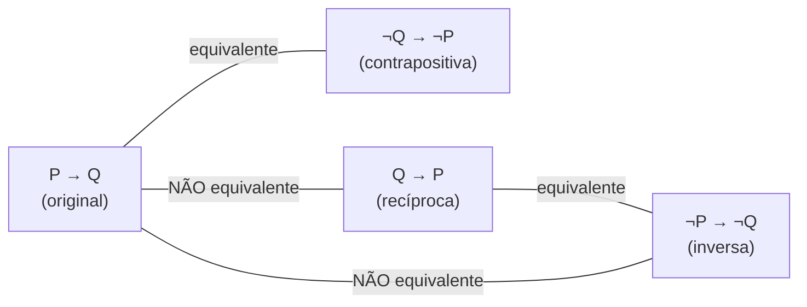

## Objetivos de Aprendizagem

- Explicar a estrutura lógica de uma prova direta de "se P então Q", e identificar a hipótese e o objetivo em cada passo.
- Declarar a contrapositiva de uma afirmação condicional corretamente, e explicar por que ela é logicamente equivalente à original.
- Provar uma afirmação condicional por contraposição quando raciocinar para frente a partir de P é desajeitado ou subdeterminado.
- Comparar uma prova direta e uma prova contrapositiva da mesma afirmação, e identificar qual se encaixa mais naturalmente numa afirmação dada.
- Identificar a recíproca e a inversa de uma afirmação condicional, e explicar por que nenhuma das duas é logicamente equivalente à original.

## Contexto e Motivação

A maioria das afirmações que vale a pena provar em Ciência da Computação e matemática tem a forma "se P, então Q": se essa entrada satisfaz alguma propriedade, o algoritmo produz essa saída; se um grafo tem essa estrutura, ele tem essa quantidade de arestas; se um número tem essa forma, ele tem essa propriedade de divisibilidade. Duas técnicas de prova tratam dessa forma diretamente, e a escolha entre elas é uma das primeiras decisões estratégicas de verdade que quem escreve uma prova precisa tomar: a **prova direta**, que parte de P e raciocina para frente até alcançar Q, e a **prova por contraposição**, que prova a afirmação logicamente equivalente "se não Q, então não P" em vez disso. Elas sempre provam a mesma coisa (esse é todo o ponto de contraposição estar disponível como opção), mas uma das duas é frequentemente muito mais fácil de de fato executar para uma dada afirmação, e aprender a reconhecer qual é uma habilidade em si mesma.

A razão de contraposição ganhar um lugar ao lado da prova direta, em vez de ser uma curiosidade, é que "assuma P, derive Q" nem sempre é a direção mais tratável para raciocinar. Algumas hipóteses são difíceis de usar diretamente porque descrevem o que algo *não é* ou entregam muito pouca estrutura concreta para trabalhar, enquanto suas negações entregam exatamente a estrutura necessária. O caso clássico é qualquer afirmação da forma "se n² é par, então n é par": assumir que n² é par dá muito pouco para se agarrar algebricamente, mas assumir a *negação* da conclusão (n é ímpar) imediatamente entrega uma forma algébrica concreta (n = 2k+1) que pode ser elevada ao quadrado e inspecionada diretamente. Reconhecer esse padrão (hipótese desajeitada de desempacotar diretamente, negação da conclusão algebricamente concreta) é exatamente o sinal de que uma prova deveria recorrer a contraposição em vez de forçar um argumento direto.

O CS103 de Stanford trata esse par como um dos movimentos fundacionais em todo o curso, precisamente porque tanto da Ciência da Computação teórica é construído a partir de afirmações condicionais: provas de corretude ("se o algoritmo para, a saída satisfaz o invariante"), resultados de complexidade ("se um problema está em P, então..."), e afirmações estruturais sobre grafos, autômatos e linguagens formais quase todas se reduzem, no nível de um único lema, a provar algum "se P então Q". Dominar a escolha direta/contrapositiva nesta etapa é dominar a ferramenta a partir da qual a esmagadora maioria das provas posteriores do curso vai ser construída.

## Teoria Central

### A forma lógica de uma prova direta

Uma afirmação condicional P → Q ("se P então Q") é provada diretamente assumindo que P vale, depois construindo uma cadeia de afirmações intermediárias R₁, R₂, ..., Rₖ, Q, onde cada afirmação na cadeia decorre das anteriores (junto com P e fatos já estabelecidos) por um passo justificado, terminando em Q. Simbolicamente, a prova estabelece P → R₁, R₁ → R₂, ..., Rₖ → Q, e as encadeia pela transitividade da implicação para concluir P → Q. Crucialmente, P é *assumido*, não provado; a afirmação sendo estabelecida é condicional, então nada exige mostrar que P é de fato verdadeiro, só que Q decorre sempre que ele vale.

O esqueleto de uma prova direta sempre é: "Sejam [os objetos sobre os quais a afirmação quantifica] arbitrários. Suponha que P vale [desempacote o que isso significa por definição]. [Cadeia de passos algébricos/lógicos justificados]. Portanto Q vale [correspondendo à definição de Q]." A variável quantificada universalmente (frequentemente n, ou um elemento arbitrário de um conjunto) é fixa mas arbitrária; o argumento não pode depender de nenhuma propriedade especial do valor particular escolhido, ou a prova só estabelece a afirmação para aquele único valor em vez de para todos eles.

### A contrapositiva, e por que ela é equivalente

Dado um condicional P → Q, sua **contrapositiva** é ¬Q → ¬P ("se não Q, então não P"). Essas duas afirmações são **logicamente equivalentes** (cada uma é verdadeira exatamente nos casos em que a outra é verdadeira), o que pode ser verificado por uma tabela-verdade:

| P | Q | P → Q | ¬Q | ¬P | ¬Q → ¬P |
|---|---|-------|-----|-----|---------|
| V | V | V | F | F | V |
| V | F | F | V | F | F |
| F | V | V | F | V | V |
| F | F | V | V | V | V |

As duas colunas destacadas (P → Q e ¬Q → ¬P) concordam em toda linha, que é exatamente a definição de equivalência lógica. Por serem equivalentes, provar uma *é* provar a outra: uma prova de ¬Q → ¬P é, por essa equivalência, uma prova completa e válida de P → Q, sem passo adicional necessário para "traduzir de volta". Essa é toda a licença lógica por trás de prova por contraposição: não é um substituto mais fraco para uma prova direta, é uma prova completa da afirmação original, só abordada pela outra ponta.

É essencial distinguir a contrapositiva de duas afirmações que *não* são equivalentes a P → Q:

- A **recíproca**, Q → P, que inverte a direção e é, em geral, uma afirmação completamente diferente que pode ser falsa mesmo quando P → Q é verdadeira (se n é múltiplo de 4, então n é par, verdadeiro; se n é par, então n é múltiplo de 4, falso, testemunhado por n = 6).
- A **inversa**, ¬P → ¬Q, que nega os dois lados sem inverter a ordem, e é logicamente equivalente à recíproca (não ao original), então herda o mesmo modo de falha.

### Escolhendo entre prova direta e contraposição

A escolha é puramente estratégica, nunca uma questão de qual é "mais rigorosa"; as duas, feitas corretamente, são provas totalmente rigorosas da mesma afirmação. A heurística que quem escreve provas com experiência usa: tente assumir P diretamente primeiro, já que geralmente é o ponto de partida mais natural; troque para assumir ¬Q em vez disso especificamente quando P é uma afirmação negativa ou existencial desajeitada de desempacotar ("n não é um quadrado perfeito", "não há maior fator primo"), ou quando a negação de Q fornece imediatamente uma forma algébrica concreta para trabalhar enquanto o próprio P não fornece. O exemplo de paridade acima é a ilustração canônica: "n² é par" (a hipótese, P) não dá nenhuma alça algébrica imediata, já que ser informado que um quadrado é par diz relativamente pouco sobre o número sendo elevado ao quadrado sem mais trabalho, enquanto "n é ímpar" (¬Q, a negação da conclusão) fornece imediatamente n = 2k + 1, uma forma concreta que pode ser manipulada diretamente.

### Provando um bicondicional combinando as duas direções

Uma afirmação da forma "P se e somente se Q" (P ↔ Q) exige provar *dois* condicionais: P → Q e Q → P, e os dois não precisam usar a mesma técnica; uma direção pode ir por prova direta, a outra por contraposição, conforme o que for mais natural para aquela direção. Essa é uma estrutura comum em teoremas posteriores (por exemplo, caracterizando exatamente quais inteiros satisfazem alguma propriedade) e vale a pena sinalizar agora: ver "se e somente se" numa afirmação é um sinal de que a prova tem duas metades separadas a completar, não uma.

## Exemplos Resolvidos

### Exemplo 1: uma prova direta onde a hipótese se desempacota de forma limpa

**Afirmação:** para todos os inteiros a, b e c, se a divide b e b divide c, então a divide c.

*Prova.* Sejam a, b, c inteiros arbitrários, e suponha que a divide b e b divide c. Pela definição de divisibilidade, a | b significa que existe um inteiro k tal que b = ak, e b | c significa que existe um inteiro m tal que c = bm. Substituindo a primeira equação na segunda:

c = bm = (ak)m = a(km)

Como k e m são inteiros, km é um inteiro, então c = a(km) exibe c como a vezes um inteiro, que é exatamente a definição de a | c. Como a, b, c eram arbitrários, a afirmação vale para todos os inteiros satisfazendo as hipóteses. ∎

Esta é uma prova direta porque a hipótese (a | b e b | c) se desempacota imediatamente em duas equações concretas que se combinam por substituição; não há desajeitamento para contornar, então contraposição não acrescentaria nada aqui.

### Exemplo 2: o mesmo estilo de afirmação, mas onde contraposição é claramente a ferramenta certa

**Afirmação:** para todo inteiro n, se n² é par, então n é par.

Tentando diretamente: assuma que n² é par, então n² = 2j para algum inteiro j. Isso dá muito pouco para trabalhar; resolver para n envolve uma raiz quadrada, e não há forma limpa de concluir n = 2(algo) a partir só de n² = 2j sem essencialmente rederivar fatos de teoria dos números sobre raízes quadradas de números pares, o que é circular em relação ao que está sendo provado.

Trocando para a contrapositiva em vez disso: a contrapositiva de "n² par → n par" é "n não par → n² não par", isto é, "se n é ímpar, então n² é ímpar".

*Prova (da contrapositiva).* Seja n um inteiro arbitrário, e suponha que n é ímpar. Por definição, existe um inteiro k tal que n = 2k + 1. Então:

n² = (2k + 1)² = 4k² + 4k + 1 = 2(2k² + 2k) + 1

Como 2k² + 2k é um inteiro, n² tem a forma 2·(algum inteiro) + 1, que é exatamente a definição de ímpar. Então n ímpar implica n² ímpar. ∎

Como "n ímpar → n² ímpar" é a contrapositiva de "n² par → n par", e as duas são logicamente equivalentes, essa prova da contrapositiva é uma prova completa e válida da afirmação original; nenhum passo adicional é necessário. Este exemplo é a ilustração padrão exatamente da heurística da Teoria Central: a conclusão negada (n ímpar) fornece uma forma algébrica utilizável (2k+1) que a hipótese original (n² par) não fornece nem de perto tão diretamente.

### Exemplo 3: uma afirmação onde as duas direções de um bicondicional precisam de tratamento separado

**Afirmação:** para todo inteiro n, n é par se e somente se n² é par.

Este é um bicondicional, então se divide em dois condicionais a provar separadamente.

*(→) Se n é par, então n² é par.* Suponha que n é par, então n = 2k para algum inteiro k. Então n² = 4k² = 2(2k²), e como 2k² é um inteiro, n² é par. Essa direção passa de forma limpa como uma prova direta.

*(←) Se n² é par, então n é par.* Esta é exatamente a afirmação do Exemplo 2, já estabelecida acima provando sua contrapositiva ("n ímpar → n² ímpar").

Combinando as duas direções: n é par ⟺ n² é par. ∎

Este exemplo concretiza o ponto da Teoria Central: as duas metades de um bicondicional usaram duas técnicas diferentes, prova direta para uma direção, contraposição para a outra, cada uma escolhida por ser a mais natural para aquela direção particular, não por causa de alguma regra exigindo consistência entre elas.

## Equívocos Comuns e Armadilhas

- **"Provar a recíproca de uma afirmação prova a afirmação."** Se a | b, então a | bc para qualquer inteiro c, verdadeiro, por uma prova direta similar ao Exemplo 1. Sua recíproca, "se a | bc, então a | b", é falsa em geral: 4 | (2 × 6) = 12, mas 4 não divide 2. Provar uma recíproca não estabelece nada sobre a afirmação original; são afirmações independentes.
- **"Contraposição significa negar P e Q sem trocar sua ordem."** Isso produz a inversa, ¬P → ¬Q, não a contrapositiva, e a inversa é equivalente à recíproca, não à afirmação original, então uma "prova por contraposição" que na verdade prova a inversa provou silenciosamente uma afirmação diferente e não equivalente.
- **"Uma prova direta é sempre mais limpa ou preferível à contraposição."** O Exemplo 2 mostra que o oposto pode ser verdade: forçar um argumento direto sobre "n² par → n par" leva a um argumento desajeitado e quase circular, enquanto a contrapositiva é curta e limpa. Nenhuma das técnicas é inerentemente melhor; a própria afirmação determina qual se desempacota mais facilmente.
- **"Uma vez que uma direção de um bicondicional é provada, a outra direção decorre automaticamente."** O Exemplo 3 exigiu dois argumentos separados; P → Q e Q → P são afirmações independentes com provas independentes (como a armadilha da recíproca acima ressalta), e uma prova de bicondicional está incompleta até que as duas metades sejam de fato estabelecidas.
- **"Assumir ¬Q numa prova por contraposição significa assumir que a afirmação original é falsa."** Não significa; significa assumir ¬Q como a hipótese de um *novo* condicional, logicamente equivalente (¬Q → ¬P), que é então provado por métodos diretos comuns; isso é inteiramente diferente de prova por contradição, que assume a negação de *toda* a implicação e busca uma impossibilidade direta (coberto separadamente).

## Resumo

Uma afirmação condicional P → Q pode ser provada diretamente, assumindo P e raciocinando para frente até Q, ou provando sua contrapositiva ¬Q → ¬P em vez disso, que é logicamente equivalente a P → Q por tabela-verdade e portanto uma prova igualmente completa da afirmação original. A escolha entre as duas é puramente estratégica: tente prova direta primeiro, e troque para a contrapositiva especificamente quando a conclusão negada fornece mais estrutura utilizável que a hipótese original, como na afirmação clássica "n² par implica n par", onde assumir n ímpar entrega a forma concreta 2k+1 que assumir n² par não entrega. A contrapositiva nunca deve ser confundida com a recíproca (Q → P) ou a inversa (¬P → ¬Q), nenhuma das quais é equivalente à afirmação original; provar qualquer uma delas não prova nada sobre P → Q. Afirmações bicondicionais (P ↔ Q) exigem que as duas direções sejam provadas separadamente, e cada direção pode razoavelmente usar uma técnica diferente, escolhida independentemente conforme o que for mais natural para aquela metade.

## Documentation Links

- [Lehman, Leighton & Meyer — Mathematics for Computer Science (full text)](https://people.csail.mit.edu/meyer/mcs.pdf) — doc
- [Stanford CS103 — Mathematical Foundations of Computing](https://web.stanford.edu/class/cs103/) — doc
