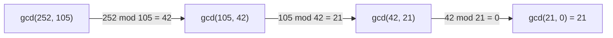

## Learning Objectives

- State the formal definition of divisibility and derive its basic algebraic properties from that definition alone.
- Define prime and composite numbers precisely, and explain why 1 is conventionally excluded from both categories.
- Prove that gcd(a, b) = gcd(b, a mod b), and use that identity to justify the correctness of the Euclidean algorithm.
- Implement the Euclidean algorithm, recursively and iteratively, and trace its execution by hand on a concrete pair of integers.
- Explain, informally and via Lamé's bound, why the Euclidean algorithm runs in time logarithmic in its inputs rather than proportional to their size.

## Context & Motivation

Divisibility looks almost too simple to need formal treatment — "does a go evenly into b" is something every student has computed since grade school. But nearly all of number theory, and a surprising amount of cryptography and computer science, is built directly on precise reasoning about this one relation. Public-key cryptosystems like RSA rely on the fact that multiplying two large primes is computationally easy while factoring the product back into those primes is (believed to be) computationally hard — a claim that only makes sense once "prime" and "divides" are pinned down exactly. Hash functions, checksums, and error-correcting codes lean on modular arithmetic, which is itself defined in terms of divisibility (the next concept in this sequence). And an enormous amount of practical computation — simplifying fractions, finding a common denominator, scheduling problems with repeating periods — reduces to computing a greatest common divisor, which is exactly the problem the Euclidean algorithm solves.

The Euclidean algorithm is worth singling out because it is one of the oldest algorithms known to still be in everyday practical use — it appears in Euclid's *Elements*, written around 300 BCE, and remains the standard method for computing gcd(a, b) today, over two thousand years later, essentially unchanged. What makes it remarkable computationally is that it never factors either number — computing a gcd by finding both numbers' prime factorizations and comparing them is far slower for large inputs, since factoring itself is hard, while the Euclidean algorithm sidesteps factoring entirely and still runs efficiently (provably in time logarithmic in the smaller input, via Lamé's theorem). This combination — an ancient, elegant algorithm, with a clean inductive correctness proof and a provable efficient runtime bound — makes it a natural centerpiece for this concept, and a template for how this curriculum treats material that is genuinely computational: real code, alongside a real proof of why that code works.

MIT's 6.042 (Mathematics for Computer Science) and the ACM/IEEE CS2013 curriculum guidelines both treat divisibility, primes, and the Euclidean algorithm as foundational — divisibility because it underlies everything from parity arguments to RSA, and the Euclidean algorithm because it is frequently a student's first encounter with an algorithm whose correctness proof and efficiency analysis are both approachable in full detail, rather than merely asserted.

## Core Theory

### Divisibility: definition and basic properties

For integers a and b, **a divides b** (written a | b) if there exists an integer k such that b = ak. When a | b, a is called a **divisor** of b, and b is a **multiple** of a. By convention, every integer divides 0 (since 0 = a × 0 for any a), and 0 divides only 0.

From this definition alone, several properties follow by direct proof:

- **Transitivity:** if a | b and b | c, then a | c. (If b = ak and c = bm, then c = akm, so a | c.)
- **Linearity:** if a | b and a | c, then a | (bx + cy) for any integers x, y. (If b = ak and c = am, then bx + cy = a(kx + my).) This property — that divisibility is preserved under arbitrary integer linear combinations — is the workhorse fact behind most divisibility proofs, including the correctness of the Euclidean algorithm below.
- **Bounding:** if a | b and b ≠ 0, then |a| ≤ |b|. A nonzero multiple of a can never be smaller in absolute value than a itself.

### Primes and composites

An integer p > 1 is **prime** if its only positive divisors are 1 and p itself. An integer n > 1 that is not prime is **composite**, meaning n = ab for some integers 1 < a, b < n. The number 1 is conventionally classified as neither prime nor composite — this is not an arbitrary technicality: if 1 were considered prime, the Fundamental Theorem of Arithmetic (every integer > 1 has a *unique* prime factorization, up to order) would fail, since 6 = 2×3 = 1×2×3 = 1×1×2×3 would all count as distinct factorizations. Excluding 1 preserves uniqueness.

### The gcd, and the key identity behind the Euclidean algorithm

The **greatest common divisor** of integers a and b (not both zero), gcd(a, b), is the largest integer that divides both a and b. The Euclidean algorithm rests entirely on one identity:

**Claim:** for integers a, b with b > 0, gcd(a, b) = gcd(b, a mod b).

**Proof:** let r = a mod b, so a = qb + r for some integer q (the quotient), with 0 ≤ r < b. We show the set of common divisors of {a, b} is exactly the set of common divisors of {b, r}, which forces their greatest elements to coincide.

(⊆) Suppose d | a and d | b. Since r = a − qb, and d divides both a and qb (as d | b implies d | qb), the linearity property gives d | (a − qb) = r. So d | b and d | r.

(⊇) Suppose d | b and d | r. Since a = qb + r, and d divides both qb and r, linearity gives d | (qb + r) = a. So d | a and d | b.

Both directions show the common divisors of {a, b} and {b, r} are identical sets, so in particular their maximum elements are equal: gcd(a, b) = gcd(b, r) = gcd(b, a mod b). ∎

### The Euclidean algorithm, and why it terminates

Repeatedly applying the identity above — replacing (a, b) with (b, a mod b) — shrinks the second argument every time (since a mod b < b strictly, whenever b > 0), and the sequence of remainders b > r₁ > r₂ > ⋯ is a strictly decreasing sequence of non-negative integers. By the well-ordering principle, no strictly decreasing sequence of non-negative integers can continue forever, so this process must reach a remainder of 0 after finitely many steps. When the second argument reaches 0, gcd(a, 0) = a by definition (every integer divides 0, so a itself is the greatest common divisor of a and 0), which is exactly the base case that stops the recursion.



### Implementing the Euclidean algorithm

The proof above translates almost verbatim into code — the recursive case mirrors the identity gcd(a, b) = gcd(b, a mod b) exactly, and the base case mirrors gcd(a, 0) = a:

```python
def gcd_recursive(a, b):
    if b == 0:                       # base case
        return a
    return gcd_recursive(b, a % b)   # recursive case: gcd(a, b) = gcd(b, a mod b)
```

The same logic, unrolled into a loop instead of recursive calls, avoids growing the call stack and is the form most standard libraries actually use internally:

```python
def gcd_iterative(a, b):
    while b != 0:
        a, b = b, a % b
    return a
```

Both versions perform identical arithmetic — trace `gcd_iterative(252, 105)`: (252, 105) → (105, 42) → (42, 21) → (21, 0), returning 21, matching the diagram above exactly.

### Why the algorithm is fast: Lamé's bound

A naive intuition might expect the number of steps to depend on the size of a and b (their magnitude), but it does not — it depends only on the number of *digits*. **Lamé's theorem** (1844) states that the number of steps the Euclidean algorithm takes on inputs a > b is at most 5 times the number of decimal digits of b, and the theorem's proof uses the Fibonacci sequence: the worst case (most steps for a given size) occurs precisely when a and b are consecutive Fibonacci numbers, because Fibonacci numbers are exactly the pairs that shrink as slowly as possible under the mod operation at every step. Since Fibonacci numbers grow exponentially, the number of steps needed grows only logarithmically in the input size — the Euclidean algorithm on even enormous (hundreds-of-digits) integers, as used in real cryptographic key generation, still completes in a small number of steps.

## Worked Examples

### Example 1 — computing gcd(252, 198) by hand, tracing every remainder

**Problem:** find gcd(252, 198) using the Euclidean algorithm, and verify the result by checking it divides both inputs.

Step 1: 252 = 1 × 198 + 54, so gcd(252, 198) = gcd(198, 54).
Step 2: 198 = 3 × 54 + 36, so gcd(198, 54) = gcd(54, 36).
Step 3: 54 = 1 × 36 + 18, so gcd(54, 36) = gcd(36, 18).
Step 4: 36 = 2 × 18 + 0, so gcd(36, 18) = gcd(18, 0) = 18.

Verification: 252 = 18 × 14 and 198 = 18 × 11 — both divide evenly by 18, and 14, 11 share no common factor greater than 1, confirming 18 is indeed the *greatest* common divisor, not merely a common one.

### Example 2 — proving a number-theoretic fact using the linearity property: gcd(n, n+1) = 1 for every integer n

**Claim:** consecutive integers are always coprime — gcd(n, n+1) = 1 for every positive integer n.

Suppose d is any common divisor of n and n+1: d | n and d | (n+1). By the linearity property, d divides any integer linear combination of n and n+1 — in particular, d | [(n+1) − n] = d | 1. The only positive divisor of 1 is 1 itself, so d = 1. Since every common divisor of n and n+1 must equal 1, the *greatest* common divisor is also 1: gcd(n, n+1) = 1. ∎

This is a direct application of the Euclidean algorithm's very first step, made explicit: gcd(n+1, n) = gcd(n, (n+1) mod n) = gcd(n, 1) = 1 immediately, since anything mod 1 is 0 and gcd(n, 1) = 1 for every n. The algorithm and the proof agree exactly, confirming the identity from Core Theory on this simple case.

### Example 3 — using the Euclidean algorithm to test primality-adjacent structure: finding gcd(1071, 462) and interpreting it

**Problem:** compute gcd(1071, 462), and use the result to say something about whether 1071/462 can be simplified as a fraction.

Step 1: 1071 = 2 × 462 + 147, so gcd(1071, 462) = gcd(462, 147).
Step 2: 462 = 3 × 147 + 21, so gcd(462, 147) = gcd(147, 21).
Step 3: 147 = 7 × 21 + 0, so gcd(147, 21) = gcd(21, 0) = 21.

So gcd(1071, 462) = 21. This means 1071/462 simplifies: 1071 ÷ 21 = 51 and 462 ÷ 21 = 22, so 1071/462 = 51/22 in lowest terms (and gcd(51, 22) = 1, confirming no further simplification is possible — 51 = 3×17 and 22 = 2×11 share no prime factors). Running `gcd_iterative(1071, 462)` from Core Theory reproduces this trace exactly in three loop iterations, matching the by-hand computation step for step.

## Common Misconceptions & Pitfalls

- **"To find the gcd, you should factor both numbers into primes and compare."** This works but is dramatically slower for large numbers, since integer factorization has no known efficient general algorithm — this is precisely why RSA is secure. The entire point of the Euclidean algorithm is that it computes the gcd *without* factoring either number, using only repeated division. For 200-digit numbers used in real cryptographic contexts, factoring is currently computationally infeasible, while the Euclidean algorithm still completes in well under a thousand steps.
- **"gcd(a, 0) is undefined, or should be 0."** By definition, every integer divides 0, so the *common* divisors of a and 0 are exactly the divisors of a, and the greatest one is a itself (or |a|, for negative a). gcd(a, 0) = a is not a special-cased convention bolted onto the algorithm — it falls directly out of the definition of divisibility, and is exactly why it works cleanly as the algorithm's base case.
- **"1 is a prime number — it only has itself and 1 as divisors, just like other primes."** 1 is deliberately excluded from the primes (see Core Theory) precisely to preserve unique factorization; without the exclusion, "the" prime factorization of any number would not be unique, since arbitrarily many factors of 1 could always be appended.
- **"The recursive and iterative Euclidean algorithm implementations might give different answers for some inputs."** They compute identical results for every input, since they perform exactly the same sequence of (a, b) → (b, a mod b) transitions — the only difference is whether that sequence is expressed as nested function calls or as loop iterations updating two variables in place, a distinction covered generally in the recursion concept.
- **"The number of steps the Euclidean algorithm takes depends mainly on how large a and b are numerically."** Lamé's bound shows the step count depends on the number of *digits*, not the raw magnitude, and grows only logarithmically — gcd(10^100, 10^100 − 1) takes only a handful of steps despite both numbers being astronomically large, because consecutive integers of any size reduce to gcd(n, 1) after just one step (as in Example 2), and even the genuine worst case (consecutive Fibonacci numbers) still only requires a number of steps proportional to the digit count.

## Summary

Divisibility (a | b, meaning b = ak for some integer k) is the foundation from which primes, composites, and the entire notion of greatest common divisor are built; its linearity property — that a | b and a | c implies a divides any integer combination bx + cy — is the single algebraic fact that makes the Euclidean algorithm's correctness proof work. The Euclidean algorithm computes gcd(a, b) by repeatedly replacing (a, b) with (b, a mod b), justified by the identity gcd(a, b) = gcd(b, a mod b) proved directly from linearity, and terminates because the remainder sequence is strictly decreasing and bounded below by 0 (an instance of the well-ordering principle). Its recursive and iterative implementations compute identical results by construction, and Lamé's theorem shows the algorithm runs in time logarithmic in the input size — never needing to factor either number, which is what makes it practical even on the enormous integers used in real cryptographic systems. 1 is excluded from the primes by convention specifically to preserve the uniqueness of prime factorization.

## Documentation Links

- [Lehman, Leighton & Meyer — Mathematics for Computer Science (full text)](https://people.csail.mit.edu/meyer/mcs.pdf) — doc
- [ACM/IEEE CS2013 Curriculum Guidelines](https://www.acm.org/binaries/content/assets/education/cs2013_web_final.pdf) — doc
