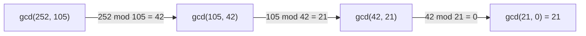

## Objetivos de Aprendizagem

- Declarar a definição formal de divisibilidade e derivar suas propriedades algébricas básicas a partir só dessa definição.
- Definir números primos e compostos com precisão, e explicar por que 1 é convencionalmente excluído das duas categorias.
- Provar que gcd(a, b) = gcd(b, a mod b), e usar essa identidade para justificar a corretude do algoritmo de Euclides.
- Implementar o algoritmo de Euclides, recursiva e iterativamente, e traçar sua execução na mão num par concreto de inteiros.
- Explicar, informalmente e via a cota de Lamé, por que o algoritmo de Euclides roda em tempo logarítmico em suas entradas em vez de proporcional ao seu tamanho.

## Contexto e Motivação

Divisibilidade parece simples demais para precisar de tratamento formal ("a entra igualmente em b" é algo que todo aluno computa desde o ensino fundamental). Mas quase toda a teoria dos números, e uma quantidade surpreendente de criptografia e Ciência da Computação, é construída diretamente sobre raciocínio preciso sobre essa única relação. Sistemas de criptografia de chave pública como o RSA dependem do fato de que multiplicar dois primos grandes é computacionalmente fácil enquanto fatorar o produto de volta naqueles primos é (acredita-se) computacionalmente difícil, uma afirmação que só faz sentido depois que "primo" e "divide" são fixados exatamente. Funções hash, checksums e códigos corretores de erro se apoiam em aritmética modular, que é ela mesma definida em termos de divisibilidade (o próximo conceito nesta sequência). E uma quantidade enorme de computação prática (simplificar frações, achar um denominador comum, problemas de agendamento com períodos repetidos) se reduz a computar um máximo divisor comum, que é exatamente o problema que o algoritmo de Euclides resolve.

O algoritmo de Euclides vale a pena destacar porque é um dos algoritmos mais antigos conhecidos ainda em uso prático cotidiano: aparece nos *Elementos* de Euclides, escritos por volta de 300 a.C., e continua sendo o método padrão para computar gcd(a, b) hoje, mais de dois mil anos depois, essencialmente inalterado. O que o torna notável computacionalmente é que ele nunca fatora nenhum dos dois números; computar um gcd achando as fatorações primas dos dois números e comparando é muito mais lento para entradas grandes, já que fatoração em si é difícil, enquanto o algoritmo de Euclides evita fatoração completamente e ainda roda eficientemente (provadamente em tempo logarítmico na menor entrada, via o teorema de Lamé). Essa combinação (um algoritmo antigo e elegante, com uma prova de corretude indutiva limpa e uma cota de tempo de execução eficiente comprovável) o torna uma peça central natural para este conceito, e um modelo de como este currículo trata material genuinamente computacional: código de verdade, junto com uma prova de verdade de por que aquele código funciona.

O 6.042 do MIT (Mathematics for Computer Science) e as diretrizes curriculares ACM/IEEE CS2013 tratam divisibilidade, primos e o algoritmo de Euclides como fundamentais: divisibilidade porque sustenta tudo, de argumentos de paridade ao RSA, e o algoritmo de Euclides porque é frequentemente o primeiro encontro de um aluno com um algoritmo cuja prova de corretude e análise de eficiência são as duas acessíveis em detalhe completo, em vez de meramente afirmadas.

## Teoria Central

### Divisibilidade: definição e propriedades básicas

Para inteiros a e b, **a divide b** (escrito a | b) se existe um inteiro k tal que b = ak. Quando a | b, a se chama um **divisor** de b, e b é um **múltiplo** de a. Por convenção, todo inteiro divide 0 (já que 0 = a × 0 para qualquer a), e 0 divide só 0.

Só a partir dessa definição, várias propriedades decorrem por prova direta:

- **Transitividade:** se a | b e b | c, então a | c. (Se b = ak e c = bm, então c = akm, então a | c.)
- **Linearidade:** se a | b e a | c, então a | (bx + cy) para quaisquer inteiros x, y. (Se b = ak e c = am, então bx + cy = a(kx + my).) Essa propriedade, de que divisibilidade é preservada sob combinações lineares inteiras arbitrárias, é o fato cavalo de batalha por trás da maioria das provas de divisibilidade, incluindo a corretude do algoritmo de Euclides abaixo.
- **Limitação:** se a | b e b ≠ 0, então |a| ≤ |b|. Um múltiplo não nulo de a nunca pode ser menor em valor absoluto que o próprio a.

### Primos e compostos

Um inteiro p > 1 é **primo** se seus únicos divisores positivos são 1 e o próprio p. Um inteiro n > 1 que não é primo é **composto**, significando n = ab para alguns inteiros 1 < a, b < n. O número 1 é convencionalmente classificado como nem primo nem composto; isso não é um tecnicismo arbitrário: se 1 fosse considerado primo, o Teorema Fundamental da Aritmética (todo inteiro > 1 tem uma fatoração prima *única*, a menos de ordem) falharia, já que 6 = 2×3 = 1×2×3 = 1×1×2×3 contariam todas como fatorações distintas. Excluir 1 preserva a unicidade.

### O gcd, e a identidade chave por trás do algoritmo de Euclides

O **máximo divisor comum** de inteiros a e b (não ambos zero), gcd(a, b), é o maior inteiro que divide tanto a quanto b. O algoritmo de Euclides se apoia inteiramente numa identidade:

**Afirmação:** para inteiros a, b com b > 0, gcd(a, b) = gcd(b, a mod b).

**Prova.** Seja r = a mod b, então a = qb + r para algum inteiro q (o quociente), com 0 ≤ r < b. Mostramos que o conjunto de divisores comuns de {a, b} é exatamente o conjunto de divisores comuns de {b, r}, o que força seus maiores elementos a coincidir.

(⊆) Suponha d | a e d | b. Como r = a − qb, e d divide tanto a quanto qb (já que d | b implica d | qb), a propriedade de linearidade dá d | (a − qb) = r. Então d | b e d | r.

(⊇) Suponha d | b e d | r. Como a = qb + r, e d divide tanto qb quanto r, linearidade dá d | (qb + r) = a. Então d | a e d | b.

As duas direções mostram que os divisores comuns de {a, b} e {b, r} são conjuntos idênticos, então em particular seus elementos máximos são iguais: gcd(a, b) = gcd(b, r) = gcd(b, a mod b). ∎

### O algoritmo de Euclides, e por que ele termina

Aplicar repetidamente a identidade acima (substituindo (a, b) por (b, a mod b)) encolhe o segundo argumento a cada vez (já que a mod b < b estritamente, sempre que b > 0), e a sequência de restos b > r₁ > r₂ > ⋯ é uma sequência estritamente decrescente de inteiros não negativos. Pelo princípio da boa ordenação, nenhuma sequência estritamente decrescente de inteiros não negativos pode continuar para sempre, então esse processo precisa chegar a um resto de 0 depois de finitos passos. Quando o segundo argumento chega a 0, gcd(a, 0) = a por definição (todo inteiro divide 0, então o próprio a é o máximo divisor comum de a e 0), que é exatamente o caso base que para a recursão.



### Implementando o algoritmo de Euclides

A prova acima se traduz quase literalmente em código: o caso recursivo espelha a identidade gcd(a, b) = gcd(b, a mod b) exatamente, e o caso base espelha gcd(a, 0) = a:

```python
def gcd_recursivo(a, b):
    if b == 0:                       # caso base
        return a
    return gcd_recursivo(b, a % b)   # caso recursivo: gcd(a, b) = gcd(b, a mod b)
```

A mesma lógica, desenrolada num laço em vez de chamadas recursivas, evita crescer a pilha de chamadas e é a forma que a maioria das bibliotecas padrão de fato usa internamente:

```python
def gcd_iterativo(a, b):
    while b != 0:
        a, b = b, a % b
    return a
```

As duas versões realizam aritmética idêntica: trace `gcd_iterativo(252, 105)`: (252, 105) → (105, 42) → (42, 21) → (21, 0), retornando 21, batendo exatamente com o diagrama acima.

### Por que o algoritmo é rápido: a cota de Lamé

Uma intuição ingênua poderia esperar que o número de passos dependesse do tamanho de a e b (sua magnitude), mas não depende; depende só do número de *dígitos*. O **teorema de Lamé** (1844) declara que o número de passos que o algoritmo de Euclides leva em entradas a > b é no máximo 5 vezes o número de dígitos decimais de b, e a prova do teorema usa a sequência de Fibonacci: o pior caso (mais passos para um dado tamanho) ocorre precisamente quando a e b são números de Fibonacci consecutivos, porque números de Fibonacci são exatamente os pares que encolhem o mais devagar possível sob a operação mod a cada passo. Como números de Fibonacci crescem exponencialmente, o número de passos necessários cresce só logaritmicamente no tamanho da entrada; o algoritmo de Euclides mesmo em inteiros enormes (centenas de dígitos), como usados na geração real de chaves criptográficas, ainda completa num pequeno número de passos.

## Exemplos Resolvidos

### Exemplo 1: computando gcd(252, 198) na mão, traçando todo resto

**Problema:** ache gcd(252, 198) usando o algoritmo de Euclides, e verifique o resultado checando que ele divide as duas entradas.

Passo 1: 252 = 1 × 198 + 54, então gcd(252, 198) = gcd(198, 54).
Passo 2: 198 = 3 × 54 + 36, então gcd(198, 54) = gcd(54, 36).
Passo 3: 54 = 1 × 36 + 18, então gcd(54, 36) = gcd(36, 18).
Passo 4: 36 = 2 × 18 + 0, então gcd(36, 18) = gcd(18, 0) = 18.

Verificação: 252 = 18 × 14 e 198 = 18 × 11, os dois dividem igualmente por 18, e 14, 11 não compartilham fator comum maior que 1, confirmando que 18 é de fato o máximo divisor comum, não meramente um comum.

### Exemplo 2: provando um fato de teoria dos números usando a propriedade de linearidade: gcd(n, n+1) = 1 para todo inteiro n

**Afirmação:** inteiros consecutivos são sempre coprimos, gcd(n, n+1) = 1 para todo inteiro positivo n.

Suponha que d é qualquer divisor comum de n e n+1: d | n e d | (n+1). Pela propriedade de linearidade, d divide qualquer combinação linear inteira de n e n+1, em particular, d | [(n+1) − n] = d | 1. O único divisor positivo de 1 é o próprio 1, então d = 1. Como todo divisor comum de n e n+1 precisa ser igual a 1, o *máximo* divisor comum também é 1: gcd(n, n+1) = 1. ∎

Essa é uma aplicação direta do primeiríssimo passo do algoritmo de Euclides, tornada explícita: gcd(n+1, n) = gcd(n, (n+1) mod n) = gcd(n, 1) = 1 imediatamente, já que qualquer coisa mod 1 é 0 e gcd(n, 1) = 1 para todo n. O algoritmo e a prova concordam exatamente, confirmando a identidade da Teoria Central neste caso simples.

### Exemplo 3: usando o algoritmo de Euclides para testar estrutura adjacente à primalidade: achando gcd(1071, 462) e interpretando o resultado

**Problema:** compute gcd(1071, 462), e use o resultado para dizer algo sobre se 1071/462 pode ser simplificado como fração.

Passo 1: 1071 = 2 × 462 + 147, então gcd(1071, 462) = gcd(462, 147).
Passo 2: 462 = 3 × 147 + 21, então gcd(462, 147) = gcd(147, 21).
Passo 3: 147 = 7 × 21 + 0, então gcd(147, 21) = gcd(21, 0) = 21.

Então gcd(1071, 462) = 21. Isso significa que 1071/462 simplifica: 1071 ÷ 21 = 51 e 462 ÷ 21 = 22, então 1071/462 = 51/22 em termos mínimos (e gcd(51, 22) = 1, confirmando que nenhuma simplificação adicional é possível, 51 = 3×17 e 22 = 2×11 não compartilham fator primo algum). Rodar `gcd_iterativo(1071, 462)` da Teoria Central reproduz esse traço exatamente em três iterações do laço, batendo com a computação na mão passo a passo.

## Equívocos Comuns e Armadilhas

- **"Para achar o gcd, você deveria fatorar os dois números em primos e comparar."** Isso funciona mas é dramaticamente mais lento para números grandes, já que fatoração de inteiros não tem algoritmo geral eficiente conhecido; é precisamente por isso que o RSA é seguro. O ponto inteiro do algoritmo de Euclides é que ele computa o gcd *sem* fatorar nenhum dos números, usando só divisão repetida. Para números de 200 dígitos usados em contextos criptográficos reais, fatoração é atualmente computacionalmente inviável, enquanto o algoritmo de Euclides ainda completa em bem menos que mil passos.
- **"gcd(a, 0) é indefinido, ou deveria ser 0."** Por definição, todo inteiro divide 0, então os divisores *comuns* de a e 0 são exatamente os divisores de a, e o maior deles é o próprio a (ou |a|, para a negativo). gcd(a, 0) = a não é uma convenção de caso especial colada no algoritmo; ela decorre diretamente da definição de divisibilidade, e é exatamente por que funciona de forma limpa como o caso base do algoritmo.
- **"1 é um número primo, tem só ele mesmo e 1 como divisores, igual outros primos."** 1 é deliberadamente excluído dos primos (veja Teoria Central) precisamente para preservar fatoração única; sem a exclusão, "a" fatoração prima de qualquer número não seria única, já que arbitrariamente muitos fatores de 1 sempre poderiam ser anexados.
- **"As implementações recursiva e iterativa do algoritmo de Euclides podem dar respostas diferentes para algumas entradas."** Elas computam resultados idênticos para toda entrada, já que realizam exatamente a mesma sequência de transições (a, b) → (b, a mod b); a única diferença é se essa sequência é expressa como chamadas de função aninhadas ou como iterações de laço atualizando duas variáveis no lugar, uma distinção coberta geralmente no conceito de recursão.
- **"O número de passos que o algoritmo de Euclides leva depende principalmente de quão grandes a e b são numericamente."** A cota de Lamé mostra que a contagem de passos depende do número de *dígitos*, não da magnitude crua, e cresce só logaritmicamente; gcd(10^100, 10^100 − 1) leva só um punhado de passos apesar dos dois números serem astronomicamente grandes, porque inteiros consecutivos de qualquer tamanho se reduzem a gcd(n, 1) depois de só um passo (como no Exemplo 2), e mesmo o pior caso genuíno (números de Fibonacci consecutivos) ainda exige um número de passos proporcional à contagem de dígitos.

## Resumo

Divisibilidade (a | b, significando b = ak para algum inteiro k) é o fundamento a partir do qual primos, compostos e a noção inteira de máximo divisor comum são construídos; sua propriedade de linearidade (que a | b e a | c implica que a divide qualquer combinação inteira bx + cy) é o único fato algébrico que faz a prova de corretude do algoritmo de Euclides funcionar. O algoritmo de Euclides computa gcd(a, b) substituindo repetidamente (a, b) por (b, a mod b), justificado pela identidade gcd(a, b) = gcd(b, a mod b) provada diretamente a partir da linearidade, e termina porque a sequência de restos é estritamente decrescente e limitada por baixo por 0 (uma instância do princípio da boa ordenação). Suas implementações recursiva e iterativa computam resultados idênticos por construção, e o teorema de Lamé mostra que o algoritmo roda em tempo logarítmico no tamanho da entrada, nunca precisando fatorar nenhum dos números, o que é o que o torna prático mesmo em inteiros enormes usados em sistemas criptográficos reais. 1 é excluído dos primos por convenção especificamente para preservar a unicidade da fatoração prima.

## Documentation Links

- [Lehman, Leighton & Meyer — Mathematics for Computer Science (full text)](https://people.csail.mit.edu/meyer/mcs.pdf) — doc
- [ACM/IEEE CS2013 Curriculum Guidelines](https://www.acm.org/binaries/content/assets/education/cs2013_web_final.pdf) — doc
