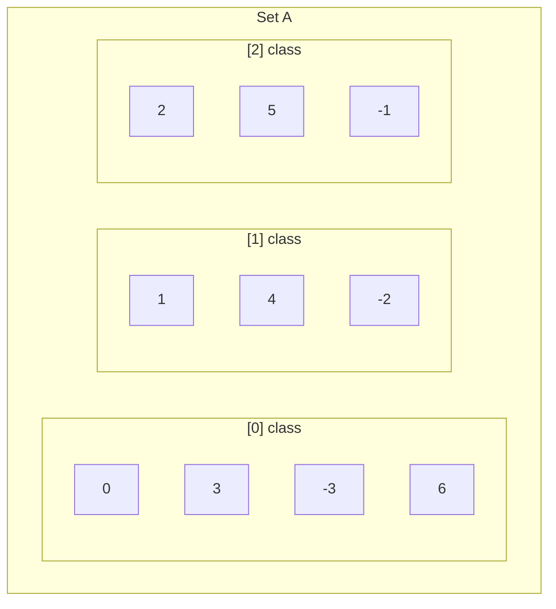

## Learning Objectives

- Define an equivalence relation as a relation that is reflexive, symmetric, and transitive, and verify all three properties on a concrete example.
- Define the equivalence class of an element and compute equivalence classes explicitly for a given equivalence relation.
- Prove, in both directions, that an equivalence relation on a set induces a partition of that set, and that every partition induces an equivalence relation.
- Construct the partition corresponding to a given equivalence relation, and conversely, construct the equivalence relation corresponding to a given partition.
- Identify real relations (congruence mod n, "same parity," "same connected component") as equivalence relations and describe their classes without recomputing from scratch.

## Context & Motivation

Among all the possible combinations of reflexive, symmetric, antisymmetric, and transitive that a relation can have, one specific combination shows up so often, and does something so structurally important, that it earns its own name: reflexive + symmetric + transitive, called an **equivalence relation**. The intuition it captures is exactly the everyday idea of "these two things count as the same for the purposes I currently care about" — not literally identical, but interchangeable along some specific dimension. Two fractions 1/2 and 2/4 are not the same symbol, but they're "the same" as rational numbers. Two integers 7 and 19 are not the same number, but they're "the same" modulo 6. Two nodes in a graph are not the same node, but they're "the same" if you only care which connected component they're in. Every one of these "count as the same" relations turns out to be reflexive (everything is trivially interchangeable with itself), symmetric (if a is interchangeable with b, b is interchangeable with a), and transitive (if a and b are interchangeable, and b and c are interchangeable, then a and c must be too) — and remarkably, that short list of three properties is *exactly* what's needed to guarantee something much stronger: the relation quietly sorts the entire set into non-overlapping groups, called equivalence classes, where every element in a group is related to every other element in that same group, and to no element outside it.

This is the theorem that gives the concept its real power, and it's a genuine "if and only if" — not just an observation about specific examples: a relation is an equivalence relation exactly when it corresponds to some partition of the set into disjoint, exhaustive groups, and a partition always corresponds to some equivalence relation (namely, "being in the same group"). MIT 6.042 presents this as one clean idea with two faces — the relational description (three properties to check) and the partition description (a picture of disjoint boxes covering the whole set) — and proving they're equivalent is one of the first substantial two-directional proofs a discrete math course asks students to carry out on their own.

The payoff is everywhere in computer science once you start looking for it: modular arithmetic is arithmetic on equivalence classes mod n (this is precisely why "the clock wraps around" — 13:00 and 1:00 PM are literally the same equivalence class mod 12); a hash function partitions its domain into buckets, and collisions are exactly pairs landing in the same equivalence class; union-find data structures maintain a partition directly and use it to answer "are these two elements equivalent" queries in near-constant time; type systems partition the space of possible values into type classes. Every one of these is, underneath its specific name, an equivalence relation being used to reason about interchangeability without tracking every individual pair explicitly.

## Core Theory

### Definition: equivalence relation

A relation R on a set A is an **equivalence relation** if it is:

1. **Reflexive:** ∀a ∈ A, a R a.
2. **Symmetric:** ∀a, b ∈ A, a R b → b R a.
3. **Transitive:** ∀a, b, c ∈ A, (a R b ∧ b R c) → a R c.

When R is an equivalence relation, a R b is often written a ∼ b, and read "a is equivalent to b." All three properties must be checked independently — as the previous concept in this unit emphasized, none of them implies any of the others, so verifying an equivalence relation genuinely requires three separate arguments (or three separate counterexamples, to show it fails to be one).

### Equivalence classes

For an equivalence relation ∼ on A and an element a ∈ A, the **equivalence class of a**, written [a], is:

[a] = { x ∈ A : x ∼ a }

— the set of every element equivalent to a, a itself always included (by reflexivity, a ∼ a, so a ∈ [a]). For congruence mod 3 on the integers, [0] = {…, -6, -3, 0, 3, 6, …}, [1] = {…, -5, -2, 1, 4, 7, …}, and [2] = {…, -4, -1, 2, 5, 8, …} — three classes, together covering every integer exactly once.

### The key lemma: two elements are equivalent iff their classes are identical

Before stating the main theorem, one lemma does almost all the work: for an equivalence relation ∼ on A, and any a, b ∈ A,

a ∼ b ⟺ [a] = [b]

**(⟸) direction:** if [a] = [b], then since a ∈ [a] (reflexivity) and [a] = [b], a ∈ [b], which by definition of [b] means a ∼ b.

**(⟹) direction:** suppose a ∼ b. Take any x ∈ [a], so x ∼ a. By transitivity with a ∼ b, x ∼ b, so x ∈ [b]; this shows [a] ⊆ [b]. Symmetrically, from a ∼ b we get b ∼ a (by symmetry), and the identical argument with a and b swapped gives [b] ⊆ [a]. Two sets that are subsets of each other are equal, so [a] = [b].

A second, equally important consequence follows immediately: **two equivalence classes are either identical or disjoint — they can never partially overlap.** Suppose [a] ∩ [b] ≠ ∅, and let x be some element in both. Then x ∼ a and x ∼ b. By symmetry, a ∼ x, and by transitivity with x ∼ b, a ∼ b. By the lemma just proved, a ∼ b implies [a] = [b]. So any two classes that share even a single element are, in fact, the exact same class — there is no such thing as classes that overlap "a little."

### The main theorem: equivalence relations and partitions are the same idea, in two directions

A **partition** of a set A is a collection of non-empty subsets {A₁, A₂, …} such that (1) every Aᵢ is non-empty, (2) the Aᵢ are pairwise disjoint (Aᵢ ∩ Aⱼ = ∅ for i ≠ j), and (3) their union is all of A (⋃ᵢ Aᵢ = A). Informally: the Aᵢ carve A up into non-overlapping, exhaustive groups.

**Theorem (equivalence relation ⟹ partition).** If ∼ is an equivalence relation on A, then the set of distinct equivalence classes {[a] : a ∈ A} is a partition of A.

*Proof.* Non-empty: every [a] contains at least a itself, by reflexivity, so no class is empty. Pairwise disjoint: shown directly above — any two classes that intersect are actually identical, so distinct classes in the collection never overlap. Union covers A: every a ∈ A belongs to its own class [a] (again by reflexivity), so every element of A is accounted for in at least one class, giving ⋃ [a] = A. All three partition conditions hold. ∎

**Theorem (partition ⟹ equivalence relation).** If {A₁, A₂, …} is a partition of A, then the relation ∼ defined by "a ∼ b iff a and b belong to the same Aᵢ" is an equivalence relation on A.

*Proof.* Reflexive: every a belongs to some Aᵢ (by the union condition), and trivially a and a belong to that same Aᵢ, so a ∼ a. Symmetric: if a and b belong to the same Aᵢ, then trivially b and a belong to that same Aᵢ — the definition doesn't distinguish an order. Transitive: suppose a ∼ b and b ∼ c, so a, b are both in some Aᵢ and b, c are both in some Aⱼ. Since b is in both Aᵢ and Aⱼ, and the Aᵢ are pairwise disjoint, Aᵢ and Aⱼ must be the same set (otherwise b would sit in two disjoint sets at once, impossible). So a and c are both in that same set, giving a ∼ c. All three properties hold. ∎

Together, these two theorems say more than "equivalence relations and partitions are related" — they say the two descriptions are two labels for the *same* underlying mathematical object, and the correspondence is exact: starting from a partition, building its equivalence relation, and then recomputing the equivalence classes of that relation returns the original partition exactly, with no information lost in either direction.

The diagram shows the partition induced by congruence mod 3 on a handful of integers: three disjoint boxes, every integer shown falling into exactly one box, and within a box every pair of elements is related by ∼ (they differ by a multiple of 3), while no element in one box is related to any element in another.

### The number of equivalence classes: quotient sets and counting

The collection of all equivalence classes of ∼ on A is called the **quotient set**, written A/∼. Its size, |A/∼|, is the number of classes — for congruence mod n on the integers, |ℤ/∼| = n exactly, regardless of how large or infinite A itself is. This is worth flagging because it's the first place "counting" and "equivalence" meet: a common combinatorial technique is to count the number of equivalence classes rather than counting individual elements directly, when the classes are easier to enumerate than the raw elements (this idea reappears later, more explicitly, when division-based counting arguments are needed for permutations and combinations).

## Worked Examples

### Example 1 — verifying all three properties, then reading off the partition directly

**Problem:** Let A = {1, 2, 3, 4, 5, 6} and let a ∼ b mean "a and b have the same remainder when divided by 3." Verify ∼ is an equivalence relation, and list its equivalence classes.

**Reflexive:** for any a, a and a obviously have the same remainder mod 3 as themselves. Holds for every a ∈ A.

**Symmetric:** if a and b have the same remainder mod 3, then trivially b and a have the same remainder mod 3 — "same as" doesn't distinguish an order.

**Transitive:** if a and b share a remainder, and b and c share a remainder, then a and c share that same remainder (both equal b's remainder, hence equal each other). Holds for all a, b, c.

All three properties hold, so ∼ is an equivalence relation. Now compute remainders directly: 1 mod 3 = 1, 2 mod 3 = 2, 3 mod 3 = 0, 4 mod 3 = 1, 5 mod 3 = 2, 6 mod 3 = 0. Grouping by shared remainder:

[1] = {1, 4} (remainder 1), [2] = {2, 5} (remainder 2), [3] = {3, 6} (remainder 0)

Three classes, each non-empty, pairwise disjoint, union {1,2,3,4,5,6} = A exactly — a genuine partition, exactly as the theorem guarantees.

### Example 2 — using the [a] = [b] lemma to shortcut a computation

**Problem:** For the same ∼ as Example 1, determine, without recomputing remainders from scratch, whether [4] = [1], and whether [4] = [2].

By the key lemma, [4] = [1] iff 4 ∼ 1. Since 4 mod 3 = 1 and 1 mod 3 = 1, they share a remainder, so 4 ∼ 1 holds, and therefore [4] = [1] — confirmed directly by the lemma without re-listing every element of both classes and checking set equality by hand.

For [4] = [2]: by the lemma this holds iff 4 ∼ 2, i.e., iff 4 and 2 share a remainder mod 3. 4 mod 3 = 1, 2 mod 3 = 2 — different remainders, so 4 ∼ 2 is false, and therefore [4] ≠ [2]. Moreover, by the disjointness consequence proved in Core Theory, since [4] ≠ [2] and both are equivalence classes of the same relation, they must be entirely disjoint, not just "not identical" — confirmed by inspection, {1,4} ∩ {2,5} = ∅.

### Example 3 — going the other direction: from a partition to its equivalence relation, and checking it against a given relation

**Problem:** A teacher partitions a class of five students {Ana, Beto, Cléo, Dara, Eli} into project groups: G₁ = {Ana, Beto}, G₂ = {Cléo, Dara, Eli}. Write down the equivalence relation this partition induces, as a set of ordered pairs, and separately verify it really is reflexive, symmetric, and transitive.

By the partition-to-relation construction in Core Theory, a ∼ b iff a and b are in the same group. Within G₁ = {Ana, Beto}: pairs (Ana,Ana), (Beto,Beto), (Ana,Beto), (Beto,Ana). Within G₂ = {Cléo, Dara, Eli}: every ordered pair among these three, including each with itself — nine pairs total, since |G₂|² = 9. Full relation:

∼ = { (Ana,Ana), (Beto,Beto), (Ana,Beto), (Beto,Ana), (Cléo,Cléo), (Dara,Dara), (Eli,Eli), (Cléo,Dara), (Dara,Cléo), (Cléo,Eli), (Eli,Cléo), (Dara,Eli), (Eli,Dara) }

**Reflexive:** every one of the five students appears paired with themselves — (Ana,Ana), (Beto,Beto), (Cléo,Cléo), (Dara,Dara), (Eli,Eli) are all present. Holds.

**Symmetric:** every cross pair listed has its reverse also listed — (Ana,Beto) and (Beto,Ana) both appear; (Cléo,Dara) and (Dara,Cléo) both appear, and so on for every pair in G₂. Holds.

**Transitive:** the only chains possible are within a single group (since no pair crosses between G₁ and G₂ at all), and within each group every pair of members is already directly related, so any chain a ∼ b ∼ c has a, b, c all in the same group, giving a ∼ c directly. Holds.

This confirms the general theorem concretely: starting purely from a partition (no relation given at all), the induced "same group" relation is guaranteed to be an equivalence relation, and its equivalence classes, recomputed from this relation, are exactly G₁ and G₂ again — nothing was lost going from partition to relation and back.

## Common Misconceptions & Pitfalls

- **Checking only symmetry and transitivity and forgetting reflexivity.** It's easy to focus on the "interesting" cross-element behavior and skip confirming that every element relates to itself — but a relation that is symmetric and transitive while failing reflexivity for even one element is not an equivalence relation. (Concretely: the empty relation on a non-empty set is vacuously symmetric and transitive, since there are no pairs to violate either property, but it fails reflexivity for every element and is not an equivalence relation.)
- **Assuming equivalence classes can partially overlap if the elements are "similar enough."** The proof in Core Theory shows this is impossible: any shared element forces the two classes to be *completely* identical, never partially overlapping. If a computed pair of classes appears to overlap without being equal, that's a signal of a computational or definitional error, not a valid third case.
- **Confusing [a] (a set) with a (an element).** [a] is the equivalence class containing a — a set, generally with more than one element — not a synonym for a itself. Writing [a] = [b] is a claim about set equality between two classes; writing a = b is a much stronger claim about the elements themselves being identical, which is not required for a ∼ b to hold.
- **Believing every reasonable-sounding "sameness" relation is automatically an equivalence relation.** "Is a friend of" on a set of people is typically symmetric (mutual friendship) but usually fails transitivity (my friend's friend isn't automatically my friend) and often fails reflexivity depending on convention (is someone their own friend?) — it looks like an equivalence relation informally but fails the formal check, and no partition into "friend groups" can be derived from it the way Example 3 derives one from an actual equivalence relation.
- **Forgetting the union condition when checking a proposed partition.** A collection of pairwise-disjoint non-empty subsets that doesn't cover every element of A is not a partition of A — it might be a valid partition of some proper subset of A, but the theorem connecting equivalence relations to partitions requires the third condition (union equals the whole set) explicitly, and skipping it can make an incomplete grouping look like a finished partition.

## Summary

An equivalence relation is a relation that is reflexive, symmetric, and transitive, and it captures the idea of "counts as the same" along some specific dimension. Its equivalence classes [a] = {x : x ∼ a} satisfy a clean and provable structural guarantee: a ∼ b exactly when [a] = [b], and any two classes are either identical or completely disjoint, never partially overlapping. This is exactly what makes the central theorem work in both directions — every equivalence relation on A induces a genuine partition of A (non-empty, pairwise disjoint, exhaustive classes), and every partition of A induces an equivalence relation on A ("same group as"), with the two constructions perfectly inverse to each other. Congruence mod n, "same connected component," and "same hash bucket" are all concrete instances of this single abstract pattern, which is why equivalence relations and partitions are treated as one idea wearing two faces rather than two separate topics.

## Documentation Links

- [Lehman, Leighton & Meyer — Mathematics for Computer Science (full text)](https://people.csail.mit.edu/meyer/mcs.pdf) — doc
- [ACM/IEEE Curricular Mapping — Discrete Structures](https://curricula.cs.luc.edu/12-discrete-structures/content.html) — doc
