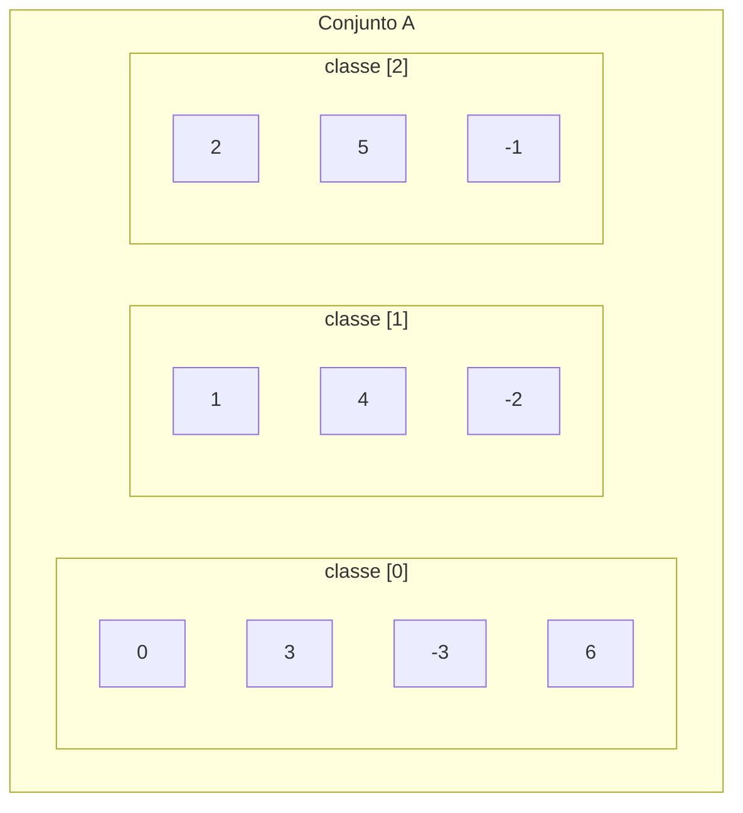

## Objetivos de Aprendizagem

- Definir uma relação de equivalência como uma relação que é reflexiva, simétrica e transitiva, e verificar as três propriedades num exemplo concreto.
- Definir a classe de equivalência de um elemento e computar classes de equivalência explicitamente para uma relação de equivalência dada.
- Provar, nas duas direções, que uma relação de equivalência num conjunto induz uma partição desse conjunto, e que toda partição induz uma relação de equivalência.
- Construir a partição correspondente a uma relação de equivalência dada, e reciprocamente, construir a relação de equivalência correspondente a uma partição dada.
- Identificar relações reais (congruência mod n, "mesma paridade", "mesmo componente conexo") como relações de equivalência e descrever suas classes sem recomputar do zero.

## Contexto e Motivação

Entre todas as combinações possíveis de reflexiva, simétrica, antissimétrica e transitiva que uma relação pode ter, uma combinação específica aparece com tanta frequência, e faz algo tão estruturalmente importante, que merece seu próprio nome: reflexiva + simétrica + transitiva, chamada uma **relação de equivalência**. A intuição que ela captura é exatamente a ideia do dia a dia de "essas duas coisas contam como a mesma para os propósitos com que me importo agora", não literalmente idênticas, mas intercambiáveis ao longo de alguma dimensão específica. Duas frações 1/2 e 2/4 não são o mesmo símbolo, mas são "a mesma coisa" como números racionais. Dois inteiros 7 e 19 não são o mesmo número, mas são "a mesma coisa" módulo 6. Dois nós num grafo não são o mesmo nó, mas são "a mesma coisa" se você só se importa com qual componente conexo eles estão. Cada uma dessas relações de "conta como a mesma coisa" acaba sendo reflexiva (tudo é trivialmente intercambiável consigo mesmo), simétrica (se a é intercambiável com b, b é intercambiável com a), e transitiva (se a e b são intercambiáveis, e b e c são intercambiáveis, então a e c também precisam ser), e notavelmente, essa lista curta de três propriedades é *exatamente* o que é necessário para garantir algo muito mais forte: a relação silenciosamente organiza o conjunto inteiro em grupos que não se sobrepõem, chamados classes de equivalência, onde todo elemento num grupo se relaciona com todo outro elemento do mesmo grupo, e com nenhum elemento fora dele.

Esse é o teorema que dá ao conceito seu poder de fato, e é um "se e somente se" genuíno, não só uma observação sobre exemplos específicos: uma relação é uma relação de equivalência exatamente quando corresponde a alguma partição do conjunto em grupos disjuntos e exaustivos, e uma partição sempre corresponde a alguma relação de equivalência (a saber, "estar no mesmo grupo"). O 6.042 do MIT apresenta isso como uma ideia limpa com duas faces (a descrição relacional, três propriedades a checar, e a descrição de partição, uma figura de caixas disjuntas cobrindo todo o conjunto), e provar que são equivalentes é uma das primeiras provas substanciais de duas direções que um curso de matemática discreta pede aos alunos para executar sozinhos.

O retorno está em toda parte na Ciência da Computação uma vez que você começa a procurar: aritmética modular é aritmética sobre classes de equivalência mod n (é exatamente por isso que "o relógio dá a volta": 13:00 e 1:00 PM são literalmente a mesma classe de equivalência mod 12); uma função hash particiona seu domínio em baldes, e colisões são exatamente pares caindo na mesma classe de equivalência; estruturas de dados union-find mantêm uma partição diretamente e a usam para responder consultas de "esses dois elementos são equivalentes" em tempo quase constante; sistemas de tipos particionam o espaço de valores possíveis em classes de tipo. Cada uma dessas é, por baixo de seu nome específico, uma relação de equivalência sendo usada para raciocinar sobre intercambiabilidade sem rastrear todo par individual explicitamente.

## Teoria Central

### Definição: relação de equivalência

Uma relação R num conjunto A é uma **relação de equivalência** se ela é:

1. **Reflexiva:** ∀a ∈ A, a R a.
2. **Simétrica:** ∀a, b ∈ A, a R b → b R a.
3. **Transitiva:** ∀a, b, c ∈ A, (a R b ∧ b R c) → a R c.

Quando R é uma relação de equivalência, a R b é frequentemente escrito a ∼ b, e lido "a é equivalente a b". As três propriedades precisam ser checadas independentemente; como o conceito anterior nesta unidade enfatizou, nenhuma delas implica nenhuma das outras, então verificar uma relação de equivalência genuinamente exige três argumentos separados (ou três contraexemplos separados, para mostrar que ela falha em ser uma).

### Classes de equivalência

Para uma relação de equivalência ∼ em A e um elemento a ∈ A, a **classe de equivalência de a**, escrita [a], é:

[a] = { x ∈ A : x ∼ a }

o conjunto de todo elemento equivalente a a, o próprio a sempre incluído (por reflexividade, a ∼ a, então a ∈ [a]). Para congruência mod 3 nos inteiros, [0] = {…, -6, -3, 0, 3, 6, …}, [1] = {…, -5, -2, 1, 4, 7, …}, e [2] = {…, -4, -1, 2, 5, 8, …}, três classes, cobrindo juntas todo inteiro exatamente uma vez.

### O lema chave: dois elementos são equivalentes sse suas classes são idênticas

Antes de declarar o teorema principal, um lema faz quase todo o trabalho: para uma relação de equivalência ∼ em A, e quaisquer a, b ∈ A,

a ∼ b ⟺ [a] = [b]

**Direção (⟸):** se [a] = [b], então como a ∈ [a] (reflexividade) e [a] = [b], a ∈ [b], que pela definição de [b] significa a ∼ b.

**Direção (⟹):** suponha a ∼ b. Tome qualquer x ∈ [a], então x ∼ a. Por transitividade com a ∼ b, x ∼ b, então x ∈ [b]; isso mostra [a] ⊆ [b]. Simetricamente, de a ∼ b obtemos b ∼ a (por simetria), e o argumento idêntico com a e b trocados dá [b] ⊆ [a]. Dois conjuntos que são subconjuntos um do outro são iguais, então [a] = [b].

Uma segunda consequência, igualmente importante, segue imediatamente: **duas classes de equivalência ou são idênticas ou são disjuntas, elas nunca podem se sobrepor parcialmente.** Suponha [a] ∩ [b] ≠ ∅, e seja x algum elemento em ambas. Então x ∼ a e x ∼ b. Por simetria, a ∼ x, e por transitividade com x ∼ b, a ∼ b. Pelo lema acabado de provar, a ∼ b implica [a] = [b]. Então quaisquer duas classes que compartilham até um único elemento são, de fato, exatamente a mesma classe; não existe algo como classes que se sobrepõem "um pouco".

### O teorema principal: relações de equivalência e partições são a mesma ideia, em duas direções

Uma **partição** de um conjunto A é uma coleção de subconjuntos não vazios {A₁, A₂, …} tal que (1) todo Aᵢ é não vazio, (2) os Aᵢ são disjuntos dois a dois (Aᵢ ∩ Aⱼ = ∅ para i ≠ j), e (3) sua união é todo A (⋃ᵢ Aᵢ = A). Informalmente: os Aᵢ recortam A em grupos que não se sobrepõem e são exaustivos.

**Teorema (relação de equivalência ⟹ partição).** Se ∼ é uma relação de equivalência em A, então o conjunto das classes de equivalência distintas {[a] : a ∈ A} é uma partição de A.

*Prova.* Não vazio: toda [a] contém pelo menos o próprio a, por reflexividade, então nenhuma classe é vazia. Disjunção dois a dois: mostrado diretamente acima; quaisquer duas classes que se intersectam são de fato idênticas, então classes distintas na coleção nunca se sobrepõem. A união cobre A: todo a ∈ A pertence à sua própria classe [a] (novamente por reflexividade), então todo elemento de A é contabilizado em pelo menos uma classe, dando ⋃ [a] = A. As três condições de partição valem. ∎

**Teorema (partição ⟹ relação de equivalência).** Se {A₁, A₂, …} é uma partição de A, então a relação ∼ definida por "a ∼ b sse a e b pertencem ao mesmo Aᵢ" é uma relação de equivalência em A.

*Prova.* Reflexiva: todo a pertence a algum Aᵢ (pela condição de união), e trivialmente a e a pertencem a esse mesmo Aᵢ, então a ∼ a. Simétrica: se a e b pertencem ao mesmo Aᵢ, então trivialmente b e a pertencem a esse mesmo Aᵢ; a definição não distingue uma ordem. Transitiva: suponha a ∼ b e b ∼ c, então a, b estão ambos em algum Aᵢ e b, c estão ambos em algum Aⱼ. Como b está tanto em Aᵢ quanto em Aⱼ, e os Aᵢ são disjuntos dois a dois, Aᵢ e Aⱼ precisam ser o mesmo conjunto (caso contrário b estaria em dois conjuntos disjuntos ao mesmo tempo, impossível). Então a e c estão ambos nesse mesmo conjunto, dando a ∼ c. As três propriedades valem. ∎

Juntos, esses dois teoremas dizem mais que "relações de equivalência e partições estão relacionadas"; dizem que as duas descrições são dois rótulos para o *mesmo* objeto matemático subjacente, e a correspondência é exata: partindo de uma partição, construindo sua relação de equivalência, e depois recomputando as classes de equivalência dessa relação retorna exatamente a partição original, sem informação perdida em nenhuma das direções.

O diagrama mostra a partição induzida por congruência mod 3 num punhado de inteiros: três caixas disjuntas, todo inteiro mostrado caindo em exatamente uma caixa, e dentro de uma caixa todo par de elementos é relacionado por ∼ (eles diferem por um múltiplo de 3), enquanto nenhum elemento numa caixa se relaciona com nenhum elemento em outra.

### O número de classes de equivalência: conjuntos quociente e contagem

A coleção de todas as classes de equivalência de ∼ em A se chama o **conjunto quociente**, escrito A/∼. Seu tamanho, |A/∼|, é o número de classes; para congruência mod n nos inteiros, |ℤ/∼| = n exatamente, independentemente de quão grande ou infinito o próprio A seja. Vale a pena sinalizar isso porque é o primeiro lugar onde "contagem" e "equivalência" se encontram: uma técnica combinatória comum é contar o número de classes de equivalência em vez de contar elementos individuais diretamente, quando as classes são mais fáceis de enumerar que os elementos crus (essa ideia reaparece mais adiante, mais explicitamente, quando argumentos de contagem baseados em divisão são necessários para permutações e combinações).

## Exemplos Resolvidos

### Exemplo 1: verificando as três propriedades, depois lendo a partição diretamente

**Problema:** sejam A = {1, 2, 3, 4, 5, 6} e a ∼ b significando "a e b têm o mesmo resto quando divididos por 3". Verifique que ∼ é uma relação de equivalência, e liste suas classes de equivalência.

**Reflexiva:** para qualquer a, a e a obviamente têm o mesmo resto mod 3 que si mesmos. Vale para todo a ∈ A.

**Simétrica:** se a e b têm o mesmo resto mod 3, então trivialmente b e a têm o mesmo resto mod 3; "mesmo que" não distingue uma ordem.

**Transitiva:** se a e b compartilham um resto, e b e c compartilham um resto, então a e c compartilham esse mesmo resto (ambos iguais ao resto de b, portanto iguais entre si). Vale para todo a, b, c.

As três propriedades valem, então ∼ é uma relação de equivalência. Agora compute restos diretamente: 1 mod 3 = 1, 2 mod 3 = 2, 3 mod 3 = 0, 4 mod 3 = 1, 5 mod 3 = 2, 6 mod 3 = 0. Agrupando por resto compartilhado:

[1] = {1, 4} (resto 1), [2] = {2, 5} (resto 2), [3] = {3, 6} (resto 0)

Três classes, cada uma não vazia, disjuntas duas a duas, com união {1,2,3,4,5,6} = A exatamente, uma partição genuína, exatamente como o teorema garante.

### Exemplo 2: usando o lema [a] = [b] para atalhar um cálculo

**Problema:** para o mesmo ∼ do Exemplo 1, determine, sem recomputar restos do zero, se [4] = [1], e se [4] = [2].

Pelo lema chave, [4] = [1] sse 4 ∼ 1. Como 4 mod 3 = 1 e 1 mod 3 = 1, eles compartilham um resto, então 4 ∼ 1 vale, e portanto [4] = [1], confirmado diretamente pelo lema sem relistar todo elemento das duas classes e checar igualdade de conjuntos à mão.

Para [4] = [2]: pelo lema isso vale sse 4 ∼ 2, isto é, sse 4 e 2 compartilham um resto mod 3. 4 mod 3 = 1, 2 mod 3 = 2, restos diferentes, então 4 ∼ 2 é falso, e portanto [4] ≠ [2]. Além disso, pela consequência de disjunção provada na Teoria Central, como [4] ≠ [2] e ambas são classes de equivalência da mesma relação, elas precisam ser inteiramente disjuntas, não só "não idênticas", confirmado por inspeção, {1,4} ∩ {2,5} = ∅.

### Exemplo 3: indo na direção oposta: de uma partição para sua relação de equivalência, e checando-a contra uma relação dada

**Problema:** um professor divide uma turma de cinco alunos {Ana, Beto, Cléo, Dara, Eli} em grupos de projeto: G₁ = {Ana, Beto}, G₂ = {Cléo, Dara, Eli}. Escreva a relação de equivalência que essa partição induz, como um conjunto de pares ordenados, e separadamente verifique que ela de fato é reflexiva, simétrica e transitiva.

Pela construção partição-para-relação da Teoria Central, a ∼ b sse a e b estão no mesmo grupo. Dentro de G₁ = {Ana, Beto}: pares (Ana,Ana), (Beto,Beto), (Ana,Beto), (Beto,Ana). Dentro de G₂ = {Cléo, Dara, Eli}: todo par ordenado entre esses três, incluindo cada um consigo mesmo, nove pares no total, já que |G₂|² = 9. Relação completa:

∼ = { (Ana,Ana), (Beto,Beto), (Ana,Beto), (Beto,Ana), (Cléo,Cléo), (Dara,Dara), (Eli,Eli), (Cléo,Dara), (Dara,Cléo), (Cléo,Eli), (Eli,Cléo), (Dara,Eli), (Eli,Dara) }

**Reflexiva:** cada um dos cinco alunos aparece pareado consigo mesmo (Ana,Ana), (Beto,Beto), (Cléo,Cléo), (Dara,Dara), (Eli,Eli) estão todos presentes. Vale.

**Simétrica:** todo par cruzado listado tem seu reverso também listado, (Ana,Beto) e (Beto,Ana) aparecem os dois; (Cléo,Dara) e (Dara,Cléo) aparecem os dois, e assim por diante para todo par em G₂. Vale.

**Transitiva:** as únicas cadeias possíveis são dentro de um único grupo (já que nenhum par cruza entre G₁ e G₂ de forma alguma), e dentro de cada grupo todo par de membros já está diretamente relacionado, então qualquer cadeia a ∼ b ∼ c tem a, b, c todos no mesmo grupo, dando a ∼ c diretamente. Vale.

Isso confirma o teorema geral concretamente: partindo puramente de uma partição (nenhuma relação dada de forma alguma), a relação induzida "mesmo grupo" é garantida ser uma relação de equivalência, e suas classes de equivalência, recomputadas a partir dessa relação, são exatamente G₁ e G₂ de novo; nada foi perdido indo de partição para relação e de volta.

## Equívocos Comuns e Armadilhas

- **Checar só simetria e transitividade e esquecer reflexividade.** É fácil focar no comportamento "interessante" entre elementos cruzados e pular confirmar que todo elemento se relaciona consigo mesmo, mas uma relação que é simétrica e transitiva mas falha em reflexividade para até um único elemento não é uma relação de equivalência. (Concretamente: a relação vazia num conjunto não vazio é vacuamente simétrica e transitiva, já que não há pares para violar nenhuma das duas propriedades, mas falha em reflexividade para todo elemento e não é uma relação de equivalência.)
- **Assumir que classes de equivalência podem se sobrepor parcialmente se os elementos são "parecidos o suficiente".** A prova na Teoria Central mostra que isso é impossível: qualquer elemento compartilhado força as duas classes a serem *completamente* idênticas, nunca parcialmente sobrepostas. Se um par de classes computado parece se sobrepor sem ser igual, isso é um sinal de erro computacional ou de definição, não um terceiro caso válido.
- **Confundir [a] (um conjunto) com a (um elemento).** [a] é a classe de equivalência contendo a, um conjunto, geralmente com mais de um elemento, não um sinônimo do próprio a. Escrever [a] = [b] é uma afirmação sobre igualdade de conjuntos entre duas classes; escrever a = b é uma afirmação muito mais forte sobre os próprios elementos serem idênticos, que não é exigida para a ∼ b valer.
- **Acreditar que toda relação de "mesmice" que soa razoável é automaticamente uma relação de equivalência.** "É amigo de" num conjunto de pessoas é tipicamente simétrica (amizade mútua) mas geralmente falha em transitividade (o amigo do meu amigo não é automaticamente meu amigo) e frequentemente falha em reflexividade dependendo da convenção (alguém é amigo de si mesmo?); parece uma relação de equivalência informalmente mas falha na checagem formal, e nenhuma partição em "grupos de amigos" pode ser derivada dela do jeito que o Exemplo 3 deriva uma a partir de uma relação de equivalência de verdade.
- **Esquecer a condição de união ao checar uma partição proposta.** Uma coleção de subconjuntos não vazios disjuntos dois a dois que não cobre todo elemento de A não é uma partição de A; pode ser uma partição válida de algum subconjunto próprio de A, mas o teorema conectando relações de equivalência a partições exige a terceira condição (união igual ao conjunto inteiro) explicitamente, e pular isso pode fazer um agrupamento incompleto parecer uma partição terminada.

## Resumo

Uma relação de equivalência é uma relação que é reflexiva, simétrica e transitiva, e captura a ideia de "conta como a mesma coisa" ao longo de alguma dimensão específica. Suas classes de equivalência [a] = {x : x ∼ a} satisfazem uma garantia estrutural limpa e provável: a ∼ b exatamente quando [a] = [b], e quaisquer duas classes são ou idênticas ou completamente disjuntas, nunca parcialmente sobrepostas. Isso é exatamente o que faz o teorema central funcionar nas duas direções: toda relação de equivalência em A induz uma partição genuína de A (classes não vazias, disjuntas duas a duas, exaustivas), e toda partição de A induz uma relação de equivalência em A ("mesmo grupo que"), com as duas construções perfeitamente inversas uma da outra. Congruência mod n, "mesmo componente conexo", e "mesmo balde de hash" são todas instâncias concretas desse único padrão abstrato, que é por que relações de equivalência e partições são tratadas como uma ideia com duas faces em vez de dois tópicos separados.

## Documentation Links

- [Lehman, Leighton & Meyer — Mathematics for Computer Science (full text)](https://people.csail.mit.edu/meyer/mcs.pdf) — doc
- [ACM/IEEE Curricular Mapping — Discrete Structures](https://curricula.cs.luc.edu/12-discrete-structures/content.html) — doc
