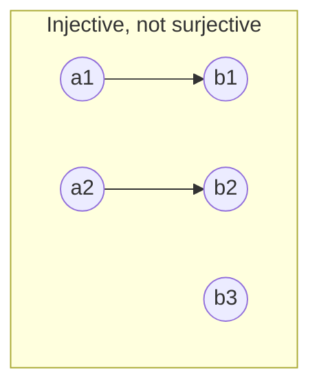
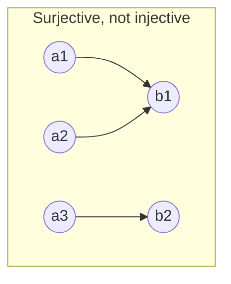
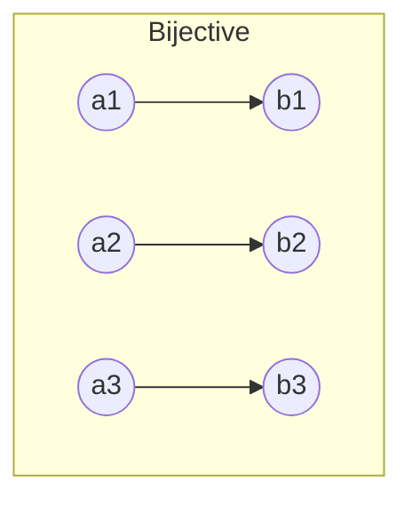

## Learning Objectives

- Define a function formally as a relation satisfying an existence-and-uniqueness condition, distinguishing it from an arbitrary relation.
- Prove or disprove that a given function is injective, surjective, and/or bijective, using the precise quantified definitions.
- Construct the inverse of a bijective function and explain why injectivity alone and surjectivity alone each fail to guarantee an inverse exists.
- Prove that the composition of two injections is an injection, two surjections is a surjection, and two bijections is a bijection.
- Connect injective/surjective/bijective functions to counting arguments — comparing set sizes without literally counting elements.

## Context & Motivation

A function is one of the most familiar objects in all of mathematics, but the rigorous definition — a function is a special kind of *relation* — is easy to skip past, and skipping it is exactly what makes injective, surjective, and bijective feel like three arbitrary vocabulary words instead of three natural questions about a single well-defined object. Once a function is understood as a subset of A × B satisfying two extra conditions (every input has *some* output, and every input has *at most one* output), the three properties fall out as answers to natural questions you can ask about that subset directly: does every element of B get hit at least once (surjective)? does every element of B get hit at most once (injective)? does every element of B get hit *exactly* once (bijective — both at once)? Framing them this way, rather than memorizing three separate definitions, is exactly how Stanford CS103 and MIT 6.042 both introduce this material, and it's the framing that makes the properties compose predictably instead of needing to be re-derived from scratch each time.

The practical stakes are high and immediate. Injectivity is what guarantees "no two different inputs collide to the same output" — the property you want from a hash function used as a unique identifier, from an encoding scheme that must be reversible, from a compression scheme that mustn't lose information. Surjectivity is what guarantees "every possible output is actually reachable" — the property you want from a random number generator that claims to produce every value in a range, or from an encoding scheme that must be able to represent every possible message. Bijectivity — both properties simultaneously — is exactly the condition under which an inverse function exists at all, and this single fact underlies why encryption schemes, serialization formats, and one-to-one lookup tables all lean on bijections specifically: only a bijection guarantees you can always get back exactly what you started with.

There's also a deep connection to counting that this concept sets up directly for what follows in this curriculum: a bijection between two finite sets is a rigorous proof that they have exactly the same size, without literally counting either one — this technique, called establishing a bijective correspondence, is precisely how the pigeonhole principle and the combinatorics unit ahead will compare quantities that would be awkward or impossible to count directly. And an injection from A into B, without needing a full bijection, is exactly what proves |A| ≤ |B| — the logical backbone of the pigeonhole principle's proof, which appears immediately after this unit.

## Core Theory

### Formal definition: a function is a relation with two extra properties

A relation f ⊆ A × B is a **function** from A to B (written f : A → B) if it satisfies:

1. **Totality (every input has an output):** ∀a ∈ A, ∃b ∈ B such that (a,b) ∈ f.
2. **Well-definedness (every input has at most one output):** ∀a ∈ A, ∀b₁, b₂ ∈ B, if (a,b₁) ∈ f and (a,b₂) ∈ f, then b₁ = b₂.

Together these say every element of A is paired with *exactly one* element of B — the familiar picture of a function, now stated as two precise conditions on a relation. A is the **domain**, B is the **codomain**, and f(a) denotes the unique b with (a,b) ∈ f. The **range** (or image) of f is { f(a) : a ∈ A } ⊆ B — the set of outputs actually achieved, which may be a proper subset of the codomain B. This range/codomain distinction is exactly what surjectivity below is going to pin down precisely.

### Injective (one-to-one)

f : A → B is **injective** if:

∀a₁, a₂ ∈ A, f(a₁) = f(a₂) → a₁ = a₂

Read informally: distinct inputs never collide to the same output; no element of B is hit more than once. The contrapositive form is often easier to use directly in a proof: a₁ ≠ a₂ → f(a₁) ≠ f(a₂). To *disprove* injectivity, it suffices to exhibit one pair a₁ ≠ a₂ with f(a₁) = f(a₂) — a single collision.

### Surjective (onto)

f : A → B is **surjective** if:

∀b ∈ B, ∃a ∈ A such that f(a) = b

Read informally: every element of the codomain is actually hit by something — the range equals the entire codomain, not merely a subset of it. To *disprove* surjectivity, it suffices to exhibit one b ∈ B with no a ∈ A mapping to it.

### Bijective, and why bijectivity alone guarantees an inverse

f : A → B is **bijective** if it is both injective and surjective. Bijectivity is precisely the condition under which an inverse function f⁻¹ : B → A exists, defined by f⁻¹(b) = the unique a with f(a) = b. This definition of f⁻¹ only makes sense because of both properties together: surjectivity guarantees such an a *exists* for every b (nothing is left undefined), and injectivity guarantees that a is *unique* (no ambiguity about which a to return). Drop either property and the construction breaks: without surjectivity, some b ∈ B would have no valid a to map back to; without injectivity, some b might have two or more valid candidates for a, and f⁻¹ would not be a well-defined function (it would fail the well-definedness condition from the very top of this section).

In the first diagram, b3 is never hit — surjectivity fails, but no two arrows share a head, so injectivity holds. In the second, b1 is hit twice (by a1 and a2) — injectivity fails, but every element of the codomain is hit by something, so surjectivity holds. In the third, every element of the codomain is hit exactly once — both properties hold simultaneously, and only in this configuration can arrows be reversed to produce a valid inverse function.

### Composition preserves each property

Given f : A → B and g : B → C, the composition g∘f : A → C is defined by (g∘f)(a) = g(f(a)).

**Claim: if f and g are both injective, g∘f is injective.** Suppose (g∘f)(a₁) = (g∘f)(a₂), i.e., g(f(a₁)) = g(f(a₂)). Since g is injective, this forces f(a₁) = f(a₂). Since f is injective, this forces a₁ = a₂. So g∘f is injective. ∎

**Claim: if f and g are both surjective, g∘f is surjective.** Let c ∈ C be arbitrary. Since g is surjective, there exists b ∈ B with g(b) = c. Since f is surjective, there exists a ∈ A with f(a) = b. Then (g∘f)(a) = g(f(a)) = g(b) = c. So every c ∈ C is hit, and g∘f is surjective. ∎

**Corollary: the composition of two bijections is a bijection.** If f and g are both bijective, they are both injective (so g∘f is injective, by the first claim) and both surjective (so g∘f is surjective, by the second claim); being both, g∘f is bijective. ∎

This corollary is exactly the kind of two-line proof that becomes available once the pieces are proved separately and combined — a pattern worth noticing on its own: proving a compound property (bijective = injective ∧ surjective) is often easiest by proving each half's preservation independently and then conjoining the results, rather than trying to argue about "bijective" as a single, unified condition from scratch.

### Cardinality consequences for finite sets

For finite sets A and B: if there exists an injective f : A → B, then |A| ≤ |B| (each element of A claims a distinct "slot" in B, so B must have at least as many slots as A has elements). If there exists a surjective f : A → B, then |A| ≥ |B| (every element of B needs at least one element of A mapping to it, so A must have at least as many elements as B has targets). If there exists a bijective f : A → B, then |A| = |B| exactly (both inequalities hold at once, forcing equality). This last fact is the rigorous justification for "counting by pairing up" — establishing a bijection between two sets proves they're the same size without literally counting either one, exactly the technique used to prove |P(A)| = 2ⁿ earlier in this unit via the bijection between subsets and bit strings.

## Worked Examples

### Example 1 — checking injectivity and surjectivity directly from the definitions

**Problem:** Let f : ℤ → ℤ be defined by f(n) = 2n. Determine whether f is injective, surjective, and/or bijective.

**Injective?** Suppose f(n₁) = f(n₂), i.e., 2n₁ = 2n₂. Dividing both sides by 2 (valid since we're working over the integers, and 2 ≠ 0) gives n₁ = n₂. Since this holds for arbitrary n₁, n₂, **f is injective.**

**Surjective?** The claim would be: for every m ∈ ℤ, there exists n ∈ ℤ with 2n = m, i.e., n = m/2. Take m = 3: n = 3/2 is not an integer, so no n ∈ ℤ maps to 3. **f is not surjective**, witnessed by the codomain element 3 (or any odd integer) never being hit.

**Bijective?** No, since bijective requires both properties and surjectivity already fails.

This example is worth pausing on because it shows injectivity and surjectivity are genuinely independent even for a simple, "nice-looking" algebraic function — doubling is a perfectly clean, well-behaved rule, and it's still not surjective onto ℤ, purely because the codomain was chosen to include elements (odd numbers) the rule can never reach.

### Example 2 — the same rule, different codomain, changes the answer

**Problem:** Let g : ℤ → 2ℤ (where 2ℤ denotes the set of all even integers) be defined by g(n) = 2n. Determine whether g is bijective.

**Injective?** Identical argument to Example 1 — 2n₁ = 2n₂ forces n₁ = n₂. **Injective.**

**Surjective?** Now the claim is: for every m ∈ 2ℤ (every even integer), there exists n ∈ ℤ with 2n = m. Since m is even by assumption, m = 2k for some integer k, and taking n = k gives 2n = 2k = m exactly. **Surjective** — and this time the argument goes through because the codomain was restricted to exactly the range of the doubling rule.

Since g is both injective and surjective, **g is bijective**, with inverse g⁻¹ : 2ℤ → ℤ given by g⁻¹(m) = m/2 (well-defined precisely because every even m has exactly one such preimage, guaranteed by the injectivity and surjectivity just proved).

The contrast between Example 1 and Example 2 makes a point that's easy to miss: injective, surjective, and bijective are not properties of a "formula" in isolation — they are properties of a specific function, meaning a specific triple (domain, codomain, rule). Changing only the codomain, with the identical rule, changed the answer from "not bijective" to "bijective." Any claim about these properties must always specify domain and codomain, not just the mapping rule.

### Example 3 — a finite function, checked by direct enumeration, and used for a cardinality argument

**Problem:** Let A = {1, 2, 3}, B = {x, y, z, w}, and let h : A → B be given by h(1) = x, h(2) = z, h(3) = y. Determine whether h is injective and/or surjective, and state what this proves about |A| versus |B|.

**Injective?** The three outputs, x, z, y, are all distinct from one another — no two different inputs share an output. **Injective.**

**Surjective?** The range of h is {x, z, y}, but w ∈ B is never hit by any of 1, 2, 3. **Not surjective**, witnessed by w.

Since h is injective (but not surjective), the cardinality consequence from Core Theory applies directly: the existence of an injective function from A to B proves |A| ≤ |B|. Here |A| = 3 and |B| = 4, so 3 ≤ 4 — consistent, and in fact this specific h is exactly a certificate of that inequality, constructed without ever needing to "count" A and B against each other directly; the injection itself *is* the proof. Notice also that no injective function A → B could possibly be surjective here, since |A| < |B| strictly — there are more elements in B than in A, so at least one element of B is guaranteed to be missed by any injection, regardless of which specific injective mapping is chosen. This observation — that an injection between sets of different finite sizes can never also be a bijection — is the exact seed of the pigeonhole principle, covered next after this unit.

## Common Misconceptions & Pitfalls

- **Treating "injective" and "surjective" as properties of a formula rather than of a full (domain, codomain, rule) triple.** Example 2 shows the identical rule f(n) = 2n is not surjective as a map ℤ → ℤ but is surjective as a map ℤ → 2ℤ — the codomain is part of what's being asked about, not incidental to it.
- **Assuming injective and surjective are opposites, or that a function must be one or the other.** They are independent properties: the first diagram in Core Theory shows injective-but-not-surjective, the second shows surjective-but-not-injective, and a function can also be neither (e.g., a constant function on a domain with more than one element, mapping everything to a single output, which fails injectivity, while also not reaching most of a larger codomain, failing surjectivity too).
- **Believing an inverse always exists as long as a function isn't "too weird."** Only bijections have inverse *functions* in the strict sense used here — an injective-but-not-surjective function like h in Example 3 has no well-defined inverse on all of B, because w has no preimage to return at all; a surjective-but-not-injective function has no well-defined inverse either, because some output has more than one candidate preimage to choose between, violating the well-definedness condition a function requires.
- **Confusing range with codomain, and concluding surjectivity is automatic.** The range (what's actually hit) is always a subset of the codomain (what's declared as possible outputs) by definition, but the two coincide only when the function is surjective — treating "the codomain" as if it just means "whatever came out" silently assumes surjectivity without proving it.
- **Believing the composition of two functions inherits a property that only one of the two has.** The composition proofs in Core Theory require *both* f and g to have the property for g∘f to inherit it — an injective f composed with a non-injective g need not produce an injective g∘f (concretely: f injective from a 2-element set into a 5-element set, followed by a g that collapses that 5-element set down to 1 element, gives a constant, non-injective composite), so checking only one of the two functions is not enough.

## Summary

A function f : A → B is a relation satisfying totality (every input maps somewhere) and well-definedness (every input maps to exactly one place); injective means no two distinct inputs share an output, surjective means every element of the codomain is hit by something, and bijective means both simultaneously — the exact condition under which a genuine inverse function f⁻¹ : B → A exists, because surjectivity supplies existence of a preimage and injectivity supplies its uniqueness. Both properties are relative to the specific domain-codomain pair chosen, not to the underlying formula alone, as the doubling-map example demonstrates directly. Composition preserves each property independently (injective∘injective is injective, surjective∘surjective is surjective), which together yields that a composition of bijections is always a bijection. For finite sets, an injection proves |A| ≤ |B|, a surjection proves |A| ≥ |B|, and a bijection proves |A| = |B| exactly — turning "does a certain mapping exist" into a rigorous way to compare set sizes without counting either set directly, the exact technique the pigeonhole principle builds on immediately next.

## Documentation Links

- [Stanford CS103 — Mathematical Foundations of Computing](https://web.stanford.edu/class/cs103/) — doc
- [Lehman, Leighton & Meyer — Mathematics for Computer Science (full text)](https://people.csail.mit.edu/meyer/mcs.pdf) — doc
