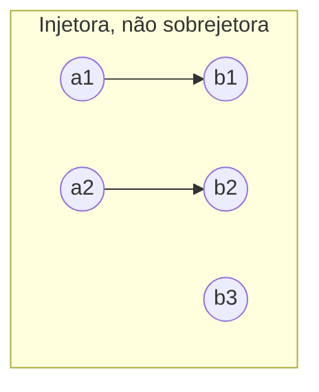
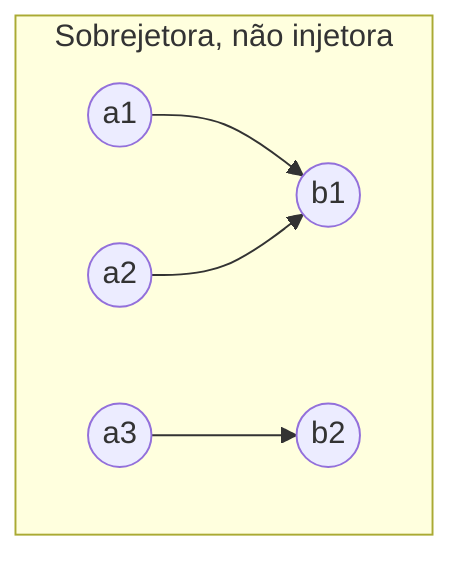
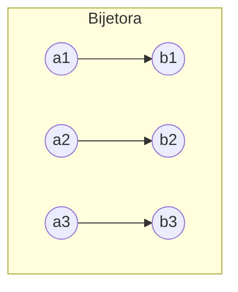

## Objetivos de Aprendizagem

- Definir função formalmente como uma relação satisfazendo uma condição de existência e unicidade, distinguindo-a de uma relação arbitrária.
- Provar ou refutar que uma dada função é injetora, sobrejetora e/ou bijetora, usando as definições precisas e quantificadas.
- Construir a inversa de uma função bijetora e explicar por que injetividade sozinha e sobrejetividade sozinha cada uma falha em garantir que uma inversa exista.
- Provar que a composição de duas injeções é uma injeção, de duas sobrejeções é uma sobrejeção, e de duas bijeções é uma bijeção.
- Conectar funções injetoras/sobrejetoras/bijetoras a argumentos de contagem: comparar tamanhos de conjuntos sem literalmente contar elementos.

## Contexto e Motivação

Uma função é um dos objetos mais familiares de toda a matemática, mas a definição rigorosa (uma função é um tipo especial de *relação*) é fácil de pular, e pular ela é exatamente o que faz injetora, sobrejetora e bijetora parecerem três palavras de vocabulário arbitrárias em vez de três perguntas naturais sobre um único objeto bem definido. Uma vez que uma função é entendida como um subconjunto de A × B satisfazendo duas condições extras (toda entrada tem *alguma* saída, e toda entrada tem *no máximo uma* saída), as três propriedades caem como respostas a perguntas naturais que você pode fazer diretamente sobre esse subconjunto: todo elemento de B é atingido pelo menos uma vez (sobrejetora)? todo elemento de B é atingido no máximo uma vez (injetora)? todo elemento de B é atingido *exatamente* uma vez (bijetora, as duas ao mesmo tempo)? Enquadrar assim, em vez de decorar três definições separadas, é exatamente como o CS103 de Stanford e o 6.042 do MIT introduzem esse material, e é o enquadramento que faz as propriedades se comporem de forma previsível em vez de precisarem ser rederivadas do zero cada vez.

As apostas práticas são altas e imediatas. Injetividade é o que garante "nenhuma entrada diferente colide na mesma saída", a propriedade que você quer de uma função hash usada como identificador único, de um esquema de codificação que precisa ser reversível, de um esquema de compressão que não pode perder informação. Sobrejetividade é o que garante "toda saída possível é de fato alcançável", a propriedade que você quer de um gerador de números aleatórios que afirma produzir todo valor numa faixa, ou de um esquema de codificação que precisa conseguir representar toda mensagem possível. Bijetividade (as duas propriedades simultaneamente) é exatamente a condição sob a qual uma função inversa existe, e esse único fato sustenta por que esquemas de criptografia, formatos de serialização, e tabelas de busca um-para-um se apoiam especificamente em bijeções: só uma bijeção garante que você sempre consegue recuperar exatamente o que começou com.

Há também uma conexão profunda com contagem que este conceito prepara diretamente para o que vem a seguir neste currículo: uma bijeção entre dois conjuntos finitos é uma prova rigorosa de que eles têm exatamente o mesmo tamanho, sem literalmente contar nenhum dos dois; essa técnica, chamada de estabelecer uma correspondência bijetiva, é precisamente como o princípio da casa dos pombos e a unidade de combinatória adiante vão comparar quantidades que seriam estranhas ou impossíveis de contar diretamente. E uma injeção de A em B, sem precisar de uma bijeção completa, é exatamente o que prova |A| ≤ |B|, a espinha dorsal lógica da prova do princípio da casa dos pombos, que aparece logo depois desta unidade.

## Teoria Central

### Definição formal: uma função é uma relação com duas propriedades extras

Uma relação f ⊆ A × B é uma **função** de A para B (escrita f : A → B) se satisfaz:

1. **Totalidade (toda entrada tem uma saída):** ∀a ∈ A, ∃b ∈ B tal que (a,b) ∈ f.
2. **Boa definição (toda entrada tem no máximo uma saída):** ∀a ∈ A, ∀b₁, b₂ ∈ B, se (a,b₁) ∈ f e (a,b₂) ∈ f, então b₁ = b₂.

Juntas, elas dizem que todo elemento de A é pareado com *exatamente um* elemento de B, a imagem familiar de uma função, agora declarada como duas condições precisas sobre uma relação. A é o **domínio**, B é o **contradomínio**, e f(a) denota o único b com (a,b) ∈ f. A **imagem** (ou range) de f é { f(a) : a ∈ A } ⊆ B, o conjunto das saídas de fato alcançadas, que pode ser um subconjunto próprio do contradomínio B. Essa distinção entre imagem e contradomínio é exatamente o que sobrejetividade abaixo vai fixar com precisão.

### Injetora (um-para-um)

f : A → B é **injetora** se:

∀a₁, a₂ ∈ A, f(a₁) = f(a₂) → a₁ = a₂

Lido informalmente: entradas distintas nunca colidem na mesma saída; nenhum elemento de B é atingido mais de uma vez. A forma contrapositiva costuma ser mais fácil de usar diretamente numa prova: a₁ ≠ a₂ → f(a₁) ≠ f(a₂). Para *refutar* injetividade, basta exibir um par a₁ ≠ a₂ com f(a₁) = f(a₂), uma única colisão.

### Sobrejetora (sobre)

f : A → B é **sobrejetora** se:

∀b ∈ B, ∃a ∈ A tal que f(a) = b

Lido informalmente: todo elemento do contradomínio é de fato atingido por algo, a imagem é igual ao contradomínio inteiro, não meramente um subconjunto dele. Para *refutar* sobrejetividade, basta exibir um b ∈ B sem nenhum a ∈ A mapeando para ele.

### Bijetora, e por que bijetividade sozinha garante uma inversa

f : A → B é **bijetora** se é tanto injetora quanto sobrejetora. Bijetividade é precisamente a condição sob a qual uma função inversa f⁻¹ : B → A existe, definida por f⁻¹(b) = o único a com f(a) = b. Essa definição de f⁻¹ só faz sentido por causa das duas propriedades juntas: sobrejetividade garante que tal a *existe* para todo b (nada fica indefinido), e injetividade garante que esse a é *único* (nenhuma ambiguidade sobre qual a retornar). Retire qualquer uma das propriedades e a construção quebra: sem sobrejetividade, algum b ∈ B não teria a válido para mapear de volta; sem injetividade, algum b poderia ter dois ou mais candidatos válidos para a, e f⁻¹ não seria uma função bem definida (falharia a condição de boa definição do início desta seção).

No primeiro diagrama, b3 nunca é atingido, sobrejetividade falha, mas nenhuma duas setas compartilham cabeça, então injetividade vale. No segundo, b1 é atingido duas vezes (por a1 e a2), injetividade falha, mas todo elemento do contradomínio é atingido por algo, então sobrejetividade vale. No terceiro, todo elemento do contradomínio é atingido exatamente uma vez, as duas propriedades valem simultaneamente, e só nessa configuração as setas podem ser revertidas para produzir uma função inversa válida.

### Composição preserva cada propriedade

Dadas f : A → B e g : B → C, a composição g∘f : A → C é definida por (g∘f)(a) = g(f(a)).

**Afirmação: se f e g são ambas injetoras, g∘f é injetora.** Suponha (g∘f)(a₁) = (g∘f)(a₂), ou seja, g(f(a₁)) = g(f(a₂)). Como g é injetora, isso força f(a₁) = f(a₂). Como f é injetora, isso força a₁ = a₂. Então g∘f é injetora. ∎

**Afirmação: se f e g são ambas sobrejetoras, g∘f é sobrejetora.** Seja c ∈ C arbitrário. Como g é sobrejetora, existe b ∈ B com g(b) = c. Como f é sobrejetora, existe a ∈ A com f(a) = b. Então (g∘f)(a) = g(f(a)) = g(b) = c. Então todo c ∈ C é atingido, e g∘f é sobrejetora. ∎

**Corolário: a composição de duas bijeções é uma bijeção.** Se f e g são ambas bijetoras, elas são ambas injetoras (então g∘f é injetora, pela primeira afirmação) e ambas sobrejetoras (então g∘f é sobrejetora, pela segunda afirmação); sendo as duas, g∘f é bijetora. ∎

Esse corolário é exatamente o tipo de prova de duas linhas que se torna disponível uma vez que as peças são provadas separadamente e combinadas, um padrão que vale a pena notar por si só: provar uma propriedade composta (bijetora = injetora ∧ sobrejetora) costuma ser mais fácil provando a preservação de cada metade independentemente e depois conjugando os resultados, em vez de tentar argumentar sobre "bijetora" como uma condição única e unificada do zero.

### Consequências de cardinalidade para conjuntos finitos

Para conjuntos finitos A e B: se existe uma f : A → B injetora, então |A| ≤ |B| (cada elemento de A reivindica um "espaço" distinto em B, então B precisa ter pelo menos tantos espaços quanto A tem elementos). Se existe uma f : A → B sobrejetora, então |A| ≥ |B| (todo elemento de B precisa de pelo menos um elemento de A mapeando para ele, então A precisa ter pelo menos tantos elementos quanto B tem alvos). Se existe uma f : A → B bijetora, então |A| = |B| exatamente (as duas desigualdades valem ao mesmo tempo, forçando igualdade). Esse último fato é a justificativa rigorosa para "contar pareando": estabelecer uma bijeção entre dois conjuntos prova que têm o mesmo tamanho sem literalmente contar nenhum dos dois, exatamente a técnica usada para provar |P(A)| = 2ⁿ mais cedo nesta unidade via a bijeção entre subconjuntos e strings de bits.

## Exemplos Resolvidos

### Exemplo 1: checando injetividade e sobrejetividade diretamente das definições

**Problema:** seja f : ℤ → ℤ definida por f(n) = 2n. Determine se f é injetora, sobrejetora e/ou bijetora.

**Injetora?** Suponha f(n₁) = f(n₂), ou seja, 2n₁ = 2n₂. Dividindo os dois lados por 2 (válido já que estamos trabalhando sobre os inteiros, e 2 ≠ 0) dá n₁ = n₂. Como isso vale para n₁, n₂ arbitrários, **f é injetora.**

**Sobrejetora?** A afirmação seria: para todo m ∈ ℤ, existe n ∈ ℤ com 2n = m, ou seja, n = m/2. Tome m = 3: n = 3/2 não é um inteiro, então nenhum n ∈ ℤ mapeia para 3. **f não é sobrejetora**, testemunhado pelo elemento do contradomínio 3 (ou qualquer inteiro ímpar) nunca sendo atingido.

**Bijetora?** Não, já que bijetora exige as duas propriedades e sobrejetividade já falha.

Vale a pena parar neste exemplo porque ele mostra que injetividade e sobrejetividade são genuinamente independentes mesmo para uma função algébrica simples e "de aparência boa": dobrar é uma regra perfeitamente limpa e bem-comportada, e ainda assim não é sobrejetora sobre ℤ, puramente porque o contradomínio foi escolhido para incluir elementos (números ímpares) que a regra nunca pode alcançar.

### Exemplo 2: a mesma regra, contradomínio diferente, muda a resposta

**Problema:** seja g : ℤ → 2ℤ (onde 2ℤ denota o conjunto de todos os inteiros pares) definida por g(n) = 2n. Determine se g é bijetora.

**Injetora?** Argumento idêntico ao Exemplo 1: 2n₁ = 2n₂ força n₁ = n₂. **Injetora.**

**Sobrejetora?** Agora a afirmação é: para todo m ∈ 2ℤ (todo inteiro par), existe n ∈ ℤ com 2n = m. Como m é par por suposição, m = 2k para algum inteiro k, e tomando n = k dá 2n = 2k = m exatamente. **Sobrejetora**, e desta vez o argumento funciona porque o contradomínio foi restrito exatamente à imagem da regra de dobrar.

Como g é tanto injetora quanto sobrejetora, **g é bijetora**, com inversa g⁻¹ : 2ℤ → ℤ dada por g⁻¹(m) = m/2 (bem definida precisamente porque todo m par tem exatamente uma tal pré-imagem, garantido pela injetividade e sobrejetividade recém provadas).

O contraste entre o Exemplo 1 e o Exemplo 2 faz um ponto fácil de perder: injetora, sobrejetora e bijetora não são propriedades de uma "fórmula" isolada, são propriedades de uma função específica, ou seja, uma tripla específica (domínio, contradomínio, regra). Mudar só o contradomínio, com a regra idêntica, mudou a resposta de "não bijetora" para "bijetora". Qualquer afirmação sobre essas propriedades precisa sempre especificar domínio e contradomínio, não só a regra de mapeamento.

### Exemplo 3: uma função finita, checada por enumeração direta, e usada para um argumento de cardinalidade

**Problema:** sejam A = {1, 2, 3}, B = {x, y, z, w}, e seja h : A → B dada por h(1) = x, h(2) = z, h(3) = y. Determine se h é injetora e/ou sobrejetora, e declare o que isso prova sobre |A| versus |B|.

**Injetora?** As três saídas, x, z, y, são todas distintas entre si; nenhuma duas entradas diferentes compartilham saída. **Injetora.**

**Sobrejetora?** A imagem de h é {x, z, y}, mas w ∈ B nunca é atingido por nenhum de 1, 2, 3. **Não sobrejetora**, testemunhado por w.

Como h é injetora (mas não sobrejetora), a consequência de cardinalidade da Teoria Central se aplica diretamente: a existência de uma função injetora de A para B prova |A| ≤ |B|. Aqui |A| = 3 e |B| = 4, então 3 ≤ 4, consistente, e de fato esse h específico é exatamente um certificado dessa desigualdade, construído sem nunca precisar "contar" A e B um contra o outro; a própria injeção *é* a prova. Note também que nenhuma função injetora A → B poderia possivelmente ser sobrejetora aqui, já que |A| < |B| estritamente, há mais elementos em B que em A, então pelo menos um elemento de B é garantidamente perdido por qualquer injeção, independentemente de qual mapeamento injetor específico é escolhido. Essa observação (de que uma injeção entre conjuntos de tamanhos finitos diferentes nunca pode também ser uma bijeção) é a semente exata do princípio da casa dos pombos, coberto logo depois desta unidade.

## Equívocos Comuns e Armadilhas

- **Tratar "injetora" e "sobrejetora" como propriedades de uma fórmula em vez de uma tripla completa (domínio, contradomínio, regra).** O Exemplo 2 mostra que a regra idêntica f(n) = 2n não é sobrejetora como mapa ℤ → ℤ mas é sobrejetora como mapa ℤ → 2ℤ; o contradomínio é parte do que está sendo perguntado, não incidental a isso.
- **Assumir que injetora e sobrejetora são opostas, ou que uma função precisa ser uma ou outra.** São propriedades independentes: o primeiro diagrama na Teoria Central mostra injetora-mas-não-sobrejetora, o segundo mostra sobrejetora-mas-não-injetora, e uma função também pode não ser nenhuma das duas (por exemplo, uma função constante num domínio com mais de um elemento, mapeando tudo para uma única saída, que falha injetividade, enquanto também não alcança a maior parte de um contradomínio maior, falhando sobrejetividade também).
- **Acreditar que uma inversa sempre existe contanto que a função não seja "muito estranha".** Só bijeções têm funções inversas no sentido estrito usado aqui; uma função injetora-mas-não-sobrejetora como h no Exemplo 3 não tem inversa bem definida em todo B, porque w não tem pré-imagem alguma para retornar; uma função sobrejetora-mas-não-injetora também não tem inversa bem definida, porque alguma saída tem mais de um candidato a pré-imagem entre os quais escolher, violando a condição de boa definição que uma função exige.
- **Confundir imagem com contradomínio, e concluir que sobrejetividade é automática.** A imagem (o que de fato é atingido) sempre é um subconjunto do contradomínio (o que é declarado como saídas possíveis) por definição, mas os dois coincidem só quando a função é sobrejetora; tratar "o contradomínio" como se significasse apenas "o que saiu" assume silenciosamente sobrejetividade sem prová-la.
- **Acreditar que a composição de duas funções herda uma propriedade que só uma das duas tem.** As provas de composição na Teoria Central exigem que *ambas* f e g tenham a propriedade para g∘f herdá-la; um f injetor composto com um g não injetor não precisa produzir um g∘f injetor (concretamente: f injetora de um conjunto de 2 elementos num conjunto de 5 elementos, seguido de um g que colapsa esse conjunto de 5 elementos para 1 elemento, dá um composto constante, não injetor), então checar só uma das duas funções não basta.

## Resumo

Uma função f : A → B é uma relação satisfazendo totalidade (toda entrada mapeia para algum lugar) e boa definição (toda entrada mapeia para exatamente um lugar); injetora significa que nenhuma duas entradas distintas compartilham saída, sobrejetora significa que todo elemento do contradomínio é atingido por algo, e bijetora significa as duas ao mesmo tempo, exatamente a condição sob a qual uma função inversa genuína f⁻¹ : B → A existe, porque sobrejetividade fornece existência de uma pré-imagem e injetividade fornece sua unicidade. As duas propriedades são relativas ao par domínio-contradomínio específico escolhido, não só à fórmula subjacente, como o exemplo do mapa de dobrar demonstra diretamente. Composição preserva cada propriedade independentemente (injetora∘injetora é injetora, sobrejetora∘sobrejetora é sobrejetora), o que junto produz que uma composição de bijeções é sempre uma bijeção. Para conjuntos finitos, uma injeção prova |A| ≤ |B|, uma sobrejeção prova |A| ≥ |B|, e uma bijeção prova |A| = |B| exatamente, transformando "um certo mapeamento existe" numa forma rigorosa de comparar tamanhos de conjuntos sem contar nenhum dos dois diretamente, exatamente a técnica sobre a qual o princípio da casa dos pombos se constrói logo a seguir.

## Documentation Links

- [Stanford CS103 — Mathematical Foundations of Computing](https://web.stanford.edu/class/cs103/) — doc
- [Lehman, Leighton & Meyer — Mathematics for Computer Science (full text)](https://people.csail.mit.edu/meyer/mcs.pdf) — doc
