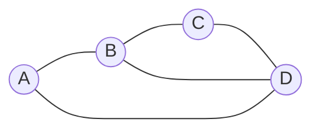
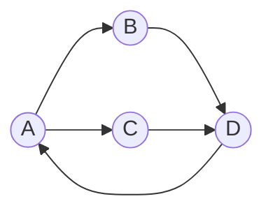

## Learning Objectives

- Define a graph formally as a pair (V, E) and distinguish directed graphs, undirected graphs, simple graphs, and multigraphs.
- Compute the degree of a vertex in an undirected graph, and the in-degree and out-degree of a vertex in a directed graph, and state the handshake theorem.
- Explain what a path, a cycle, and a connected graph are, and identify each in a small concrete example.
- Construct the adjacency matrix and adjacency list representations of a given small graph, and explain the space and lookup trade-offs between the two.
- Choose the more suitable representation (matrix or list) for a graph given its density and the operations it needs to support.

## Context & Motivation

A graph is one of the most reused abstractions in all of computer science, precisely because "a set of things, and some pairs of them related somehow" is a shape that shows up everywhere once you start looking for it: web pages and hyperlinks, cities and roads, people and friendships, tasks and their dependencies, states and transitions in a program. Graph theory itself predates computing by roughly two centuries — Euler's 1736 analysis of the Seven Bridges of Königsberg is usually credited as the founding result — but the formal vocabulary developed since then (vertices, edges, degree, paths, connectivity) is exactly the vocabulary a computer scientist needs to state precisely what problem an algorithm is solving before ever writing a line of code for it. Before a shortest-path algorithm, a cycle-detection routine, or a network-flow method can be discussed meaningfully, the underlying structure needs a shared, unambiguous language — and that language is what this topic builds.

Equally important, and often underemphasized in a first pass, is that a graph as a mathematical object and a graph as something a program manipulates are two different things connected by a choice: how do you *represent* a graph in memory? This is not a detail to defer to a later "data structures" course — the choice of representation determines which operations are cheap and which are expensive, and getting this wrong is one of the most common sources of accidentally-quadratic or accidentally-linear-instead-of-constant code in real graph algorithms. The two standard representations, the adjacency matrix and the adjacency list, embody a genuine space/time trade-off that recurs throughout computer science whenever a sparse relationship needs to be stored efficiently, and understanding *why* each one has the trade-offs it does — not just how to build each one — is the actual payoff of covering representations alongside the pure mathematical terminology in the same topic, as the ACM/IEEE CS2013 curriculum guidelines and Lehman, Leighton & Meyer's *Mathematics for Computer Science* both do.

## Core Theory

### Formal definition: vertices and edges

A **graph** is a pair G = (V, E), where V is a finite set of **vertices** (or **nodes**), and E is a set of **edges**, each edge being an association between two vertices.

In an **undirected graph**, each edge is an unordered pair {u, v} with u, v ∈ V, u ≠ v (for a *simple* graph — see below) — representing a relationship with no inherent direction (e.g., "is friends with"). In a **directed graph** (or **digraph**), each edge is an ordered pair (u, v), representing a relationship that runs specifically *from* u *to* v (e.g., "follows," "has a one-way road to"); (u, v) and (v, u) are distinct edges that may or may not both be present.

A **simple graph** disallows both **self-loops** (an edge from a vertex to itself) and **multi-edges** (more than one edge between the same pair of vertices). A **multigraph** permits multi-edges; a graph with self-loops permitted is sometimes called a **pseudograph**. Unless stated otherwise, "graph" in most introductory contexts means a simple graph, and that is the default assumed for the rest of this topic.

### Degree, and the handshake theorem

In an undirected graph, the **degree** of a vertex v, written deg(v), is the number of edges incident to v (edges with v as one of their two endpoints).

**Handshake theorem.** Σ_{v∈V} deg(v) = 2|E|.

**Proof.** Each edge {u,v} contributes exactly 1 to deg(u) and exactly 1 to deg(v) — that is, each edge is counted exactly twice when summing degree over all vertices (once at each endpoint). Summing over all |E| edges gives a total contribution of 2|E|. ∎

**Corollary.** The number of vertices with odd degree is always even (since the total degree sum 2|E| is even, and a sum of integers is even only if it contains an even number of odd terms).

In a directed graph, degree splits into **in-degree** (number of edges pointing into v) and **out-degree** (number of edges pointing out of v). The directed analogue of the handshake theorem is Σ deg⁺(v) = Σ deg⁻(v) = |E|, since each directed edge contributes exactly one unit of out-degree (at its source) and exactly one unit of in-degree (at its target), counted separately rather than doubly.

### Paths, cycles, and connectivity

A **walk** is a sequence of vertices v₀, v₁, …, v_k where consecutive vertices are joined by an edge. A **path** is a walk with no repeated vertices. A **cycle** is a path of length ≥ 3 (for a simple graph) whose first and last vertices coincide, with no other repeats. An undirected graph is **connected** if there exists a path between every pair of distinct vertices; a directed graph is **strongly connected** if there is a directed path from every vertex to every other vertex, and merely **weakly connected** if the graph obtained by ignoring edge directions is connected.



In this undirected graph, A-B-C-D-A is a cycle of length 4; A-B-D is a path of length 2 (using the diagonal B-D edge); the graph is connected, since every vertex reaches every other via some path; deg(B) = 3 (edges to A, C, D), and by the handshake theorem, Σdeg(v) = deg(A)+deg(B)+deg(C)+deg(D) = 2+3+2+3 = 10 = 2·5, matching the graph's 5 edges.

### Adjacency matrix and adjacency list

Two representations dominate practice, and the choice between them is a genuine engineering trade-off, not a matter of taste.

**Adjacency matrix.** An n × n matrix M where M[i][j] = 1 if there is an edge from vertex i to vertex j (and, for a weighted graph, the edge's weight instead of a bare 1), and 0 (or ∞, for weighted shortest-path problems) otherwise. For an undirected graph, M is symmetric (M[i][j] = M[j][i]).

- Space: Θ(n²), regardless of how many edges actually exist.
- Edge-existence query "is there an edge between u and v?": Θ(1) — a single array lookup.
- Enumerating all neighbors of a vertex: Θ(n), since the entire row must be scanned even if the vertex has few or no neighbors.

**Adjacency list.** For each vertex, a list (or set) of the vertices it has an edge to.

- Space: Θ(n + |E|) — proportional to the actual number of edges present, plus one list header per vertex.
- Edge-existence query: up to Θ(deg(v)) in the worst case (must scan the list, unless it's a hash set, giving expected O(1)).
- Enumerating all neighbors of a vertex: Θ(deg(v)) — exactly proportional to how many neighbors actually exist, with no wasted work scanning absent edges.

The trade-off is squarely about **density**. For a **dense** graph (|E| close to n²), the matrix's Θ(n²) space is not actually wasteful relative to the list's Θ(n + |E|), and the matrix's Θ(1) edge queries are strictly better. For a **sparse** graph (|E| = O(n), as in most real-world networks — road networks, social graphs, dependency graphs), the matrix wastes an enormous amount of space storing mostly-zero entries, while the adjacency list's space scales with the actual edge count and neighbor enumeration (the most common operation in most graph algorithms, such as breadth-first and depth-first search) is correspondingly cheap.

### Representing a concrete graph both ways

Take the small directed graph with vertices {A, B, C, D} and edges A→B, A→C, B→D, C→D, D→A:



```python
# Adjacency matrix representation.
# Rows/columns indexed in the fixed vertex order ['A', 'B', 'C', 'D'].
vertices = ['A', 'B', 'C', 'D']
index = {v: i for i, v in enumerate(vertices)}

adj_matrix = [[0] * len(vertices) for _ in vertices]
edges = [('A', 'B'), ('A', 'C'), ('B', 'D'), ('C', 'D'), ('D', 'A')]
for u, v in edges:
    adj_matrix[index[u]][index[v]] = 1

for row in adj_matrix:
    print(row)
# [0, 1, 1, 0]   <- A: edges to B, C
# [0, 0, 0, 1]   <- B: edge to D
# [0, 0, 0, 1]   <- C: edge to D
# [1, 0, 0, 0]   <- D: edge to A

# Adjacency list representation — same graph, same edges.
adj_list = {v: [] for v in vertices}
for u, v in edges:
    adj_list[u].append(v)

print(adj_list)
# {'A': ['B', 'C'], 'B': ['D'], 'C': ['D'], 'D': ['A']}
```

The matrix stores 16 entries (4×4) to describe a graph with only 5 edges — 11 of those entries are structurally zero. The adjacency list stores exactly 5 entries total across all four lists, proportional to |E| rather than n². Checking "is there an edge A→D?" is `adj_matrix[index['A']][index['D']]` (one lookup, answer 0) versus scanning `adj_list['A']` (2 elements, answer "no, D not present") — for this tiny example the difference is invisible, but it is exactly this Θ(1)-vs-Θ(deg(v)) gap that dominates performance on graphs with millions of vertices and a sparse edge set.

## Worked Examples

### Example 1 — verifying the handshake theorem on a hand-built graph

**Problem:** Build an undirected simple graph on 5 vertices with edges {1,2}, {1,3}, {2,3}, {3,4}, {4,5}, and verify the handshake theorem directly.

**Degrees:** deg(1) = 2 (edges to 2, 3). deg(2) = 2 (edges to 1, 3). deg(3) = 3 (edges to 1, 2, 4). deg(4) = 2 (edges to 3, 5). deg(5) = 1 (edge to 4).

**Sum:** 2+2+3+2+1 = 10. **Edge count:** |E| = 5, so 2|E| = 10. The two match, confirming the theorem on this instance. Note also that exactly one vertex (vertex 5) has odd degree... wait — deg(5) = 1 is odd, and deg(3) = 3 is also odd, giving *two* odd-degree vertices, consistent with the corollary that the number of odd-degree vertices must be even (2 is even). ✓

### Example 2 — building both representations from an edge list, and comparing

**Problem:** Given the undirected graph from Example 1, build both representations and use them to answer "list all neighbors of vertex 3" and "is there an edge between 1 and 4?"

```python
vertices = [1, 2, 3, 4, 5]
edges = [(1,2), (1,3), (2,3), (3,4), (4,5)]

# Adjacency matrix (symmetric, since the graph is undirected)
n = len(vertices)
adj_matrix = [[0]*n for _ in range(n)]
for u, v in edges:
    adj_matrix[u-1][v-1] = 1
    adj_matrix[v-1][u-1] = 1     # symmetric: both directions set

# Adjacency list
adj_list = {v: [] for v in vertices}
for u, v in edges:
    adj_list[u].append(v)
    adj_list[v].append(u)

print("neighbors of 3 (matrix):", [i+1 for i, val in enumerate(adj_matrix[2]) if val])
print("neighbors of 3 (list):  ", adj_list[3])
print("edge between 1 and 4?  ", bool(adj_matrix[0][3]))
```

Output: `neighbors of 3 (matrix): [1, 2, 4]`, `neighbors of 3 (list): [1, 2, 4]` (same answer, both representations agree, as they must — they encode the same graph), and `edge between 1 and 4? False` (no such edge in the original list). This confirms both representations are faithful encodings of the same underlying graph, differing only in how the same information is laid out and what that layout costs to query.

### Example 3 — directed graph in-degree and out-degree

**Problem:** For the directed graph A→B, A→C, B→D, C→D, D→A from Core Theory, compute the in-degree and out-degree of every vertex, and verify Σdeg⁺(v) = Σdeg⁻(v) = |E|.

**Out-degrees:** deg⁺(A) = 2 (→B, →C). deg⁺(B) = 1 (→D). deg⁺(C) = 1 (→D). deg⁺(D) = 1 (→A). Sum = 2+1+1+1 = 5.

**In-degrees:** deg⁻(A) = 1 (from D). deg⁻(B) = 1 (from A). deg⁻(C) = 1 (from A). deg⁻(D) = 2 (from B, C). Sum = 1+1+1+2 = 5.

Both sums equal 5, matching |E| = 5 exactly, as the directed handshake analogue requires — every edge contributes exactly one unit to some vertex's out-degree and exactly one unit to some (possibly different) vertex's in-degree.

## Common Misconceptions & Pitfalls

- **"An adjacency matrix is always more efficient because array lookups are fast."** Θ(1) lookup is only faster in the *edge-query* operation; for the far more common operation of enumerating a vertex's neighbors (needed by nearly every graph traversal algorithm), the matrix costs Θ(n) regardless of actual degree, while the list costs Θ(deg(v)) — for a sparse graph with deg(v) ≪ n, the list is dramatically cheaper for exactly the operation graph algorithms perform most.
- **"Degree and number of edges are the same count."** The handshake theorem exists precisely because they are not — Σdeg(v) = 2|E|, not |E|, since every edge is incident to exactly two vertices and is therefore counted in two different vertices' degree tallies. Forgetting the factor of 2 is a frequent source of off-by-a-factor-of-two errors in degree-sum calculations.
- **"A path and a walk are the same thing."** A walk permits repeated vertices (and by extension, potentially repeated edges); a path specifically forbids repeated vertices. Confusing the two matters in proofs — e.g., "does a path exist between u and v" is a strictly stronger and more specific claim than "does a walk exist," even though in a finite graph the existence of a walk between two vertices does imply the existence of a path (by removing any cycles the walk revisits), which is itself a fact worth proving rather than assuming.
- **"A weakly connected directed graph is 'basically the same as' being connected."** Weak connectivity only asks whether the underlying undirected graph is connected, ignoring edge direction entirely; it says nothing about whether every vertex can actually be *reached* from every other by following directed edges — that stronger property is strong connectivity, and a directed graph can easily be weakly but not strongly connected (e.g., a directed graph shaped like a straight line, A→B→C, is weakly connected but not strongly connected, since C cannot reach A).
- **"The adjacency matrix representation naturally generalizes to multigraphs and self-loops without change."** A 0/1 matrix cannot record more than one edge between the same pair of vertices; representing a multigraph with a matrix requires storing an edge *count* rather than a boolean flag, and a self-loop is recorded on the diagonal (M[i][i]), which some handshake-theorem statements exclude or double-count depending on convention — the formal definitions above assume a simple graph specifically to sidestep these complications.

## Summary

A graph G = (V, E) is a set of vertices together with a set of edges connecting pairs of them, either as unordered pairs (undirected) or ordered pairs (directed); degree measures how many edges touch a vertex, splitting into in-degree and out-degree for directed graphs, and the handshake theorem (Σdeg(v) = 2|E|) is a direct consequence of every edge being counted at exactly two endpoints. Paths (no repeated vertices), cycles (a path that returns to its start), and connectivity (a path exists between every pair of vertices, or, for directed graphs, the stronger notion of strong connectivity) give the vocabulary needed to describe a graph's structure precisely. The adjacency matrix (Θ(n²) space, Θ(1) edge queries, Θ(n) neighbor enumeration) and adjacency list (Θ(n+|E|) space, neighbor enumeration proportional to actual degree) are the two standard in-memory representations, and the choice between them is a real space/time trade-off governed by graph density — dense graphs favor the matrix, and the sparse graphs typical of most real-world networks favor the list, especially for the neighbor-enumeration operation that dominates most graph algorithms.

## Documentation Links

- [Lehman, Leighton & Meyer — Mathematics for Computer Science (full text)](https://people.csail.mit.edu/meyer/mcs.pdf) — doc
- [ACM/IEEE CS2013 Curriculum Guidelines](https://www.acm.org/binaries/content/assets/education/cs2013_web_final.pdf) — doc
