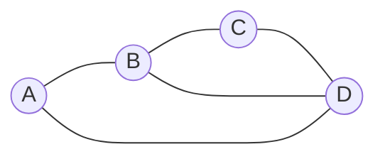
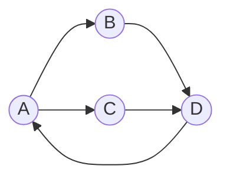

## Objetivos de Aprendizagem

- Definir um grafo formalmente como um par (V, E) e distinguir grafos dirigidos, grafos não dirigidos, grafos simples e multigrafos.
- Computar o grau de um vértice num grafo não dirigido, e o grau de entrada e o grau de saída de um vértice num grafo dirigido, e declarar o teorema do aperto de mãos.
- Explicar o que são um caminho, um ciclo e um grafo conexo, e identificar cada um num exemplo concreto pequeno.
- Construir as representações em matriz de adjacência e lista de adjacência de um grafo pequeno dado, e explicar as trocas de espaço e tempo de busca entre as duas.
- Escolher a representação mais adequada (matriz ou lista) para um grafo dado sua densidade e as operações que precisa suportar.

## Contexto e Motivação

Um grafo é uma das abstrações mais reusadas em toda a Ciência da Computação, precisamente porque "um conjunto de coisas, e alguns pares delas relacionados de algum jeito" é uma forma que aparece em todo lugar assim que você começa a procurar: páginas web e hiperlinks, cidades e estradas, pessoas e amizades, tarefas e suas dependências, estados e transições num programa. A própria teoria dos grafos é anterior à computação por aproximadamente dois séculos (a análise de Euler de 1736 sobre as Sete Pontes de Königsberg costuma receber o crédito como resultado fundador), mas o vocabulário formal desenvolvido desde então (vértices, arestas, grau, caminhos, conectividade) é exatamente o vocabulário que um cientista da computação precisa para declarar com precisão que problema um algoritmo está resolvendo antes mesmo de escrever uma linha de código para ele. Antes que um algoritmo de caminho mais curto, uma rotina de detecção de ciclos, ou um método de fluxo de rede possam ser discutidos de forma significativa, a estrutura subjacente precisa de uma linguagem compartilhada e sem ambiguidade, e essa linguagem é o que este tópico constrói.

Igualmente importante, e frequentemente subenfatizado numa primeira passagem, é que um grafo como objeto matemático e um grafo como algo que um programa manipula são duas coisas diferentes conectadas por uma escolha: como você *representa* um grafo na memória? Isso não é um detalhe a ser adiado para um curso posterior de "estruturas de dados"; a escolha de representação determina quais operações são baratas e quais são caras, e errar isso é uma das fontes mais comuns de código acidentalmente quadrático ou acidentalmente linear em vez de constante em algoritmos de grafo reais. As duas representações padrão, a matriz de adjacência e a lista de adjacência, encarnam uma troca genuína de espaço por tempo que reaparece por toda a Ciência da Computação sempre que uma relação esparsa precisa ser armazenada eficientemente, e entender *por que* cada uma tem as trocas que tem, não só como construir cada uma, é o verdadeiro retorno de cobrir representações junto com a terminologia matemática pura no mesmo tópico, como tanto as diretrizes curriculares ACM/IEEE CS2013 quanto o *Mathematics for Computer Science* de Lehman, Leighton e Meyer fazem.

## Teoria Central

### Definição formal: vértices e arestas

Um **grafo** é um par G = (V, E), onde V é um conjunto finito de **vértices** (ou **nós**), e E é um conjunto de **arestas**, cada aresta sendo uma associação entre dois vértices.

Num **grafo não dirigido**, cada aresta é um par não ordenado {u, v} com u, v ∈ V, u ≠ v (para um grafo *simples*, veja abaixo), representando um relacionamento sem direção inerente (por exemplo, "é amigo de"). Num **grafo dirigido** (ou **dígrafo**), cada aresta é um par ordenado (u, v), representando um relacionamento que corre especificamente *de* u *para* v (por exemplo, "segue", "tem uma estrada de mão única para"); (u, v) e (v, u) são arestas distintas que podem ou não estar ambas presentes.

Um **grafo simples** proíbe tanto **laços próprios** (uma aresta de um vértice para ele mesmo) quanto **multiarestas** (mais de uma aresta entre o mesmo par de vértices). Um **multigrafo** permite multiarestas; um grafo em que laços próprios são permitidos às vezes se chama **pseudografo**. A menos que declarado de outra forma, "grafo" na maioria dos contextos introdutórios significa um grafo simples, e esse é o padrão assumido pelo resto deste tópico.

### Grau, e o teorema do aperto de mãos

Num grafo não dirigido, o **grau** de um vértice v, escrito deg(v), é o número de arestas incidentes a v (arestas que têm v como uma de suas duas extremidades).

**Teorema do aperto de mãos.** Σ_{v∈V} deg(v) = 2|E|.

**Prova.** Cada aresta {u,v} contribui exatamente 1 para deg(u) e exatamente 1 para deg(v), ou seja, cada aresta é contada exatamente duas vezes ao somar o grau sobre todos os vértices (uma vez em cada extremidade). Somando sobre todas as |E| arestas dá uma contribuição total de 2|E|. ∎

**Corolário.** O número de vértices com grau ímpar é sempre par (já que a soma total de graus 2|E| é par, e uma soma de inteiros é par só se contém um número par de termos ímpares).

Num grafo dirigido, grau se divide em **grau de entrada** (número de arestas apontando para v) e **grau de saída** (número de arestas apontando para fora de v). O análogo dirigido do teorema do aperto de mãos é Σ deg⁺(v) = Σ deg⁻(v) = |E|, já que cada aresta dirigida contribui exatamente uma unidade de grau de saída (em sua origem) e exatamente uma unidade de grau de entrada (em seu destino), contadas separadamente em vez de duplamente.

### Caminhos, ciclos e conectividade

Um **passeio** é uma sequência de vértices v₀, v₁, …, v_k onde vértices consecutivos são unidos por uma aresta. Um **caminho** é um passeio sem vértices repetidos. Um **ciclo** é um caminho de comprimento ≥ 3 (para um grafo simples) cujo primeiro e último vértices coincidem, sem outras repetições. Um grafo não dirigido é **conexo** se existe um caminho entre todo par de vértices distintos; um grafo dirigido é **fortemente conexo** se existe um caminho dirigido de todo vértice para todo outro vértice, e apenas **fracamente conexo** se o grafo obtido ignorando as direções das arestas é conexo.



Neste grafo não dirigido, A-B-C-D-A é um ciclo de comprimento 4; A-B-D é um caminho de comprimento 2 (usando a aresta diagonal B-D); o grafo é conexo, já que todo vértice alcança todo outro via algum caminho; deg(B) = 3 (arestas para A, C, D), e pelo teorema do aperto de mãos, Σdeg(v) = deg(A)+deg(B)+deg(C)+deg(D) = 2+3+2+3 = 10 = 2·5, correspondendo às 5 arestas do grafo.

### Matriz de adjacência e lista de adjacência

Duas representações dominam a prática, e a escolha entre elas é uma troca genuína de engenharia, não uma questão de gosto.

**Matriz de adjacência.** Uma matriz n × n M onde M[i][j] = 1 se existe uma aresta do vértice i para o vértice j (e, para um grafo ponderado, o peso da aresta em vez de um 1 simples), e 0 (ou ∞, para problemas de caminho mais curto ponderados) caso contrário. Para um grafo não dirigido, M é simétrica (M[i][j] = M[j][i]).

- Espaço: Θ(n²), independentemente de quantas arestas de fato existem.
- Consulta de existência de aresta "existe uma aresta entre u e v?": Θ(1), uma única busca em array.
- Enumerar todos os vizinhos de um vértice: Θ(n), já que a linha inteira precisa ser escaneada mesmo que o vértice tenha poucos ou nenhum vizinho.

**Lista de adjacência.** Para cada vértice, uma lista (ou conjunto) dos vértices para os quais tem uma aresta.

- Espaço: Θ(n + |E|), proporcional ao número real de arestas presentes, mais um cabeçalho de lista por vértice.
- Consulta de existência de aresta: até Θ(deg(v)) no pior caso (precisa escanear a lista, a menos que seja um conjunto hash, dando O(1) esperado).
- Enumerar todos os vizinhos de um vértice: Θ(deg(v)), exatamente proporcional a quantos vizinhos de fato existem, sem trabalho desperdiçado escaneando arestas ausentes.

A troca é diretamente sobre **densidade**. Para um grafo **denso** (|E| próximo de n²), o espaço Θ(n²) da matriz não é de fato desperdiçado em relação ao Θ(n + |E|) da lista, e as consultas Θ(1) de aresta da matriz são estritamente melhores. Para um grafo **esparso** (|E| = O(n), como na maioria das redes do mundo real, redes de estradas, grafos sociais, grafos de dependência), a matriz desperdiça uma quantidade enorme de espaço armazenando entradas majoritariamente zero, enquanto o espaço da lista de adjacência escala com a contagem real de arestas e a enumeração de vizinhos (a operação mais comum na maioria dos algoritmos de grafo, como busca em largura e busca em profundidade) é correspondentemente barata.

### Representando um grafo concreto das duas formas

Tome o grafo dirigido pequeno com vértices {A, B, C, D} e arestas A→B, A→C, B→D, C→D, D→A:



```python
# Representação em matriz de adjacência.
# Linhas/colunas indexadas na ordem fixa de vértices ['A', 'B', 'C', 'D'].
vertices = ['A', 'B', 'C', 'D']
index = {v: i for i, v in enumerate(vertices)}

adj_matrix = [[0] * len(vertices) for _ in vertices]
edges = [('A', 'B'), ('A', 'C'), ('B', 'D'), ('C', 'D'), ('D', 'A')]
for u, v in edges:
    adj_matrix[index[u]][index[v]] = 1

for row in adj_matrix:
    print(row)
# [0, 1, 1, 0]   <- A: arestas para B, C
# [0, 0, 0, 1]   <- B: aresta para D
# [0, 0, 0, 1]   <- C: aresta para D
# [1, 0, 0, 0]   <- D: aresta para A

# Representação em lista de adjacência, mesmo grafo, mesmas arestas.
adj_list = {v: [] for v in vertices}
for u, v in edges:
    adj_list[u].append(v)

print(adj_list)
# {'A': ['B', 'C'], 'B': ['D'], 'C': ['D'], 'D': ['A']}
```

A matriz armazena 16 entradas (4×4) para descrever um grafo com apenas 5 arestas; 11 dessas entradas são estruturalmente zero. A lista de adjacência armazena exatamente 5 entradas no total através de todas as quatro listas, proporcional a |E| em vez de n². Checar "existe uma aresta A→D?" é `adj_matrix[index['A']][index['D']]` (uma busca, resposta 0) versus escanear `adj_list['A']` (2 elementos, resposta "não, D não está presente"); para este exemplo minúsculo a diferença é invisível, mas é exatamente essa lacuna Θ(1) contra Θ(deg(v)) que domina o desempenho em grafos com milhões de vértices e um conjunto de arestas esparso.

## Exemplos Resolvidos

### Exemplo 1: verificando o teorema do aperto de mãos num grafo construído à mão

**Problema:** construa um grafo simples não dirigido em 5 vértices com arestas {1,2}, {1,3}, {2,3}, {3,4}, {4,5}, e verifique o teorema do aperto de mãos diretamente.

**Graus:** deg(1) = 2 (arestas para 2, 3). deg(2) = 2 (arestas para 1, 3). deg(3) = 3 (arestas para 1, 2, 4). deg(4) = 2 (arestas para 3, 5). deg(5) = 1 (aresta para 4).

**Soma:** 2+2+3+2+1 = 10. **Contagem de arestas:** |E| = 5, então 2|E| = 10. Os dois batem, confirmando o teorema nesta instância. Note também que exatamente um vértice (o vértice 5) tem grau ímpar... espere, deg(5) = 1 é ímpar, e deg(3) = 3 também é ímpar, dando *dois* vértices de grau ímpar, consistente com o corolário de que o número de vértices de grau ímpar precisa ser par (2 é par). ✓

### Exemplo 2: construindo as duas representações a partir de uma lista de arestas, e comparando

**Problema:** dado o grafo não dirigido do Exemplo 1, construa as duas representações e use-as para responder "liste todos os vizinhos do vértice 3" e "existe uma aresta entre 1 e 4?"

```python
vertices = [1, 2, 3, 4, 5]
edges = [(1,2), (1,3), (2,3), (3,4), (4,5)]

# Matriz de adjacência (simétrica, já que o grafo é não dirigido)
n = len(vertices)
adj_matrix = [[0]*n for _ in range(n)]
for u, v in edges:
    adj_matrix[u-1][v-1] = 1
    adj_matrix[v-1][u-1] = 1     # simétrica: as duas direções são setadas

# Lista de adjacência
adj_list = {v: [] for v in vertices}
for u, v in edges:
    adj_list[u].append(v)
    adj_list[v].append(u)

print("vizinhos de 3 (matriz):", [i+1 for i, val in enumerate(adj_matrix[2]) if val])
print("vizinhos de 3 (lista): ", adj_list[3])
print("aresta entre 1 e 4?    ", bool(adj_matrix[0][3]))
```

Saída: `vizinhos de 3 (matriz): [1, 2, 4]`, `vizinhos de 3 (lista): [1, 2, 4]` (mesma resposta, as duas representações concordam, como precisam concordar, já que codificam o mesmo grafo), e `aresta entre 1 e 4? False` (nenhuma aresta dessas na lista original). Isso confirma que as duas representações são codificações fiéis do mesmo grafo subjacente, diferindo só em como a mesma informação é organizada e quanto essa organização custa para consultar.

### Exemplo 3: grau de entrada e grau de saída num grafo dirigido

**Problema:** para o grafo dirigido A→B, A→C, B→D, C→D, D→A da Teoria Central, compute o grau de entrada e o grau de saída de todo vértice, e verifique Σdeg⁺(v) = Σdeg⁻(v) = |E|.

**Graus de saída:** deg⁺(A) = 2 (→B, →C). deg⁺(B) = 1 (→D). deg⁺(C) = 1 (→D). deg⁺(D) = 1 (→A). Soma = 2+1+1+1 = 5.

**Graus de entrada:** deg⁻(A) = 1 (de D). deg⁻(B) = 1 (de A). deg⁻(C) = 1 (de A). deg⁻(D) = 2 (de B, C). Soma = 1+1+1+2 = 5.

As duas somas são iguais a 5, correspondendo exatamente a |E| = 5, como o análogo dirigido do aperto de mãos exige: toda aresta contribui exatamente uma unidade para o grau de saída de algum vértice e exatamente uma unidade para o grau de entrada de algum (possivelmente diferente) vértice.

## Equívocos Comuns e Armadilhas

- **"Uma matriz de adjacência é sempre mais eficiente porque buscas em array são rápidas."** A busca Θ(1) só é mais rápida na operação de *consulta de aresta*; para a operação muito mais comum de enumerar os vizinhos de um vértice (necessária em quase todo algoritmo de travessia de grafo), a matriz custa Θ(n) independentemente do grau real, enquanto a lista custa Θ(deg(v)); para um grafo esparso com deg(v) ≪ n, a lista é dramaticamente mais barata exatamente na operação que algoritmos de grafo mais realizam.
- **"Grau e número de arestas são a mesma contagem."** O teorema do aperto de mãos existe precisamente porque não são: Σdeg(v) = 2|E|, não |E|, já que toda aresta é incidente a exatamente dois vértices e portanto é contada em duas contagens de grau de vértices diferentes. Esquecer o fator de 2 é uma fonte frequente de erros de fator dois em cálculos de soma de graus.
- **"Um caminho e um passeio são a mesma coisa."** Um passeio permite vértices repetidos (e por extensão, potencialmente arestas repetidas); um caminho especificamente proíbe vértices repetidos. Confundir os dois importa em provas, por exemplo, "existe um caminho entre u e v" é uma afirmação estritamente mais forte e específica que "existe um passeio", mesmo que num grafo finito a existência de um passeio entre dois vértices de fato implique a existência de um caminho (removendo qualquer ciclo que o passeio revisita), o que é ele mesmo um fato que vale a pena provar em vez de assumir.
- **"Um grafo dirigido fracamente conexo é 'basicamente a mesma coisa' que ser conexo."** Conectividade fraca só pergunta se o grafo não dirigido subjacente é conexo, ignorando a direção das arestas completamente; não diz nada sobre se todo vértice pode de fato ser *alcançado* a partir de todo outro seguindo arestas dirigidas; essa propriedade mais forte é conectividade forte, e um grafo dirigido pode facilmente ser fracamente mas não fortemente conexo (por exemplo, um grafo dirigido em forma de linha reta, A→B→C, é fracamente conexo mas não fortemente conexo, já que C não consegue alcançar A).
- **"A representação em matriz de adjacência generaliza naturalmente para multigrafos e laços próprios sem mudança."** Uma matriz 0/1 não consegue registrar mais de uma aresta entre o mesmo par de vértices; representar um multigrafo com uma matriz exige armazenar uma *contagem* de arestas em vez de uma flag booleana, e um laço próprio é registrado na diagonal (M[i][i]), que algumas declarações do teorema do aperto de mãos excluem ou contam em dobro dependendo da convenção; as definições formais acima assumem um grafo simples especificamente para evitar essas complicações.

## Resumo

Um grafo G = (V, E) é um conjunto de vértices junto com um conjunto de arestas conectando pares deles, seja como pares não ordenados (não dirigido) ou pares ordenados (dirigido); grau mede quantas arestas tocam um vértice, dividindo-se em grau de entrada e grau de saída para grafos dirigidos, e o teorema do aperto de mãos (Σdeg(v) = 2|E|) é uma consequência direta de toda aresta ser contada em exatamente duas extremidades. Caminhos (sem vértices repetidos), ciclos (um caminho que retorna ao seu início) e conectividade (existe um caminho entre todo par de vértices, ou, para grafos dirigidos, a noção mais forte de conectividade forte) dão o vocabulário necessário para descrever a estrutura de um grafo com precisão. A matriz de adjacência (espaço Θ(n²), consultas de aresta Θ(1), enumeração de vizinhos Θ(n)) e a lista de adjacência (espaço Θ(n+|E|), enumeração de vizinhos proporcional ao grau real) são as duas representações padrão em memória, e a escolha entre elas é uma troca real de espaço por tempo governada pela densidade do grafo: grafos densos favorecem a matriz, e os grafos esparsos típicos da maioria das redes do mundo real favorecem a lista, especialmente para a operação de enumeração de vizinhos que domina a maioria dos algoritmos de grafo.

## Documentation Links

- [Lehman, Leighton & Meyer — Mathematics for Computer Science (full text)](https://people.csail.mit.edu/meyer/mcs.pdf) — doc
- [ACM/IEEE CS2013 Curriculum Guidelines](https://www.acm.org/binaries/content/assets/education/cs2013_web_final.pdf) — doc
