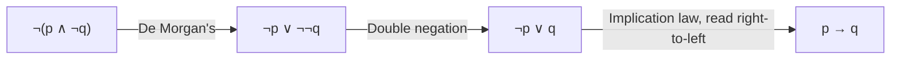

## Learning Objectives

- Define logical equivalence (≡) precisely in terms of matching truth values across every row of a truth table, and distinguish it from the biconditional connective (↔).
- Classify a compound proposition as a tautology, a contradiction, or a contingency by examining its truth table.
- Prove a logical equivalence two ways: exhaustively, via a truth table, and algebraically, via a chain of named equivalence laws.
- Apply De Morgan's laws, the distributive laws, and the implication-as-disjunction identity to rewrite compound propositions into simpler or more useful forms.
- Identify a common equivalence-law misapplication (for example, an incomplete De Morgan's rewrite) and correct it.

## Context & Motivation

A truth table answers one narrow question about one formula: which rows make it true. Logical equivalence asks a different, more useful question: do *two* formulas — often written in completely different notation — always land on the same truth value as each other, for every possible assignment of truth values to their shared variables? That question turns out to be the working currency of almost everything built on top of propositional logic. A digital circuit designer who can prove `¬(p ∧ q)` is equivalent to `¬p ∨ ¬q` (one of De Morgan's laws) can replace an AND gate feeding a NOT gate with two NOT gates feeding an OR gate, and know with certainty that the replacement circuit behaves identically on every input — not just the ones tested. A programmer simplifying a tangled `if` condition like `!(a && !b)` is doing exactly the same rewrite, whether or not they have ever seen the phrase "De Morgan's laws."

Mathematics for Computer Science (Lehman, Leighton & Meyer, the MIT 6.042 textbook) introduces equivalence laws immediately after truth tables for exactly this reason: a truth table proves a fact about one specific formula, but the *laws* — De Morgan's, distributivity, double negation, and a handful of others — are reusable tools that let you rewrite an arbitrarily complicated formula into an equivalent, simpler one without re-deriving anything from scratch. This is the same relationship algebra has to arithmetic: you could verify `(x + y)² = x² + 2xy + y²` by plugging in numbers all day, or you could prove it once, as an identity, and reuse it forever afterward. Logical equivalence laws are that same promotion — from checking one case to proving a fact that holds unconditionally, over every possible truth assignment.

Tautologies and contradictions are the two extreme, degenerate cases of this idea. A tautology is a formula so structured that it comes out true no matter what — its truth doesn't depend on the world at all, only on its logical form. `p ∨ ¬p` ("it's raining or it's not raining") is guaranteed true regardless of the weather; it carries zero information about the weather, but it is enormously useful as a logical *tool*, because it licenses splitting a proof into cases ("either p holds, or ¬p holds — the rest of the argument covers both"). Recognizing when a compound proposition is secretly a tautology, or when two seemingly different conditions are secretly the same proposition in disguise, is a skill that pays off directly in reading and writing correct proofs later in this course, and in reasoning about program correctness (loop invariants, preconditions, guard conditions) afterward.

## Core Theory

### Logical equivalence, defined

Two propositional formulas `P` and `Q`, built from the same set of variables, are **logically equivalent**, written `P ≡ Q`, if they have the same truth value under every possible assignment of truth values to their variables — equivalently, if the biconditional `P ↔ Q` is a tautology. The distinction between `≡` and `↔` matters: `↔` is a *connective* that builds a new proposition out of two existing ones, and that new proposition can itself be true or false depending on the assignment; `≡` is a *claim* about two formulas — that `P ↔ Q` happens to be true under *every* assignment, i.e., that `P ↔ Q` is a tautology. Saying `p ≡ q` is a much stronger claim than saying `p ↔ q` is merely true for the particular `p` and `q` at hand.

### Tautology, contradiction, contingency

A formula is a **tautology** if it evaluates to true under every assignment of truth values to its variables (`p ∨ ¬p`). It is a **contradiction** if it evaluates to false under every assignment (`p ∧ ¬p`). It is a **contingency** if its truth value depends on the assignment — true for some rows, false for others (`p ∧ q` is a contingency: true only when both are true). Every compound proposition built from propositional variables falls into exactly one of these three categories, and a truth table with one row per possible assignment (2ⁿ rows for n variables) settles which category any specific formula belongs to, by direct inspection.

### Proving equivalence by truth table

To prove `P ≡ Q` by truth table, build one table with a column for each variable, a column for `P`, and a column for `Q`, and check that the `P` and `Q` columns agree on every row. This is exhaustive and mechanical, but the number of rows doubles with every additional variable, which makes it impractical for anything beyond 3–4 variables — motivating the algebraic approach below.

| p | q | p → q | ¬p ∨ q |
|---|---|-------|--------|
| T | T |   T   |   T    |
| T | F |   F   |   F    |
| F | T |   T   |   T    |
| F | F |   T   |   T    |

Every row agrees, so `p → q ≡ ¬p ∨ q` — the implication is exactly the disjunction of its negated antecedent with its consequent. This single equivalence is worth memorizing outright: it is the bridge between "if–then" reasoning and pure AND/OR/NOT reasoning, and it underlies the standard technique for negating an implication (see the *Negating Quantified Statements* concept, which reuses it directly).

### The standard equivalence laws

| Law | Form |
|---|---|
| Identity | `p ∧ T ≡ p`,  `p ∨ F ≡ p` |
| Domination | `p ∨ T ≡ T`,  `p ∧ F ≡ F` |
| Idempotent | `p ∧ p ≡ p`,  `p ∨ p ≡ p` |
| Double negation | `¬¬p ≡ p` |
| Commutative | `p ∧ q ≡ q ∧ p`,  `p ∨ q ≡ q ∨ p` |
| Associative | `(p ∧ q) ∧ r ≡ p ∧ (q ∧ r)`,  similarly for `∨` |
| Distributive | `p ∧ (q ∨ r) ≡ (p ∧ q) ∨ (p ∧ r)`,  `p ∨ (q ∧ r) ≡ (p ∨ q) ∧ (p ∨ r)` |
| De Morgan's | `¬(p ∧ q) ≡ ¬p ∨ ¬q`,  `¬(p ∨ q) ≡ ¬p ∧ ¬q` |
| Absorption | `p ∨ (p ∧ q) ≡ p`,  `p ∧ (p ∨ q) ≡ p` |
| Negation | `p ∨ ¬p ≡ T`,  `p ∧ ¬p ≡ F` |
| Implication | `p → q ≡ ¬p ∨ q` |

Each of these can itself be verified by a truth table exactly as above; the point of naming and memorizing them is to never have to re-derive them from scratch. An algebraic proof of a larger equivalence is a chain of applications of these named laws, each step justified by one law, ending at the target formula — the propositional-logic analogue of proving a trigonometric identity by a chain of named substitutions rather than by plugging in every possible angle.



This chain shows a full derivation of the fact that `¬(p ∧ ¬q) ≡ p → q` — each arrow is one named law, applied to one subformula, and the chain reads as a proof exactly the way a two-column geometry proof does: one justified step at a time.

## Worked Examples

### Example 1 — proving p → q ≡ ¬p ∨ q is not an isolated fact

**Problem:** show that the contrapositive form `p → q` is equivalent to `¬q → ¬p`, using the implication law and De Morgan's-adjacent reasoning rather than a fresh truth table.

Start from the implication law applied twice, once to each formula:
```
p → q  ≡  ¬p ∨ q                (implication law)
¬q → ¬p  ≡  ¬¬q ∨ ¬p            (implication law, applied to ¬q → ¬p)
         ≡  q ∨ ¬p              (double negation)
         ≡  ¬p ∨ q              (commutative law)
```
Both formulas reduce to the identical expression `¬p ∨ q`, so by transitivity of equivalence, `p → q ≡ ¬q → ¬p`. This is exactly the logical justification behind contraposition as a proof technique (covered in *Direct Proof and Contraposition*): proving `¬q → ¬p` really does prove `p → q`, because the two are the same proposition wearing different notation.

### Example 2 — simplifying a compound proposition algebraically

**Problem:** simplify `¬(p ∧ ¬q) ∨ (¬p ∧ q)` as far as possible.

```
¬(p ∧ ¬q) ∨ (¬p ∧ q)
≡ (¬p ∨ ¬¬q) ∨ (¬p ∧ q)        De Morgan's on the left disjunct
≡ (¬p ∨ q) ∨ (¬p ∧ q)          double negation
≡ ¬p ∨ (q ∨ (¬p ∧ q))          associative law, regrouping
≡ ¬p ∨ q                       absorption: q ∨ (¬p ∧ q) ≡ q, since q ∨ (X ∧ q) ≡ q for any X
```
The final form, `¬p ∨ q`, is exactly `p → q` by the implication law. A truth table on the original four-term formula would need four columns and 4 rows to confirm this, but the algebraic derivation shows *why* it collapses, one recognizable law at a time — and the same derivation generalizes to formulas with more variables where a truth table would need 2ⁿ rows to check by brute force.

### Example 3 — proving a tautology without a truth table

**Problem:** prove `(p → q) ∨ (q → p)` is a tautology.

By the implication law, `(p → q) ∨ (q → p) ≡ (¬p ∨ q) ∨ (¬q ∨ p)`. By associativity and commutativity, this regroups to `(p ∨ ¬p) ∨ (q ∨ ¬q)`. By the negation law, `p ∨ ¬p ≡ T` and `q ∨ ¬q ≡ T`, so the whole expression reduces to `T ∨ T`, which by the domination law is `T`. The formula is a tautology regardless of `p` and `q`'s truth values — which makes sense in plain English too: for any two propositions, either the first implies the second, or the second implies the first (or both), because whichever one happens to be false, the implication *out of* the false one is vacuously true.

## Common Misconceptions & Pitfalls

- **Applying De Morgan's law to only part of a formula and forgetting to flip the connective.** `¬(p ∧ q)` is *not* `¬p ∧ ¬q` — that keeps the wrong connective. The correct rewrite flips AND to OR (and vice versa) *while* negating each conjunct: `¬(p ∧ q) ≡ ¬p ∨ ¬q`. Checking with `p = T, q = F`: `¬(T ∧ F) = ¬F = T`, while `¬p ∧ ¬q = F ∧ T = F` — the flipped-connective version disagrees with the original, confirming the "keep AND" version is wrong.
- **Treating `≡` and `↔` as interchangeable notation for the same thing.** `p ↔ q` is a proposition whose truth value depends on `p` and `q` — for `p = T, q = F` it is simply false. `p ≡ q` is the separate claim that `p ↔ q` is a tautology, true under *every* assignment. Writing `p ≡ q` when you mean "in this particular case, `p` and `q` happen to agree" overstates what you've shown.
- **Concluding a formula is a tautology from checking only a few rows.** A formula that is true for `p = T, q = T` and `p = F, q = F` might still fail on a mixed row. `p ↔ q` itself is a cautionary example: true on those two rows, but false when `p` and `q` disagree — a full truth table (or an algebraic proof covering every case at once) is required, not spot-checking.
- **Using absorption or distributive laws in the wrong direction without checking the result still matches.** `p ∨ (p ∧ q) ≡ p` is correct, but a student rewriting `p ∧ (p ∨ q)` might mistakenly "simplify" to `p ∧ q` instead of the correct `p` — verify each step against the specific named law rather than against a vague sense of what "looks simpler."
- **Assuming every true biconditional you happen to write down is automatically a "law."** The named laws in the table above have been proven, once, to hold for *all* p, q, r. An equivalence you derive for one specific compound formula in a homework problem is a fact about that formula, not a new general law — it doesn't get reused elsewhere unless proven for arbitrary variables.

## Summary

Logical equivalence (`≡`) is the claim that two formulas agree in truth value under every assignment — strictly stronger than the biconditional connective (`↔`) being true in one particular case, and provable either exhaustively (a shared truth table) or algebraically (a chain of named equivalence laws: identity, domination, idempotent, double negation, commutative, associative, distributive, De Morgan's, absorption, negation, and implication). A tautology is a formula guaranteed true under every assignment purely by its logical form; a contradiction is guaranteed false; a contingency depends on the assignment. The implication law, `p → q ≡ ¬p ∨ q`, is the single most reused identity in the list, underlying both contraposition and the correct method for negating an implication. Algebraic proofs of equivalence scale to formulas with many variables in a way truth tables — whose size doubles per variable — do not, which is exactly why the named laws are worth memorizing rather than re-deriving.

## Documentation Links

- [Lehman, Leighton & Meyer — Mathematics for Computer Science (full text)](https://people.csail.mit.edu/meyer/mcs.pdf) — doc
- [ACM/IEEE CS2013 Curriculum Guidelines](https://www.acm.org/binaries/content/assets/education/cs2013_web_final.pdf) — doc
