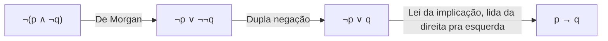

## Objetivos de Aprendizagem

- Definir equivalência lógica (≡) precisamente em termos de valores-verdade coincidentes em toda linha de uma tabela-verdade, e distingui-la do conectivo bicondicional (↔).
- Classificar uma proposição composta como tautologia, contradição ou contingência examinando sua tabela-verdade.
- Provar uma equivalência lógica de duas formas: exaustivamente, via tabela-verdade, e algebricamente, via uma cadeia de leis de equivalência nomeadas.
- Aplicar as leis de De Morgan, as leis distributivas e a identidade implicação-como-disjunção para reescrever proposições compostas em formas mais simples ou úteis.
- Identificar uma aplicação incorreta comum de lei de equivalência (por exemplo, uma reescrita incompleta de De Morgan) e corrigi-la.

## Contexto e Motivação

Uma tabela-verdade responde a uma pergunta estreita sobre uma fórmula: quais linhas a tornam verdadeira. Equivalência lógica faz uma pergunta diferente e mais útil: *duas* fórmulas (muitas vezes escritas em notações completamente diferentes) sempre caem no mesmo valor-verdade uma da outra, para toda atribuição possível de valores-verdade às suas variáveis compartilhadas? Essa pergunta acaba sendo a moeda de troca de quase tudo construído em cima da lógica proposicional. Um projetista de circuito digital que consegue provar que `¬(p ∧ q)` é equivalente a `¬p ∨ ¬q` (uma das leis de De Morgan) pode substituir uma porta AND alimentando uma porta NOT por duas portas NOT alimentando uma porta OR, e saber com certeza que o circuito substituto se comporta identicamente em toda entrada, não só nas testadas. Um programador simplificando uma condição `if` emaranhada como `!(a && !b)` está fazendo exatamente a mesma reescrita, quer já tenha visto a expressão "leis de De Morgan" antes ou não.

Mathematics for Computer Science (Lehman, Leighton & Meyer, o livro-texto do 6.042 do MIT) introduz leis de equivalência logo depois de tabelas-verdade exatamente por essa razão: uma tabela-verdade prova um fato sobre uma fórmula específica, mas as *leis* (De Morgan, distributividade, dupla negação, e um punhado de outras) são ferramentas reutilizáveis que permitem reescrever uma fórmula arbitrariamente complicada numa equivalente e mais simples sem rederivar nada do zero. É a mesma relação que álgebra tem com aritmética: você poderia verificar `(x + y)² = x² + 2xy + y²` substituindo números o dia inteiro, ou poderia provar isso uma vez, como identidade, e reusar para sempre depois. Leis de equivalência lógica são essa mesma promoção: de checar um caso para provar um fato que vale incondicionalmente, sobre toda atribuição de verdade possível.

Tautologias e contradições são os dois casos extremos e degenerados dessa ideia. Uma tautologia é uma fórmula estruturada de forma que sai verdadeira não importa o quê; sua verdade não depende do mundo de forma alguma, só de sua forma lógica. `p ∨ ¬p` ("está chovendo ou não está chovendo") é garantidamente verdadeira independentemente do clima; carrega zero informação sobre o clima, mas é enormemente útil como *ferramenta* lógica, porque licencia dividir uma prova em casos ("ou p vale, ou ¬p vale; o resto do argumento cobre os dois"). Reconhecer quando uma proposição composta é secretamente uma tautologia, ou quando duas condições aparentemente diferentes são secretamente a mesma proposição disfarçada, é uma habilidade que compensa diretamente ao ler e escrever provas corretas mais adiante neste curso, e ao raciocinar sobre corretude de programas (invariantes de laço, pré-condições, condições de guarda) depois disso.

## Teoria Central

### Equivalência lógica, definida

Duas fórmulas proposicionais `P` e `Q`, construídas a partir do mesmo conjunto de variáveis, são **logicamente equivalentes**, escrito `P ≡ Q`, se têm o mesmo valor-verdade sob toda atribuição possível de valores-verdade às suas variáveis, equivalentemente, se o bicondicional `P ↔ Q` é uma tautologia. A distinção entre `≡` e `↔` importa: `↔` é um *conectivo* que constrói uma nova proposição a partir de duas existentes, e essa nova proposição pode ela mesma ser verdadeira ou falsa dependendo da atribuição; `≡` é uma *afirmação* sobre duas fórmulas, de que `P ↔ Q` acontece de ser verdadeiro sob *toda* atribuição, ou seja, que `P ↔ Q` é uma tautologia. Dizer `p ≡ q` é uma afirmação muito mais forte que dizer que `p ↔ q` é meramente verdadeiro para o `p` e `q` particulares em questão.

### Tautologia, contradição, contingência

Uma fórmula é uma **tautologia** se avalia como verdadeira sob toda atribuição de valores-verdade às suas variáveis (`p ∨ ¬p`). É uma **contradição** se avalia como falsa sob toda atribuição (`p ∧ ¬p`). É uma **contingência** se seu valor-verdade depende da atribuição, verdadeira em algumas linhas, falsa em outras (`p ∧ q` é uma contingência: verdadeira só quando ambos são verdadeiros). Toda proposição composta construída a partir de variáveis proposicionais cai em exatamente uma dessas três categorias, e uma tabela-verdade com uma linha por atribuição possível (2ⁿ linhas para n variáveis) resolve a qual categoria qualquer fórmula específica pertence, por inspeção direta.

### Provando equivalência por tabela-verdade

Para provar `P ≡ Q` por tabela-verdade, construa uma tabela com uma coluna para cada variável, uma coluna para `P`, e uma coluna para `Q`, e cheque que as colunas `P` e `Q` concordam em toda linha. Isso é exaustivo e mecânico, mas o número de linhas dobra a cada variável adicional, o que torna impraticável para além de 3 a 4 variáveis, motivando a abordagem algébrica abaixo.

| p | q | p → q | ¬p ∨ q |
|---|---|-------|--------|
| V | V |   V   |   V    |
| V | F |   F   |   F    |
| F | V |   V   |   V    |
| F | F |   V   |   V    |

Toda linha concorda, então `p → q ≡ ¬p ∨ q`, a implicação é exatamente a disjunção de seu antecedente negado com seu consequente. Essa única equivalência vale a pena memorizar diretamente: é a ponte entre o raciocínio "se-então" e o raciocínio puro de E/OU/NÃO, e sustenta a técnica padrão de negar uma implicação (veja o conceito *Negando Afirmações Quantificadas*, que a reusa diretamente).

### As leis de equivalência padrão

| Lei | Forma |
|---|---|
| Identidade | `p ∧ V ≡ p`,  `p ∨ F ≡ p` |
| Dominação | `p ∨ V ≡ V`,  `p ∧ F ≡ F` |
| Idempotência | `p ∧ p ≡ p`,  `p ∨ p ≡ p` |
| Dupla negação | `¬¬p ≡ p` |
| Comutativa | `p ∧ q ≡ q ∧ p`,  `p ∨ q ≡ q ∨ p` |
| Associativa | `(p ∧ q) ∧ r ≡ p ∧ (q ∧ r)`,  similarmente para `∨` |
| Distributiva | `p ∧ (q ∨ r) ≡ (p ∧ q) ∨ (p ∧ r)`,  `p ∨ (q ∧ r) ≡ (p ∨ q) ∧ (p ∨ r)` |
| De Morgan | `¬(p ∧ q) ≡ ¬p ∨ ¬q`,  `¬(p ∨ q) ≡ ¬p ∧ ¬q` |
| Absorção | `p ∨ (p ∧ q) ≡ p`,  `p ∧ (p ∨ q) ≡ p` |
| Negação | `p ∨ ¬p ≡ V`,  `p ∧ ¬p ≡ F` |
| Implicação | `p → q ≡ ¬p ∨ q` |

Cada uma dessas pode ela mesma ser verificada por uma tabela-verdade exatamente como acima; o objetivo de nomeá-las e memorizá-las é nunca precisar rederivá-las do zero. Uma prova algébrica de uma equivalência maior é uma cadeia de aplicações dessas leis nomeadas, cada passo justificado por uma lei, terminando na fórmula alvo, o análogo em lógica proposicional de provar uma identidade trigonométrica por uma cadeia de substituições nomeadas em vez de substituir todo ângulo possível.



Essa cadeia mostra uma derivação completa do fato de que `¬(p ∧ ¬q) ≡ p → q`; cada seta é uma lei nomeada, aplicada a uma subfórmula, e a cadeia se lê como uma prova exatamente do jeito que uma prova geométrica de duas colunas faz: um passo justificado de cada vez.

## Exemplos Resolvidos

### Exemplo 1: provando que p → q ≡ ¬p ∨ q não é um fato isolado

**Problema:** mostre que a forma contrapositiva `p → q` é equivalente a `¬q → ¬p`, usando a lei da implicação e raciocínio adjacente a De Morgan em vez de uma tabela-verdade nova.

Comece pela lei da implicação aplicada duas vezes, uma a cada fórmula:
```
p → q  ≡  ¬p ∨ q                (lei da implicação)
¬q → ¬p  ≡  ¬¬q ∨ ¬p            (lei da implicação, aplicada a ¬q → ¬p)
         ≡  q ∨ ¬p              (dupla negação)
         ≡  ¬p ∨ q              (lei comutativa)
```
As duas fórmulas se reduzem à expressão idêntica `¬p ∨ q`, então por transitividade de equivalência, `p → q ≡ ¬q → ¬p`. Essa é exatamente a justificativa lógica por trás da contraposição como técnica de prova (coberta em *Prova Direta e Contraposição*): provar `¬q → ¬p` de fato prova `p → q`, porque as duas são a mesma proposição vestindo notações diferentes.

### Exemplo 2: simplificando uma proposição composta algebricamente

**Problema:** simplifique `¬(p ∧ ¬q) ∨ (¬p ∧ q)` o máximo possível.

```
¬(p ∧ ¬q) ∨ (¬p ∧ q)
≡ (¬p ∨ ¬¬q) ∨ (¬p ∧ q)        De Morgan no disjunto da esquerda
≡ (¬p ∨ q) ∨ (¬p ∧ q)          dupla negação
≡ ¬p ∨ (q ∨ (¬p ∧ q))          lei associativa, reagrupando
≡ ¬p ∨ q                       absorção: q ∨ (¬p ∧ q) ≡ q, já que q ∨ (X ∧ q) ≡ q para qualquer X
```
A forma final, `¬p ∨ q`, é exatamente `p → q` pela lei da implicação. Uma tabela-verdade sobre a fórmula original de quatro termos precisaria de quatro colunas e 4 linhas para confirmar isso, mas a derivação algébrica mostra *por que* ela colapsa, uma lei reconhecível de cada vez, e a mesma derivação generaliza para fórmulas com mais variáveis onde uma tabela-verdade precisaria de 2ⁿ linhas para checar por força bruta.

### Exemplo 3: provando uma tautologia sem tabela-verdade

**Problema:** prove que `(p → q) ∨ (q → p)` é uma tautologia.

Pela lei da implicação, `(p → q) ∨ (q → p) ≡ (¬p ∨ q) ∨ (¬q ∨ p)`. Por associatividade e comutatividade, isso se reagrupa em `(p ∨ ¬p) ∨ (q ∨ ¬q)`. Pela lei da negação, `p ∨ ¬p ≡ V` e `q ∨ ¬q ≡ V`, então a expressão inteira se reduz a `V ∨ V`, que pela lei da dominação é `V`. A fórmula é uma tautologia independentemente dos valores-verdade de `p` e `q`, o que faz sentido em português comum também: para quaisquer duas proposições, ou a primeira implica a segunda, ou a segunda implica a primeira (ou ambas), porque qual quer que seja a que acontece de ser falsa, a implicação *saindo* da falsa é vacuamente verdadeira.

## Equívocos Comuns e Armadilhas

- **Aplicar a lei de De Morgan a só parte de uma fórmula e esquecer de trocar o conectivo.** `¬(p ∧ q)` *não* é `¬p ∧ ¬q`, isso mantém o conectivo errado. A reescrita correta troca E por OU (e vice-versa) *enquanto* nega cada conjunto: `¬(p ∧ q) ≡ ¬p ∨ ¬q`. Checando com `p = V, q = F`: `¬(V ∧ F) = ¬F = V`, enquanto `¬p ∧ ¬q = F ∧ V = F`, a versão com conectivo mantido discorda do original, confirmando que a versão "manter E" está errada.
- **Tratar `≡` e `↔` como notação intercambiável para a mesma coisa.** `p ↔ q` é uma proposição cujo valor-verdade depende de `p` e `q`; para `p = V, q = F` ela é simplesmente falsa. `p ≡ q` é a afirmação separada de que `p ↔ q` é uma tautologia, verdadeira sob *toda* atribuição. Escrever `p ≡ q` quando você quer dizer "neste caso particular, `p` e `q` acontecem de concordar" exagera o que você mostrou.
- **Concluir que uma fórmula é tautologia checando só algumas linhas.** Uma fórmula que é verdadeira para `p = V, q = V` e `p = F, q = F` ainda pode falhar numa linha mista. O próprio `p ↔ q` é um exemplo de aviso: verdadeiro nessas duas linhas, mas falso quando `p` e `q` discordam; uma tabela-verdade completa (ou uma prova algébrica cobrindo todo caso de uma vez) é necessária, não checar alguns pontos.
- **Usar leis de absorção ou distributivas na direção errada sem checar se o resultado ainda bate.** `p ∨ (p ∧ q) ≡ p` está correto, mas um aluno reescrevendo `p ∧ (p ∨ q)` pode erroneamente "simplificar" para `p ∧ q` em vez do correto `p`; verifique cada passo contra a lei nomeada específica em vez de contra uma noção vaga do que "parece mais simples".
- **Assumir que todo bicondicional verdadeiro que você acontece de escrever é automaticamente uma "lei".** As leis nomeadas na tabela acima foram provadas, uma vez, para valer para *todos* p, q, r. Uma equivalência que você deriva para uma fórmula composta específica num exercício é um fato sobre aquela fórmula, não uma nova lei geral; ela não pode ser reusada em outro lugar a menos que provada para variáveis arbitrárias.

## Resumo

Equivalência lógica (`≡`) é a afirmação de que duas fórmulas concordam em valor-verdade sob toda atribuição, estritamente mais forte que o conectivo bicondicional (`↔`) ser verdadeiro num caso particular, e provável tanto exaustivamente (uma tabela-verdade compartilhada) quanto algebricamente (uma cadeia de leis de equivalência nomeadas: identidade, dominação, idempotência, dupla negação, comutativa, associativa, distributiva, De Morgan, absorção, negação, e implicação). Uma tautologia é uma fórmula garantidamente verdadeira sob toda atribuição puramente por sua forma lógica; uma contradição é garantidamente falsa; uma contingência depende da atribuição. A lei da implicação, `p → q ≡ ¬p ∨ q`, é a identidade mais reusada da lista, sustentando tanto a contraposição quanto o método correto de negar uma implicação. Provas algébricas de equivalência escalam para fórmulas com muitas variáveis de um jeito que tabelas-verdade, cujo tamanho dobra por variável, não escalam, o que é exatamente por que as leis nomeadas valem a pena memorizar em vez de rederivar.

## Documentation Links

- [Lehman, Leighton & Meyer — Mathematics for Computer Science (full text)](https://people.csail.mit.edu/meyer/mcs.pdf) — doc
- [ACM/IEEE CS2013 Curriculum Guidelines](https://www.acm.org/binaries/content/assets/education/cs2013_web_final.pdf) — doc
