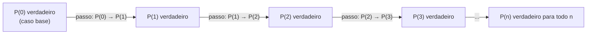

## Objetivos de Aprendizagem

- Explicar por que o princípio da boa ordenação justifica a indução matemática como uma técnica de prova válida, não apenas um padrão conveniente.
- Declarar uma proposição P(n) com precisão e identificar o caso base e o passo indutivo necessários para provar ∀n ≥ n₀, P(n).
- Construir provas de indução completas para identidades de soma em forma fechada, afirmações de divisibilidade e desigualdades.
- Identificar a hipótese indutiva numa prova e distingui-la da conclusão sendo provada em cada passo.
- Diagnosticar "provas" por indução quebradas que violam o caso base, o passo indutivo, ou a direção de avanço do argumento.

## Contexto e Motivação

Suponha que alguém afirme que 1 + 2 + 3 + ⋯ + n = n(n+1)/2 para todo inteiro positivo n. Você poderia checar isso para n = 1, n = 2, n = 100, e valeria toda vez, mas nenhuma quantidade finita de checagem prova que vale para *todo* número natural, porque existem infinitos deles. Esse é o problema fundamental que a indução matemática resolve: ela dá um argumento finito (tipicamente dois passos curtos) que ainda assim certifica uma afirmação para infinitos casos de uma vez. Sem ela, uma fatia enorme das propriedades que cientistas da computação usam diariamente (que um invariante de laço vale depois de toda iteração, que um algoritmo recursivo produz saída correta em entradas de todo tamanho, que uma estrutura de dados mantém sua forma não importa quantas inserções aconteceram) não teria justificativa rigorosa alguma, só "funcionou nos exemplos que tentei".

Indução é a técnica de prova cavalo de batalha por trás da corretude de algoritmos. Quando você prova que um laço `for` mantém um invariante, você está implicitamente rodando um argumento de indução: o invariante valer antes da iteração k mais um passo do corpo do laço implica que ele vale antes da iteração k+1, e ele começou verdadeiro antes do laço começar. O 6.042 do MIT (Mathematics for Computer Science) introduz indução logo depois de estabelecer o princípio da boa ordenação exatamente por essa razão: quase todo tópico subsequente do curso, de propriedades de grafos a relações de recorrência à corretude de algoritmos recursivos, se apoia num argumento indutivo em algum ponto. A técnica também aparece constantemente fora de provas sobre números: indução sobre a estrutura de uma fórmula, uma lista, ou uma árvore (coberta num conceito posterior, indução estrutural) é a mesma ideia aplicada a objetos que não são inteiros.

A intuição costuma ser descrita com uma fileira de dominós: se você consegue garantir que o primeiro dominó cai, e você consegue garantir que sempre que qualquer dominó cai, ele derruba o próximo, então você sabe que todo dominó na fileira cai, mesmo que a fileira seja infinitamente longa e você nunca vá assistir cada dominó individual tombar. O que licencia esse salto de "o primeiro cai, e cada um derruba o próximo" para "todos caem" não é intuição sozinha; se apoia num axioma genuíno sobre os números naturais, o princípio da boa ordenação, que diz que todo conjunto não vazio de inteiros não negativos tem um elemento mínimo. Indução e boa ordenação são, de fato, logicamente equivalentes (cada uma pode ser derivada da outra), o que é por que indução não é só um padrão heurístico mas um método de prova rigorosamente justificado.

## Teoria Central

### A declaração formal do princípio

Para provar uma afirmação da forma "∀n ≥ n₀, P(n)" (onde P(n) é alguma proposição dependendo do número natural n, e n₀ é o ponto de partida, geralmente 0 ou 1), o **princípio da indução matemática** diz que basta estabelecer dois fatos:

1. **Caso base:** P(n₀) é verdadeiro.
2. **Passo indutivo:** para um k ≥ n₀ arbitrário, assumindo que P(k) é verdadeiro (a **hipótese indutiva**), prove que P(k+1) também é verdadeiro.

Se ambos valem, então P(n) é verdadeiro para todo inteiro n ≥ n₀. Simbolicamente: [P(n₀) ∧ (∀k ≥ n₀, P(k) → P(k+1))] → ∀n ≥ n₀, P(n).

O passo indutivo não é raciocínio circular, mesmo parecendo que assume o que está tentando provar. Ele prova uma afirmação *condicional* ("se P(k) vale, então P(k+1) vale") para um k arbitrário e não especificado. Provar um condicional assumindo sua hipótese e derivando sua conclusão é prova direta comum; nada em assumir P(k) para derivar P(k+1) está afirmando que P(k) é de fato verdadeiro sozinho. O caso base é o que de fato certifica que a cadeia começa; o passo indutivo só certifica que a verdade se propaga adiante uma vez que ela começa em algum lugar.

### Por que indução é válida: derivação a partir da boa ordenação

Suponha, por contradição, que o caso base e o passo indutivo valem os dois, mas ∀n ≥ n₀, P(n) é *falso*, ou seja, existe algum n ≥ n₀ com P(n) falso. Seja S = {n ≥ n₀ : P(n) é falso}. Por suposição S é não vazio, então pelo princípio da boa ordenação S tem um elemento mínimo, chame-o de m. Como P(n₀) é verdadeiro (o caso base), m ≠ n₀, então m > n₀, o que significa m − 1 ≥ n₀. Como m é o elemento *mínimo* de S, m − 1 ∉ S, então P(m − 1) é verdadeiro. Mas o passo indutivo diz que P(m − 1) → P(m), então P(m) precisa ser verdadeiro, contradizendo m ∈ S. Essa contradição mostra que S precisa ser vazio, ou seja, P(n) vale para todo n ≥ n₀. ∎

Essa derivação vale a pena internalizar porque mostra que indução não é um salto de fé separado colado em cima da boa ordenação; é uma consequência lógica direta dela. Onde quer que os números naturais sejam bem ordenados (sem cadeia descendente infinita de inteiros não negativos), indução está disponível como ferramenta de prova.

### A cadeia de dominós, visualizada

Cada seta é uma única instância do passo indutivo, provada uma vez, genericamente, para um k arbitrário; o diagrama não é n provas separadas, é uma prova de "P(k) → P(k+1)" que, combinada com o caso base, licencia a cadeia infinita inteira.

### Formas comuns de P(n): somas, divisibilidade, desigualdades

Três famílias de afirmações recorrem constantemente na prática de indução, e cada uma exige uma álgebra de passo indutivo ligeiramente diferente:

- **Somas em forma fechada**, por exemplo 1 + 2 + ⋯ + n = n(n+1)/2. O passo indutivo soma o (k+1)-ésimo termo aos dois lados da hipótese indutiva e simplifica para bater com a forma fechada em k+1.
- **Afirmações de divisibilidade**, por exemplo "7ⁿ − 1 é divisível por 6 para todo n ≥ 0." O passo indutivo tipicamente reescreve 7^(k+1) − 1 em termos de 7ᵏ − 1 (que é divisível por 6, pela hipótese) mais um termo que também é divisível por 6.
- **Desigualdades**, por exemplo "2ⁿ > n para todo n ≥ 1" ou "n! > 2ⁿ para todo n ≥ 4." O passo indutivo geralmente multiplica ou soma uma quantidade controlada aos dois lados da hipótese e então argumenta que a desigualdade resultante é pelo menos tão forte quanto exigido.

## Exemplos Resolvidos

### Exemplo 1: a fórmula de soma 1 + 2 + ⋯ + n = n(n+1)/2

**Afirmação:** para todo inteiro n ≥ 1, 1 + 2 + ⋯ + n = n(n+1)/2.

Seja P(n) a proposição "1 + 2 + ⋯ + n = n(n+1)/2."

**Caso base (n = 1):** o lado esquerdo é só 1. O lado direito é 1(1+1)/2 = 2/2 = 1. Os dois lados são iguais a 1, então P(1) vale.

**Passo indutivo:** assuma que P(k) vale para algum k ≥ 1 arbitrário, ou seja, assuma 1 + 2 + ⋯ + k = k(k+1)/2 (a hipótese indutiva). Precisamos mostrar P(k+1): 1 + 2 + ⋯ + k + (k+1) = (k+1)(k+2)/2.

Começando do lado esquerdo de P(k+1) e usando a hipótese indutiva para substituir os primeiros k termos:

1 + 2 + ⋯ + k + (k+1) = [k(k+1)/2] + (k+1)   (pela hipótese indutiva)
&nbsp;&nbsp;&nbsp;&nbsp;= (k+1)[k/2 + 1]
&nbsp;&nbsp;&nbsp;&nbsp;= (k+1)(k+2)/2

Isso bate exatamente com o lado direito de P(k+1), então P(k) → P(k+1) vale. Por indução, P(n) vale para todo n ≥ 1. ∎

### Exemplo 2: divisibilidade: 3 | (n³ − n) para todo n ≥ 0

**Afirmação:** para todo inteiro não negativo n, 3 divide n³ − n.

Seja P(n) "3 | (n³ − n)."

**Caso base (n = 0):** 0³ − 0 = 0, e 3 | 0 (já que 0 = 3 × 0). Então P(0) vale.

**Passo indutivo:** assuma P(k): 3 | (k³ − k), ou seja, k³ − k = 3m para algum inteiro m. Precisamos mostrar P(k+1): 3 | [(k+1)³ − (k+1)].

Expanda (k+1)³ − (k+1) = k³ + 3k² + 3k + 1 − k − 1 = (k³ − k) + 3k² + 3k = 3m + 3k² + 3k = 3(m + k² + k).

Como m + k² + k é um inteiro, (k+1)³ − (k+1) é 3 vezes um inteiro, então 3 | [(k+1)³ − (k+1)]. Logo P(k) → P(k+1). Por indução, P(n) vale para todo n ≥ 0. ∎

O movimento algébrico chave (reescrever o caso (k+1) como "o caso k, mais algo mais divisível por 3") é o modelo para essencialmente toda indução de divisibilidade: isole a hipótese indutiva como um subtermo, depois mostre que o resto compartilha o mesmo divisor.

### Exemplo 3: a desigualdade 2ⁿ > n para todo n ≥ 1

**Afirmação:** para todo inteiro n ≥ 1, 2ⁿ > n.

Seja P(n) "2ⁿ > n."

**Caso base (n = 1):** 2¹ = 2 > 1. P(1) vale.

**Passo indutivo:** assuma P(k): 2ᵏ > k, para algum k ≥ 1 arbitrário. Precisamos mostrar P(k+1): 2^(k+1) > k+1.

2^(k+1) = 2 · 2ᵏ > 2k (pela hipótese indutiva, multiplicando os dois lados por 2, o que preserva a desigualdade já que 2 > 0).

Falta mostrar 2k ≥ k + 1 para k ≥ 1, que se rearranja para k ≥ 1, verdadeiro por suposição. Encadeando as duas desigualdades: 2^(k+1) > 2k ≥ k + 1, então 2^(k+1) > k + 1, estabelecendo P(k+1). Por indução, 2ⁿ > n para todo n ≥ 1. ∎

Este exemplo ilustra um padrão frequente em induções de desigualdade: a hipótese indutiva te leva a maior parte do caminho (2^(k+1) > 2k), e um pequeno fato algébrico separado (2k ≥ k+1 para k ≥ 1) fecha a lacuna restante até o limite alvo.

## Equívocos Comuns e Armadilhas

- **"O passo indutivo assume o que você está tentando provar, então é circular."** Ele assume P(k) para um k arbitrário e fixo para provar o condicional P(k) → P(k+1), uma única instância de prova direta. Ele nunca assume ∀n, P(n), que é a conclusão de fato. O caso base, separadamente, é o que de fato certifica que a verdade começa em algum lugar; sem ele o passo indutivo sozinho não prova nada (uma cadeia ininterrupta de dominós caindo ainda exige que alguém empurre o primeiro).
- **"Pular o caso base tudo bem se o passo indutivo é inatacável."** Considere a afirmação falsa "n = n + 1 para todo n" com um "passo indutivo" (deliberadamente falso): se k = k + 1, então somando 1 aos dois lados dá k + 1 = k + 2, então P(k) → P(k+1); esse passo é vacuamente válido, já que P(k) nunca de fato é verdadeiro, então a implicação vale trivialmente. Sem um caso base verdadeiro, esse "passo" não prova nada, ilustrando por que o caso base não é formalidade opcional: é o que impede qualquer passo indutivo, por mais elegante que seja, de certificar besteira.
- **"Você pode escolher qualquer caso base, desde que um exista."** Se a afirmação só é verdadeira para n ≥ 4 (por exemplo, "n! > 2ⁿ para n ≥ 4", falso em n = 0, 1, 2, 3, onde 2ⁿ ≥ n!), o caso base precisa ser n₀ = 4, não n₀ = 0. Checar o ponto de partida errado ou produz um caso base falso (invalidando a prova inteira) ou silenciosamente prova uma afirmação mais fraca e não pretendida.
- **"A hipótese indutiva precisa ser rederivada do zero em cada passo."** Alunos às vezes tentam provar P(k+1) diretamente, ignorando P(k) completamente, efetivamente refazendo uma prova completa em todo nível e abandonando o maquinário que a indução oferece. A eficiência inteira da indução vem de *reusar* a verdade assumida de P(k) como um degrau; se seu passo indutivo não referencia a hipótese indutiva em nenhum lugar de sua derivação, algo deu errado (ou o passo está fazendo trabalho extra desnecessário, ou pior, é uma prova direta disfarçada e inválida de P(k+1) que acontece de não precisar de P(k) de forma alguma, significando que sua "indução" nunca foi de fato indução).
- **"Checar alguns casos (n = 1, 2, 3) é basicamente tão bom quanto uma prova indutiva."** Nenhuma verificação finita, por mais extensa, descarta falha em algum n posterior. Um exemplo famoso de aviso: a conjectura de Euler de que um certo polinômio n² − n + 41 produz primos para muitos n pequenos (verdadeiro de n = 0 até 40) falha em n = 41, mostrando que reconhecimento de padrão em casos pequenos, sem um argumento indutivo genuíno, pode enganar arbitrariamente longe antes de quebrar.

## Resumo

Indução matemática prova ∀n ≥ n₀, P(n) estabelecendo um caso base P(n₀) e um passo indutivo mostrando P(k) → P(k+1) para k ≥ n₀ arbitrário, dois argumentos finitos que juntos certificam infinitos casos. A técnica não é um axioma independente mas uma consequência lógica direta do princípio da boa ordenação: se a conclusão falhasse para algum n, o menor n falhando contradiria o passo indutivo. O passo indutivo é prova direta comum de um condicional, nunca circular, e o caso base é o que ancora a cadeia inteira, não uma formalidade para pular. Identidades de soma, afirmações de divisibilidade e desigualdades são as três formas mais comuns de P(n) encontradas na prática, cada uma com álgebra de passo indutivo característica: isolar a hipótese indutiva como um subtermo e mostrar que o resto satisfaz a propriedade necessária. Errar o caso base, omiti-lo, ou escrever um passo indutivo que nunca de fato usa a hipótese indutiva são as formas mais comuns de uma prova de indução quebrar silenciosamente.

## Documentation Links

- [MIT 6.042J — Syllabus (OCW)](https://ocw.mit.edu/courses/6-042j-mathematics-for-computer-science-fall-2010/pages/syllabus/) — doc
- [Lehman, Leighton & Meyer — Mathematics for Computer Science (full text)](https://people.csail.mit.edu/meyer/mcs.pdf) — doc
