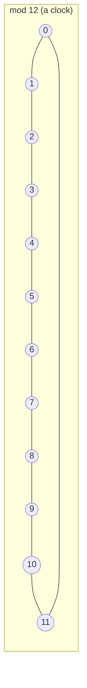

## Learning Objectives

- State the formal definition of congruence modulo n, and prove it is an equivalence relation.
- Prove the basic laws of modular arithmetic — that congruences can be added, subtracted, and multiplied term-by-term — directly from the definition.
- Compute modular inverses using the extended Euclidean algorithm, and explain precisely when a modular inverse fails to exist.
- Implement fast modular exponentiation and explain why it computes aᵇ mod n in logarithmic rather than linear time.
- Identify where modular arithmetic underlies real systems — clock/calendar arithmetic, hash tables, and public-key cryptography — and connect each to the specific congruence property it relies on.

## Context & Motivation

A clock is the most familiar example of arithmetic that "wraps around": 9 o'clock plus 5 hours is 2 o'clock, not 14 o'clock, because a 12-hour clock only distinguishes remainders modulo 12. This everyday intuition is the entire content of modular arithmetic, made precise: instead of tracking an integer's exact value, track only its remainder after division by some fixed modulus n, and define arithmetic operations on those remainders so that the wraparound behaves consistently. What looks like a simplification (throwing away information — the exact quotient) turns out to be exactly the right abstraction for an enormous range of computational problems, because many real questions genuinely only depend on a value's remainder, not its exact magnitude — whether a day is a weekend, whether a hash bucket index is valid, whether a check digit on a credit card or ISBN is correct.

Modular arithmetic's importance to computer science goes far beyond clocks, though. Hash tables map keys to array indices using `hash(key) mod table_size` — a direct application of modular reduction to keep arbitrary-sized values within a fixed range. More strikingly, essentially all of modern public-key cryptography — RSA, Diffie-Hellman key exchange, elliptic-curve cryptography — is built on modular exponentiation and the algebraic structure of congruence classes: RSA's security rests on the fact that computing aᵇ mod n is fast (this concept's fast exponentiation algorithm below) while reversing it (computing a *discrete logarithm*, or factoring n to break the underlying structure) is believed to be hard. None of this is accessible without first being fluent in the definition of congruence and its algebraic laws, which is why MIT's 6.042 and the ACM/IEEE CS2013 guidelines place modular arithmetic directly after the Euclidean algorithm — the two are used together constantly, since finding modular inverses requires exactly the extended form of the Euclidean algorithm from the preceding concept.

## Core Theory

### Congruence modulo n: the formal definition

For a positive integer n (the **modulus**) and integers a, b, we say **a is congruent to b modulo n**, written a ≡ b (mod n), if n | (a − b) — equivalently, if a and b leave the same remainder when divided by n. For example, 17 ≡ 5 (mod 12), since 12 | (17 − 5) = 12, and both 17 and 5 leave remainder 5 when divided by 12.

**Congruence modulo n is an equivalence relation** — it partitions the integers into n **congruence classes** (also called residue classes), one for each possible remainder 0, 1, …, n−1:

- **Reflexive:** a ≡ a (mod n), since n | (a − a) = n | 0, true for every n.
- **Symmetric:** if a ≡ b (mod n), then n | (a−b), so n | −(a−b) = (b−a), so b ≡ a (mod n).
- **Transitive:** if a ≡ b (mod n) and b ≡ c (mod n), then n | (a−b) and n | (b−c), so by the linearity property of divisibility, n | [(a−b)+(b−c)] = (a−c), so a ≡ c (mod n).

### The arithmetic laws: congruences add, subtract, and multiply term-by-term

**Claim:** if a ≡ b (mod n) and c ≡ d (mod n), then (a+c) ≡ (b+d) (mod n), (a−c) ≡ (b−d) (mod n), and ac ≡ bd (mod n).

**Proof (addition):** a ≡ b (mod n) means a = b + kn for some integer k; c ≡ d (mod n) means c = d + jn for some integer j. Then a + c = b + d + (k+j)n, so n | [(a+c) − (b+d)], giving (a+c) ≡ (b+d) (mod n). Subtraction follows identically with a sign flipped.

**Proof (multiplication):** using the same a = b + kn, c = d + jn: ac = (b+kn)(d+jn) = bd + bjn + dkn + kjn² = bd + n(bj + dk + kjn). So ac − bd = n(bj + dk + kjn), meaning n | (ac − bd), giving ac ≡ bd (mod n). ∎

These three laws are what make modular arithmetic genuinely usable as arithmetic: they guarantee you can reduce numbers modulo n at *any* point in a computation — not just at the very end — without changing the final residue. This is precisely why computing aᵇ mod n never requires computing the (potentially astronomically large) exact value of aᵇ first; every intermediate product can be reduced mod n immediately.

### Modular inverses and when they exist

An integer a has a **multiplicative inverse modulo n** if there exists an integer x such that ax ≡ 1 (mod n), written x = a⁻¹ mod n. Unlike ordinary arithmetic, not every nonzero residue has an inverse.

**Claim:** a has an inverse modulo n if and only if gcd(a, n) = 1 (a and n are coprime).

**Proof (⇐):** if gcd(a, n) = 1, Bézout's identity (a consequence of running the Euclidean algorithm from the previous concept in reverse — the *extended* Euclidean algorithm) guarantees integers x, y with ax + ny = 1. Reducing modulo n: ax ≡ 1 (mod n) (since ny ≡ 0 (mod n)), so x is the inverse of a.

**Proof (⇒):** if a has an inverse x, ax ≡ 1 (mod n) means n | (ax − 1), so ax − 1 = kn for some integer k, i.e., ax − kn = 1. Any common divisor d of a and n divides the left side (ax − kn), so d | 1, forcing d = 1 — so gcd(a, n) = 1. ∎

This is exactly why modular inverses matter for cryptography: choosing a modulus n and requiring a to be coprime to it is not an incidental restriction, it is the precise condition that makes "division by a" meaningful modulo n at all.



### Fast modular exponentiation

Computing aᵇ mod n by multiplying a by itself b−1 times is far too slow when b is large (hundreds of digits, as in real RSA keys) — it takes time linear in b. **Repeated squaring** brings this down to time logarithmic in b, using the fact that b can be written in binary, and a^b can be built from successive squarings of a, combined according to b's bits:

```python
def mod_pow(base, exponent, modulus):
    if modulus == 1:
        return 0
    result = 1
    base = base % modulus
    while exponent > 0:
        if exponent % 2 == 1:               # current bit of exponent is 1
            result = (result * base) % modulus
        exponent //= 2                       # shift to the next bit
        base = (base * base) % modulus       # square the base for the next bit
    return result
```

Each loop iteration halves `exponent`, so the loop runs O(log b) times rather than O(b) times — the difference between roughly 10 iterations and roughly a billion iterations for a 30-bit exponent. Every intermediate value is reduced modulo `modulus` immediately (justified exactly by the arithmetic laws proved above), which is also what keeps the numbers involved from growing to unusable size — without that reduction, `base * base` would double in bit-length at every squaring, becoming intractably large well before the loop finished for real cryptographic exponent sizes.

## Worked Examples

### Example 1 — clock arithmetic: what time is it 100 hours after 3:00?

**Problem:** on a 12-hour clock, what does the clock read 100 hours after showing 3:00?

The answer only depends on 100 mod 12 (by the addition law: 3 + 100 ≡ 3 + (100 mod 12) (mod 12)). Computing 100 mod 12: 100 = 8×12 + 4, so 100 ≡ 4 (mod 12). Then 3 + 4 = 7. The clock reads 7:00.

Checking directly: 100 hours is 4 days and 4 hours; 4 full days bring the clock back to 3:00 exactly (4 × 24 = 96 hours, and 96 ≡ 0 mod 12 confirms this), and the remaining 4 hours advance it to 7:00 — matching the modular computation exactly.

### Example 2 — finding a modular inverse using the extended Euclidean algorithm: 7⁻¹ mod 26

**Problem:** find the multiplicative inverse of 7 modulo 26 (relevant, for instance, to constructing an affine cipher, where a letter shift needs to be reversible).

First confirm an inverse exists: gcd(7, 26). 26 = 3×7 + 5; 7 = 1×5 + 2; 5 = 2×2 + 1; 2 = 2×1 + 0. So gcd(7, 26) = 1 — an inverse exists.

Back-substitute to express 1 as a combination of 7 and 26 (the extended Euclidean algorithm):
1 = 5 − 2×2
1 = 5 − 2×(7 − 1×5) = 3×5 − 2×7
1 = 3×(26 − 3×7) − 2×7 = 3×26 − 11×7

So 1 = 3×26 − 11×7, meaning −11×7 ≡ 1 (mod 26), i.e., 7 × (−11) ≡ 1 (mod 26). Converting −11 to a positive residue: −11 + 26 = 15. So 7⁻¹ ≡ 15 (mod 26).

Verification: 7 × 15 = 105 = 4×26 + 1, so 105 ≡ 1 (mod 26). Confirmed.

### Example 3 — fast modular exponentiation traced by hand: 5¹¹ mod 13

**Problem:** compute 5¹¹ mod 13 using repeated squaring, tracing every step, and confirm it against direct computation.

Write 11 in binary: 11 = 1011₂ = 8 + 2 + 1.

Compute successive squarings of 5 mod 13: 5¹ ≡ 5; 5² ≡ 25 ≡ 12 (mod 13); 5⁴ ≡ 12² = 144 ≡ 1 (mod 13, since 144 = 11×13 + 1); 5⁸ ≡ 1² ≡ 1 (mod 13).

Since 11 = 8 + 2 + 1, 5¹¹ = 5⁸ × 5² × 5¹ ≡ 1 × 12 × 5 (mod 13) = 60 ≡ 60 − 4×13 = 60 − 52 = 8 (mod 13).

Tracing `mod_pow(5, 11, 13)` from Core Theory: exponent's bits, low to high, are 1, 1, 0, 1 — matching exactly the 8+2+1 decomposition used above, and the loop's running `result` accumulates the same three factors (5¹, 5², 5⁸) in the same way. Direct verification: 5¹¹ = 48828125, and 48828125 mod 13 = 8 (48828125 = 3756009×13 + 8) — matching the fast computation exactly, without ever needing to work with the full 8-digit intermediate value during the modular computation itself.

## Common Misconceptions & Pitfalls

- **"Every nonzero residue has a multiplicative inverse modulo n, just like every nonzero real number has a reciprocal."** Only residues coprime to n have inverses (proved in Core Theory). For instance, modulo 12, the residue 4 has no inverse at all — gcd(4, 12) = 4 ≠ 1, and no x satisfies 4x ≡ 1 (mod 12), since 4x is always a multiple of 4, and no multiple of 4 is congruent to 1 modulo 12 (checking all twelve residues confirms this directly).
- **"You can divide both sides of a congruence by a common factor, the same way you'd divide an equation."** ac ≡ bc (mod n) does *not* generally imply a ≡ b (mod n) — e.g., 2×3 ≡ 2×9 (mod 12) (6 ≡ 18 (mod 12), both ≡ 6), but 3 ≢ 9 (mod 12). Division is only valid when the factor being cancelled is coprime to the modulus (in which case it's really multiplication by that factor's inverse), which is exactly why the modular-inverse machinery above exists — "dividing" mod n is never automatic.
- **"Computing aᵇ mod n means computing aᵇ first, then reducing at the end."** For real cryptographic key sizes (b with hundreds of digits), aᵇ itself would have an astronomically large number of digits — computing it directly is infeasible even though the final reduced answer is small. The arithmetic laws proved in Core Theory guarantee reducing modulo n at every intermediate step gives the identical final answer, which is exactly what makes `mod_pow`'s repeated squaring both correct and practical.
- **"Congruence classes are just a notational convenience — they don't behave like genuine numbers you can compute with."** The addition, subtraction, and multiplication laws proved in Core Theory show congruence classes modulo n form a fully consistent algebraic system (a ring, in more advanced terminology) where arithmetic is well-defined regardless of which representative of each class you compute with — 17 and 5 are interchangeable representatives of the same class mod 12, and any computation using either one modulo 12 gives the same final residue.
- **"The extended Euclidean algorithm and the ordinary Euclidean algorithm solve different problems, so learning one doesn't help with the other."** The extended version is literally the ordinary algorithm's own division steps, back-substituted in reverse (Example 2 traces exactly this) — anyone fluent in the ordinary Euclidean algorithm from the preceding concept already has every arithmetic step needed for the extended version; the only addition is bookkeeping the coefficients as you substitute backward.

## Summary

Congruence modulo n (a ≡ b (mod n) iff n | (a−b)) is an equivalence relation partitioning the integers into n residue classes, and addition, subtraction, and multiplication all respect these classes — meaning any intermediate value in a computation can be reduced modulo n without affecting the final result, which is the single fact that makes modular arithmetic computationally practical rather than just notationally elegant. A residue a has a multiplicative inverse modulo n exactly when gcd(a, n) = 1, and that inverse is computed via the extended Euclidean algorithm — the ordinary algorithm's steps, back-substituted to express 1 as a combination of a and n. Fast modular exponentiation exploits the binary representation of the exponent and repeated squaring, with every intermediate result reduced mod n immediately, to compute aᵇ mod n in time logarithmic in b — the algorithmic fact that makes RSA and other cryptosystems using enormous exponents computationally feasible at all. Clock arithmetic, hash table indexing, and cryptographic key operations are all direct applications of the same handful of congruence laws proved here from the definition alone.

## Documentation Links

- [Lehman, Leighton & Meyer — Mathematics for Computer Science (full text)](https://people.csail.mit.edu/meyer/mcs.pdf) — doc
- [ACM/IEEE CS2013 Curriculum Guidelines](https://www.acm.org/binaries/content/assets/education/cs2013_web_final.pdf) — doc
