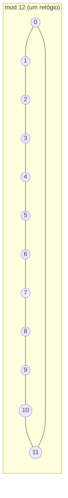

## Objetivos de Aprendizagem

- Declarar a definição formal de congruência módulo n, e provar que é uma relação de equivalência.
- Provar as leis básicas da aritmética modular (que congruências podem ser somadas, subtraídas e multiplicadas termo a termo) diretamente a partir da definição.
- Computar inversos modulares usando o algoritmo de Euclides estendido, e explicar precisamente quando um inverso modular deixa de existir.
- Implementar exponenciação modular rápida e explicar por que ela computa aᵇ mod n em tempo logarítmico em vez de linear.
- Identificar onde aritmética modular sustenta sistemas reais (aritmética de relógio/calendário, tabelas hash, e criptografia de chave pública) e conectar cada um à propriedade de congruência específica em que se apoia.

## Contexto e Motivação

Um relógio é o exemplo mais familiar de aritmética que "dá a volta": 9 horas mais 5 horas é 2 horas, não 14 horas, porque um relógio de 12 horas só distingue restos módulo 12. Essa intuição do dia a dia é o conteúdo inteiro da aritmética modular, tornada precisa: em vez de rastrear o valor exato de um inteiro, rastreie só seu resto após divisão por algum módulo fixo n, e defina operações aritméticas sobre esses restos de forma que a volta se comporte consistentemente. O que parece uma simplificação (jogar fora informação, o quociente exato) acaba sendo exatamente a abstração certa para uma gama enorme de problemas computacionais, porque muitas perguntas reais genuinamente só dependem do resto de um valor, não de sua magnitude exata: se um dia é fim de semana, se um índice de balde de hash é válido, se um dígito verificador num cartão de crédito ou ISBN está correto.

A importância da aritmética modular para a Ciência da Computação vai muito além de relógios, porém. Tabelas hash mapeiam chaves para índices de vetor usando `hash(chave) mod tamanho_da_tabela`, uma aplicação direta de redução modular para manter valores de tamanho arbitrário dentro de uma faixa fixa. Mais marcantemente, essencialmente toda a criptografia de chave pública moderna (RSA, troca de chaves Diffie-Hellman, criptografia de curva elíptica) é construída sobre exponenciação modular e a estrutura algébrica de classes de congruência: a segurança do RSA se apoia no fato de que computar aᵇ mod n é rápido (o algoritmo de exponenciação rápida deste conceito abaixo) enquanto reverter isso (computar um *logaritmo discreto*, ou fatorar n para quebrar a estrutura subjacente) é acreditado ser difícil. Nada disso é acessível sem primeiro ser fluente na definição de congruência e suas leis algébricas, que é por que o 6.042 do MIT e as diretrizes ACM/IEEE CS2013 colocam aritmética modular logo depois do algoritmo de Euclides; os dois são usados juntos constantemente, já que achar inversos modulares exige exatamente a forma estendida do algoritmo de Euclides do conceito anterior.

## Teoria Central

### Congruência módulo n: a definição formal

Para um inteiro positivo n (o **módulo**) e inteiros a, b, dizemos que **a é congruente a b módulo n**, escrito a ≡ b (mod n), se n | (a − b), equivalentemente, se a e b deixam o mesmo resto quando divididos por n. Por exemplo, 17 ≡ 5 (mod 12), já que 12 | (17 − 5) = 12, e tanto 17 quanto 5 deixam resto 5 quando divididos por 12.

**Congruência módulo n é uma relação de equivalência**, ela particiona os inteiros em n **classes de congruência** (também chamadas classes de resíduo), uma para cada resto possível 0, 1, …, n−1:

- **Reflexiva:** a ≡ a (mod n), já que n | (a − a) = n | 0, verdadeiro para todo n.
- **Simétrica:** se a ≡ b (mod n), então n | (a−b), então n | −(a−b) = (b−a), então b ≡ a (mod n).
- **Transitiva:** se a ≡ b (mod n) e b ≡ c (mod n), então n | (a−b) e n | (b−c), então pela propriedade de linearidade da divisibilidade, n | [(a−b)+(b−c)] = (a−c), então a ≡ c (mod n).

### As leis aritméticas: congruências somam, subtraem e multiplicam termo a termo

**Afirmação:** se a ≡ b (mod n) e c ≡ d (mod n), então (a+c) ≡ (b+d) (mod n), (a−c) ≡ (b−d) (mod n), e ac ≡ bd (mod n).

**Prova (adição):** a ≡ b (mod n) significa a = b + kn para algum inteiro k; c ≡ d (mod n) significa c = d + jn para algum inteiro j. Então a + c = b + d + (k+j)n, então n | [(a+c) − (b+d)], dando (a+c) ≡ (b+d) (mod n). Subtração decorre de forma idêntica com um sinal trocado.

**Prova (multiplicação):** usando os mesmos a = b + kn, c = d + jn: ac = (b+kn)(d+jn) = bd + bjn + dkn + kjn² = bd + n(bj + dk + kjn). Então ac − bd = n(bj + dk + kjn), significando n | (ac − bd), dando ac ≡ bd (mod n). ∎

Essas três leis são o que torna a aritmética modular genuinamente usável como aritmética: elas garantem que você pode reduzir números módulo n em *qualquer* ponto de um cálculo, não só bem no final, sem mudar o resto final. É precisamente por isso que computar aᵇ mod n nunca exige computar o valor exato (potencialmente astronomicamente grande) de aᵇ primeiro; todo produto intermediário pode ser reduzido mod n imediatamente.

### Inversos modulares e quando existem

Um inteiro a tem um **inverso multiplicativo módulo n** se existe um inteiro x tal que ax ≡ 1 (mod n), escrito x = a⁻¹ mod n. Diferente da aritmética comum, nem todo resíduo não nulo tem um inverso.

**Afirmação:** a tem um inverso módulo n se e somente se mdc(a, n) = 1 (a e n são coprimos).

**Prova (⇐):** se mdc(a, n) = 1, a identidade de Bézout (uma consequência de rodar o algoritmo de Euclides do conceito anterior de trás para frente, o algoritmo de Euclides *estendido*) garante inteiros x, y com ax + ny = 1. Reduzindo módulo n: ax ≡ 1 (mod n) (já que ny ≡ 0 (mod n)), então x é o inverso de a.

**Prova (⇒):** se a tem um inverso x, ax ≡ 1 (mod n) significa n | (ax − 1), então ax − 1 = kn para algum inteiro k, isto é, ax − kn = 1. Qualquer divisor comum d de a e n divide o lado esquerdo (ax − kn), então d | 1, forçando d = 1, então mdc(a, n) = 1. ∎

É exatamente por isso que inversos modulares importam para criptografia: escolher um módulo n e exigir que a seja coprimo a ele não é uma restrição incidental, é a condição precisa que torna "dividir por a" significativo módulo n de forma alguma.



### Exponenciação modular rápida

Computar aᵇ mod n multiplicando a por si mesmo b−1 vezes é longe de rápido o suficiente quando b é grande (centenas de dígitos, como em chaves RSA reais); leva tempo linear em b. **Elevação ao quadrado repetida** reduz isso a tempo logarítmico em b, usando o fato de que b pode ser escrito em binário, e a^b pode ser construído a partir de elevações ao quadrado sucessivas de a, combinadas de acordo com os bits de b:

```python
def mod_pow(base, expoente, modulo):
    if modulo == 1:
        return 0
    resultado = 1
    base = base % modulo
    while expoente > 0:
        if expoente % 2 == 1:                # bit atual do expoente é 1
            resultado = (resultado * base) % modulo
        expoente //= 2                        # desloca para o próximo bit
        base = (base * base) % modulo         # eleva a base ao quadrado para o próximo bit
    return resultado
```

Cada iteração do laço reduz `expoente` pela metade, então o laço roda O(log b) vezes em vez de O(b) vezes, a diferença entre cerca de 10 iterações e cerca de um bilhão de iterações para um expoente de 30 bits. Todo valor intermediário é reduzido módulo `modulo` imediatamente (justificado exatamente pelas leis aritméticas provadas acima), o que também é o que impede os números envolvidos de crescerem para um tamanho inutilizável; sem essa redução, `base * base` dobraria em tamanho de bits a cada elevação ao quadrado, tornando-se intratavelmente grande bem antes do laço terminar para tamanhos de expoente criptográficos reais.

## Exemplos Resolvidos

### Exemplo 1: aritmética de relógio: que horas são 100 horas depois de 3:00?

**Problema:** num relógio de 12 horas, o que o relógio mostra 100 horas depois de mostrar 3:00?

A resposta só depende de 100 mod 12 (pela lei da adição: 3 + 100 ≡ 3 + (100 mod 12) (mod 12)). Computando 100 mod 12: 100 = 8×12 + 4, então 100 ≡ 4 (mod 12). Então 3 + 4 = 7. O relógio mostra 7:00.

Checando diretamente: 100 horas são 4 dias e 4 horas; 4 dias completos trazem o relógio de volta exatamente a 3:00 (4 × 24 = 96 horas, e 96 ≡ 0 mod 12 confirma isso), e as 4 horas restantes o avançam a 7:00, correspondendo exatamente ao cálculo modular.

### Exemplo 2: achando um inverso modular usando o algoritmo de Euclides estendido: 7⁻¹ mod 26

**Problema:** ache o inverso multiplicativo de 7 módulo 26 (relevante, por exemplo, para construir uma cifra afim, onde um deslocamento de letra precisa ser reversível).

Primeiro confirme que um inverso existe: mdc(7, 26). 26 = 3×7 + 5; 7 = 1×5 + 2; 5 = 2×2 + 1; 2 = 2×1 + 0. Então mdc(7, 26) = 1, um inverso existe.

Substitua de trás para frente para expressar 1 como uma combinação de 7 e 26 (o algoritmo de Euclides estendido):
1 = 5 − 2×2
1 = 5 − 2×(7 − 1×5) = 3×5 − 2×7
1 = 3×(26 − 3×7) − 2×7 = 3×26 − 11×7

Então 1 = 3×26 − 11×7, significando −11×7 ≡ 1 (mod 26), isto é, 7 × (−11) ≡ 1 (mod 26). Convertendo −11 para um resíduo positivo: −11 + 26 = 15. Então 7⁻¹ ≡ 15 (mod 26).

Verificação: 7 × 15 = 105 = 4×26 + 1, então 105 ≡ 1 (mod 26). Confirmado.

### Exemplo 3: exponenciação modular rápida traçada à mão: 5¹¹ mod 13

**Problema:** compute 5¹¹ mod 13 usando elevação ao quadrado repetida, traçando cada passo, e confirme contra o cálculo direto.

Escreva 11 em binário: 11 = 1011₂ = 8 + 2 + 1.

Compute elevações ao quadrado sucessivas de 5 mod 13: 5¹ ≡ 5; 5² ≡ 25 ≡ 12 (mod 13); 5⁴ ≡ 12² = 144 ≡ 1 (mod 13, já que 144 = 11×13 + 1); 5⁸ ≡ 1² ≡ 1 (mod 13).

Como 11 = 8 + 2 + 1, 5¹¹ = 5⁸ × 5² × 5¹ ≡ 1 × 12 × 5 (mod 13) = 60 ≡ 60 − 4×13 = 60 − 52 = 8 (mod 13).

Traçando `mod_pow(5, 11, 13)` da Teoria Central: os bits do expoente, do menos ao mais significativo, são 1, 1, 0, 1, correspondendo exatamente à decomposição 8+2+1 usada acima, e o `resultado` corrente do laço acumula os mesmos três fatores (5¹, 5², 5⁸) da mesma forma. Verificação direta: 5¹¹ = 48828125, e 48828125 mod 13 = 8 (48828125 = 3756009×13 + 8), correspondendo exatamente ao cálculo rápido, sem nunca precisar trabalhar com o valor intermediário completo de 8 dígitos durante o próprio cálculo modular.

## Equívocos Comuns e Armadilhas

- **"Todo resíduo não nulo tem um inverso multiplicativo módulo n, assim como todo número real não nulo tem um recíproco."** Só resíduos coprimos a n têm inversos (provado na Teoria Central). Por exemplo, módulo 12, o resíduo 4 não tem inverso algum, mdc(4, 12) = 4 ≠ 1, e nenhum x satisfaz 4x ≡ 1 (mod 12), já que 4x é sempre um múltiplo de 4, e nenhum múltiplo de 4 é congruente a 1 módulo 12 (checar os doze resíduos confirma isso diretamente).
- **"Você pode dividir os dois lados de uma congruência por um fator comum, do mesmo jeito que dividiria uma equação."** ac ≡ bc (mod n) *não* implica em geral a ≡ b (mod n), por exemplo, 2×3 ≡ 2×9 (mod 12) (6 ≡ 18 (mod 12), ambos ≡ 6), mas 3 ≢ 9 (mod 12). Divisão só é válida quando o fator sendo cancelado é coprimo ao módulo (nesse caso é de fato multiplicação pelo inverso desse fator), que é exatamente por que a maquinaria de inverso modular acima existe; "dividir" mod n nunca é automático.
- **"Computar aᵇ mod n significa computar aᵇ primeiro, depois reduzir no final."** Para tamanhos de chave criptográficos reais (b com centenas de dígitos), o próprio aᵇ teria um número astronomicamente grande de dígitos; computá-lo diretamente é inviável mesmo que a resposta final reduzida seja pequena. As leis aritméticas provadas na Teoria Central garantem que reduzir módulo n em todo passo intermediário dá a resposta final idêntica, que é exatamente o que torna a elevação ao quadrado repetida do `mod_pow` tanto correta quanto prática.
- **"Classes de congruência são só uma conveniência de notação, elas não se comportam como números de verdade com os quais você pode computar."** As leis de adição, subtração e multiplicação provadas na Teoria Central mostram que classes de congruência módulo n formam um sistema algébrico totalmente consistente (um anel, em terminologia mais avançada) onde a aritmética é bem definida independentemente de qual representante de cada classe você usa para computar; 17 e 5 são representantes intercambiáveis da mesma classe mod 12, e qualquer cálculo usando um ou outro módulo 12 dá o mesmo resto final.
- **"O algoritmo de Euclides estendido e o algoritmo de Euclides comum resolvem problemas diferentes, então aprender um não ajuda com o outro."** A versão estendida é literalmente os próprios passos de divisão do algoritmo comum, substituídos de trás para frente (o Exemplo 2 traça exatamente isso); quem é fluente no algoritmo de Euclides comum do conceito anterior já tem todo passo aritmético necessário para a versão estendida; o único acréscimo é fazer a contabilidade dos coeficientes conforme você substitui de trás para frente.

## Resumo

Congruência módulo n (a ≡ b (mod n) sse n | (a−b)) é uma relação de equivalência particionando os inteiros em n classes de resíduo, e adição, subtração e multiplicação todas respeitam essas classes, significando que qualquer valor intermediário num cálculo pode ser reduzido módulo n sem afetar o resultado final, que é o único fato que torna a aritmética modular computacionalmente prática em vez de só elegante em notação. Um resíduo a tem um inverso multiplicativo módulo n exatamente quando mdc(a, n) = 1, e esse inverso é computado via o algoritmo de Euclides estendido, os passos do algoritmo comum, substituídos de trás para frente para expressar 1 como uma combinação de a e n. Exponenciação modular rápida explora a representação binária do expoente e elevação ao quadrado repetida, com todo resultado intermediário reduzido mod n imediatamente, para computar aᵇ mod n em tempo logarítmico em b, o fato algorítmico que torna RSA e outros criptossistemas usando expoentes enormes computacionalmente viáveis de forma alguma. Aritmética de relógio, indexação de tabela hash, e operações de chave criptográfica são todas aplicações diretas do mesmo punhado de leis de congruência provadas aqui a partir só da definição.

## Documentation Links

- [Lehman, Leighton & Meyer — Mathematics for Computer Science (full text)](https://people.csail.mit.edu/meyer/mcs.pdf) — doc
- [ACM/IEEE CS2013 Curriculum Guidelines](https://www.acm.org/binaries/content/assets/education/cs2013_web_final.pdf) — doc
