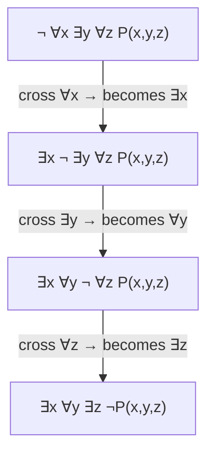

## Learning Objectives

- State the precise negation rule for quantified statements: `¬∀x P(x) ≡ ∃x ¬P(x)` and `¬∃x P(x) ≡ ∀x ¬P(x)`.
- Justify both negation identities directly from the definitions of ∀ and ∃, rather than treating them as arbitrary symbol-swapping rules.
- Negate a statement containing multiple nested quantifiers by pushing the negation inward one quantifier at a time, in order.
- Negate a quantified statement whose inner predicate is itself a compound proposition (an implication, conjunction, or disjunction), combining quantifier negation with propositional equivalence laws.
- Identify an incomplete or incorrect quantifier negation — one that flips only the outermost quantifier, or leaves the inner predicate un-negated — and correct it.

## Context & Motivation

Disproving a mathematical claim, or writing a proof by contradiction, both require the exact same first move: forming the precise negation of a statement and reasoning from *that*. When the statement being negated is quantified — "every prime greater than 2 is odd," "there exists a smallest positive rational number" — getting the negation wrong at the very first step invalidates everything built on it afterward, no matter how careful the rest of the argument is. This is not a hypothetical risk: negating a quantified statement is one of the most reliably mishandled steps in early proof-writing, precisely because the natural-language instinct — "just add a 'not' somewhere and flip the polarity of the words" — produces a result that reads plausibly in English while being logically wrong.

Stanford's CS103 flags this explicitly as a recurring failure mode: a student asked to disprove "for every x, P(x)" will often write "for every x, not P(x)" — which is an entirely different, and generally much stronger, claim than the correct negation "there exists an x such that not P(x)." The first says the property fails *everywhere*; the correct negation says only that it fails *somewhere*. Confusing these two is the logical equivalent of trying to disprove "all swans are white" by claiming "all swans are non-white" — an enormous overclaim, when a single black swan was all that was ever needed.

The rule that fixes this — De Morgan's laws generalized from propositional logic to quantifiers — has a mechanical, unambiguous recipe: negation pushed through a `∀` turns it into an `∃` (and vice versa), and the negation keeps moving inward past every quantifier in a nested statement, landing only on the innermost predicate once every quantifier has been flipped. Learning to apply this recipe correctly, especially for statements with two or three nested quantifiers, is what separates a valid disproof from a superficially similar but logically empty one.

## Core Theory

### The two negation identities, and why they hold

`¬∀x P(x) ≡ ∃x ¬P(x)`. In words: saying "it is not the case that P holds for every x" is exactly the same claim as "some x fails P" — these describe the identical situation from two directions. The identity holds by direct appeal to the definitions of the quantifiers: `∀x P(x)` is true exactly when no counterexample exists; its negation is therefore true exactly when a counterexample *does* exist — which is precisely what `∃x ¬P(x)` asserts.

`¬∃x P(x) ≡ ∀x ¬P(x)`. In words: "it is not the case that some x satisfies P" is the same claim as "every x fails P." Again by definition: `∃x P(x)` is true exactly when at least one witness exists; its negation is true exactly when no witness exists anywhere in the domain — which is precisely `∀x ¬P(x)`.

These two identities are the quantifier-level restatement of De Morgan's laws from propositional logic (see *Logical Equivalence and Tautologies*): a finite conjunction `P(a) ∧ P(b) ∧ P(c) ∧ ...` negates to a disjunction of negations `¬P(a) ∨ ¬P(b) ∨ ¬P(c) ∨ ...` by De Morgan's, and `∀x P(x)` is exactly an (in general infinite) conjunction over the domain, while `∃x P(x)` is exactly the corresponding disjunction — the quantifier negation rule is De Morgan's laws taken to their natural limit over an arbitrary (possibly infinite) domain.

### Negating nested quantifiers: push inward, one at a time

A statement with several quantifiers in a row negates by moving the `¬` inward past exactly one quantifier per step, flipping that quantifier as it passes, and only touching the innermost predicate once every quantifier has been crossed:

```
¬∀x ∃y P(x, y)
≡ ∃x ¬∃y P(x, y)        (crossed ∀, became ∃; ¬ now sits just inside)
≡ ∃x ∀y ¬P(x, y)        (crossed ∃, became ∀; ¬ now sits on the innermost predicate)
```

The rule generalizes to any number of nested quantifiers: negation crossing a string of quantifiers flips *every one of them*, alternating `∀ ↔ ∃`, and the negation symbol only ever ends up attached to the innermost, quantifier-free predicate — never left stranded partway through the chain.



Every arrow performs exactly one flip; skipping a step (leaving a `¬` sitting in front of a quantifier instead of pushing it through) is the single most common error at this stage, covered concretely below.

### Negating a quantified implication or compound predicate

Quantifiers are frequently paired with an implication as the inner predicate — "for all x, if P(x) then Q(x)." Negating this requires combining the quantifier rule with the propositional negation of an implication, `¬(P → Q) ≡ P ∧ ¬Q` (itself derivable from the implication law `P → Q ≡ ¬P ∨ Q` and De Morgan's):

```
¬∀x (P(x) → Q(x))
≡ ∃x ¬(P(x) → Q(x))          (quantifier negation)
≡ ∃x (P(x) ∧ ¬Q(x))          (negating the implication)
```

In words: negating "every x that satisfies P also satisfies Q" produces "there is an x that satisfies P but *not* Q" — a single, concrete counterexample witness, satisfying the antecedent while failing the consequent. This exact pattern — negate the quantifier, then negate the implication — is the standard opening move for disproving any "for all x, if..., then..." claim, and it appears throughout later proof-writing (disproving false universal claims about numbers, functions, and structures alike).

### A full worked negation with mixed connectives

`∀x ∃y (P(x, y) → Q(x, y))` negates in three deliberate steps: cross the `∀`, cross the `∃`, then negate the implication that remains:

```
¬∀x ∃y (P(x,y) → Q(x,y))
≡ ∃x ¬∃y (P(x,y) → Q(x,y))
≡ ∃x ∀y ¬(P(x,y) → Q(x,y))
≡ ∃x ∀y (P(x,y) ∧ ¬Q(x,y))
```

Each of the three steps is independently justified by one of the rules above — this decomposition into single, checkable steps is exactly what prevents the "add a `not` somewhere" shortcut from silently producing the wrong statement.

## Worked Examples

### Example 1 — negating a false-sounding universal claim about primes

**Problem:** negate "every even number greater than 2 is the sum of two primes" (Goldbach's conjecture, restricted to a finite check), symbolically `∀n ((n > 2 ∧ Even(n)) → ∃p ∃q (Prime(p) ∧ Prime(q) ∧ n = p + q))`.

Cross the outer `∀`, turning it into `∃`, and negate the implication that remains as its body:
```
∃n ¬((n > 2 ∧ Even(n)) → ∃p∃q (Prime(p) ∧ Prime(q) ∧ n = p+q))
≡ ∃n ( (n > 2 ∧ Even(n)) ∧ ¬∃p∃q (Prime(p) ∧ Prime(q) ∧ n = p+q) )
```
Now negate the inner existential pair, pushing through both `∃` quantifiers to reach two nested `∀`s:
```
≡ ∃n ( (n > 2 ∧ Even(n)) ∧ ∀p ∀q ¬(Prime(p) ∧ Prime(q) ∧ n = p+q) )
```
The fully negated statement reads: "there exists an even number greater than 2 such that, for every pair of primes p and q, it is *not* the case that both are prime and sum to n" — i.e., a specific counterexample number with *no* valid prime-pair decomposition at all. Disproving Goldbach's conjecture (were it false) would require producing exactly one such `n`; no amount of checking "most numbers work" substitutes for that single required counterexample.

### Example 2 — negating the definition of an injective function

**Problem:** a function `f` is injective if `∀x ∀y (f(x) = f(y) → x = y)`. Negate this to obtain the definition of "f is not injective."

```
¬∀x ∀y (f(x) = f(y) → x = y)
≡ ∃x ¬∀y (f(x) = f(y) → x = y)          cross the outer ∀
≡ ∃x ∃y ¬(f(x) = f(y) → x = y)          cross the inner ∀
≡ ∃x ∃y (f(x) = f(y) ∧ x ≠ y)           negate the implication
```
"f is not injective" precisely means: there exist two inputs x and y with the same output but different values themselves — exactly the textbook definition of a collision. Disproving injectivity for a specific function reduces exactly to exhibiting one such pair (x, y), which is only possible because the negation was pushed all the way to a fully existential, witness-producing statement rather than left as a vague `¬∀x∀y(...)`.

### Example 3 — negating the definition of an upper bound

**Problem:** `M` is an upper bound for a set `S` if `∀x (x ∈ S → x ≤ M)`. Negate this to state what it means for `M` to *fail* to be an upper bound.

```
¬∀x (x ∈ S → x ≤ M)
≡ ∃x ¬(x ∈ S → x ≤ M)
≡ ∃x (x ∈ S ∧ x > M)
```
"M fails to be an upper bound for S" means exactly: some element of S exceeds M — a single element of S that is strictly greater than M is a complete and sufficient disproof, and the negation identity guarantees no other form of counterexample is needed or possible.

## Common Misconceptions & Pitfalls

- **Negating "all A are B" as "all A are not B" instead of "some A is not B."** This is the single most common error in the discipline. `¬∀x P(x)` is `∃x ¬P(x)`, not `∀x ¬P(x)`. "Not every prime is odd" (true, witness: 2) is a far weaker and correct claim than "every prime is not odd" (false — most primes *are* odd).
- **Flipping only the outermost quantifier in a nested statement and stopping there.** `¬∀x∃y P(x,y)` is not `∃x ∃y ¬P(x,y)` — the inner `∃` must also flip, to `∀`, giving `∃x ∀y ¬P(x,y)`. Every quantifier in the chain flips; the negation only reaches the innermost predicate after passing through all of them, as the mermaid diagram above shows step by step.
- **Forgetting to negate the inner predicate itself after crossing all the quantifiers.** `¬∀x P(x)` fully negated is `∃x ¬P(x)` — with the negation landing on `P(x)`, not `∃x P(x)` left un-negated. Leaving the innermost predicate unnegated silently produces a claim with the opposite intended meaning.
- **Negating "if P then Q" as "if P then not Q" instead of "P and not Q."** The correct negation of an implication is a conjunction, not another implication: `¬(P → Q) ≡ P ∧ ¬Q`. Examples 1 through 3 above all depend on this specific step; getting it wrong produces a "negation" that is not actually the logical opposite of the original claim.
- **Treating "negate the statement" as optional prose-level rewording rather than a symbol-by-symbol derivation.** Each of the worked examples proceeds one identity at a time, precisely because skipping straight from the original statement to a guessed English negation is exactly where the standard errors above creep in undetected.

## Summary

Negating a quantified statement follows one fixed, mechanical rule applied repeatedly: `¬∀x P(x) ≡ ∃x ¬P(x)` and `¬∃x P(x) ≡ ∀x ¬P(x)`, both provable directly from the definitions of the quantifiers as generalized conjunctions and disjunctions over the domain (the quantifier-level form of De Morgan's laws). A statement with several nested quantifiers negates by pushing the `¬` inward one quantifier at a time, flipping every quantifier it crosses (alternating ∀ and ∃), until it reaches the innermost, quantifier-free predicate — at which point, if that predicate is itself an implication, the propositional identity `¬(P → Q) ≡ P ∧ ¬Q` finishes the job. The most common and consequential error is stopping early — flipping only the first quantifier, or leaving the inner predicate un-negated — which produces a statement that reads plausibly but is not the actual logical negation, and any disproof or contradiction argument built on it is invalid from that first step onward.

## Documentation Links

- [Stanford CS103 — Mathematical Foundations of Computing](https://web.stanford.edu/class/cs103/) — doc
- [Lehman, Leighton & Meyer — Mathematics for Computer Science (full text)](https://people.csail.mit.edu/meyer/mcs.pdf) — doc
