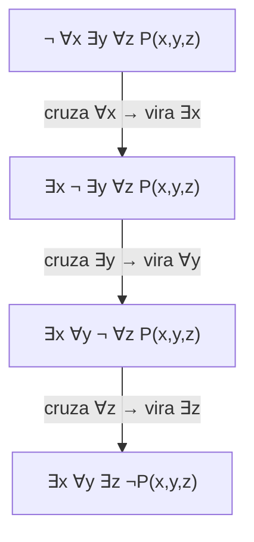

## Objetivos de Aprendizagem

- Declarar a regra precisa de negação para afirmações quantificadas: `¬∀x P(x) ≡ ∃x ¬P(x)` e `¬∃x P(x) ≡ ∀x ¬P(x)`.
- Justificar as duas identidades de negação diretamente a partir das definições de ∀ e ∃, em vez de tratá-las como regras arbitrárias de troca de símbolo.
- Negar uma afirmação contendo múltiplos quantificadores aninhados empurrando a negação para dentro um quantificador de cada vez, em ordem.
- Negar uma afirmação quantificada cujo predicado interno é ele mesmo uma proposição composta (uma implicação, conjunção ou disjunção), combinando negação de quantificador com leis de equivalência proposicional.
- Identificar uma negação de quantificador incompleta ou incorreta (uma que só inverte o quantificador mais externo, ou deixa o predicado interno sem negar) e corrigi-la.

## Contexto e Motivação

Refutar uma afirmação matemática, ou escrever uma prova por contradição, ambos exigem exatamente o mesmo primeiro movimento: formar a negação precisa de uma afirmação e raciocinar a partir *dela*. Quando a afirmação sendo negada é quantificada ("todo primo maior que 2 é ímpar", "existe um menor número racional positivo"), errar a negação logo no primeiro passo invalida tudo construído sobre ela depois, não importa quão cuidadoso seja o resto do argumento. Isso não é um risco hipotético: negar uma afirmação quantificada é um dos passos mais confiavelmente mal executados no início da escrita de provas, precisamente porque o instinto de linguagem natural ("só adicione um 'não' em algum lugar e inverta a polaridade das palavras") produz um resultado que soa plausível em português enquanto está logicamente errado.

O CS103 de Stanford sinaliza isso explicitamente como um padrão de falha recorrente: um aluno pedido para refutar "para todo x, P(x)" frequentemente escreve "para todo x, não P(x)", que é uma afirmação inteiramente diferente, e geralmente muito mais forte, que a negação correta "existe um x tal que não P(x)". A primeira diz que a propriedade falha *em toda parte*; a negação correta diz só que ela falha *em algum lugar*. Confundir essas duas é o equivalente lógico de tentar refutar "todo cisne é branco" afirmando "todo cisne é não branco", uma superafirmação enorme, quando um único cisne preto já era tudo que se precisava.

A regra que conserta isso (as leis de De Morgan generalizadas da lógica proposicional para quantificadores) tem uma receita mecânica e sem ambiguidade: negação empurrada através de um `∀` o transforma num `∃` (e vice-versa), e a negação continua se movendo para dentro passando por todo quantificador numa afirmação aninhada, pousando só no predicado mais interno depois que todo quantificador foi invertido. Aprender a aplicar essa receita corretamente, especialmente para afirmações com dois ou três quantificadores aninhados, é o que separa uma refutação válida de uma superficialmente parecida mas logicamente vazia.

## Teoria Central

### As duas identidades de negação, e por que valem

`¬∀x P(x) ≡ ∃x ¬P(x)`. Em palavras: dizer "não é o caso de P valer para todo x" é exatamente a mesma afirmação que "algum x falha P"; essas descrevem a situação idêntica a partir de duas direções. A identidade vale por apelo direto às definições dos quantificadores: `∀x P(x)` é verdadeiro exatamente quando nenhum contraexemplo existe; sua negação portanto é verdadeira exatamente quando um contraexemplo *de fato* existe, que é precisamente o que `∃x ¬P(x)` afirma.

`¬∃x P(x) ≡ ∀x ¬P(x)`. Em palavras: "não é o caso de algum x satisfazer P" é a mesma afirmação que "todo x falha P". De novo por definição: `∃x P(x)` é verdadeiro exatamente quando pelo menos uma testemunha existe; sua negação é verdadeira exatamente quando nenhuma testemunha existe em lugar nenhum do domínio, que é precisamente `∀x ¬P(x)`.

Essas duas identidades são a reformulação, no nível de quantificador, das leis de De Morgan da lógica proposicional (veja *Equivalência Lógica e Tautologias*): uma conjunção finita `P(a) ∧ P(b) ∧ P(c) ∧ ...` se nega numa disjunção de negações `¬P(a) ∨ ¬P(b) ∨ ¬P(c) ∨ ...` por De Morgan, e `∀x P(x)` é exatamente uma conjunção (em geral infinita) sobre o domínio, enquanto `∃x P(x)` é exatamente a disjunção correspondente; a regra de negação de quantificador é as leis de De Morgan levadas ao seu limite natural sobre um domínio arbitrário (possivelmente infinito).

### Negando quantificadores aninhados: empurre para dentro, um de cada vez

Uma afirmação com vários quantificadores em sequência se nega movendo o `¬` para dentro passando por exatamente um quantificador por passo, invertendo aquele quantificador conforme passa, e só tocando o predicado mais interno depois que todo quantificador tiver sido cruzado:

```
¬∀x ∃y P(x, y)
≡ ∃x ¬∃y P(x, y)        (cruzou ∀, virou ∃; ¬ agora fica logo dentro)
≡ ∃x ∀y ¬P(x, y)        (cruzou ∃, virou ∀; ¬ agora fica no predicado mais interno)
```

A regra generaliza para qualquer número de quantificadores aninhados: negação cruzando uma sequência de quantificadores inverte *todos eles*, alternando `∀ ↔ ∃`, e o símbolo de negação só acaba ligado ao predicado mais interno, sem quantificador, nunca deixado pelo caminho no meio da cadeia.



Toda seta realiza exatamente uma inversão; pular um passo (deixar um `¬` parado na frente de um quantificador em vez de empurrá-lo através) é o erro mais comum nesta etapa, coberto concretamente abaixo.

### Negando uma implicação ou predicado composto quantificado

Quantificadores frequentemente são pareados com uma implicação como predicado interno: "para todo x, se P(x) então Q(x)." Negar isso exige combinar a regra de quantificador com a negação proposicional de uma implicação, `¬(P → Q) ≡ P ∧ ¬Q` (ela mesma derivável da lei da implicação `P → Q ≡ ¬P ∨ Q` e De Morgan):

```
¬∀x (P(x) → Q(x))
≡ ∃x ¬(P(x) → Q(x))          (negação de quantificador)
≡ ∃x (P(x) ∧ ¬Q(x))          (negando a implicação)
```

Em palavras: negar "todo x que satisfaz P também satisfaz Q" produz "existe um x que satisfaz P mas *não* Q", uma testemunha contraexemplo única e concreta, satisfazendo o antecedente enquanto falha o consequente. Esse padrão exato (negar o quantificador, depois negar a implicação) é o movimento de abertura padrão para refutar qualquer afirmação "para todo x, se..., então...", e ele aparece ao longo da escrita de provas posterior (refutando afirmações universais falsas sobre números, funções e estruturas igualmente).

### Uma negação completa resolvida com conectivos mistos

`∀x ∃y (P(x, y) → Q(x, y))` se nega em três passos deliberados: cruzar o `∀`, cruzar o `∃`, depois negar a implicação que resta:

```
¬∀x ∃y (P(x,y) → Q(x,y))
≡ ∃x ¬∃y (P(x,y) → Q(x,y))
≡ ∃x ∀y ¬(P(x,y) → Q(x,y))
≡ ∃x ∀y (P(x,y) ∧ ¬Q(x,y))
```

Cada um dos três passos é justificado independentemente por uma das regras acima; essa decomposição em passos únicos e checáveis é exatamente o que impede o atalho de "adicionar um 'não' em algum lugar" de produzir silenciosamente a afirmação errada.

## Exemplos Resolvidos

### Exemplo 1: negando uma afirmação universal de aparência falsa sobre primos

**Problema:** negue "todo número par maior que 2 é a soma de dois primos" (a conjectura de Goldbach, restrita a uma checagem finita), simbolicamente `∀n ((n > 2 ∧ Par(n)) → ∃p ∃q (Primo(p) ∧ Primo(q) ∧ n = p + q))`.

Cruze o `∀` externo, transformando-o em `∃`, e negue a implicação que resta como seu corpo:
```
∃n ¬((n > 2 ∧ Par(n)) → ∃p∃q (Primo(p) ∧ Primo(q) ∧ n = p+q))
≡ ∃n ( (n > 2 ∧ Par(n)) ∧ ¬∃p∃q (Primo(p) ∧ Primo(q) ∧ n = p+q) )
```
Agora negue o par existencial interno, empurrando através dos dois quantificadores `∃` para chegar a dois `∀` aninhados:
```
≡ ∃n ( (n > 2 ∧ Par(n)) ∧ ∀p ∀q ¬(Primo(p) ∧ Primo(q) ∧ n = p+q) )
```
A afirmação totalmente negada se lê: "existe um número par maior que 2 tal que, para todo par de primos p e q, *não* é o caso de ambos serem primos e somarem n", ou seja, um número contraexemplo específico sem *nenhuma* decomposição válida em par de primos. Refutar a conjectura de Goldbach (se ela fosse falsa) exigiria produzir exatamente um tal `n`; nenhuma quantidade de checar "a maioria dos números funciona" substitui esse único contraexemplo exigido.

### Exemplo 2: negando a definição de uma função injetora

**Problema:** uma função `f` é injetora se `∀x ∀y (f(x) = f(y) → x = y)`. Negue isso para obter a definição de "f não é injetora."

```
¬∀x ∀y (f(x) = f(y) → x = y)
≡ ∃x ¬∀y (f(x) = f(y) → x = y)          cruza o ∀ externo
≡ ∃x ∃y ¬(f(x) = f(y) → x = y)          cruza o ∀ interno
≡ ∃x ∃y (f(x) = f(y) ∧ x ≠ y)           nega a implicação
```
"f não é injetora" significa precisamente: existem duas entradas x e y com a mesma saída mas valores diferentes entre si, exatamente a definição de livro-texto de uma colisão. Refutar injetividade para uma função específica se reduz exatamente a exibir um tal par (x, y), o que só é possível porque a negação foi empurrada até o fim, até uma afirmação totalmente existencial que produz testemunha, em vez de deixada como um vago `¬∀x∀y(...)`.

### Exemplo 3: negando a definição de uma cota superior

**Problema:** `M` é uma cota superior para um conjunto `S` se `∀x (x ∈ S → x ≤ M)`. Negue isso para declarar o que significa `M` *falhar* em ser uma cota superior.

```
¬∀x (x ∈ S → x ≤ M)
≡ ∃x ¬(x ∈ S → x ≤ M)
≡ ∃x (x ∈ S ∧ x > M)
```
"M falha em ser uma cota superior de S" significa exatamente: algum elemento de S excede M; um único elemento de S que é estritamente maior que M já é uma refutação completa e suficiente, e a identidade de negação garante que nenhuma outra forma de contraexemplo é necessária ou possível.

## Equívocos Comuns e Armadilhas

- **Negar "todo A é B" como "todo A não é B" em vez de "algum A não é B".** Este é o erro mais comum na disciplina. `¬∀x P(x)` é `∃x ¬P(x)`, não `∀x ¬P(x)`. "Nem todo primo é ímpar" (verdadeiro, testemunha: 2) é uma afirmação bem mais fraca e correta que "todo primo não é ímpar" (falsa; a maioria dos primos *é* ímpar).
- **Inverter só o quantificador mais externo numa afirmação aninhada e parar aí.** `¬∀x∃y P(x,y)` não é `∃x ∃y ¬P(x,y)`; o `∃` interno também precisa inverter, para `∀`, dando `∃x ∀y ¬P(x,y)`. Todo quantificador na cadeia inverte; a negação só chega ao predicado mais interno depois de passar por todos eles, como o diagrama mermaid acima mostra passo a passo.
- **Esquecer de negar o próprio predicado interno depois de cruzar todos os quantificadores.** `¬∀x P(x)` totalmente negado é `∃x ¬P(x)`, com a negação pousando em `P(x)`, não `∃x P(x)` deixado sem negar. Deixar o predicado mais interno sem negação produz silenciosamente uma afirmação com o sentido oposto ao pretendido.
- **Negar "se P então Q" como "se P então não Q" em vez de "P e não Q".** A negação correta de uma implicação é uma conjunção, não outra implicação: `¬(P → Q) ≡ P ∧ ¬Q`. Os Exemplos 1 a 3 acima todos dependem desse passo específico; errá-lo produz uma "negação" que não é de fato o oposto lógico da afirmação original.
- **Tratar "negar a afirmação" como uma reformulação opcional em nível de prosa em vez de uma derivação símbolo por símbolo.** Cada um dos exemplos resolvidos procede uma identidade de cada vez, precisamente porque pular direto da afirmação original para uma negação em português adivinhada é exatamente onde os erros padrão acima se infiltram sem serem detectados.

## Resumo

Negar uma afirmação quantificada segue uma regra fixa e mecânica aplicada repetidamente: `¬∀x P(x) ≡ ∃x ¬P(x)` e `¬∃x P(x) ≡ ∀x ¬P(x)`, as duas prováveis diretamente das definições dos quantificadores como conjunções e disjunções generalizadas sobre o domínio (a forma, no nível de quantificador, das leis de De Morgan). Uma afirmação com vários quantificadores aninhados se nega empurrando o `¬` para dentro um quantificador de cada vez, invertendo todo quantificador que cruza (alternando ∀ e ∃), até chegar ao predicado mais interno, sem quantificador; nesse ponto, se esse predicado é ele mesmo uma implicação, a identidade proposicional `¬(P → Q) ≡ P ∧ ¬Q` termina o serviço. O erro mais comum e consequente é parar cedo demais (inverter só o primeiro quantificador, ou deixar o predicado interno sem negar), o que produz uma afirmação que soa plausível mas não é a negação lógica de fato, e qualquer refutação ou argumento de contradição construído sobre ela é inválido a partir daquele primeiro passo em diante.

## Documentation Links

- [Stanford CS103 — Mathematical Foundations of Computing](https://web.stanford.edu/class/cs103/) — doc
- [Lehman, Leighton & Meyer — Mathematics for Computer Science (full text)](https://people.csail.mit.edu/meyer/mcs.pdf) — doc
